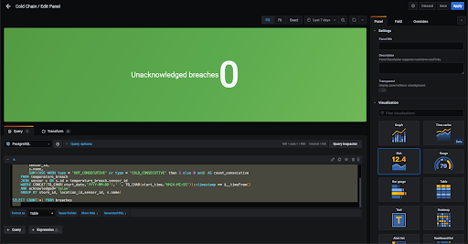
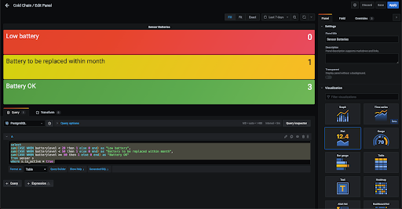

+++
title = "Integration with mSupply Dashboard"
description = "mSupply Cold Chain sensor setup."
date = 2022-03-17T18:20:00+00:00
updated = 2022-03-17T18:20:00+00:00
draft = false
weight = 106
sort_by = "weight"
template = "coldchain/page.html"

[extra]
lead = ""
toc = true
top = true
+++


### Introduction
One of the things that makes mSupply Cold Chain unique is that, when integrated with mSupply Desktop, it can not only tell you when there has been a breach, but also which batches have been affected.

The following examples use the mSupply Grafana dashboard to visualise information. Usually a consultant from the mSupply Foundation will set these up for you, but they're recorded below for users who have the skill, or who may want to tweak a query to suit their particular situation.

These queries generally need to be set up by an administrator but have been included here as a reference to demonstrate some of the mSupply Cold Chain data that can be made available on the mSupply Dashboard.

### Sensor Graph


**Query:**

``` sql
WITH temp AS (
SELECT 
s.name,
CONCAT(TO_CHAR(date,'YYYY-MM-DD'),' ', TO_CHAR(time,'HH24:MI:SS'))::timestamptz AS log_datetime,
tl.temperature 
FROM temperature_log tl 
JOIN sensor s ON tl.sensor_id = s.id 
WHERE
CONCAT(TO_CHAR(date,'YYYY-MM-DD'),' ', TO_CHAR(time,'HH24:MI:SS'))::timestamptz >= $__timeFrom() 
)
SELECT
$__time(log_datetime),
name,
temperature
FROM temp
ORDER BY log_datetime
```

### Unacknowledged Breaches



**Query:**

``` sql 
WITH breaches AS (
SELECT 
        store_id, 
        location_id, 
        sensor_id,
        s.name,
        SUM(CASE WHEN type = 'HOT_CONSECUTIVE' or type = 'COLD_CONSECUTIVE' then 1 else 0 end) AS count_consecutive
    FROM temperature_breach 
    JOIN sensor s ON s.id = temperature_breach.sensor_id
    WHERE CONCAT(TO_CHAR(start_date,'YYYY-MM-DD'),' ', TO_CHAR(start_time,'HH24:MI:SS'))::timestamp >= $__timeFrom() 
    AND acknowledged='false'
    GROUP BY store_id, location_id,sensor_id, s.name)

SELECT COUNT(*) FROM breaches

```

### Batches affected


**Query:**

``` sql
WITH batch_count AS (
SELECT
        temperature_breach.store_id, 
        temperature_breach.location_id, 
        sensor_id,
        s.name,
        il.id,
        SUM(CASE WHEN type = 'HOT_CONSECUTIVE' or type = 'COLD_CONSECUTIVE' then 1 else 0 end) AS count_consecutive
    FROM temperature_breach 
    JOIN sensor s ON s.id = temperature_breach.sensor_id
    JOIN item_line il ON il.location_id = temperature_breach.location_id
    WHERE CONCAT(TO_CHAR(start_date,'YYYY-MM-DD'),' ', TO_CHAR(start_time,'HH24:MI:SS'))::timestamp >= $__timeFrom() 
    AND acknowledged='false'
    GROUP BY temperature_breach.store_id, temperature_breach.location_id,sensor_id, s.name, il.id

)
SELECT COUNT(*) FROM batch_count
```

### Sensor battery life



**Query:**

``` sql
select 
sum(CASE WHEN batterylevel < 20 then 1 else 0 end) as "Low battery",
sum(CASE WHEN batterylevel < 50 then 1 else 0 end) as "Battery to be replaced within month",
sum(CASE WHEN batterylevel >= 50 then 1 else 0 end) as "Battery OK"
from sensor s
where s.is_active = true 

```

### Telegram notifications for Cold Chain

General instructions are here: https://gist.github.com/ilap/cb6d512694c3e4f2427f85e4caec8ad7

But note that you need to invite your bot, not the bot father to the channel

Temperature logs rely on the using mSupply Desktop to transfer mSupply Cold Chain records from the tablet to the server. If the mSupply Desktop (alternate) web server is not running then no logs will be synced (and hence nothing will show on the Dashboard).

You can test if the alternate server process is really running by checking port 8081 in Windows cmd with 

```
netstat -ano | findstr :8081 In this case process with ID 2188 is running ok. 
```


