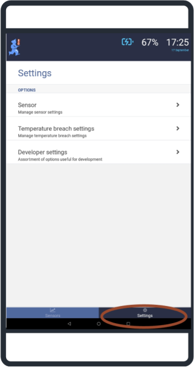
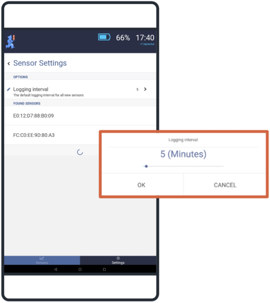
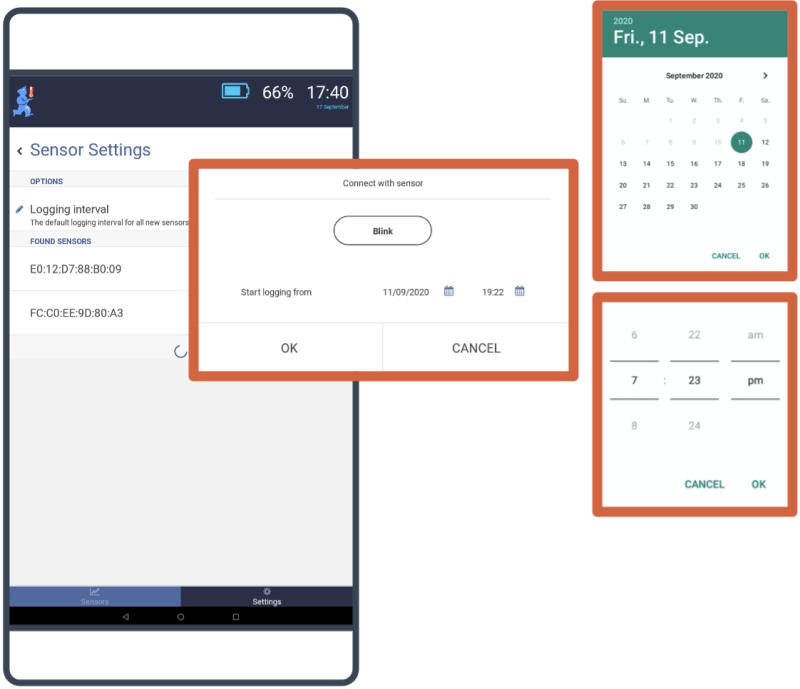
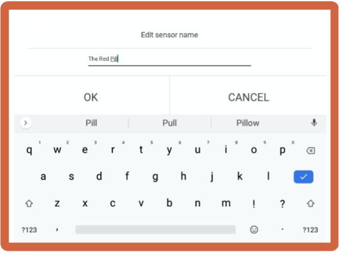
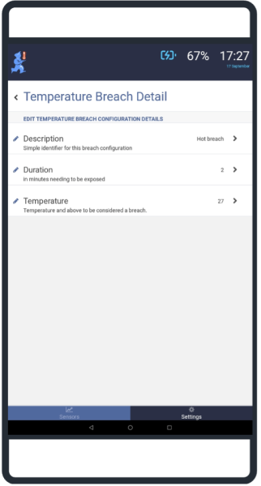
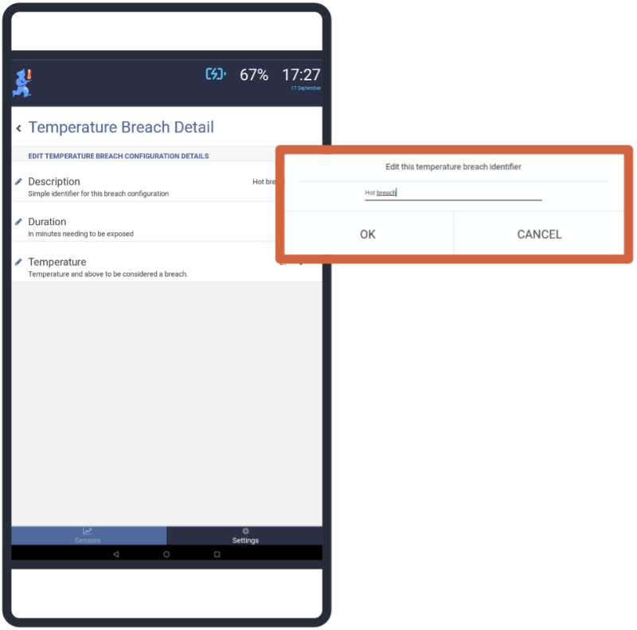

+++
title = "mSupply Cold Chain Settings"
description = "mSupply Cold Chain settings adjustment."
date = 2022-03-17T18:20:00+00:00
updated = 2022-03-17T18:20:00+00:00
draft = false
weight = 104
sort_by = "weight"
template = "coldchain/page.html"

[extra]
lead = ""
toc = true
top = true
+++

### Settings

Selecting the Settings tab at the bottom right of the screen will take you to the Settings screen. From here, you can adjust the settings to:

* Sensors
* Temperature breach settings

### Sensor settings

When using the mSupply Cold Chain application for the first time, the Sensor Settings screen will have two sections:

* Options
* Found Sensors

Please refer to the mSupply Cold Chain Getting Started for information about the device settings and sensor requirements and recommendations when setting up the application for the first time.

#### Options

Logging interval: Sets the default number of minutes between logs on sensors. Using the slider, you can set the default log interval to any length between 1 and 100 minutes. 

The logging interval applies for all sensors when they are first linked to the mSupply Cold Chain application. Different log intervals can be set for each sensor in Available Sensors/Log interval (see below).

#### Found sensors

Any new sensors, not yet paired, will appear below this title. You can open new sensors by double-tapping anywhere on the sensor name/row.

Blink: Pressing the blink button will cause the sensor light to flash. You can use this feature to ensure that you are connecting to the correct sensor.
Start logging from: Using the date/time options, you can set the schedule for the first log. The sensor can be configured to start a maximum of 30 days from the link date. When you select OK, the application will link the sensor and move it to the Available Sensors section at the top of the Sensor Settings screen.

### Available sensors

Once a sensor has been linked to the mSupply Cold Chain application, it will be displayed as an Available Sensor at the top of the screen. You can select a linked sensor by double-tapping on the sensor name/row or by pressing on “>” in the device’s row.

**Blink**: Pressing here will cause the sensor light to flash. You can use this feature to ensure that you are working with the correct sensor.

**Download**: Pressing here will trigger a manual download of all logs on the sensor.
Sensor Details: This provides the MAC address for the sensor (this is found on the back of the sensor). The current battery level will also be displayed as a percentage. Neither field can be edited.

**Sensor name**: Double-tap on sensor name/row or select the > in the row to enter a new name for the sensor. This is the name that will appear on the Sensors tab. You should choose a name that makes it easy to identify (of course!).

We recommend you avoid the use special characters (e.g. -, +, \*) in the sensor name.

**Log interval**: The log interval will initially be set to the default log interval. Using the slider, you can change the interval between logs to any length between 1 and 30 minutes. When you press OK, the sensor will be reprogrammed with the new log interval.

### Temperature breach settings

There are two breach categories:

* Single Exposure: any continuous period of time the temperature is outside the specified range.
* Cumulative Exposure: the sum of time the temperature is outside the specified range during a period.

Temperature breach settings apply to all sensors.

### Single exposure breach configurations

You should set a minimum temperature (cold breach) and maximum temperature (hot breach) for the single exposure breaches. The current setting will be displayed in the row for each category.

Description: The default names for the two single exposure breach configuration are:

* Hot breach
* Cold breach

However, you can enter a custom name for each temperature breach category if required.

We recommend you avoid the use special characters (e.g. -, +, \*) when naming breach categories.

Duration: Using the slider, you can determine how long the temperature must continuously remain outside of the required temperature range for it to be considered a breach. You can set the duration to any length between 1 and 600 minutes.

The duration should be equal or greater to the log interval. The duration should also be a multiple of the log interval to ensure breaches are captured accurately.

Temperature: Using the slider, you can set the temperature outside of which will result in a breach:

* below which will be a breach for the cold breach category, and
* above which will be a breach for the hot breach category.

The temperature selected can be between -30 and +50 degrees Celsius.

### Cumulative Exposure Configurations

You should set a minimum temperature (cold breach) and maximum temperature (hot breach) for the cumulative exposure configuration. The current setting will be displayed in the row for each category.

Description: The default names for the two single exposure breach configuration are:

* Hot cumulative
* Cold cumulative

You can enter a name for each temperature breach category.

We recommend you avoid the use special characters (e.g. -, +, \*) when naming breach categories.

Duration: Using the slider, you can determine the total time (sum) the temperature must remain outside of the required temperature range for it to be considered a cumulative breach. You can set the duration to any length between 1 and 600 minutes. 

Temperature: Using the slider, you can set the temperature outside of which will result in a breach:

* below which will be a breach for the cold breach category, and
* above which will be a breach for the hot breach category.

The temperature selected can be between -30 and +50 degrees Celsius. 

Period: The time period used for cumulative temperature configuration (and hence alerts) on the Sensor tab is set at 72 hours.

To view cumulative temperature breaches for a different period, you can change the time period on the Sensor Detail screen. The mSupply Cold Chain application will use this time period to calculate cumulative temperature and display any breaches at the top of the Sensor Detail screen.

You can export the sensor logs for further information and investigation regarding temperature breaches. 