+++
title = "Navigating dashboards sections"
date = 2025-05-01T08:00:00+00:00
updated = 2021-05-01T08:00:00+00:00
sort_by = "weight"
weight = 6
template = "dashboard/page.html"
+++

Navigation here refers to both how to move **within a dashboard page** and how to navigate **between dashboards pages**. Please note that there may be difference between what is shown here and what is visible on a dashboard page depending on your user’s permission, ==Learn more==. 

<a href="https://demo-board.msupply.org:3000" target="_blank">
  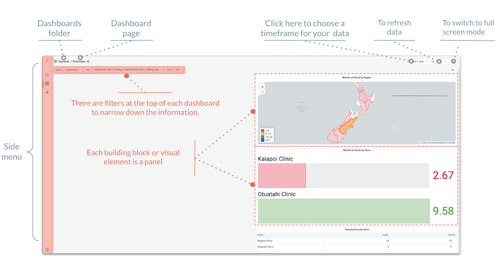
</a>
   

All dashboard pages have the same core elements as shown here. 
Let’s have a closer look at how each works.

The zoom option present on any internet page (click on the 3 dots at the top right in Google Chrome) allows you to change the layout of the dashboards. You can zoom out/zoom in for better visibility of the panels.

## How to use panels 

### What are panels ?

Each dashboard is composed of editable panels arranged on a grid. The panels are separated by rows and can be dragged-and-dropped to a different location on the grid. Each panel queries your mSupply data to give you information in a visual form. Use the filters at the top of the dashboard to update the panel data. <a href="###how-to-use-the-top-filters">Learn more &nearr;</a>.

At the top of a panel, you will find its **title** and a description or explanation under a **small “i”** on the top left corner. They are both only visible if information has been filled in.

If you hover anywhere on the top of a panel, there should be a grey ribbon appearing with a **downward arrow** in the middle, if you click on it, you will find several options for the panel : 

- **View**: Click here to open the panel in full screen. For better understanding, some panels should be viewed in full-screen mode.
- **Edit**: Open the panel editor to edit the panel. <a href="###">Learn more &nearr;</a>.
- **Share**: Share this specific panel as a link, embed, or snapshot to someone with no mSupply or grafana credentials. <a href="###">Learn more &nearr;</a>.
- **Explore** : Open the panel in Explore, where you can focus on your query.
- **Inspect** : Click here to have a detailed look at the data, stats, JSON and query. You can also download data from here. <a href="###">Learn more &nearr;</a>.
- **More** : mostly used to duplicate the current panel.
- **Remove** : To delete this panel from the dashboard page.

 

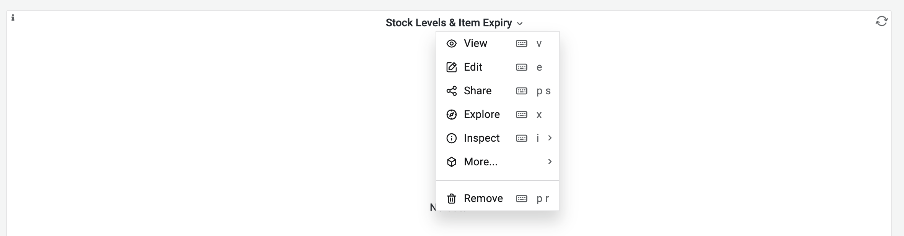

If the panel is a table, there are additional tools :     

- 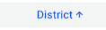 The blue arrow in the column headers allows sorting the data in ascending or descending order.
- 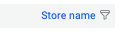The funnel logo in the column headers allows filtering the data in the table by clicking on it.

### How to download data from a dashboard 

Data can be downloaded from each panel in a .csv format following these steps : 

1. Click on a the downward arrow of the panel.
    
2. Click on **Inspect > Data**.
    
3. A new window opens with 3 tabs, make sure to be on tab **Data**.
    
4. Click on **Download CSV** blue button.
    
5. A csv file has been added to your downloads folder.

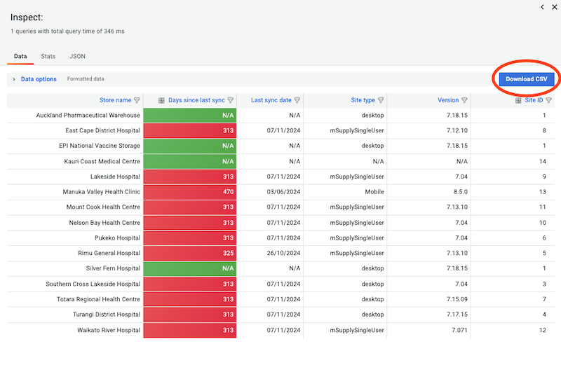

If the panel is an mSupply table, then it has an “Export” button at the bottom. If you click on it, an excel file of your data is downloaded with the same layout as on dashboard.

### How to use the top filters

Each dashboard has filters positioned in the top-left corner, which are independent from each other. They update the dashboard panels.

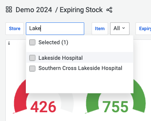

For instance : 

- Select the store Lakeside Hospital to only see indicators for this specific store. 
    
- Select On essential drug list items to only see indicators for these specific items 
    
- If you select both filters then the conditions will be combined and users will only see indicators for essential drug items at Lakeside Hospital.
    
- Depending on a dashboard page configuration, different filters are available.

- Most filters are a dropdown list with clickable boxes but it is still possible to type the variable you’re looking for and it only shows matching options. It can be very useful with a long list of items for instance.
    
- To reset a filter, you don’t need to click on a variable again and can just select the option All instead.

The **timeframe filter**  (located in the top-right corner) determines the time range for the displayed data.

- You can set an absolute time range using specific dates, or select a relative range such as t*he last X days, months, or years from today.*
    
- This filter is not always visible; it depends on the user's permissions. 
    

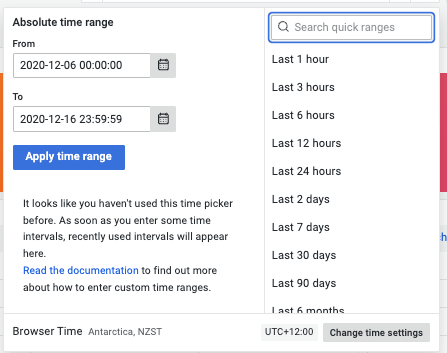

Filters can be customised and configured to fit specific needs. <a href="###">Learn more &nearr;</a>.

### How to refresh data on a dashboard page 

Changing the filters of a dashboard triggers an automatic refresh of all panels. If a loading  logo appears in the top right corner of a panel it means that the panel is still refreshing.

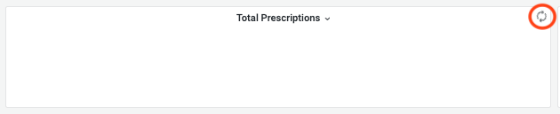
To refresh manually, click on the refresh button to reload a dashboard. It will reload all panels.

Depending on the size of the datafile and the quality of the internet connection, refreshing panels can take some time. Make sure that the loading logo is gone before inspecting a panel.
 
### What happens when switching to full screen mode

If you click on the switch to full screen mode, the top filters and side menu will disappear and the dashboard page will take the entire screen. Press the keyboard **Esc** to leave the full screen mode.
  
## What can be found in the different menus
### What are dashboards folders 

At the top left corner, the dashboard page name and location will always be displayed allowing the user to always know where they are. Clicking on the dashboard folder name will take you to said folder where you can navigate between dashboards. <a href="###">Learn more &nearr;</a>.

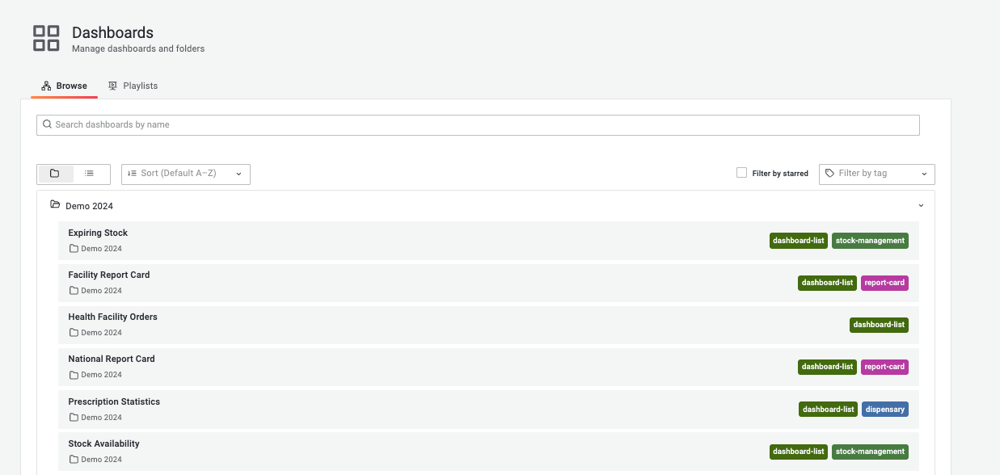

### What is on the side menu 
<a href="http://docs.grafana.org" target="_blank"> 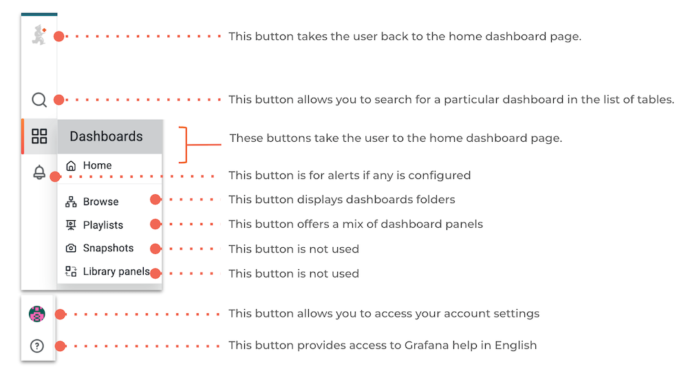
</a>
Please note that these are all the buttons existing on the side menu but most users have access to its reduced version.

## What are the different types of panels ?

When creating a dashboard, administrators can choose between several types of visualisations available in Grafana.

### Graphs & charts

- [Time series](https://grafana.com/docs/grafana/latest/panels-visualizations/visualizations/time-series/) is the default and main graph visualization. Alerts are supported in this panel.
- [State timeline](https://grafana.com/docs/grafana/latest/panels-visualizations/visualizations/state-timeline/) for state changes over time.
- [Status history](https://grafana.com/docs/grafana/latest/panels-visualizations/visualizations/status-history/) for periodic state over time.
- [Bar chart](https://grafana.com/docs/grafana/latest/panels-visualizations/visualizations/bar-chart/) shows any categorical data.
- [Histogram](https://grafana.com/docs/grafana/latest/panels-visualizations/visualizations/histogram/) calculates and shows value distribution in a bar chart.
- [Pie chart](https://grafana.com/docs/grafana/latest/panels-visualizations/visualizations/pie-chart/) is typically used where proportionality is important.
- [Gauge](https://grafana.com/docs/grafana/latest/panels-visualizations/visualizations/gauge/) is the traditional rounded visual showing how far a single metric is from a threshold.
- [Trend](https://grafana.com/docs/grafana/latest/panels-visualizations/visualizations/trend/) for datasets that have a sequential, numeric x that is not time.
- [XY chart](https://grafana.com/docs/grafana/latest/panels-visualizations/visualizations/xy-chart/) provides a way to visualize arbitrary x and y values in a graph.

### Stats & numbers

- [Stat](https://grafana.com/docs/grafana/latest/panels-visualizations/visualizations/stat/) for big stats and optional sparkline.
- [Bar gauge](https://grafana.com/docs/grafana/latest/panels-visualizations/visualizations/bar-gauge/) is a horizontal or vertical bar gauge.

### Misc

- [Table](https://grafana.com/docs/grafana/latest/panels-visualizations/visualizations/table/) is the main and only table visualization.
- [Traces](https://grafana.com/docs/grafana/latest/panels-visualizations/visualizations/traces/) is the main visualization for traces.
- [Geomap](https://grafana.com/docs/grafana/latest/panels-visualizations/visualizations/geomap/) helps you visualize geospatial data.

### Widgets

- [Dashboard list](https://grafana.com/docs/grafana/latest/panels-visualizations/visualizations/dashboard-list/) can list dashboards.
- [Alert list](https://grafana.com/docs/grafana/latest/panels-visualizations/visualizations/alert-list/) can list alerts.
- [Text](https://grafana.com/docs/grafana/latest/panels-visualizations/visualizations/text/) can show markdown and html.

### mSupply Custom panels

We have created some data visualisation panels. Once installed these can be selected in the same way as any other panels can be when configuring your dashboard:

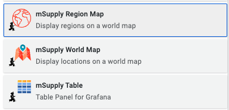

#### mSupply Region Map

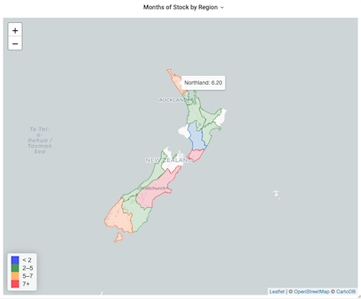

The region map displays geographic outlines on a map which can be coloured according to the thresholds defined in your panel configuration. To use this plugin you will need to have the geoJSON for the regions which you wish to display on the map.

#### mSupply Table

  

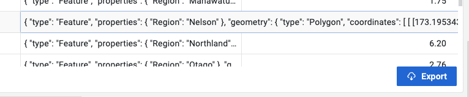

This is a custom table plugin which allows exporting information to an excel file.

#### mSupply World Map

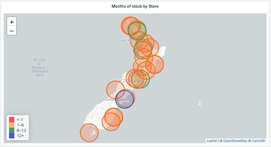

The world map panel allows you to plot values on a map, with colours indicating how the values relate to threshold levels, and sizes of the plotted circles showing relative sizes of the values. You'll need some geographic data: a latitude and longitude value which can be plotted on the map.

### How to receive updates from the dashboards ?

