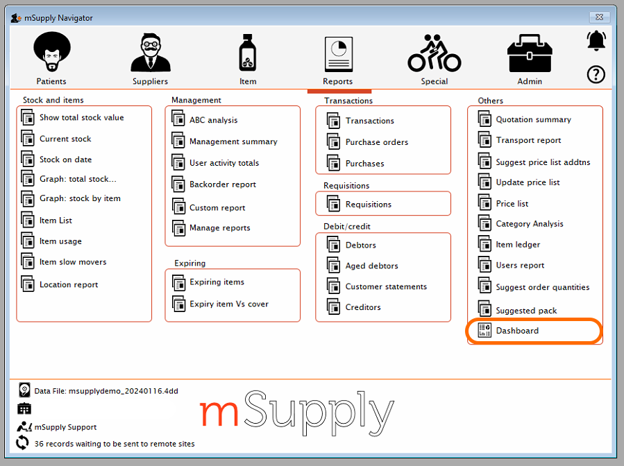
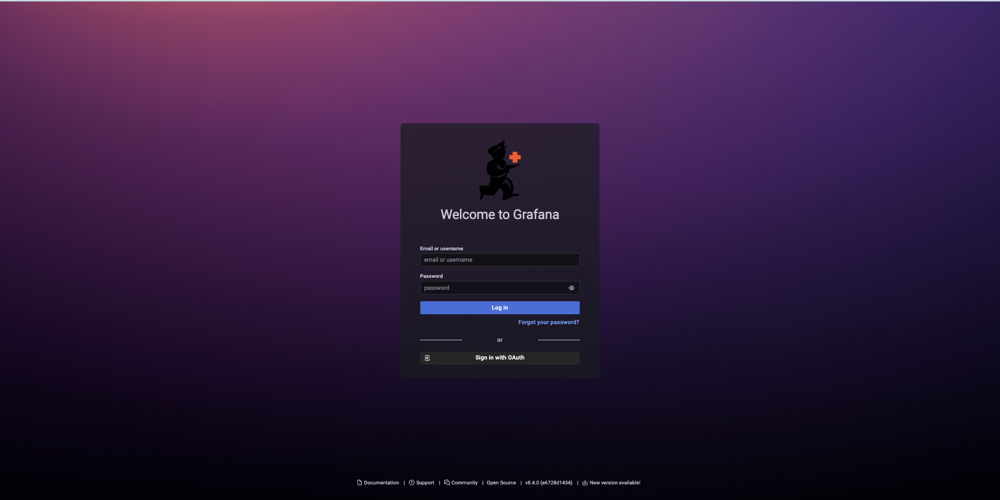
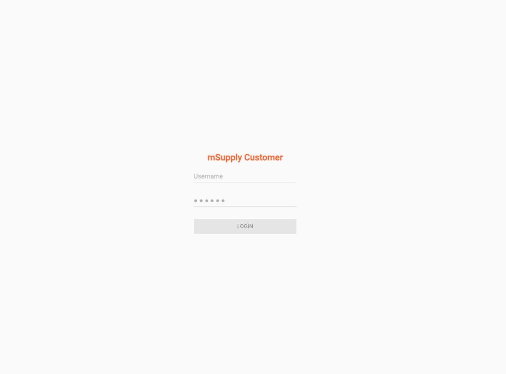

+++
title = "How to access dashboards"
date = 2025-05-01T08:00:00+00:00
updated = 2021-05-01T08:00:00+00:00
sort_by = "weight"
weight = 5
template = "dashboard/page.html"

+++
## How to access your dashboards collection

Analytical dashboards can be accessed in two different ways. 

### From the mSupply central server main page : 

- After logging in, click on **Reports** > **Dashboard**. 

- You will be automatically redirected to the mSupply dashboards using the mSupply  credentials used here.

- Please note that an administrator needs to give you access to the central server. 

### From a generated link 

- The link should look like  [https://[your-domain-name].msupply.org:3000](about:blank)  (i.e [https://demo-board.msupply.org:3000](https://demo-board.msupply.org:3000))

- When using the link directly, users land on the log in page shown here : 

## How to log in to Grafana

Please note that users can use their mSupply credentials on Grafana.

- If you have mSupply credentials, click on  
    
- Enter your mSupply credentials on the next page : 
    

In most cases, this page can be reached directly by using `2048` instead of `3000` in the URL of your dashboard collection : [https://demo-board.msupply.org:2048](about:blank)

  
After logging in, you are redirected towards the dashboards home page
