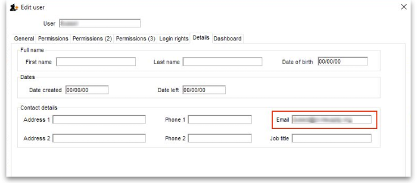
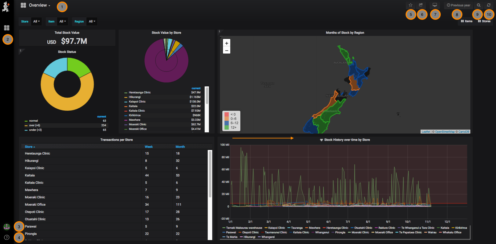
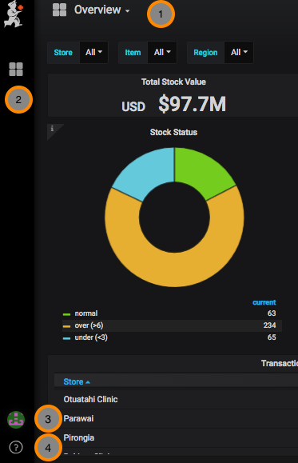

+++
title = "mSupply Dashboard"
description = "mSupply Dashboard user documentation."
date = 2025-05-01T08:00:00+00:00
updated = 2021-05-01T08:00:00+00:00
sort_by = "weight"
weight = 201
template = "dashboard/page.html"

[extra]
lead = "Welcome to the mSupply Dashboard"
toc = true
+++

### Getting Started

#### Introduction

Grafana

Your mSupply Dashboard uses Grafana, an open source visualisation tool that is linked to your mSupply data. This User Guide contains external links to Grafana information pages to explain various concepts and how to edit your current dashboard and create new dashboards.
Dashboards and Panels

Each Dashboard is composed of editable Panels arranged on a grid. The panels are separated by rows and can be dragged-and-dropped to a different location on the grid. Each panel queries your mSupply data to give you information in a visual form (graph, table etc).

#### Store login permissions to determine data visibility

The dashboards can be configured such that data visibility is controlled according to the store login permissions of the user. This can be an efficient way of managing dashboards. Instead of having a large range of very similar dashboards where the only difference between them is the user / store who's data is visible, you can have just one dashboard, where different users will see data according to the stores which they have permission to log in to.

#### Flexibility

You can view and share data from your dashboard, change the appearance and type of data the panels in your dashboard show, and create new dashboards customised to suit your needs.

For a detailed overview refer to Grafana Dashboard Concepts

#### Setting up Users

You can login to the dashboard using your current mSupply login. An account is created for you automatically in the grafana system with standard viewer-level permissions. If you are to have an editor or administrator role, then Sustainable Solutions, or another administrative user, can set that up for you after you have logged in for the first time.

To use the dashboard, an mSupply user must be configured to:

1. Use the Dashboard.

2. Have Active status enabled.

3.  If your dashboard is filtering store data according to the user's permission to log in to the store (recommendethen you will need to: \* Enter an email address for the user.
    

         * Configure the user to be able to log in to the stores for which you want them to have access.

Other than these, no other special configuration of the mSupply user account is required - including any permissions in any of the stores.

Valid Grafana user names are more restrictive than mSupply. For example, if the mSupply user name contains a hyphen (-) then Grafana will not accept that user name.
    John Doe **is** valid
    John-Doe **is not** valid

Users may need to have their mSupply username, which was working perfectly, amended in order for them to be able to log in to the Dashboard.

### Logging In

Users log in by entering the URL address of dashboard on a web browser.

The oauth (mSupply login) app requires something that Internet Explorer doesn't support. You must use another browser to log in to the mSupply dashboards.

Also, just STOP USING Internet Explorer - it's dangerous!

When you log in you may see a suite of dashboards similar to the example below.

This example is showing the 'Overview' Dashboard.
It is set to a Time Range of 'Previous year'
This Dashboard example contains six Panels:

- Total stock value
- Stock status
- Stock value by store
- Transactions per store
- Months of stock by region
- Stock history over time by store

#### Navigation menus

Let's walk through the navigation menus

1. Overview - This is the dashboard you are viewing. Clicking on this opens a window to view your other dashboards.

2. Dashboards menu - Home, Manage dashboards, Playlists, Snapshots

3. User menu - Preferences, change password, sign out

4. Help menu - Keyboard shortcuts, Community site, Grafana documentation

5. Mark as Favourite

6. Share Dashboard - via snapshot or link

7. Cycle View Mode

8. Time Range - control the time period for your dashboard

9. Search

10. Refresh
