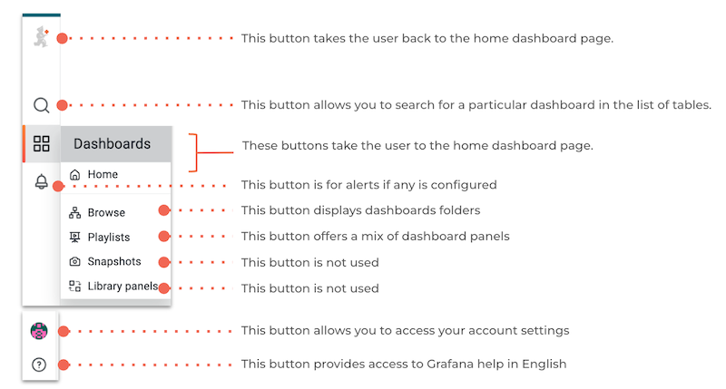
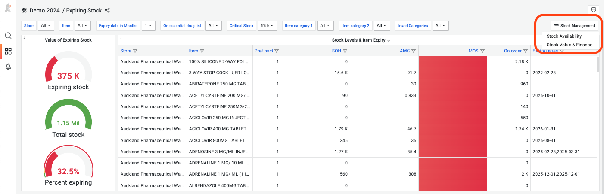
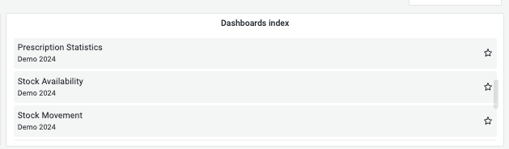

+++
title = "Navigating between dashboards"
date = 2025-05-01T08:00:00+00:00
updated = 2021-05-01T08:00:00+00:00
sort_by = "weight"
weight = 6
template = "dashboard/page.html"
+++

## How to navigate between dashboards pages 

Most collections have more than one dashboard pages, they usually are gathered in dashboards folders.

Folders can be organized by theme —such as stock management, clinical data dashboards, or dashboards for specific programs— or by access level. <a href="https://grafana.com/docs/grafana-cloud/visualizations/dashboards/manage-dashboards/#create-a-dashboard-folder">Learn more</a>

In the example below, dashboards related to performance indicators were grouped in a single folder with restricted access, as they are intended for high-level users.
 
 

Here are the different ways to navigate from one dashboard page to another :

<!-- [side menu](https://docs.google.com/document/d/1YTihF5TmRS_WccoZGVhw3y9Wy8oTKiGeoKcvDGfGesY/edit?pli=1&tab=t.jpoggc5tu8ur#heading=h.t2pc38qnlton) -->

- **Side menu** : On a dashboard page, clicking on the browse button of the side menu will redirect you to your whole collection as seen above. You can then click on the dashboard panor the folder  you are looking for.

  
  direct

- **Navigation** : On a dashboard page, if  you click on the dashboard folder name at the top left corner of the dashboard page you’re on (next to the four squares logo), you will be redirected to the current folder page.
- **Direct links** : Most dashboards have on the top right corner a button with direct links to other dashboards from the same folder as shown below. It is possible to These links are configurable.

- **Panel dashboard index** : A specific panel called Dashboards index can be added to your dashboard page and lists all the dashboards available with a direct link to each of them. This panel can also be configurable to display specific dashboards.

#### How to share your dashboard

You can share both dashboards and panels with other users, as well as producing snapshots for external partners to view.

##### To share the entire dashboard : 

- You can copy the URL of the dashboard which will lock all the variables and share it to someone who already has access to it. Make sure to share the entire URL for this.
- You can click on the logo that can be found after the title of the dashboard

- Share a link :

- None of the variables will be saved except for the timerange, unless you decide to lock it
- It is recommended to shorten the URL
- The receiver needs a username and a password to access the dashboard

- Share a snapshot  : i.e a static version of the dashboard page  that captures its current state (doesn’t update in real time), even with people who don’t have credentials to access the dashboard, without giving  live access to the underlying data sources are exposed.

- Make sure to click on “Local snapshot” to create an accessible URL with the snapshot

- Export the full dashboard page in a JSON format

- Click on Save to file to download the file on your device

- To share a panel :\*\*
