+++
title = "Dashboard Panels"
description = "mSupply Dashboard Panels."
date = 2025-05-01T08:00:00+00:00
updated = 2021-05-01T08:00:00+00:00
sort_by = "weight"
weight = 202
template = "dashboard/page.html"

[extra]
lead = "mSupply Dashboard Panels"
toc = true
+++

### Panels

There are several different Panel types or visualizations you can have on your dashboard.

For instructions on how to configure each type of Panel click here:

- <a href="http://docs.grafana.org/features/panels/graph/#graph-panel" target="_blank">Grafana Graphs</a>
- <a href="http://docs.grafana.org/features/panels/singlestat/#singlestat-panel" target="_blank">Grafa Singlestats</a>
- <a href="http://docs.grafana.org/features/panels/table_panel/#table-panel" target="_blank">Grafana Tables</a>
- <a href="http://docs.grafana.org/features/panels/dashlist/#dashboard-list-panel" target="_blank">Grafana Lists</a>
- <a href="http://docs.grafana.org/features/panels/text/#text-panel" target="_blank">Grafana Text</a>
- [mSupply Region Map](#msupply-region-map)
- [mSupply Table](#msupply-table)
- [mSupply World Map](#msupply-world-map)

Clicking the title for a panel exposes a menu.
The **Edit** option opens additional configuration options for the panel.

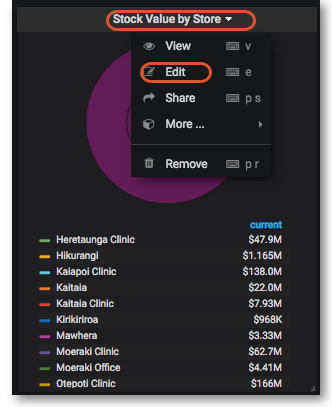

### Time range controls

The Time Range controls the data you can see at the Dashboard-level and at the Panel-level.

To view or change the Time Range, in the top right click on the Dashboard time picker (looks like a clock face). This shows the current dashboard time and refresh interval. It also acts as the menu button to toggle the time range controls.

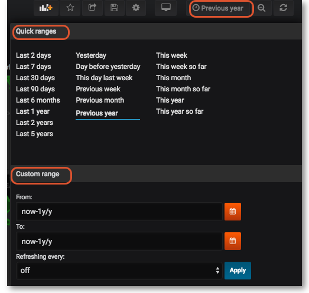

Click <a href="https://grafana.com/docs/grafana/latest/dashboards/use-dashboards/#common-time-range-controls" target="_blank">here</a> for more details on Grafana time range controls

### Sharing

You can share both dashboards and panels with other users, as well as producing snapshots for external partners to view.

#### Sharing Dashboards

Click on the Share dashboard button in the top right navigation panel > Select one of three options: Link, Snapshot or Export.
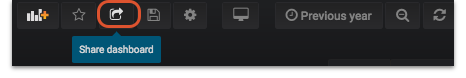

For detailed instructions on each option click on <a href="https://grafana.com/docs/grafana/latest/dashboards/share-dashboards-panels/" target="_blank">Grafana Sharing Dashboards</a>

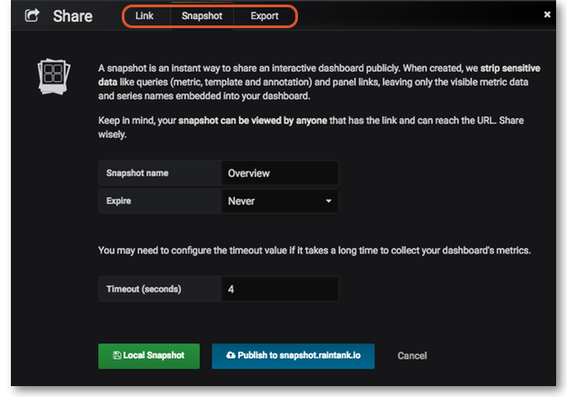

#### Sharing Panels

Click on the Title of the panel > from the menu select Share > Select one of the three options: Link, Embed or Snapshot.
For detailed instructions on each option click on Grafana Sharing Panels

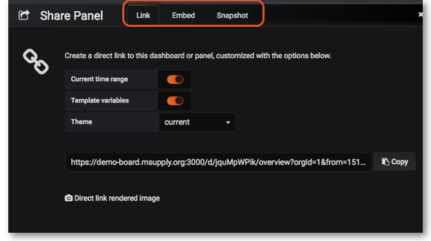

### Custom panels

We have created some data visualisation panels. Once installed these can be selected in the same way as any other panels can be when configuring your dashboard:

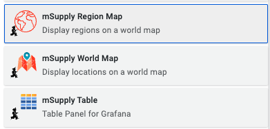

#### mSupply Region Map

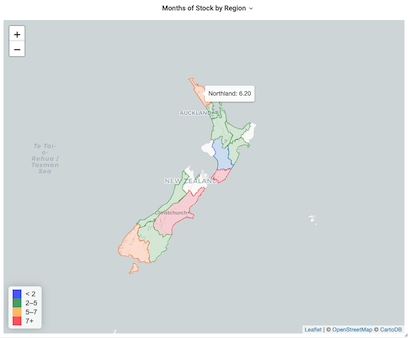

The region map displays geographic outlines on a map which can be coloured according to the thresholds defined in your panel configuration. To use this plugin you will need to have the geoJSON for the regions which you wish to display on the map.

##### Configuration

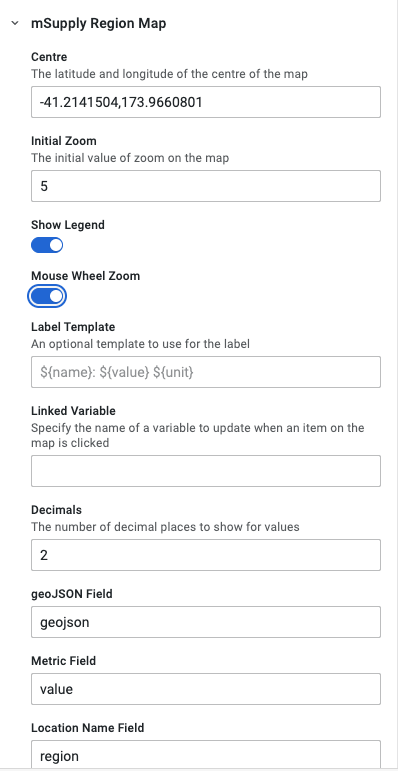

The configuration properties available are as follows

| Property            | Description                                                                                                                                       |
| ------------------- | ------------------------------------------------------------------------------------------------------------------------------------------------- |
| Centre              | A latitude and longitude pair which gives the centre of the map                                                                                   |
| Initial zoom        | Is the zoom level which the map starts at. the value is between 0 (whole world) and 20 (1:500 scale)                                              |
| Show legend         | Controls the display of the colour legend                                                                                                         |
| Mouse wheel zoom    | Controls whether the mouse wheel zooms the map or not                                                                                             |
| Label template      | An optional template to use for the label. The default value is `${name}: ${value} ${unit}`                                                       |
| Linked variable     | Here you can define what happens when clicking on a region - the linked variable allows you to update a variable with the region which is clicked |
| Decimals            | The number of decimal places to show for values                                                                                                   |
| geoJSON field       | The field returned by the query which contains the geoJSON data as text                                                                           |
| Metric field        | The field returned by the query which contains the numerical value to plot                                                                        |
| Location name field | The field returned by the query which contains the name of the region                                                                             |

#### mSupply Table

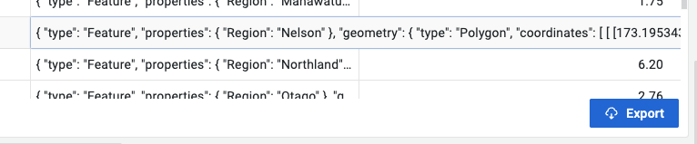

This is a custom table plugin which allows exporting information to an excel file.

##### Configuration

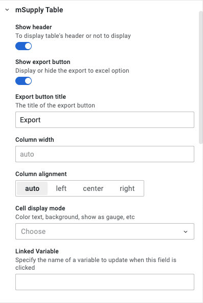

The configuration properties available are as follows

| Property            | Description                                                         |
| ------------------- | ------------------------------------------------------------------- |
| Show header         | Toggles the header visibility                                       |
| Show export button  | Toggles the export button visibility                                |
| Export button title | The text shown on the button                                        |
| Column width        | Default is 'auto'                                                   |
| Column alignment    | Alignment options for data in the cells                             |
| Cell display mode   | A standard table configuration option                               |
| Linked variable     | Specify the name of a variable to update when this field is clicked |

#### mSupply World Map

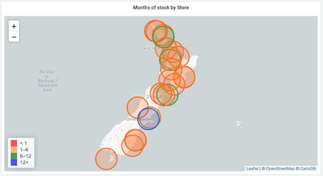

The world map panel allows you to plot values on a map, with colours indicating how the values relate to threshold levels, and sizes of the plotted circles showing relative sizes of the values. You'll need some geographic data: a latitude and longitude value which can be plotted on the map.

##### Configuration

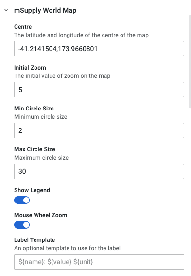
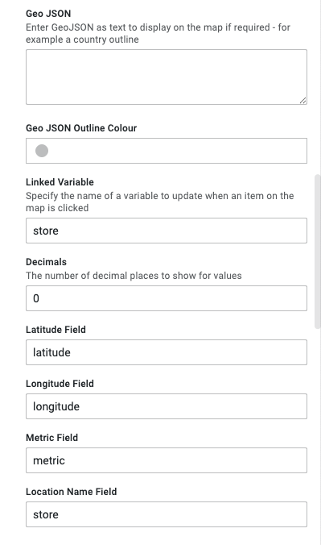

The configuration properties available are as follows

| Property         | Description                                                                                          |
| ---------------- | ---------------------------------------------------------------------------------------------------- |
| Centre           | A latitude and longitude pair which gives the centre of the map                                      |
| Initial zoom     | Is the zoom level which the map starts at. the value is between 0 (whole world) and 20 (1:500 scale) |
| Min circle size  | The minimum circle size                                                                              |
| Max circle size  | The maximum circle size                                                                              |
| Show legend      | Controls the display of the colour legend                                                            |
| Mouse wheel zoom | Controls whether the mouse wheel zooms the map or not                                                |
| Label template   | An optional template to use for the label. The default value is `${name}: ${value} ${unit}`          |
| Geo JSON         | Enter GeoJSON as text to display on the map if required - for example a country outline              |
