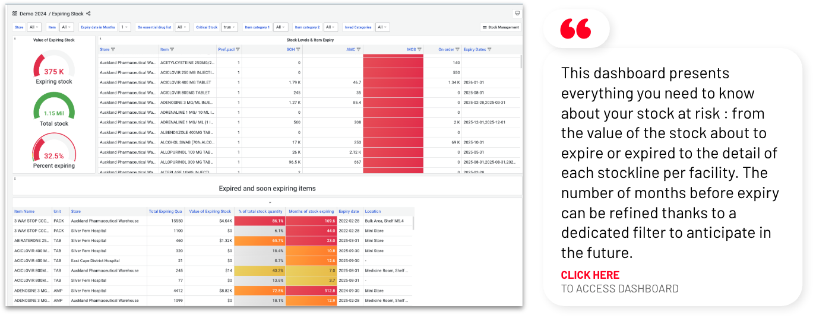
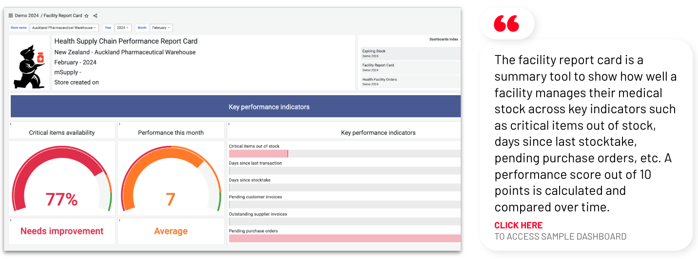
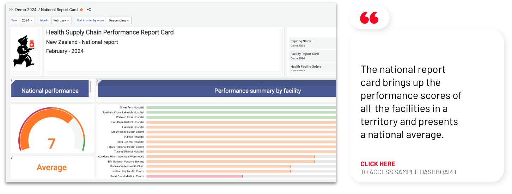
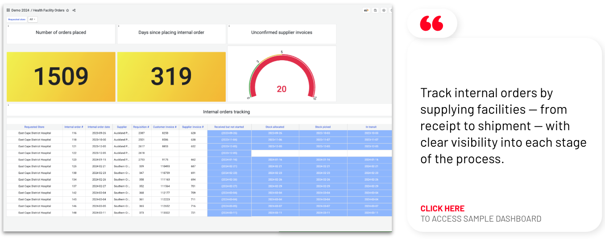
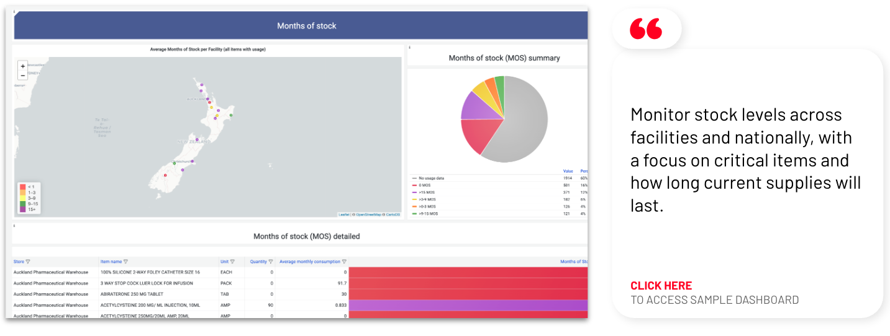
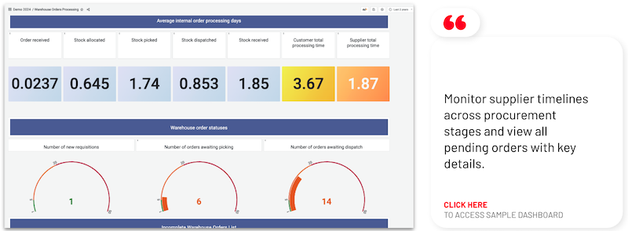
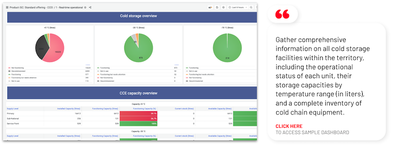
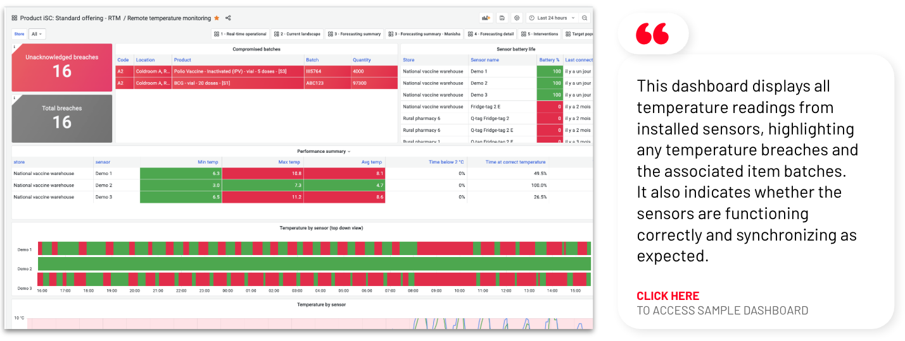
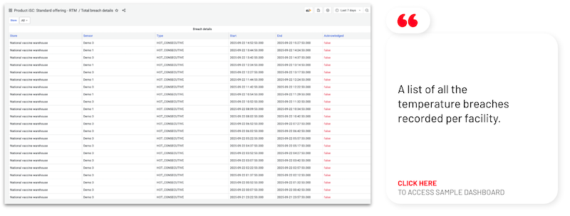

+++
title = "Standard dashboards"
description = "mSupply integrated standard dashboards"
date = 2025-05-01T08:00:00+00:00
updated = 2021-05-01T08:00:00+00:00
sort_by = "weight"
weight = 4
template = "dashboard/page.html"
+++

Standard dashboards with predefined KPIs can be included when the mSupply central server is installed, providing a solid starting point. For more specific needs, our team is available to develop custom indicators and tailored dashboards.

We have set up these dashboards with sample data for anyone to explore, you will find them listed below with a short summary.
<ul>
  <li><a href="#expiring-stock">Expiring stock</a></li>
  <li><a href="#facility-report-card">Facility report card</a></li>
  <li><a href="#national-report-card">National report card</a></li>
  <li><a href="#health-facility-orders">Health facility orders</a></li>
  <li><a href="#stock-availability">Stock availability</a></li>
  <li><a href="#stock-value-finance">Stock value & Finance</a></li>
  <li><a href="#warehouse-orders-processing">Warehouse orders processing</a></li>
  <li><a href="#warehouse-orders-delivery-tracking">Warehouse orders delivery tracking</a></li>
  <li><a href="#dispensing-statistics">Dispensing statistics</a></li>
</ul>

When consulting the dashboards, make sure that the time range filter is set to at least “a year ago” as the sample data are set in 2024. 

## Expiring stock 

## Facility report card 

## National Report card 

## Health Facility Orders

## Stock availability

## Stock value & Finance

## Warehouse orders processing

## Warehouse orders delivery tracking

(coming soon)

## Items dispensing frequency

## Cold chain equipment - Real-time operational

## Remote temperature monitoring

## Total breach details

## Unacknowledged breach details

This [dashboard](https://vaccines.msupply.org:3000/d/x9jTpCFIk/unacknowledged-breach-details?orgId=1) is a list of all the unacknowledged temperature breaches per facility. Once a breach has been identified, it is possible to acknowledge it so that it is removed from the list of new (or unacknowledged) breaches.
