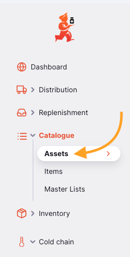

+++
title = "Activos"
description = "Ver los activos."
date = 2022-03-19T18:20:00+00:00
updated = 2022-03-19T18:20:00+00:00
draft = false
weight = 52
sort_by = "weight"
template = "docs/page.html"

[extra]
lead = "Gestiona tu catálogo de activos"
toc = true
top = false
+++

Los activos en Open mSupply son un registro digital para gestionar la creación y el mantenimiento de activos.

El catálogo de activos ofrece una lista base de activos y está pre-llenada con información del [Catálogo PQS de la OMS](https://apps.who.int/immunization_standards/vaccine_quality/pqs_catalogue/) (secciones E003 & E004). Luego, puedes crear un activo basado en los ítems de este catálogo utilizando la sección de [Equipos](/docs/coldchain/equipment/). Al hacerlo, obtendrás información básica, como el fabricante y el modelo de un activo, sin necesidad de ingresarla manualmente.
Desde el menú **Activos**, puedes ver todos los activos que actualmente tienes en tu almacén.

### Ver la lista de activos

En el panel de navegación, selecciona `Catálogo` > `Activos` para mostrar la lista de activos

Aquí puedes ver todos los activos disponibles en tu almacén.

La lista de activos está dividida en 6 columnas:

| Columna             | Descripción                                                                                                 |
| :------------------ | :---------------------------------------------------------------------------------------------------------- |
| **Subcatálogo**     | El catálogo al que pertenece este activo                                                                    |
| **Código**          | El código del ítem del catálogo al que pertenece este activo                                                |
| **Tipo**            | El tipo de activo                                                                                           |
| **Fabricante**      | El fabricante de tu activo                                                                                  |
| **Modelo**          | El número de modelo del activo                                                                              |
| **Clase**           | La clase del activo, por ejemplo: `Equipo de cadena de frío`                                                |
| **Categoría**       | La subcategoría del activo, como la sección E003 en el catálogo PQS, que es `Refrigeradores y congeladores` |

La lista puede mostrar un número fijo de activos por página. En la esquina inferior izquierda, puedes ver cuántos activos se están mostrando actualmente en tu pantalla.

Si tienes más activos que el límite actual, puedes navegar a las otras páginas tocando el número de página o usando las flechas izquierda o derecha (esquina inferior derecha).

También puedes seleccionar un número diferente de filas para mostrar por página utilizando la opción en la esquina inferior derecha de la página.

#### Filtrar activos

Para agregar un filtro a la página, selecciona el filtro requerido del menú desplegable. Se pueden combinar varios filtros.

#### Eliminar activos

Los activos se pueden seleccionar y eliminar utilizando la acción de la barra de herramientas:

### Importar y Exportar

#### Importar
Los activos se pueden importar desde un archivo con valores separados por comas (CSV) utilizando el botón `Importar`.

Esto abrirá el modo de importación.

Un ejemplo de plantilla (en formato CSV) está disponible para descargar aquí:

Los datos deberán convertirse al formato de la plantilla CSV proporcionada para que Open mSupply pueda procesar y cargar esta información.

Se puede cargar un archivo CSV una vez que haya sido creado en el formato de ejemplo.

#### Exportar

Se puede exportar una lista de activos como un archivo CSV utilizando el botón `Exportar`.

### Gestionar razones del reistro de eestado

Las razones del registro de estado se gestionan desde el servidor central de Open mSupply. <a href="/docs/getting_started/central">Haz clic aquí para obtener más información</a>.

Cuando los usuarios añaden un nuevo registro de estado a un activo en particular, se puede proporcionar más detalle asociando una razón al nuevo estado. Por ejemplo, un activo etiquetado como  `NO FUNCIONA` podría tener como razón `fallo en el suministro eléctrico`. Estas razones son personalizables y están asociados a un estado específico.

Las razones se pueden gestionar en una nueva página accesible desde el botón `Gestionar Razones de Registro`.

#### Gestionar las razones de registro

En esta página puedes:

- Crear nuevas razones de registro utilizando el botón `Crear razón de registro`

Esto abrirá el modo para crear un nuevo motivo.

- Seleccionar y eliminar razones existentes mediante el menú desplegable `Acciones`

- Filtrar razones existentes por estado utilizando el menú desplegable de filtros.
