+++
title = "Équipements"
description = "Consulter les équipements."
date = 2022-03-19T18:20:00+00:00
updated = 2022-03-19T18:20:00+00:00
draft = false
weight = 52
sort_by = "weight"
template = "docs/page.html"

[extra]
lead = "Gérer votre catalogue d'équipements"
toc = true
top = false
+++

Les équipements dans Open mSupply constituent un registre numérique pour gérer la création et la maintenance des équipements.

Le catalogue d'équipements fournit une liste d'articles d'équipement de base, et est pré-rempli depuis le [Catalogue PQS de l'OMS](https://apps.who.int/immunization_standards/vaccine_quality/pqs_catalogue/) (sections E003 & E004). Vous pouvez ensuite créer un équipement basé sur les articles de ce catalogue en utilisant la section [Équipements](/docs/coldchain/equipment/). Cela vous fournira des informations de base, telles que le fabricant et le modèle d'un équipement, sans avoir à les saisir manuellement.

Depuis le menu **Équipements**, vous pouvez voir tous les équipements actuellement présents dans votre dépôt.

### Visualiser la liste des équipements

Dans le panneau de navigation, appuyez sur `Catalogue` > `Équipements` pour afficher la liste des équipements.

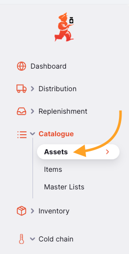

Vous pouvez voir ici tous les équipements disponibles dans votre dépôt.

La liste des équipements est divisée en 6 colonnes :

| Colonne             | Description                                                                                                               |
| :------------------ | :------------------------------------------------------------------------------------------------------------------------ |
| **Sous-catalogue**  | Le catalogue auquel cet équipement appartient                                                                             |
| **Code**            | Le code de l'article du catalogue auquel cet équipement appartient                                                       |
| **Type**            | Le type d'équipement                                                                                                      |
| **Fabricant**       | Le fabricant de votre équipement                                                                                          |
| **Modèle**          | Le numéro de modèle de l'équipement                                                                                       |
| **Classe**          | La classe de l'équipement. ex : `Équipement de chaîne du froid`                                                          |
| **Catégorie**       | La sous-catégorie de l'équipement, ex. section E003 dans le catalogue PQS qui correspond aux `Réfrigérateurs et congélateurs` |

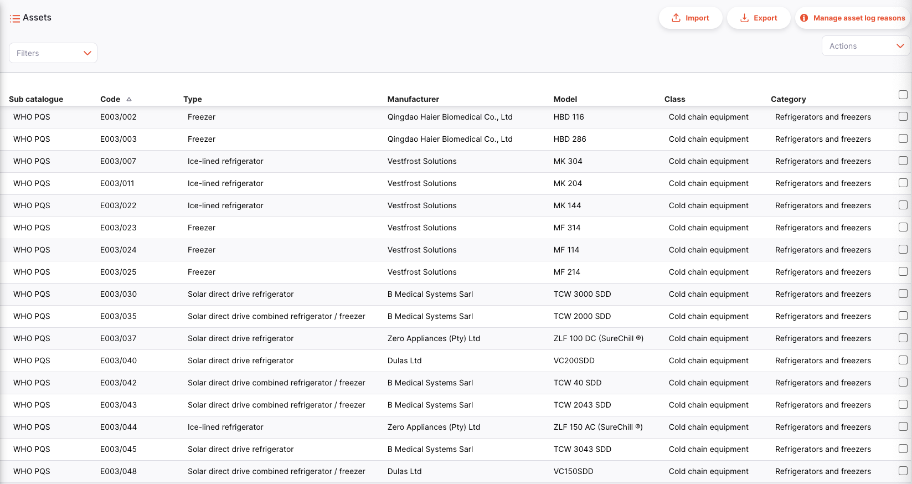

La liste peut afficher un nombre fixe d'équipements par page. En bas à gauche, vous pouvez voir combien d'équipements sont actuellement affichés sur votre écran.

Si vous avez plus d'équipements que la limite actuelle, vous pouvez naviguer vers d'autres pages en appuyant sur le numéro de page ou en utilisant les flèches droite ou gauche (coin inférieur droit).

Vous pouvez également sélectionner un nombre différent de lignes à afficher par page en utilisant l'option en bas à droite de la page.

#### Filtrer les équipements

Pour ajouter un filtre à la page, choisissez le filtre souhaité dans le menu déroulant. Plusieurs filtres peuvent être combinés.

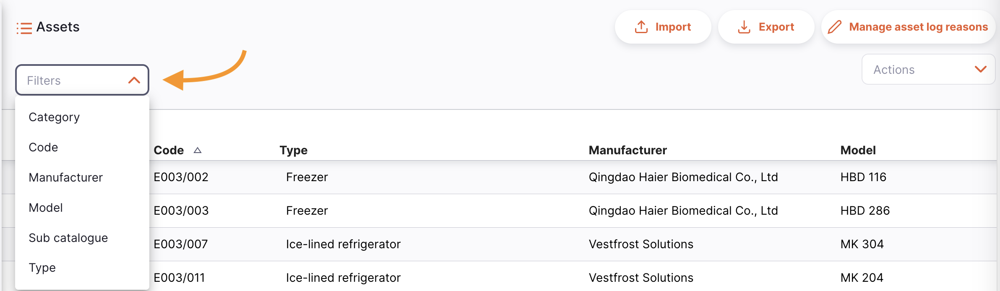

### Importer et exporter

L'importation et la suppression d'articles du catalogue d'équipements ne peuvent être effectuées que depuis le [Serveur Central Open mSupply](/docs/getting_started/central-server).

#### Importer

Les équipements peuvent être importés depuis un fichier CSV (valeurs séparées par des virgules) en utilisant le bouton `Importer`.

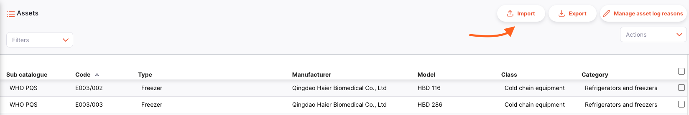

Cela ouvrira une fenêtre d'importation.

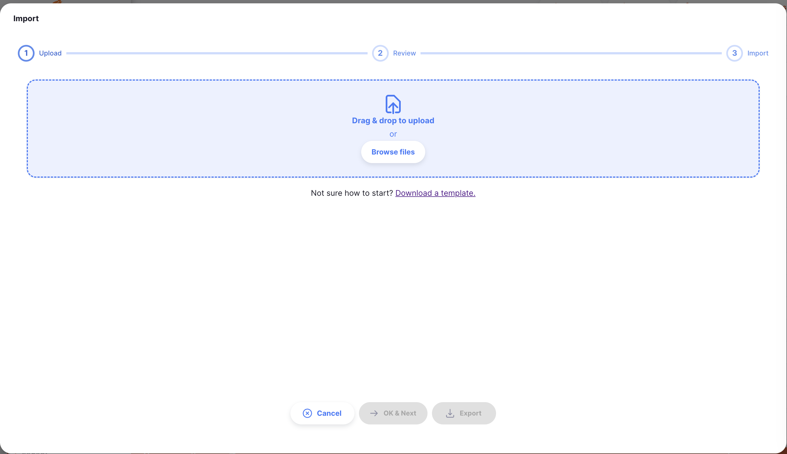

Un exemple de modèle (au format CSV) est disponible au téléchargement ici :

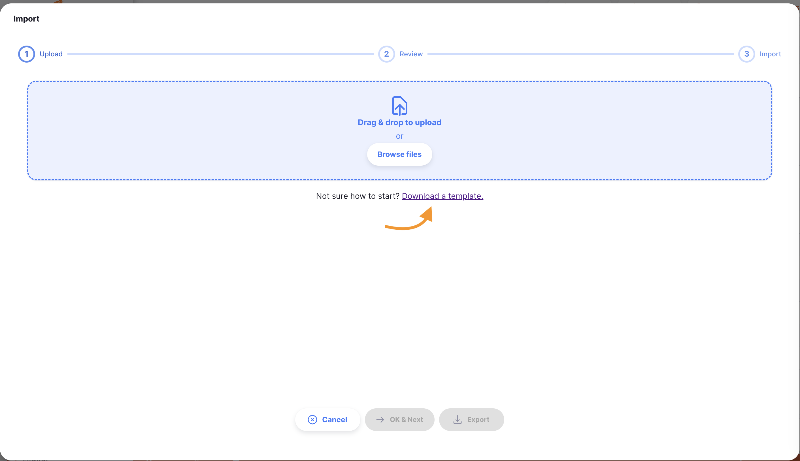

Les données devront être converties dans le format du modèle CSV fourni afin qu'Open mSupply puisse traiter et charger ces données.

Un fichier CSV peut être téléchargé une fois qu'il a été créé dans le format exemple.

#### Exporter

Une liste d'équipements peut être exportée en tant que fichier CSV en utilisant le bouton `Exporter`.

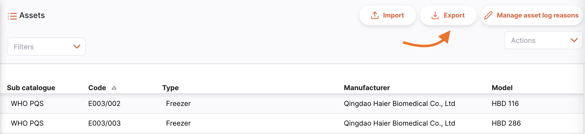

#### Supprimer

Sur le Serveur Central Open mSupply, il est possible de sélectionner et supprimer des articles du catalogue d'équipements. Le pied de page `Actions` s'affichera en bas de l'écran lorsqu'une ligne d'équipement est sélectionnée :

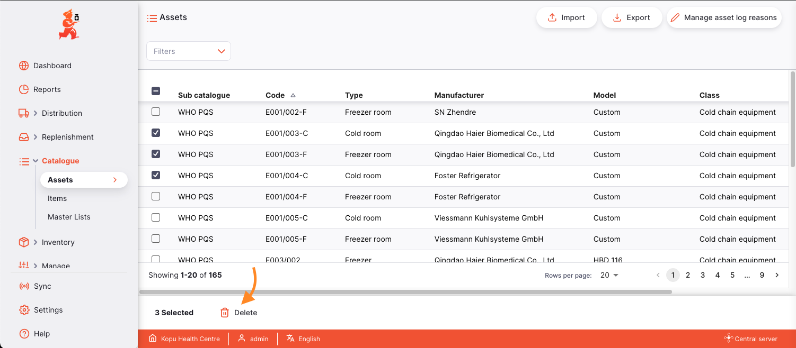

### Gérer les raisons du journal de statut

Les raisons du journal de statut sont gérées depuis le <a href="/docs/getting_started/central-server">serveur central Open mSupply</a>.

Lorsque les utilisateurs ajoutent un nouveau journal de statut pour un équipement particulier, des détails supplémentaires peuvent être fournis avec une raison associée au nouveau statut. Par exemple, un équipement qui a été étiqueté `NON_FONCTIONNEL` pourrait se voir attribuer la raison `alimentation électrique défectueuse`. Ces raisons sont personnalisables et associées à un statut particulier.

Les raisons peuvent être gérées sur une nouvelle page accessible depuis le bouton `Gérer les raisons du journal`.

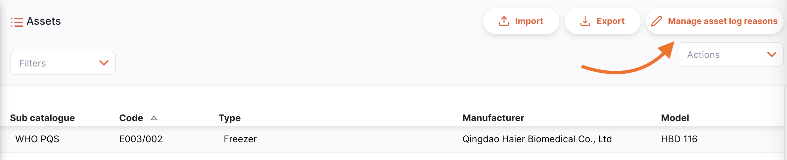

#### Gestion des raisons du journal

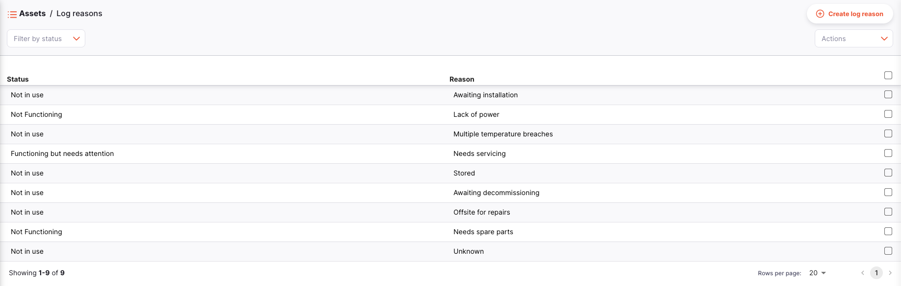

Sur cette page, vous pouvez :

- Créer de nouvelles raisons du journal via le bouton `Créer une raison de journal`
  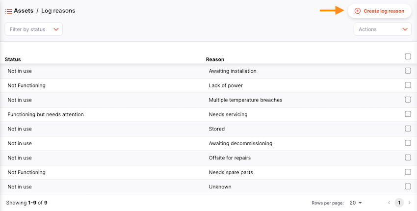

  Cela ouvrira une fenêtre de création d'une nouvelle raison
  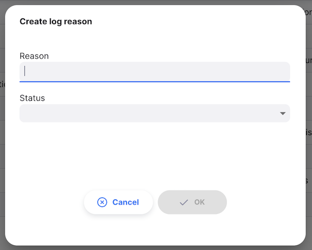

- Sélectionner des raisons pour les supprimer. Les boutons d'action s'afficheront en bas de l'écran lorsqu'une raison de journal d'équipement est sélectionnée
  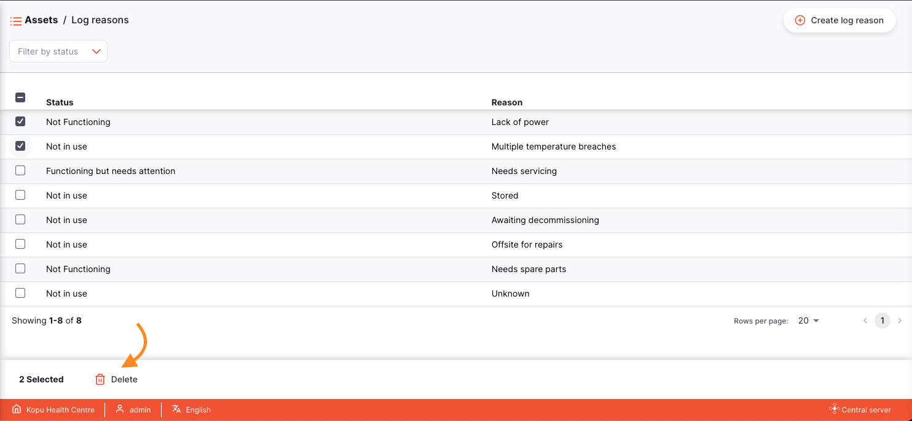

- Filtrer les raisons existantes par statut en utilisant le menu déroulant de filtre
  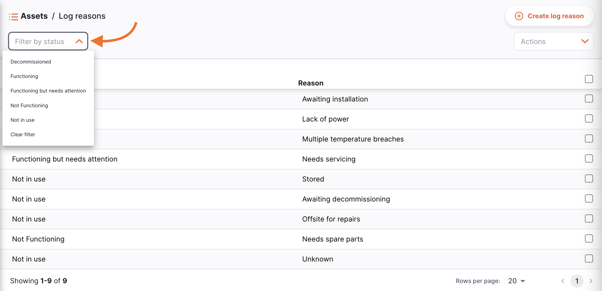
