+++
title = "Assets"
description = "Viewing assets."
date = 2022-03-19T18:20:00+00:00
updated = 2022-03-19T18:20:00+00:00
draft = false
weight = 52
sort_by = "weight"
template = "docs/page.html"

[extra]
lead = "Managing your catalogue of asset items"
toc = true
top = false
+++

Assets in Open mSupply is a digital register to manage the creation and maintenance of assets.

The asset catalogue provides a list of base asset items, and is pre-populated from the [WHO PQS Catalogue](https://apps.who.int/immunization_standards/vaccine_quality/pqs_catalogue/) (sections E003 & E004). You can then create an asset based on the items in this catalogue using the [Equipment](/docs/coldchain/equipment/) section. Doing so will give you base information, such as the manufacturer & model of an asset without having to enter that manually.
From the **Assets** menu, you can view all of the assets currently in your store.

### Viewing Asset List

In the navigation panel, tap on `Catalogue` > `Assets` to show the asset list

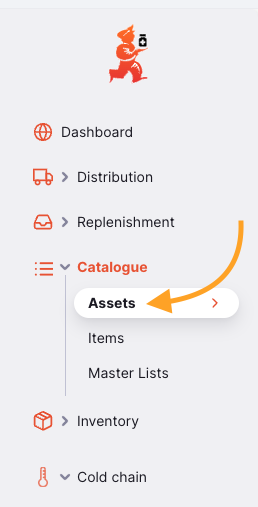

Here you can see all the assets which are available in your store.

The asset list is divided into 6 columns:

| Column            | Description                                                                                               |
| :---------------- | :-------------------------------------------------------------------------------------------------------- |
| **Sub catalogue** | The catalogue this asset belongs to                                                                       |
| **Code**          | The code of the catalogue item which this asset belongs to                                                |
| **Type**          | The type of asset                                                                                         |
| **Manufacturer**  | The manufacturer of your asset                                                                            |
| **Model**         | The model number of the asset                                                                             |
| **Class**         | The class of the asset. ie: `Cold chain equipment`                                                        |
| **Category**      | The subcategory of the asset e.g. section E003 in the PQS catalogue which is `Refrigerators and freezers` |

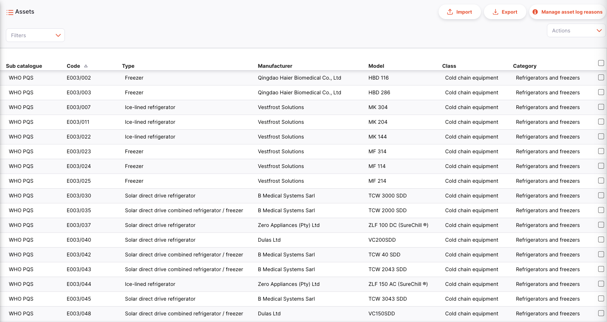

The list can display a fixed number of assets per page. On the bottom left corner, you can see how many assets are currently displayed on your screen.

If you have more assets than the current limit, you can navigate to the other pages by tapping on the page number or using the right of left arrows (bottom right corner).

You can also select a different number of rows to show per page using the option at the bottom right of the page.

#### Filter Assets

To add a filter to the page, choose the required filter from the drop down. Multiple filters can be combined.

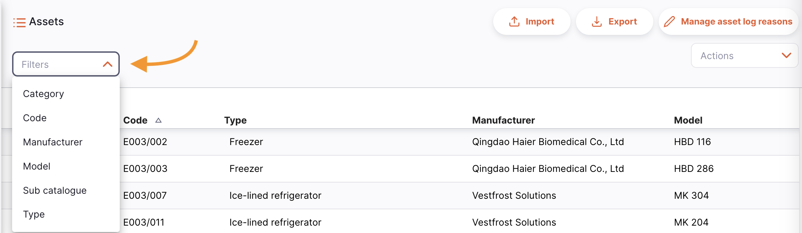

### Importing And Exporting

Importing and deleting of asset catalogue items can only be done on the [Open mSupply Central Server](/docs/getting_started/central).

#### Import

Assets can be imported from a comma-separated-file (csv) file using the `Import` button.

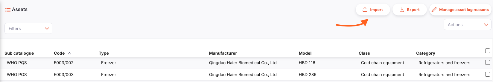

This will open an import modal.

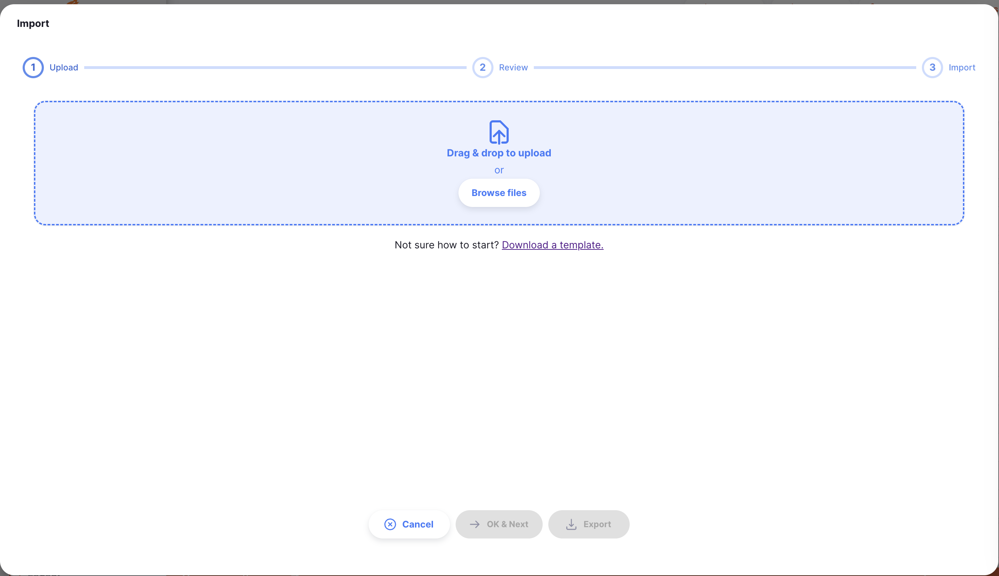

An example template (in csv format) is available for download here:

Data will need to be converted into the format of the csv template provided in order for Open mSupply to be able to process and upload this data.

A csv file can be uploaded once it has been created in the example format.

#### Export

A list of assets can be exported as a csv file using the `Export` button.

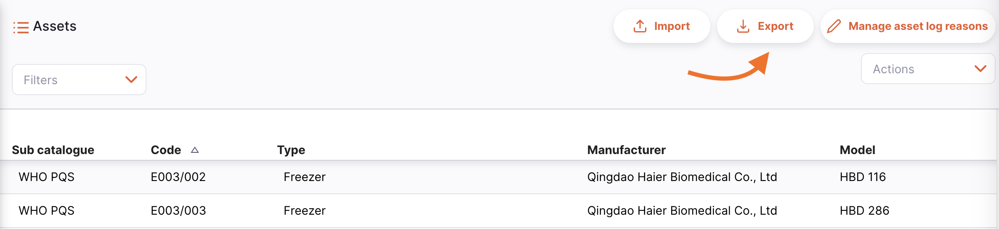

#### Delete

On the Open mSupply Central Server, there is the option to select and delete asset catalogue items. The `Actions` footer will display at the bottom of the screen when an asset row is selected:

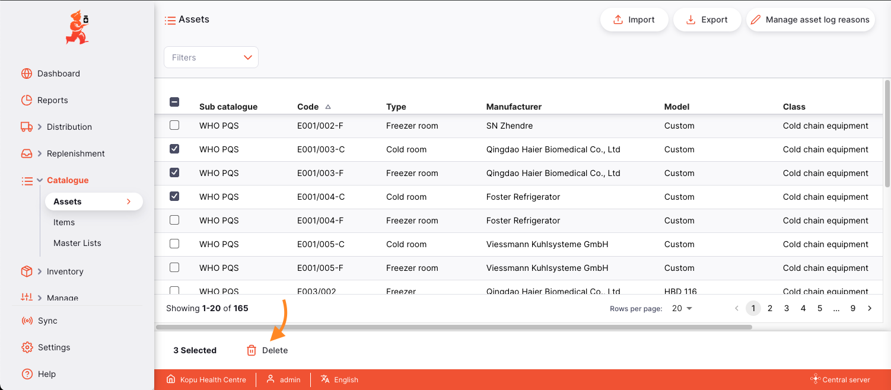

### Managing status log reasons

Status log reasons are managed from the <a href="/docs/getting_started/central">Open mSupply central server</a>.

When users add a new status log against a particular asset, more detail can be provided with a reason associated with the new status. For example, an asset which has been labled `NON_FUNCTIONING` could be assigned a reason of `power supply broken`. These reasons are customisable, and associated with a particular status.

Reasons can be managed on a new page accessible from the `Manage Log Reasons` button.

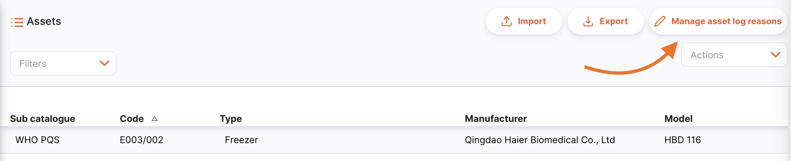

#### Managing log reasons

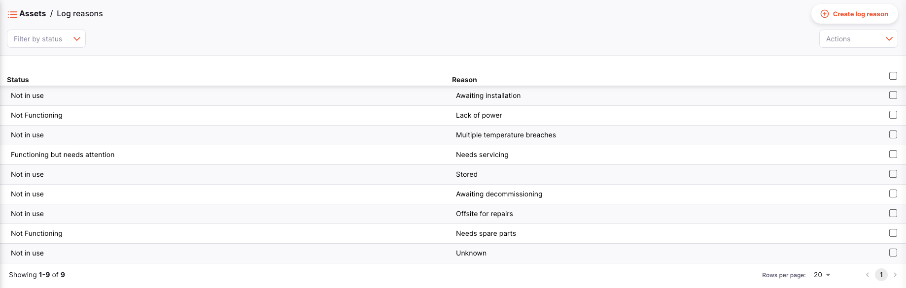

On this page you can:

- Create new log reasons through the `Create log reason` button
  

This will open a create new reason modal
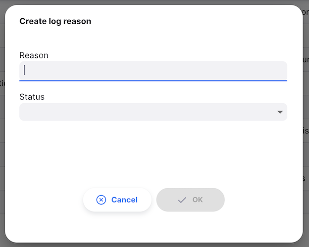

- Select reasons to delete them. Action buttons will display at the bottom of the screen when an asset log reason is selected
  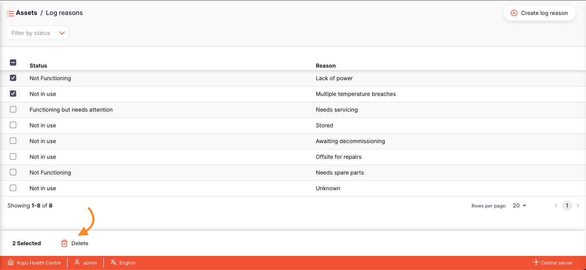

- Filter existing reasons by status using the filter dropdown
  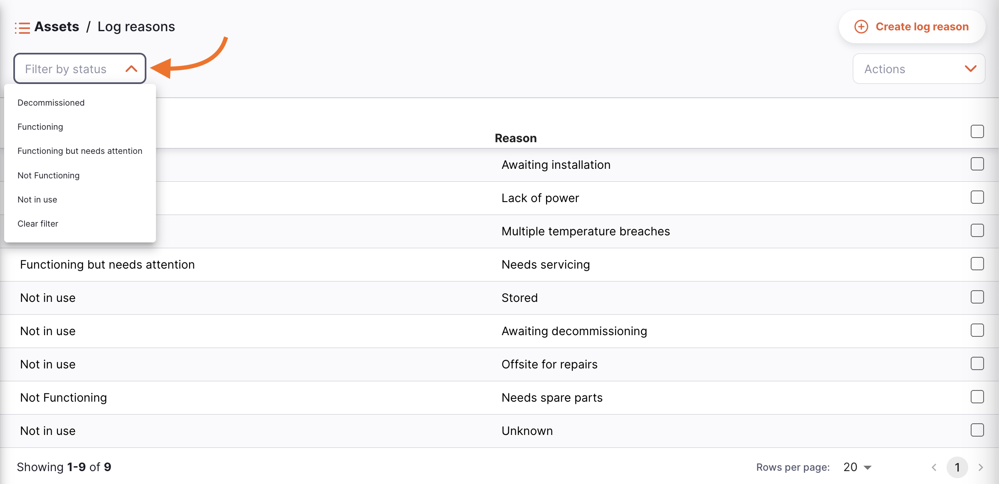
