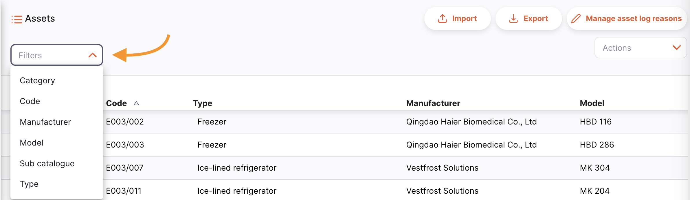
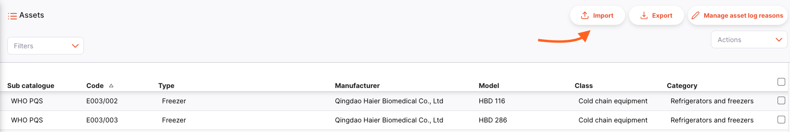
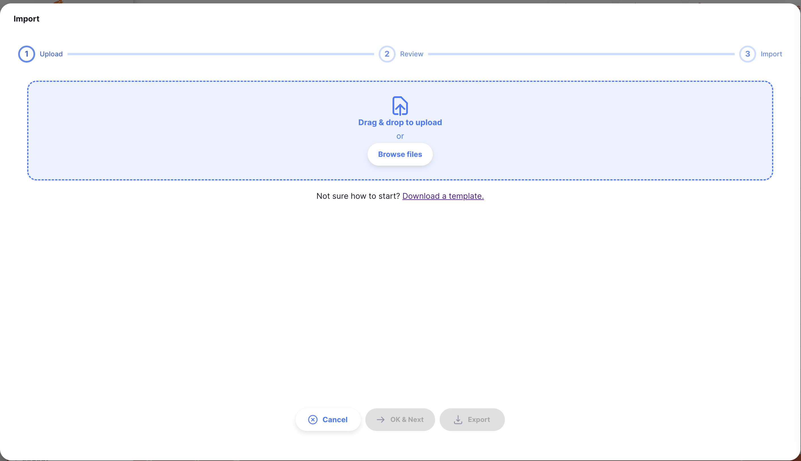
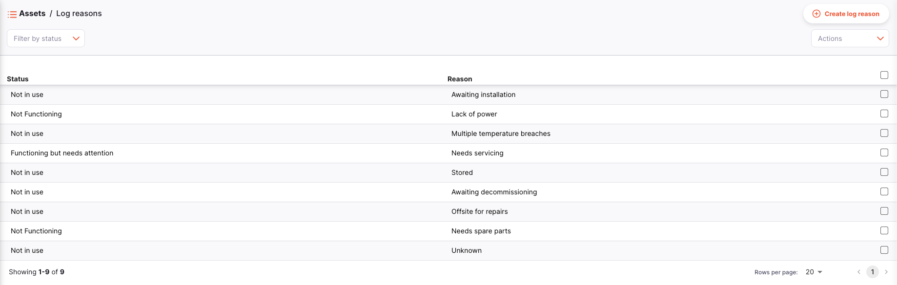
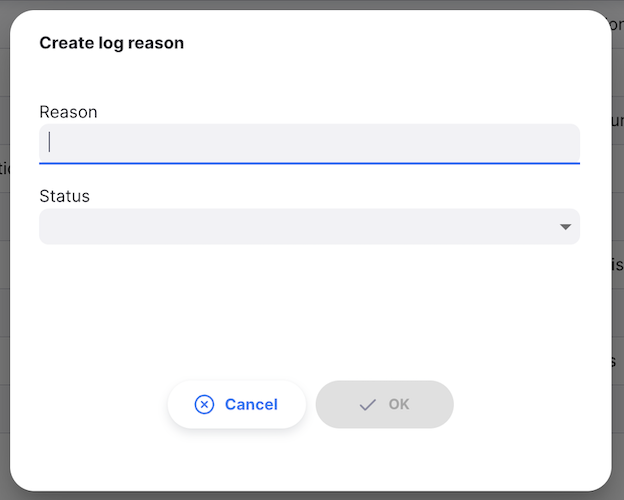
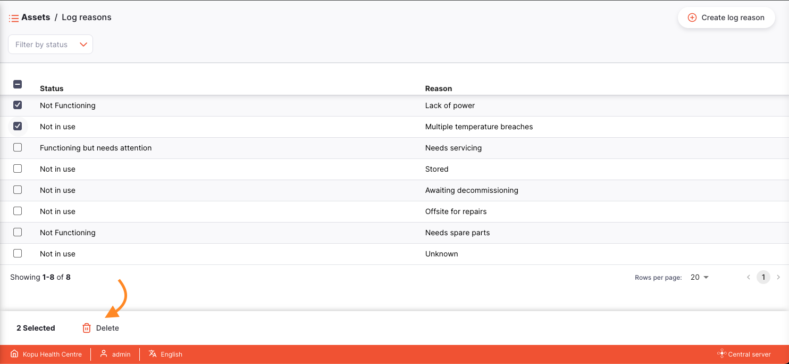

+++
title = "Ativos"
description = "Ver os ativos."
date = 2022-03-19T18:20:00+00:00
updated = 2022-03-19T18:20:00+00:00
draft = false
weight = 52
sort_by = "weight"
template = "docs/page.html"

[extra]
lead = "Gerencie seu catálogo de ativos"
toc = true
top = false
+++

Os ativos do Open mSupply permitem ter um registro digital para gerenciar a criação e manutenção de ativos.

O catálogo de ativos oferece uma lista base de ativos e está preenchida com informações do [Catálogo PQS de OMS](https://apps.who.int/immunization_standards/vaccine_quality/pqs_catalogue/) (seções E003 & E004). Logo, é possível criar um ativo basado nos items deste catálogo utilizando a seção de [Equipamentos](/docs/coldchain/equipment/). Ao fazer-lo, obterás informações básicas, como o fabricante e o modelo de un ativo, sem necessidade de inserir manualmente.
No menu **Ativos**, é possível ver todos os ativos que atualmente tens na sua unidade de saúde.

### Ver a lista de ativos

No panel de navegação, selecione `Catálogo` > `Ativos` para mostrar a lista de ativos

Aqui é possível ver todos os ativos disponíveis na sua unidade de saúde.

A lista de ativos está dividida en 6 columnas:

| Coluna          | Descrição                                                                                          |
| :-------------- | :------------------------------------------------------------------------------------------------- |
| **Subcatálogo** | O catálogo no qual o ativo está contido                                                            |
| **Código**      | O código do ítem do catálogo no qual o ativo está contido                                          |
| **Tipo**        | O tipo de ativo                                                                                    |
| **Fabricante**  | O fabricante do ativo                                                                              |
| **Modelo**      | O número do modelo do ativo                                                                        |
| **Classe**      | A classe do ativo, por exemplo: `Equipamento da cadeia de frios`                                   |
| **Categoría**   | A subcategoría do ativo, como a seção E003 no catálogo PQS, que es `Refrigeradores e congeladores` |

A lista pode mostrar um número fixo de ativos por página. No canto inferior esquerdo é possível ver quantos ativos estão sendo mostrados na sua janela.

Caso tenham mais ativos em que o limite atual, podes navegar pelas outras páginas clicando no número de página o utilizando as setas na esquerda ou direita.

Também é possível selecionar un número diferente de linhas para mostrar por página utilizando a opção no canto inferior direito.

#### Filtrar ativos

Para adicionar um filtro à sua página, selecione o filtro requisitado no menu suspenso. É possível combinar vários filtros.

#### Excluir ativos

É possível selecionar e excluir os ativos utilizando a ação na barra de ferramentas:

### Importar e Exportar

#### Importar

É possível importar os ativos a partir de um ficheiro com valores separados por comas (CSV) utilizando o botão `Importar`.

Isso abrirá o modo de importação.

Um exemplo de planilha (em formato CSV) está disponível para download aqui:

Os datos deverão ser convertidos para o formato da planilha CSV para que Open mSupply possa processar e carregar corretamente as informações.

#### Exportar

É possível exportar uma lista de ativos em formato CSV utilizando o botão `Exportar`.

### Gerenciar razões para o registo de Estado

 As razões do registo de estado são gerenciadas a partir do servidor central de Open mSupply. <a href="/docs/getting_started/central"> Clique aqui para obter mais informações </a>.

Quando os utilizadores associam um novo registo de estado à um ativo em particular, pode-se adicionar mais detalhes ao associar uma razão ao novo estado. Por exemplo, um ativo marcado como `NÃO FUNCIONA` podería estar associado a uma razão `falha no sistema elétrico`. Estas razo8es podem ser personalizadas e estão associadas a un estado específico.

As razones podem ser geridas um uma nova página acessível ao clicar no botão `Gerenciar Razões de Registo`.

#### Gerenciar as razões de registo

Nesta página podes:

- Criar novas razões de registo utilizando o botão `Criar razão de registo`
  

- Isso irá habilitar a criac1ão de um novo motivo.
  

- Selecione os motivos para os eliminar. Os botões de ação serão apresentados na parte inferior do ecrã quando for selecionado um motivo do registo de activos
  

- Filtrar razões existentes por estado utilizando o menu suspenso de filtros.
  
