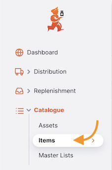

+++
title = "Artículos"
description = "Ver artículos."
date = 2022-03-19T18:20:00+00:00
updated = 2022-03-19T18:20:00+00:00
draft = false
weight = 52
sort_by = "weight"
template = "docs/page.html"

[extra]
lead = "Gestiona tu catálogo"
toc = true
top = false
+++

Un artículo en Open mSupply es usualmente un producto que compras de un proveedor, mantienes en stock y suministras a un cliente.
Desde el menú **Artículos**, puedes ver todos los artículos que están actualmente visibles en tu tienda.

## Ver la lista de artículos

En el panel de navegación, toca `Catálogo` > `Artículos` para mostrar la lista de artículos:

Puedes ver todos los artículos que están disponibles para uso por tu tienda:

La lista de Artículos está dividida en 6 columnas:

| Columna    | Descripción                                                                                                                                                     |
| :--------- | :-------------------------------------------------------------------------------------------------------------------------------------------------------------- |
| **Código** | Código asignado a este artículo en mSupply                                                                                                                      |
| **Nombre** | Este es el nombre por el cual mSupply se referirá al artículo                                                                                                   |
| **Unidad** | La unidad de medida para el artículo                                                                                                                            |
| **EED**    | Cuánto stock está físicamente en tu tienda                                                                                                                      |
| **CMM**    | Consumo Mensual Promedio. Esta es la cantidad de stock que tu tienda usa cada mes en promedio (basado en un número configurable de meses, por defecto 3 meses). |
| **MDE**    | Número de meses de consumo restante con el stock actual. Esto se calcula como: `Stock en Depósito / CMM`.                                                       |

## Ver detalles de un artículo

Para ver los detalles de un artículo, simplemente toca en uno. Se abre una nueva ventana:

En la parte superior de la pantalla, puedes ver la siguiente información:

- **Stock en Depósito**: Cuánto stock está actualmente en tu tienda
- **CMM**: Consumo Mensual Promedio. Esta es la cantidad de stock que tu tienda usa cada mes en promedio (basado en un número configurable de meses, por defecto 3 meses).
- **Meses de Stock**: Número de meses de consumo restante con el stock actual. Esto se calcula como: `Stock en Depósito / CMM`.

En el ejemplo a continuación, tenemos 20,219 unidades de Ácido Acetilsalicílico disponibles en nuestra tienda. El consumo promedio es de 3,443.67 unidades por mes, lo que significa que hay el equivalente a 5.87 meses de stock en el inventario.

Hay dos pestañas en la parte inferior de la pantalla:

- **General**: La información básica del artículo
- **Listas Maestras**: Listas maestras asociadas con el artículo
<!-- - **Variantes de Paquete**: Tamaños de paquete personalizables para el artículo. Solo se puede configurar en el nuevo servidor central de Open mSupply. -->

### General

#### Detalles

- **Nombre**: Este es el nombre por el cual mSupply se referirá al artículo
- **Código**: Este debe ser único para cada artículo y es una abreviación útil para referirse a los artículos
- **Unidad**: La unidad que usas para este artículo. Es útil distinguir artículos que emites por paquete (ej. gotas para los ojos) de artículos que emites por volumen (ej. líquidos orales)
- **Concentración**: Para un medicamento, la concentración de sus ingredientes activos (ej. para Amoxicilina 250mg, la concentración es 250mg)
- **Dosis Diaria Definida**: La dosis de mantenimiento promedio asumida por día para un medicamento usado para su indicación principal en adultos
- **Tipo**: El tipo de artículo (ej. Stock o Servicio)
- **Dosis**: Para vacunas, el número de dosis por vial
- **Vacuna** (casilla de verificación): Si esto está marcado, este artículo es una vacuna y se puede asignar un número de dosis

#### Categorías

- **Categoría ATC**: ATC significa Anatómico, Terapéutico, Químico y es un método de clasificar entidades, e identificarlas por categoría
- **Nombre Universal**: si el artículo está vinculado a la [base de datos universal de códigos de medicamentos](https://codes.msupply.foundation/), esto muestra el nombre universal, o genérico para el artículo dado
- **Código Universal**: similarmente, el código asignado al artículo de código de medicamento universal

#### Empaque

- **Tamaño de paquete por defecto**: Este es el tamaño de paquete por defecto que será asignado al stock entrante cuando se reciba
- **Tamaño de paquete externo**: El número de unidades en una caja (paquete externo). No el número de paquetes de tamaño preferido en una caja (paquete externo).
- **Volumen por paquete**: El volumen por defecto por paquete de tamaño preferido. Este es el volumen que será usado por defecto al recibir mercancías. Recomendamos que dividas el volumen de una caja por el número de paquetes de tamaño preferido en una caja para obtener esta cifra. Open mSupply siempre almacena volúmenes en m3 (metros cúbicos), pero puedes ingresar un volumen como mililitros (ml) o litros (l) ingresando la abreviación apropiada después del número que representa el volumen. ej. ingresa "0.5l" para ingresar un volumen de 0.5 litros (= 0.0005m3).
- **Volumen por paquete externo**: El volumen por defecto de un paquete de tamaño de paquete externo de este artículo
- **Peso**: El peso de un paquete de tamaño preferido en kg

#### Precios

- **Margen**: Este es el margen por defecto que será aplicado a este artículo en Envíos Entrantes para calcular el precio de venta

### Listas Maestras

Esta pestaña lista las Listas Maestras asociadas con este artículo.

### Libro Mayor

La pestaña del libro mayor del artículo muestra un historial de transacciones en esta tienda para el artículo.

El libro mayor está dividido en 16 columnas:

| Columna                     | Descripción                                                          |
| :-------------------------- | :------------------------------------------------------------------- |
| **Tipo**                    | El tipo de la transacción                                            |
| **Fecha**                   | La fecha en que la transacción fue confirmada                        |
| **Hora**                    | La hora en que la transacción fue confirmada                         |
| **Número de Factura**       | El número de factura (envío) de la transacción                       |
| **Nombre**                  | El nombre del cliente o proveedor                                    |
| **Estado**                  | El estado de la transacción                                          |
| **Vencimiento**             | La fecha de vencimiento de la línea de stock                         |
| **Lote**                    | El número de lote de la línea de stock                               |
| **Tamaño del Paquete**      | El tamaño del paquete                                                |
| **Número de paquetes**      | El número de paquetes en la transacción                              |
| **Cant. Unitaria**          | La cantidad que fue asignada a la transacción en unidades            |
| **Saldo**                   | El saldo de la línea de stock                                        |
| **Precio de costo paquete** | El precio de costo del paquete                                       |
| **Precio de venta paquete** | El precio de venta del paquete                                       |
| **Total antes de impuesto** | El costo total de la transacción antes de impuesto (en moneda local) |
| **Razón**                   | La razón del ajuste (si es requerido)                                |

### Filtrar libro mayor por transacciones

Puedes filtrar los libros mayores por la transacción: Tipo, Estado o Rango de fechas. ¡Esto es útil cuando necesitas revisar un conjunto específico de transacciones que cumplen ciertos criterios!

Selecciona uno o más filtros para reducir los resultados. La lista se actualizará para mostrar todas las transacciones del libro mayor que coinciden con los criterios seleccionados.

## Variantes de Artículos

En el [Servidor Central Open mSupply](../../getting_started/central-server/), una tercera pestaña, Variantes de Artículos, está disponible. Esta pestaña te permite configurar variaciones del artículo, como diferentes fabricantes o tamaños de empaque.

Actualmente, las Variantes de Artículos solo se usan para funcionalidad GAPS.

### Agregando una Variante de Artículo

Para crear una nueva Variante de Artículo, haz clic en el botón `Agregar Variante` en la esquina superior derecha.

Esto abrirá una nueva ventana, donde puedes ingresar un nombre para la variante, y sus detalles:

Las opciones de temperatura se configuran como [Tipos de Ubicación](https://docs.msupply.org.nz/items:item_locations?s[]=location&s[]=type#location_types) en el Servidor Central mSupply. Los [Fabricantes](https://docs.msupply.org.nz/names:adding_and_editing?s[]=manufacturers#adding_a_customer_supplier_manufacturer_donor_or_benchmark) también se gestionan en mSupply.

#### Empaque

Diferentes instalaciones trabajan en diferentes niveles de empaque, ej. un almacén puede trabajar en cajas, mientras que una clínica trabaja en cajas o unidades individuales. En la sección Empaque, puedes definir el tamaño del paquete (unidades por paquete) y volumen de empaque para los diferentes niveles de empaque de una variante de artículo.

Esto permite que los cálculos GAPS consideren con precisión los requisitos de almacenamiento en frío para esta variante de artículo, en el nivel de empaque usado por una instalación particular.

Los tamaños de paquete definidos en las Variantes de Artículos se usan para cálculos GAPS SOLAMENTE, para proporcionar mayor precisión a través de las variaciones de artículos. No afecta los tamaños de paquete usados en tus flujos de trabajo de pedidos habituales en Open mSupply.

### Editando una Variante de Artículo

Para editar una Variante de Artículo, haz clic en el botón `Editar` al lado de la variante que deseas actualizar.

Esto abrirá la misma ventana que cuando agregas una nueva variante, con los detalles existentes pre-llenados. Haz los cambios que necesites, y haz clic en `OK` para actualizar la variante.

### Eliminando una Variante de Artículo

Para eliminar una Variante de Artículo, haz clic en el botón `Eliminar` al lado de la variante que deseas remover.

Se te pedirá que confirmes la eliminación. Haz clic en `OK` para confirmar, o `Cancelar` si ya no deseas eliminar la variante.

    

### Agrupación de artículos

También puedes agregar artículos agrupados a cada Variante de Artículo. Estos son otros artículos que siempre se emiten con este artículo, por lo que los cálculos GAPS deben considerar el almacenamiento requerido para todos los artículos en el grupo.

  Los artículos agrupados no están implementados en flujos de trabajo de dispensación en Open mSupply. Aún necesitas dispensar cada artículo en el grupo por separado.

La agrupación se hace a nivel de Variante de Artículo, dándote control refinado sobre qué variantes deben agruparse juntas. Por ejemplo, una vacuna puede solo poder agruparse con un diluyente específico del mismo fabricante.

#### Agregando artículos agrupados

Para agrupar un artículo con la variante actual, haz clic en el botón `Agregar artículo agrupado` bajo la sección `Agrupado con`.

    

Esto abrirá una nueva ventana, donde puedes buscar el artículo que deseas agrupar con la variante actual.

    

Después de seleccionar el artículo, se te pedirá que selecciones la variante específica de ese artículo, junto con la proporción en la que debe agruparse.

En este ejemplo, 0.2 unidades de Silverfern salina 0.22% deben agruparse con cada 1 unidad de Qdenga.

    

Haz clic en OK para agregar el artículo agrupado. Entonces aparecerá en la sección `Agrupado con`.

#### Editando artículos agrupados

Para editar un artículo agrupado, haz clic en la fila en la sección `Agrupado con`. Esto abrirá la misma ventana que cuando agregas un nuevo artículo agrupado, con los detalles existentes pre-llenados. Haz los cambios que necesites, y haz clic en `OK` para actualizar el grupo.

    

#### Removiendo artículos agrupados

Para remover un artículo agrupado, haz clic en el ícono Eliminar al lado del artículo que deseas remover.

Se te pedirá que confirmes la remoción del artículo agrupado. Haz clic en `OK` para confirmar, o `Cancelar` si ya no deseas removerlo.

    

#### Variantes de artículos que son parte de grupos

No puedes agrupar artículos para una variante de artículo que ya es parte de otro grupo.

El botón `Agregar artículo agrupado` será deshabilitado, y en su lugar verás una lista de las variantes de artículos con las que esta variante ya está agrupada.

