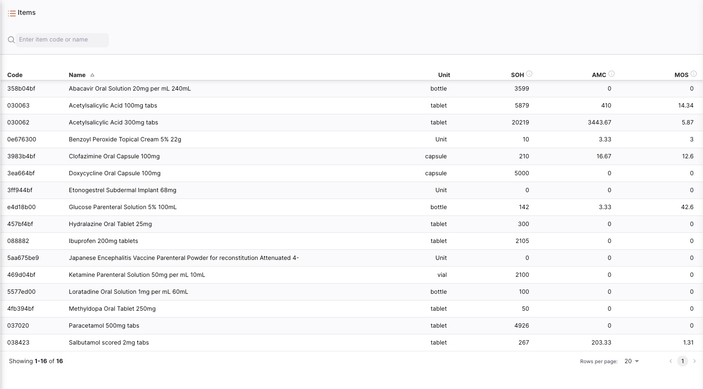
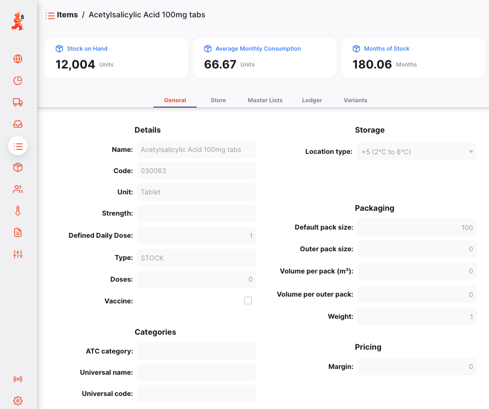
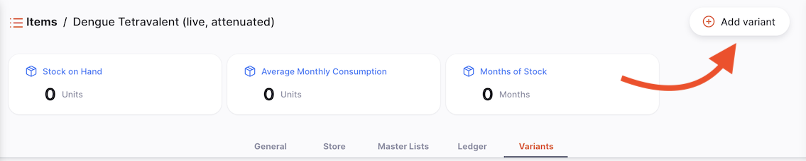
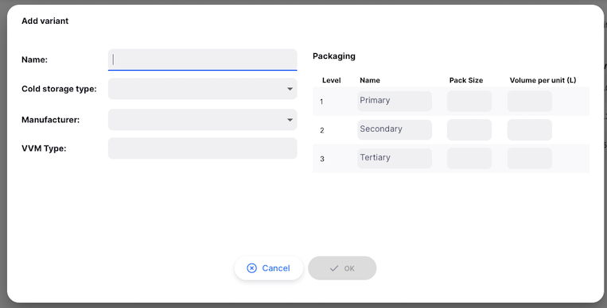
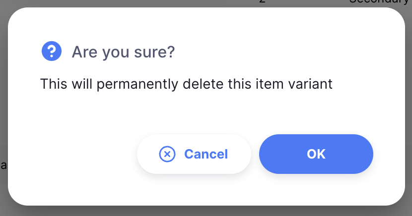
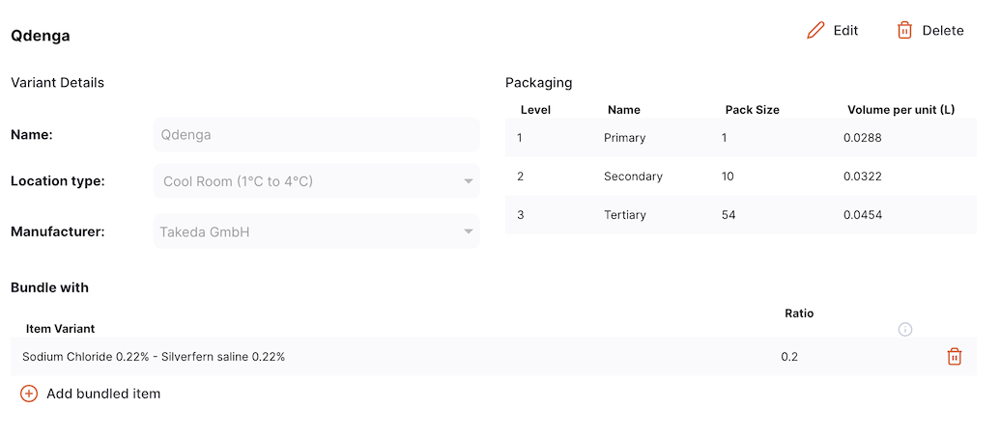
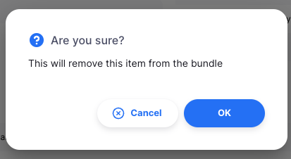
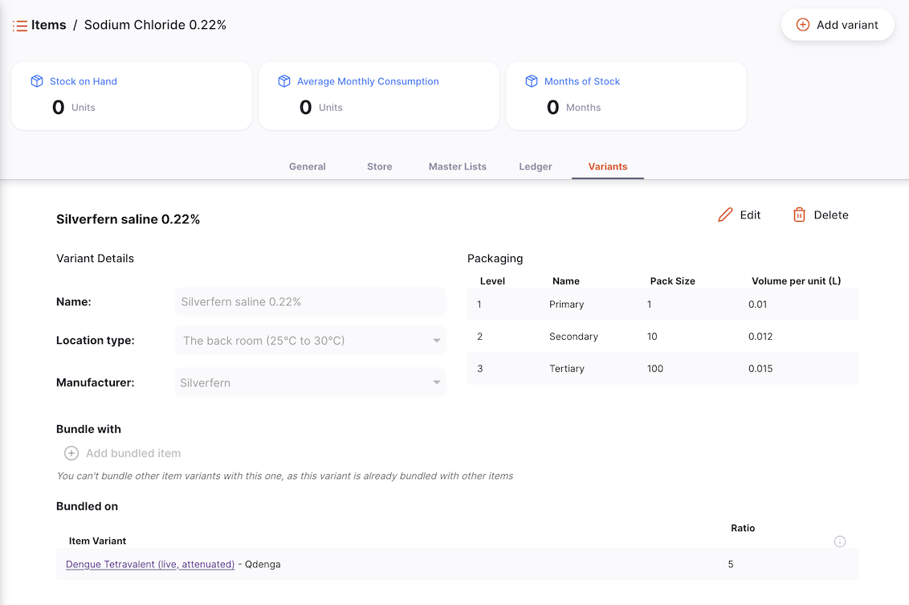

+++
title = "Articles"
description = "Consulter les articles."
date = 2022-03-19T18:20:00+00:00
updated = 2022-03-19T18:20:00+00:00
draft = false
weight = 52
sort_by = "weight"
template = "docs/page.html"

[extra]
lead = "Gérer votre catalogue"
toc = true
top = false
+++

Un article dans Open mSupply est généralement un produit que vous achetez auprès d'un fournisseur, que vous gardez en stock et que vous fournissez à un client.
Depuis le menu **Articles**, vous pouvez voir tous les articles qui sont actuellement visibles dans votre magasin.

## Visualiser la liste des articles

Dans le panneau de navigation, appuyez sur `Catalogue` > `Articles` pour afficher la liste des articles :

Vous pouvez voir tous les articles qui sont disponibles pour utilisation par votre magasin :

La liste des articles est divisée en 6 colonnes :

| Colonne   | Description                                                                                                                                                       |
| :-------- | :---------------------------------------------------------------------------------------------------------------------------------------------------------------- |
| **Code**  | Code assigné à cet article dans mSupply                                                                                                                           |
| **Nom**   | C'est le nom par lequel mSupply fera référence à l'article                                                                                                        |
| **Unité** | L'unité de mesure pour l'article                                                                                                                                  |
| **SED**   | Combien de stock est disponible dans votre magasin                                                                                                                |
| **CMM**   | Consommation Mensuelle Moyenne. C'est combien de stock votre magasin utilise chaque mois en moyenne (basé sur un nombre configurable de mois, par défaut 3 mois). |
| **MDS**   | Nombre de mois de consommation restant avec le stock actuel. Ceci est calculé comme : `Stock en Dépôt / CMM`.                                                     |

## Visualiser les détails d'un article

Pour voir les détails d'un article, appuyez simplement dessus. Une nouvelle fenêtre s'ouvre :

En haut de l'écran, vous pouvez voir les informations suivantes :

- **Stock en Dépôt** : Combien de stock est actuellement disponible dans votre magasin
- **CMM** : Consommation Mensuelle Moyenne. C'est combien de stock votre magasin utilise chaque mois en moyenne (basé sur un nombre configurable de mois, par défaut 3 mois).
- **Mois de Stock** : Nombre de mois de consommation restant avec le stock actuel. Ceci est calculé comme : `Stock en Dépôt / CMM`.

Dans l'exemple ci-dessous, nous avons 20 219 unités d'Acide Acétylsalicylique disponibles dans notre magasin. La consommation moyenne est de 3 443,67 unités par mois ce qui signifie qu'il y a l'équivalent de 5,87 mois de stock dans l'inventaire.

Il y a deux onglets dans la partie inférieure de l'écran :

- **Général** : Les informations de base de l'article
- **Listes Principales** : Listes principales associées à l'article
<!-- - **Variantes de Paquet** : Tailles de paquet personnalisables pour l'article. Ne peut être configuré que dans le nouveau serveur central d'Open mSupply. -->

### Général

#### Détails

- **Nom** : C'est le nom par lequel mSupply fera référence à l'article
- **Code** : Ceci doit être unique pour chaque article et est un raccourci utile pour faire référence aux articles
- **Unité** : L'unité que vous utilisez pour cet article. Il est utile de distinguer les articles que vous émettez par paquet (ex. gouttes pour les yeux) des articles que vous émettez par volume (ex. liquides oraux)
- **Concentration** : Pour un médicament, la concentration de ses ingrédients actifs (ex. pour Amoxilline 250mg, la concentration est 250mg)
- **Dose Quotidienne Définie** : La dose de maintenance moyenne supposée par jour pour un médicament utilisé pour son indication principale chez les adultes
- **Type** : Le type d'article (ex. Stock ou Service)
- **Doses** : Pour les vaccins, le nombre de doses par flacon
- **Vaccin** (case à cocher) : Si ceci est coché, cet article est un vaccin et un nombre de doses peut être assigné

#### Catégories

- **Catégorie ATC** : ATC signifie Anatomique, Thérapeutique, Chimique et est une méthode de classification des entités, et de les identifier par catégorie
- **Nom Universel** : si l'article est lié à la [base de données universelle de codes de médicaments](https://codes.msupply.foundation/), ceci montre le nom universel, ou générique pour l'article donné
- **Code Universel** : de même, le code alloué à l'article de code de médicament universel

#### Emballage

- **Taille de paquet par défaut** : C'est la taille de paquet par défaut qui sera assignée au stock entrant lors de sa réception
- **Taille de paquet externe** : Le nombre d'unités dans un carton (paquet externe). Pas le nombre de paquets de taille préférée dans un carton (paquet externe).
- **Volume par paquet** : Le volume par défaut par paquet de taille préférée. C'est le volume qui sera utilisé par défaut lors de la réception des marchandises. Nous recommandons de diviser le volume d'un carton par le nombre de paquets de taille préférée dans un carton pour obtenir ce chiffre. Open mSupply stocke toujours les volumes en m3 (mètres cubes), mais vous pouvez entrer un volume en millilitres (ml) ou litres (l) en entrant l'abréviation appropriée après le nombre représentant le volume. ex. entrez "0.5l" pour entrer un volume de 0,5 litres (= 0,0005m3).
- **Volume par paquet externe** : Le volume par défaut d'un paquet de taille de paquet externe de cet article
- **Poids** : Le poids d'un paquet de taille préférée en kg

#### Tarification

- **Marge** : C'est la marge par défaut qui sera appliquée à cet article sur les Expéditions Entrantes pour calculer le prix de vente

### Listes Principales

Cet onglet liste les Listes Principales associées à cet article.

### Grand Livre

L'onglet grand livre de l'article montre un historique des transactions dans ce magasin pour l'article.

Le grand livre est divisé en 16 colonnes :

| Colonne                  | Description                                                   |
| :----------------------- | :------------------------------------------------------------ |
| **Type**                 | Le type de la transaction                                     |
| **Date**                 | La date à laquelle la transaction a été confirmée             |
| **Heure**                | L'heure à laquelle la transaction a été confirmée             |
| **Numéro de facture**    | Le numéro de facture (expédition) de la transaction           |
| **Nom**                  | Le nom du client ou fournisseur                               |
| **Statut**               | Le statut de la transaction                                   |
| **Expiration**           | La date d'expiration de la ligne de stock                     |
| **Lot**                  | Le numéro de lot de la ligne de stock                         |
| **Taille de paquet**     | La taille du paquet                                           |
| **Nombre de paquets**    | Le nombre de paquets dans la transaction                      |
| **Qté unitaire**         | La quantité qui a été assignée à la transaction en unités     |
| **Solde**                | Le solde de la ligne de stock                                 |
| **Prix de coût paquet**  | Le prix de coût du paquet                                     |
| **Prix de vente paquet** | Le prix de vente du paquet                                    |
| **Total avant taxe**     | Le coût total de la transaction avant taxe (en devise locale) |
| **Raison**               | La raison de l'ajustement (si requis)                         |

### Filtrer le grand livre par transactions

Vous pouvez filtrer les grands livres par la transaction : Type, Statut ou Plage de dates. Ceci est utile quand vous devez réviser un ensemble spécifique de transactions qui répondent à certains critères !

Sélectionnez un ou plusieurs filtres pour affiner les résultats. La liste se mettra à jour pour montrer toutes les transactions du grand livre qui correspondent aux critères sélectionnés.

## Variantes d'Articles

Sur le [Serveur Central Open mSupply](../../getting_started/central-server/), un troisième onglet, Variantes d'Articles, est disponible. Cet onglet vous permet de configurer des variations de l'article, telles que différents fabricants ou tailles d'emballage.

Actuellement, les Variantes d'Articles sont uniquement utilisées pour la fonctionnalité GAPS.

### Ajouter une Variante d'Article

Pour créer une nouvelle Variante d'Article, cliquez sur le bouton `Ajouter une Variante` dans le coin supérieur droit.

Cela ouvrira une nouvelle fenêtre, où vous pouvez entrer un nom pour la variante, et ses détails :

Les options de température sont configurées comme [Types d'Emplacement](https://docs.msupply.org.nz/items:item_locations?s[]=location&s[]=type#location_types) sur le Serveur Central mSupply. Les [Fabricants](https://docs.msupply.org.nz/names:adding_and_editing?s[]=manufacturers#adding_a_customer_supplier_manufacturer_donor_or_benchmark) sont également gérés dans mSupply.

#### Emballage

Différentes installations travaillent à différents niveaux d'emballage, ex. un entrepôt peut travailler en cartons, tandis qu'une clinique travaille en boîtes ou unités individuelles. Dans la section Emballage, vous pouvez définir la taille du paquet (unités par paquet) et le volume d'emballage pour les différents niveaux d'emballage d'une variante d'article.

Cela permet aux calculs GAPS de tenir compte avec précision des exigences de stockage au froid pour cette variante d'article, au niveau d'emballage utilisé par une installation particulière.

Les tailles de paquet définies dans les Variantes d'Articles sont utilisées pour les calculs GAPS SEULEMENT, pour fournir une plus grande précision à travers les variations d'articles. Cela n'affecte pas les tailles de paquet utilisées dans vos flux de travail de commande habituels dans Open mSupply.

### Modifier une Variante d'Article

Pour modifier une Variante d'Article, cliquez sur le bouton `Modifier` à côté de la variante que vous souhaitez mettre à jour.

Cela ouvrira la même fenêtre que lors de l'ajout d'une nouvelle variante, avec les détails existants pré-remplis. Faites les changements nécessaires, et cliquez sur `OK` pour mettre à jour la variante.

### Supprimer une Variante d'Article

Pour supprimer une Variante d'Article, cliquez sur le bouton `Supprimer` à côté de la variante que vous souhaitez retirer.

Il vous sera demandé de confirmer la suppression. Cliquez sur `OK` pour confirmer, ou `Annuler` si vous ne souhaitez plus supprimer la variante.

    

### Regroupement d'articles

Vous pouvez également ajouter des articles groupés à chaque Variante d'Article. Ce sont d'autres articles qui sont toujours émis avec cet article, donc les calculs GAPS devraient considérer le stockage requis pour tous les articles du groupe.

  Les articles groupés ne sont pas implémentés dans les flux de travail de dispensation dans Open mSupply. Vous devez encore dispenser chaque article du groupe séparément.

Le regroupement se fait au niveau de la Variante d'Article, vous donnant un contrôle fin sur quelles variantes devraient être regroupées ensemble. Par exemple, un vaccin peut seulement pouvoir être regroupé avec un diluant spécifique du même fabricant.

#### Ajouter des articles groupés

Pour regrouper un article avec la variante actuelle, cliquez sur le bouton `Ajouter un article groupé` sous la section `Regroupé avec`.

    

Cela ouvrira une nouvelle fenêtre, où vous pouvez rechercher l'article que vous souhaitez regrouper avec la variante actuelle.

    

Après avoir sélectionné l'article, il vous sera demandé de sélectionner la variante spécifique de cet article, ainsi que le ratio auquel il devrait être regroupé.

Dans cet exemple, 0,2 unités de Silverfern saline 0,22% devraient être regroupées avec chaque 1 unité de Qdenga.

    

Cliquez sur OK pour ajouter l'article groupé. Il apparaîtra alors dans la section `Regroupé avec`.

#### Modifier des articles groupés

Pour modifier un article groupé, cliquez sur la ligne dans la section `Regroupé avec`. Cela ouvrira la même fenêtre que lors de l'ajout d'un nouvel article groupé, avec les détails existants pré-remplis. Faites les changements nécessaires, et cliquez sur `OK` pour mettre à jour le groupe.

    

#### Retirer des articles groupés

Pour retirer un article groupé, cliquez sur l'icône Supprimer à côté de l'article que vous souhaitez retirer.

Il vous sera demandé de confirmer le retrait de l'article groupé. Cliquez sur `OK` pour confirmer, ou `Annuler` si vous ne souhaitez plus le retirer.

    

#### Variantes d'articles qui font partie de groupes

Vous n'êtes pas capable de regrouper des articles pour une variante d'article qui fait déjà partie d'un autre groupe.

Le bouton `Ajouter un article groupé` sera désactivé, et vous verrez à la place une liste des variantes d'articles avec lesquelles cette variante est déjà regroupée.

