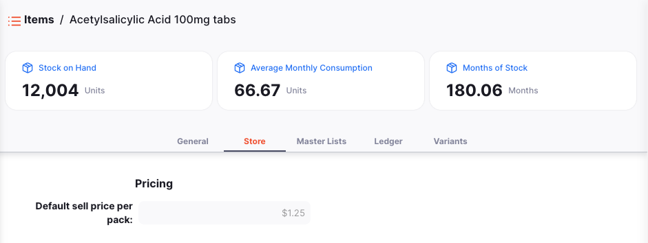
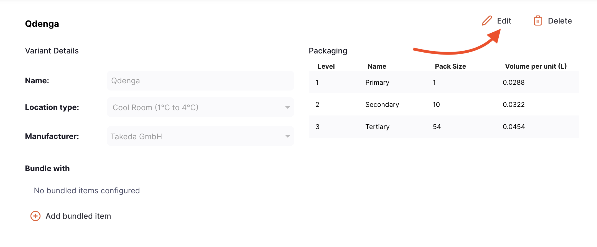
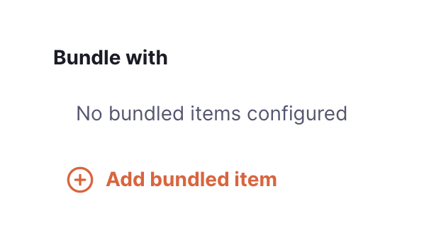
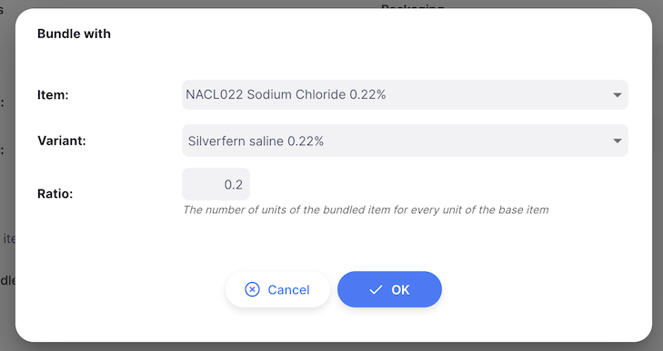

+++
title = "Items"
description = "Viewing items."
date = 2022-03-19T18:20:00+00:00
updated = 2022-03-19T18:20:00+00:00
draft = false
weight = 52
sort_by = "weight"
template = "docs/page.html"

[extra]
lead = "Managing your catalogue"
toc = true
top = false
+++

An item in Open mSupply is usually a product that you purchase from a supplier, hold in stock and supply to a customer.
From the **Items** menu, you can view all of the items that are currently visible in your store.

## Viewing items list

In the navigation panel, tap on `Catalogue` > `Items` to show the items list:

You can see all the items which are available for use by your store:

The Items list is divided into 6 columns:

| Column   | Description                                                                                                                                                 |
| :------- | :---------------------------------------------------------------------------------------------------------------------------------------------------------- |
| **Code** | Code assigned to this item in mSupply                                                                                                                       |
| **Name** | This is the name by which mSupply will refer to the item                                                                                                    |
| **Unit** | The unit of measure for the item                                                                                                                            |
| **SOH**  | How much stock is available in your store                                                                                                                   |
| **AMC**  | Average Monthly Consumption. This is how much stock your store uses each month on average (based on a configurable number of months, defaults to 3 months). |
| **MOS**  | Number of months of consumption left with current stock. This is calculated as: `Stock on Hand / AMC`.                                                      |

## Viewing an item's details

To view the details of an item, simply tap on one. A new window opens:

On top of the screen, you can the following information:

- **Stock on Hand**: How much stock is currently available in your store
- **AMC**: Average Monthly Consumption. This is how much stock your store uses each month on average (based on a configurable number of months, defaults to 3 months).
- **Months of Stock**: Number of months of consumption left with current stock. This is calculated as: `Stock on Hand / AMC`.

In the below example, we have 20,219 units of Acetylsalicylic Acid available in our store. The average consumption is 3,443.67 units per month which means that there is the equivalent of 5.87 months of stock in the inventory. 

There are several tabs in the bottom part of the screen:

### General

The general tab includes basic information about the item, including:

#### Details

- **Name**: This is the name by which mSupply will refer to the item
- **Code**: This should be unique for each item and is a helpful shorthand for referring to items
- **Unit**: The unit you use for this item. It is useful to distinguish items you issue by pack (eg. eye drops) from items you issue by volume (eg. oral liquids)
- **Strength**: For a medicine, the concentration of its active ingredients (eg. for Amoxillin 250mg, the strength is 250mg)
- **Defined Daily Dose**: The assumed average maintenance dose per day for a medicine used for its main indication in adults
- **Type**: The type of item (eg. Stock or Service)
- **Doses**: For vaccines, the number of dose per vial
- **Vaccine** (check box): If this is checked, this item is a vaccine and a number of dose can be assigned

#### Categories

- **ATC Category**: ATC stands for Anatomical, Therapeutic, Chemical and is a method of classifying entities, and identifying them by category
- **Universal Name**: if the item is linked to the [universal drug code database](https://codes.msupply.foundation/), this shows the universal, or generic name for the given item
- **Universal Code**: similarly, the code allocated to the universal drug code item

#### Storage

- **Location type**: The location type that this item is restricted to. Used for items that need to be stored in a specific type of location, such as cold storage.

#### Packaging

- **Default pack size**: This is the default pack size that will be assigned to incoming stock as it is received
- **Outer pack size**: The number of units in a carton (outer pack). Not the number of preferred pack size packs in a carton (outer pack).
- **Volume per pack**: The default volume per preferred pack size pack. This is the volume that will be used by default when receiving goods. We recommend you divide a carton volume by the number of preferred pack size packs in a carton to get this figure. Open mSupply always stores volumes in m3 (cubic metres), but you can enter a volume as millilitres (ml) or litres (l) by entering the appropriate abbreviation after the number representing the volume. e.g. enter “0.5l” to enter a volume of 0.5 litres (= 0.0005m3).
- **Volume per outer pack**: The default volume of an Outer pack size pack of this item
- **Weight**: The weight of a preferred pack size pack in kg

#### Pricing

- **Margin**: This is the default margin that will be applied to this item on Inbound Shipments to calculate the selling price

### Store

The Store tab shows any configurations for this item that are specific to your current store.

### Master Lists

This tab lists the Master Lists associated with this item.

### Ledger

The item ledger tab shows a history of transactions in this store for the item.

The ledger is divided into 16 columns:

| Column               | Description                                                      |
| :------------------- | :--------------------------------------------------------------- |
| **Type**             | The type of the transaction                                      |
| **Date**             | The date of the transaction was confirmed                        |
| **Time**             | The time of the transaction was confirmed                        |
| **Invoice Number**   | The invoice (shipment) number of the transaction                 |
| **Name**             | The name of the customer or supplier                             |
| **Status**           | The status of the transaction                                    |
| **Expiry**           | The expiry date of the stock line                                |
| **Batch**            | The batch number of the stock line                               |
| **Pack Size**        | The pack size                                                    |
| **Number of packs**  | The number of packs in the transaction                           |
| **Unit Qty**         | The quantity that was assigned to the transaction in units       |
| **Balance**          | The balance of the stock line                                    |
| **Pack cost price**  | The cost price of the pack                                       |
| **Pack sell price**  | The sell price of the pack                                       |
| **Total before tax** | The total cost of the transaction before tax (in local currency) |
| **Reason**           | The reason for the adjustment (if required)                      |

### Filter ledger by transactions

You can filter the ledgers by the transaction: Type, Status or Date range. This is useful when you need to review a specific set of transactions that meet certain criteria!

Select one or more filters to narrow down the results. The list will update to show all ledger transactions that match the selected criteria.

## Item Variants

On the [Open mSupply Central Server](../../getting_started/central-server/) an Item Variants tab is available. This tab allows you to configure variations of the item, such as different manufacturers or packaging sizes.

### Adding an Item Variant

To create a new Item Variant, click the `Add Variant` button in the top right corner.

This will open a new window, where you can enter a name for the variant, and its details:

Temperature options are configured as [Location Types](https://docs.msupply.org.nz/items:item_locations?s[]=location&s[]=type#location_types) on the mSupply Central Server. [Manufacturers](https://docs.msupply.org.nz/names:adding_and_editing?s[]=manufacturers#adding_a_customer_supplier_manufacturer_donor_or_benchmark) are also managed in mSupply.

#### Packaging

Different facilities work in different levels of packaging, e.g. a warehouse may work in cartons, while a clinic works in boxes or individual units. In the Packaging section, you can define the pack size (units per pack) and packaging volume for the different packaging levels of an item variant.

When introducing a new stock line, users will select the relevant Item Variant (e.g. based on manufacturer). If you have configured a Packaging level for that variant, with a pack size that matches the pack size of the stock line, Open mSupply will automatically set the `Volume per pack` for the stock line, based on the `Volume per unit` defined here.

### Editing an Item Variant

To edit an Item Variant, click the `Edit` button next to the variant you wish to update.

This will open the same window as when adding a new variant, with the existing details pre-filled. Make any changes you need, and click `OK` to update the variant.

### Deleting an Item Variant

To delete an Item Variant, click the `Delete` button next to the variant you wish to remove.

You will be asked to confirm the deletion. Click `OK` to confirm, or `Cancel` if you no longer wish to delete the variant.

    

### Bundling items

You can also add bundled items to each Item Variant. These are other items that are always issued with this item, so GAPS calculations should consider the storage required for all items in the bundle.

  Bundled items are not implemented in dispensing workflows in Open mSupply. You still need to dispense each item in the bundle separately.

Bundling is done at the Item Variant level, giving you fine-grained control over which variants should be bundled together. For example, a vaccine may only be able to be bundled with a specific diluent from the same manufacturer.

#### Adding bundled items

To bundle an item with the current variant, click the `Add bundled item` button under the `Bundled with` section.

    

This will open a new window, where you can search for the item you wish to bundle with the current variant.

    

After selecting the item, you will be prompted to select the specific variant of that item, along with the ratio at which it should be bundled.

In this example, 0.2 units of Silverfern Normal Saline should be bundled with every 1 unit of Silverfern Adsorbed (Paediatric) DPT Vaccine.

    

Click OK to add the bundled item. It will then appear in the `Bundled with` section.

#### Editing bundled items

To edit a bundled item, click the row in the `Bundled with` section. This will open the same window as when adding a new bundled item, with the existing details pre-filled. Make any changes you need, and click `OK` to update the bundle.

    

#### Removing bundled items

To remove a bundled item, click the Delete icon next to the item you wish to remove.

You will be asked to confirm the removal of the bundled item. Click `OK` to confirm, or `Cancel` if you no longer wish to remove it.

    

#### Item variants that are a part of bundles

You aren't able to bundle items for an item variant that is already part of another bundle.

The `Add bundled item` button will be disabled, and you will instead see a list of the item variants that this variant is already bundled with.

