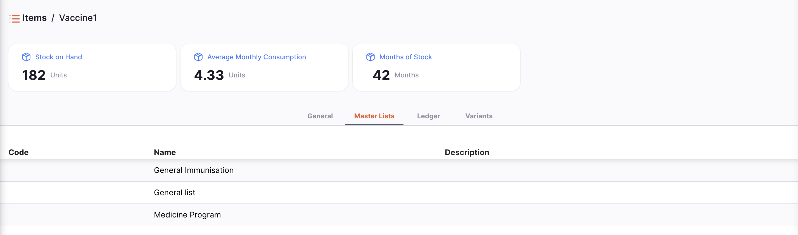
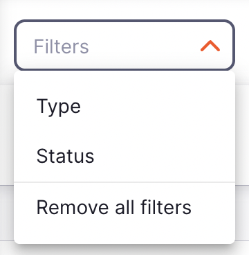
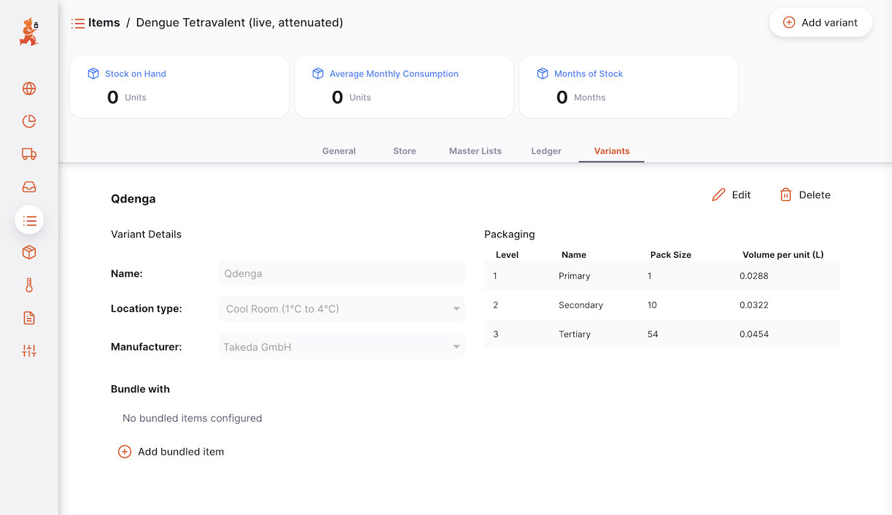
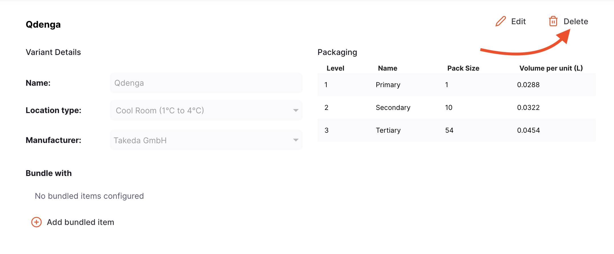
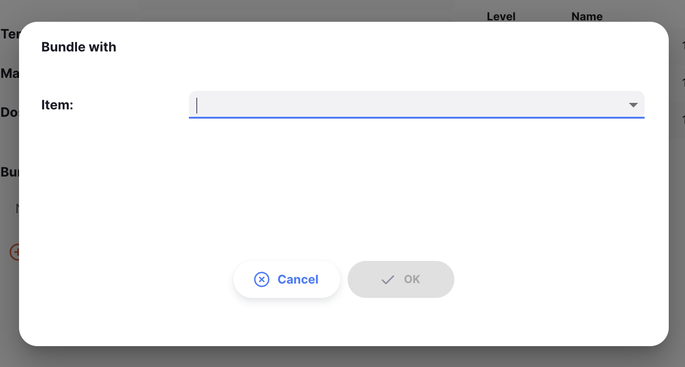

+++
title = "Artigos"
description = "Ver artigos."
date = 2022-03-19T18:20:00+00:00
updated = 2022-03-19T18:20:00+00:00
draft = false
weight = 52
sort_by = "weight"
template = "docs/page.html"

[extra]
lead = "Gerencie seu catálogo"
toc = true
top = false
+++

Um item no Open mSupply é geralmente um produto que você compra de um fornecedor, mantém em estoque e fornece a um cliente.
Do menu **Itens**, você pode ver todos os itens que estão atualmente visíveis em sua loja.

## Ver a lista de artigos

No painel de navegação, toque em `Catálogo` > `Itens` para mostrar a lista de itens:

Você pode ver todos os itens que estão disponíveis para uso por sua loja:

A lista de Itens é dividida em 6 colunas:

| Coluna      | Descrição                                                                                                                                                  |
| :---------- | :--------------------------------------------------------------------------------------------------------------------------------------------------------- |
| **Código**  | Código atribuído a este item no mSupply                                                                                                                    |
| **Nome**    | Este é o nome pelo qual o mSupply se referirá ao item                                                                                                      |
| **Unidade** | A unidade de medida para o item                                                                                                                            |
| **EED**     | Quanto estoque está fisicamente em sua loja                                                                                                                |
| **CMM**     | Consumo Médio Mensal. Esta é a quantidade de estoque que sua loja usa a cada mês em média (baseado em um número configurável de meses, padrão de 3 meses). |
| **MDE**     | Número de meses de consumo restante com o estoque atual. Isto é calculado como: `Estoque em Depósito / CMM`.                                               |

## Visualizar detalhes de um item

Para ver os detalhes de um item, simplesmente toque nele. Uma nova janela se abre:

No topo da tela, você pode ver as seguintes informações:

- **Estoque em Depósito**: Quanto estoque está atualmente em sua loja
- **CMM**: Consumo Médio Mensal. Esta é a quantidade de estoque que sua loja usa a cada mês em média (baseado em um número configurável de meses, padrão de 3 meses).
- **Meses de Estoque**: Número de meses de consumo restante com o estoque atual. Isto é calculado como: `Estoque em Depósito / CMM`.

No exemplo abaixo, temos 20.219 unidades de Ácido Acetilsalicílico disponíveis em nossa loja. O consumo médio é de 3.443,67 unidades por mês, o que significa que há o equivalente a 5,87 meses de estoque no inventário.

Há duas abas na parte inferior da tela:

- **Geral**: As informações básicas do item
- **Listas Principais**: Listas principais associadas ao item
<!-- - **Variantes de Pacote**: Tamanhos de pacote personalizáveis para o item. Só pode ser configurado no novo servidor central do Open mSupply. -->

### Geral

#### Detalhes

- **Nome**: Este é o nome pelo qual o mSupply se referirá ao item
- **Código**: Este deve ser único para cada item e é uma abreviação útil para referenciar itens
- **Unidade**: A unidade que você usa para este item. É útil distinguir itens que você emite por pacote (ex. colírios) de itens que você emite por volume (ex. líquidos orais)
- **Concentração**: Para um medicamento, a concentração de seus ingredientes ativos (ex. para Amoxicilina 250mg, a concentração é 250mg)
- **Dose Diária Definida**: A dose de manutenção média assumida por dia para um medicamento usado para sua indicação principal em adultos
- **Tipo**: O tipo de item (ex. Estoque ou Serviço)
- **Doses**: Para vacinas, o número de doses por frasco
- **Vacina** (caixa de seleção): Se isto estiver marcado, este item é uma vacina e um número de doses pode ser atribuído

#### Categorias

- **Categoria ATC**: ATC significa Anatômico, Terapêutico, Químico e é um método de classificar entidades, e identificá-las por categoria
- **Nome Universal**: se o item estiver vinculado ao [banco de dados universal de códigos de medicamentos](https://codes.msupply.foundation/), isto mostra o nome universal, ou genérico para o item dado
- **Código Universal**: similarmente, o código alocado ao item de código de medicamento universal

#### Embalagem

- **Tamanho de pacote padrão**: Este é o tamanho de pacote padrão que será atribuído ao estoque recebido conforme é recebido
- **Tamanho de pacote externo**: O número de unidades em uma caixa (pacote externo). Não o número de pacotes de tamanho preferido em uma caixa (pacote externo).
- **Volume por pacote**: O volume padrão por pacote de tamanho preferido. Este é o volume que será usado por padrão ao receber mercadorias. Recomendamos que você divida o volume de uma caixa pelo número de pacotes de tamanho preferido em uma caixa para obter esta figura. O Open mSupply sempre armazena volumes em m3 (metros cúbicos), mas você pode inserir um volume como mililitros (ml) ou litros (l) inserindo a abreviação apropriada após o número representando o volume. ex. digite "0.5l" para inserir um volume de 0,5 litros (= 0,0005m3).
- **Volume por pacote externo**: O volume padrão de um pacote de tamanho de pacote externo deste item
- **Peso**: O peso de um pacote de tamanho preferido em kg

#### Preços

- **Margem**: Esta é a margem padrão que será aplicada a este item em Remessas Recebidas para calcular o preço de venda

### Listas Principais

Esta aba lista as Listas Principais associadas a este item.

### Livro Razão

A aba do livro razão do item mostra um histórico de transações nesta loja para o item.

O livro razão é dividido em 16 colunas:

| Coluna                     | Descrição                                                    |
| :------------------------- | :----------------------------------------------------------- |
| **Tipo**                   | O tipo da transação                                          |
| **Data**                   | A data em que a transação foi confirmada                     |
| **Hora**                   | A hora em que a transação foi confirmada                     |
| **Número da Fatura**       | O número da fatura (remessa) da transação                    |
| **Nome**                   | O nome do cliente ou fornecedor                              |
| **Status**                 | O status da transação                                        |
| **Validade**               | A data de validade da linha de estoque                       |
| **Lote**                   | O número do lote da linha de estoque                         |
| **Tamanho do Pacote**      | O tamanho do pacote                                          |
| **Número de pacotes**      | O número de pacotes na transação                             |
| **Qtde Unitária**          | A quantidade que foi atribuída à transação em unidades       |
| **Saldo**                  | O saldo da linha de estoque                                  |
| **Preço de custo pacote**  | O preço de custo do pacote                                   |
| **Preço de venda pacote**  | O preço de venda do pacote                                   |
| **Total antes do imposto** | O custo total da transação antes do imposto (em moeda local) |
| **Motivo**                 | O motivo do ajuste (se necessário)                           |

### Filtrar livro razão por transações

Você pode filtrar os livros razão pela transação: Tipo, Status ou Intervalo de datas. Isto é útil quando você precisa revisar um conjunto específico de transações que atendem a certos critérios!

Selecione um ou mais filtros para restringir os resultados. A lista será atualizada para mostrar todas as transações do livro razão que correspondem aos critérios selecionados.

## Variantes de Itens

No [Servidor Central Open mSupply](../../getting_started/central-server/), uma terceira aba, Variantes de Itens, está disponível. Esta aba permite que você configure variações do item, como diferentes fabricantes ou tamanhos de embalagem.

Atualmente, as Variantes de Itens são usadas apenas para funcionalidade GAPS.

### Adicionando uma Variante de Item

Para criar uma nova Variante de Item, clique no botão `Adicionar Variante` no canto superior direito.

Isso abrirá uma nova janela, onde você pode inserir um nome para a variante, e seus detalhes:

Opções de temperatura são configuradas como [Tipos de Localização](https://docs.msupply.org.nz/items:item_locations?s[]=location&s[]=type#location_types) no Servidor Central mSupply. [Fabricantes](https://docs.msupply.org.nz/names:adding_and_editing?s[]=manufacturers#adding_a_customer_supplier_manufacturer_donor_or_benchmark) também são gerenciados no mSupply.

#### Embalagem

Diferentes instalações trabalham em diferentes níveis de embalagem, ex. um armazém pode trabalhar em caixas, enquanto uma clínica trabalha em caixas ou unidades individuais. Na seção Embalagem, você pode definir o tamanho do pacote (unidades por pacote) e volume de embalagem para os diferentes níveis de embalagem de uma variante de item.

Isso permite que os cálculos GAPS considerem com precisão os requisitos de armazenamento refrigerado para esta variante de item, no nível de embalagem usado por uma instalação específica.

Os tamanhos de pacote definidos nas Variantes de Itens são usados para cálculos GAPS APENAS, para fornecer maior precisão através das variações de itens. Não afeta os tamanhos de pacote usados em seus fluxos de trabalho de pedidos usuais no Open mSupply.

### Editando uma Variante de Item

Para editar uma Variante de Item, clique no botão `Editar` ao lado da variante que você deseja atualizar.

Isso abrirá a mesma janela de quando você adiciona uma nova variante, com os detalhes existentes pré-preenchidos. Faça as alterações necessárias e clique em `OK` para atualizar a variante.

### Excluindo uma Variante de Item

Para excluir uma Variante de Item, clique no botão `Excluir` ao lado da variante que você deseja remover.

Você será solicitado a confirmar a exclusão. Clique em `OK` para confirmar, ou `Cancelar` se você não desejar mais excluir a variante.

    

### Agrupamento de itens

Você também pode adicionar itens agrupados a cada Variante de Item. Estes são outros itens que são sempre emitidos com este item, então os cálculos GAPS devem considerar o armazenamento necessário para todos os itens no grupo.

  Itens agrupados não são implementados em fluxos de trabalho de dispensação no Open mSupply. Você ainda precisa dispensar cada item no grupo separadamente.

O agrupamento é feito no nível da Variante de Item, dando a você controle refinado sobre quais variantes devem ser agrupadas juntas. Por exemplo, uma vacina pode apenas ser capaz de ser agrupada com um diluente específico do mesmo fabricante.

#### Adicionando itens agrupados

Para agrupar um item com a variante atual, clique no botão `Adicionar item agrupado` sob a seção `Agrupado com`.

    

Isso abrirá uma nova janela, onde você pode procurar pelo item que deseja agrupar com a variante atual.

    

Após selecionar o item, você será solicitado a selecionar a variante específica daquele item, junto com a proporção na qual deve ser agrupado.

Neste exemplo, 0,2 unidades de Silverfern salina 0,22% devem ser agrupadas com cada 1 unidade de Qdenga.

    

Clique em OK para adicionar o item agrupado. Ele então aparecerá na seção `Agrupado com`.

#### Editando itens agrupados

Para editar um item agrupado, clique na linha na seção `Agrupado com`. Isso abrirá a mesma janela de quando você adiciona um novo item agrupado, com os detalhes existentes pré-preenchidos. Faça as alterações necessárias e clique em `OK` para atualizar o grupo.

    

#### Removendo itens agrupados

Para remover um item agrupado, clique no ícone Excluir ao lado do item que você deseja remover.

Você será solicitado a confirmar a remoção do item agrupado. Clique em `OK` para confirmar, ou `Cancelar` se você não desejar mais removê-lo.

    

#### Variantes de itens que fazem parte de grupos

Você não consegue agrupar itens para uma variante de item que já faz parte de outro grupo.

O botão `Adicionar item agrupado` será desabilitado, e você verá em vez disso uma lista das variantes de itens com as quais esta variante já está agrupada.

