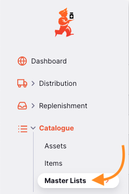
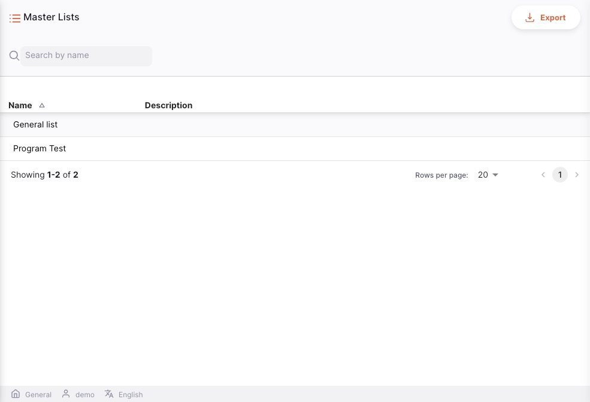
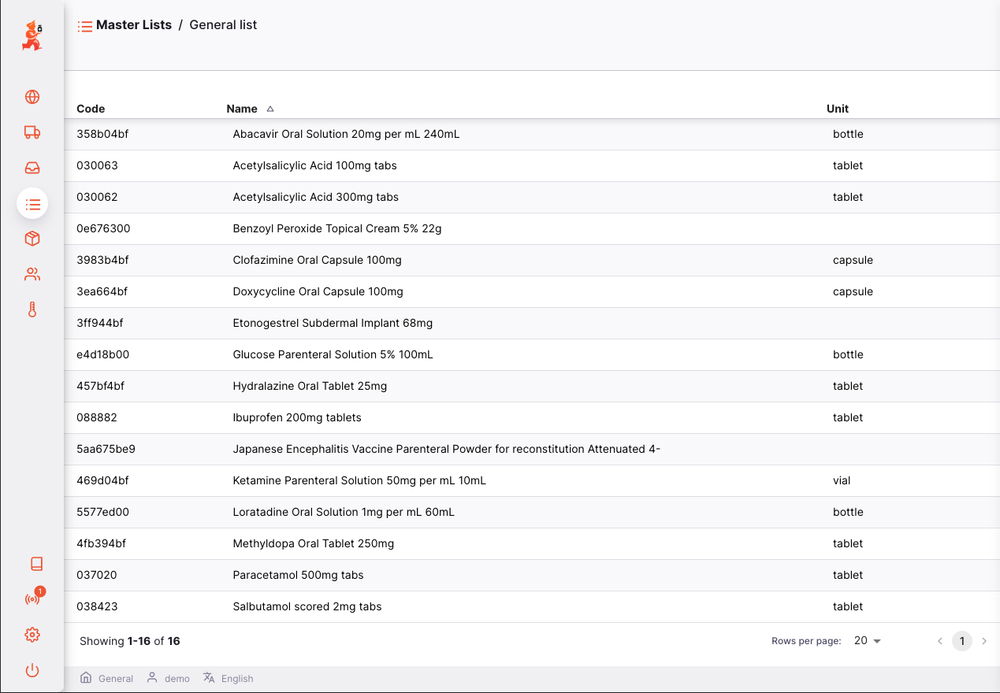

+++
title = "Listes Maîtresse"
description = "Listes Maîtresse"
date = 2022-03-19T18:20:00+00:00
updated = 2022-03-19T18:20:00+00:00
draft = false
weight = 2
sort_by = "weight"
template = "docs/page.html"
+++

Les listes Maîtresse sont des listes standard, des regroupements d'articles qui ne peuvent être définies qu'au niveau du serveur central.

## Consulter les Listes Maîtresse

Allez à `Catalogue` > `Listes Maîtresse` dans le panneau de navigation à gauche:

Vous verrez une fenêtre comme celle-ci :

Pour afficher tous les éléments d'une liste, cliquez simplement sur l'une des listes qui s'affichent à l'écran.

Le contenu de la liste s'affichera comme ci-après:

