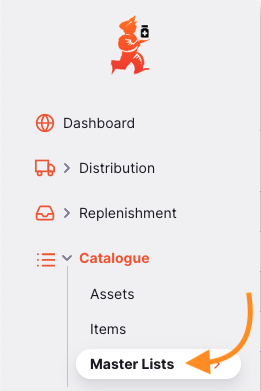
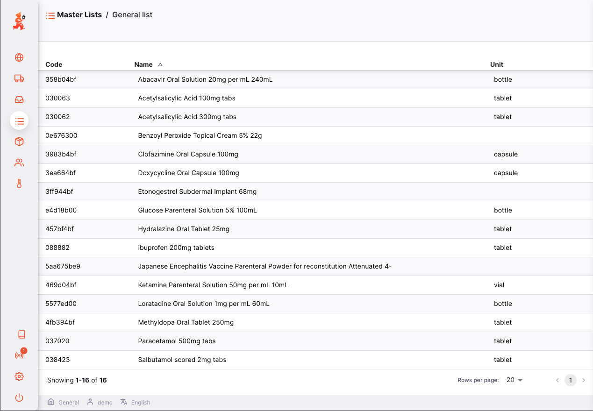

+++
title = "Listas Mestras"
description = "Listas Mestras"
date = 2022-03-19T18:20:00+00:00
updated = 2022-03-19T18:20:00+00:00
draft = false
weight = 52
sort_by = "weight"
template = "docs/page.html"
+++

Listas mestras são listas padrão de artigos que podem apenas serem definidas ao nível de servidor central.

## Ver Listas Mestras

Vá até `Catálogo` > `Listas Mestras` no painel de navegação:

Verás uma janelas como esta:

Para visualizar todos os artigos de uma lista mestra, clique em uma:

