+++
title = "GAPS"
description = "Gap analysis planning system"
date = 2023-11-08T15:20:00+00:00
updated = 2023-11-08T15:20:00+00:00
draft = false
weight = 15
sort_by = "weight"
template = "docs/page.html"

[extra]
toc = true
top = false
+++

## Gap analysis planning system (GAPS)

The gap analysis planning system (GAPS) is a tool designed to help EPI teams to assess whether their CCE infrastructure is sufficient to meet the forecast demand.

The GAPS module allows EPI teams to: 
- [Assess CCE capacity for the country](#assessing-cce-capacity)
- [Forecast the demand for CCE capacity over the next 5 years](#forecasting-demand-for-cce-capacity)
- [Compare the current CCE capacity to the forecast demand](#comparing-cce-capacity-to-forecast-demand)
- [Identify facilities that will need intervention due to increased demand](#identifying-facilities-that-need-intervention)

## Assessing CCE capacity

The CCE capacity for the country can be assessed by:
1. [Registering all CCE](#1-registering-cce) for all facilities in the CCEI module. 
2. [Obtaining recent updates about the functional status](#2-updating-cce-functional-status) of each CCE
3. [Reviewing the aggregated data](#3-reviewing-aggregated-cce-data)
### 1. Registering CCE

CCE can be registered for every facility in the country by following the documentation for the [CCEI module](/docs/coldchain/equipment/). 

Each registered CCE provides data about its cold storage volume capacity:  

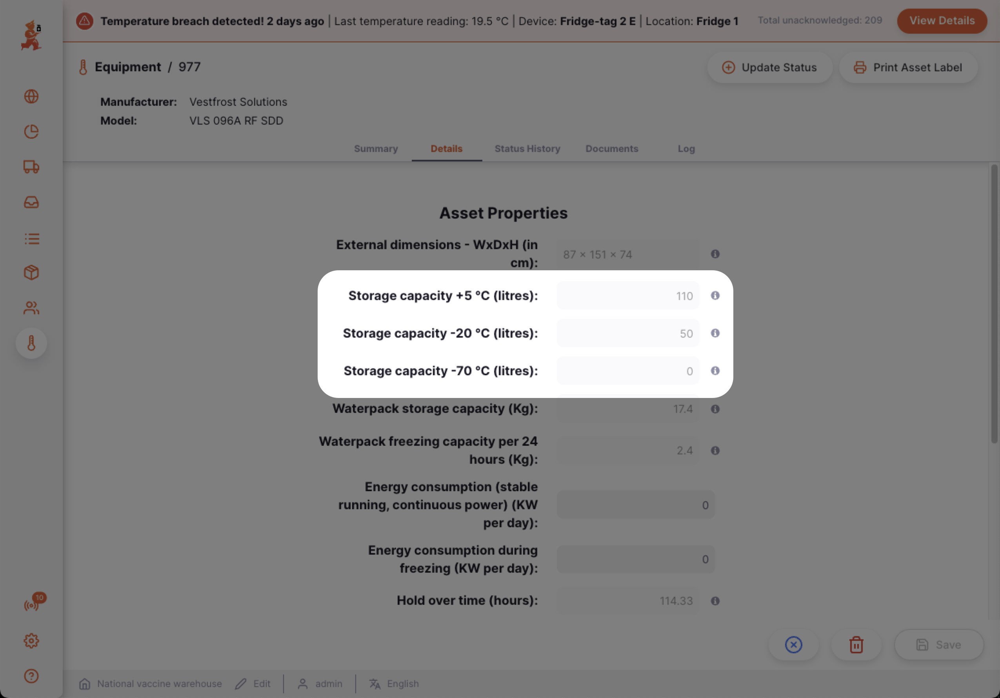

The aggregation of these cold storage volumes from all CCE across all facilities therefore gives the `CCE installed capacity` for the country (see [Installed CCE capacity](#installed-cce-capacity)). 

### 2. Updating CCE functional status

The `CCE functioning capacity` is the percentage of the `CCE installed capacity` that is currently working as expected. 

To determine an accurate `CCE functioning capacity` it is necessary to obtain recent data about the functional status of each CCE in the country. 

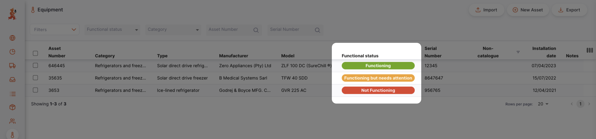
This data can be obtained in two ways: 
1. Manually - each facility user submits a [functional status report](/docs/coldchain/equipment/#update-status) for each of their CCE
2. Automatically - each CCE directly reports its own functional status (**future feature*)

As of version 2.7, only the manual option is available. 

Therefore, to obtain an accurate `CCE functioning capacity` it is **vitally important to implement a robust SOP** for facilities so that they regularly report the functional status of their CCE by submitting a [functional status report](/docs/coldchain/equipment/#update-status) (for example, on a weekly basis)
### 3. Reviewing aggregated CCE data

#### Installed CCE capacity

The `CCE installed capacity` is the aggregation of the data collected in [1. Registering CCE](#1-registering-cce) and can be viewed in the [mSupply Dashboard](/dashboard/introduction).  

The dashboard can be filtered by metrics such as supply level (Primary, Sub-National, Lowest Distribution etc) or temperature range (+ 5°C, -20 °C, -70°C)

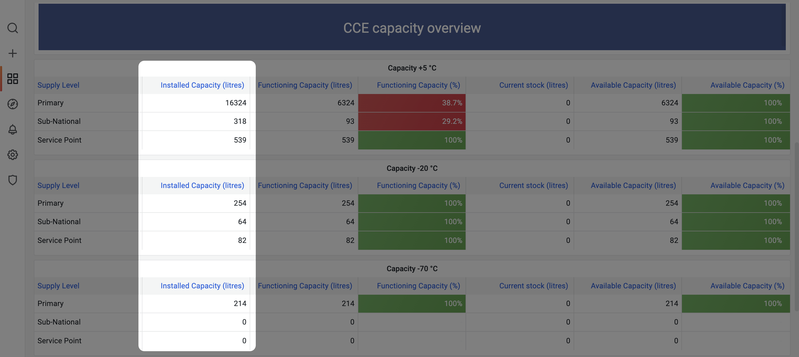

#### Functioning CCE capacity

The `CCE functioning capacity` is the aggregation of the data collected in [2. Updating CCE functional status](#2-updating-cce-functional-status) and can be viewed in the [mSupply Dashboard](/dashboard/introduction).

The dashboard can be filtered by metrics such as supply level (Primary, Sub-National, Lowest Distribution etc) or temperature range (+ 5°C, -20 °C, -70°C)

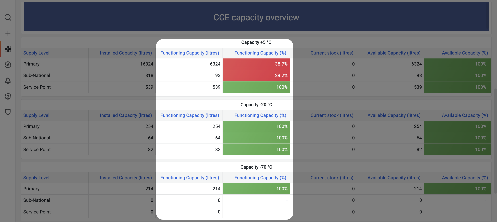
## Forecasting demand for CCE capacity

The forecast demand for CCE capacity for the country can be determined by:
1. [Recording packaging volumes for each type of vaccine](#1-recording-packaging-volumes-for-vaccines)
2. [Capturing population data for each facility](#2-capturing-population-data-for-facilities)
3. [Specifying the national immunization program](#3-specifying-the-national-immunization-program)
4. [Reviewing the calculated forecast](#4-reviewing-the-forecast-demand)

### 1. Recording packaging volumes for vaccines

To calculate how much CCE capacity is required to store vaccines it is necessary to know how much space each dose occupies in the CCE. 

The volume required to store each type of vaccine can be recorded in the [Item Catalogue](/docs/catalogue/items/#packaging-1). 

Volumes for primary, secondary and tertiary packaging can be recorded so that the appropriate packaging level for each facility is used when calculating their storage volume requirements.

Additionally the Item Catalogue captures which diluents are bundled with vaccines and this data is also used to calculate the total storage volume requirements for vaccines. 

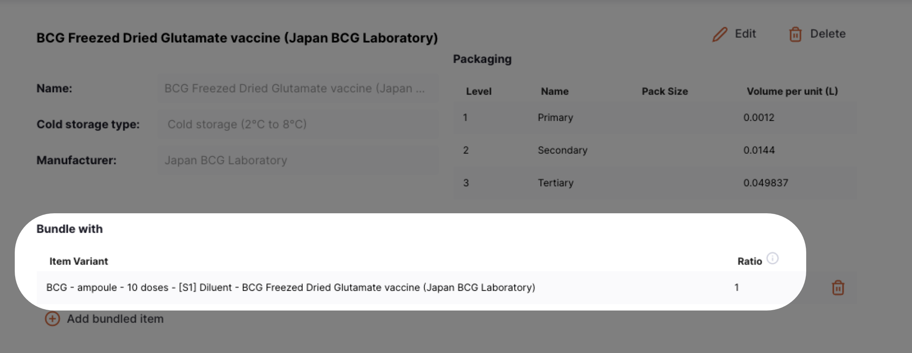

Open mSupply comes with the <a target="_blank" href=https://extranet.who.int/prequal/vaccines/prequalified-vaccines>list of WHO PQS prequalified vaccines</a>, including their respective packaging volumes and diluent bundling ratios, built into the system by default. 

### 2. Capturing population data for facilities

To calculate how many doses of vaccines will be required in a given year it is necessary to know how many people are served by each facility and what percentage of those people will require vaccines in that year. 

To do this requires: 
- [A snapshot of the current population](#population-snapshot)
- [Specification of population indicators](#population-indicators)
- [An estimation of population growth rate](#population-growth-rate)

#### Population snapshot

Each facility can submit a snapshot of their own `Population served` data in the [Store properties](/docs/manage/facilities/#editing-your-store-properties) section. 

This population data is then aggregated centrally to build a national population snapshot. 

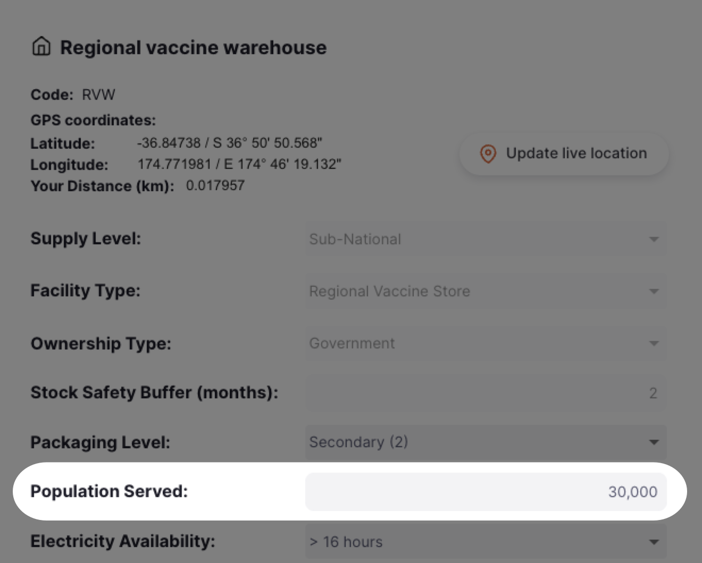

For demand calculations to stay relevant it is necessary for the Population served data to be renewed on a periodic basis, e.g. annually. 
 
 
This requires the introduction of a robust SOP to ensure facilities maintain up-to-date population data. 

#### Population indicators

`Population indicators` are used to determine what percentage of the population snapshot will require vaccinating.  For example, what percentage of the population snapshot are newborn children.

The `Population indicators` are set at the central level in the [Demographics](/docs/manage/demographics/#adding-a-new-indicator) section.

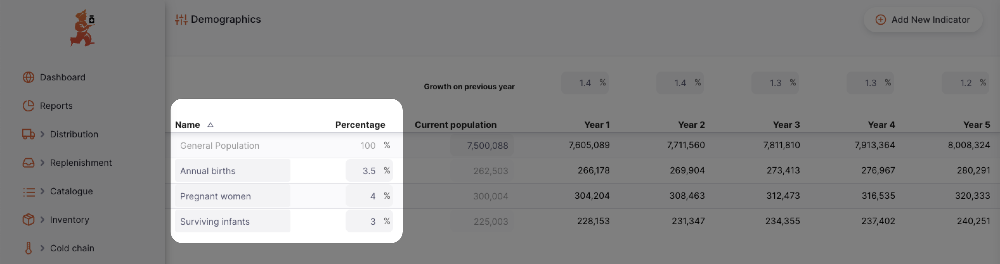

#### Population growth rate

To forecast beyond the current year it is necessary to estimate the annual population growth. 

The `Population growth` may be specified for the next 5 years in the [Demographics](/docs/manage/demographics/#yearly-growth-percentage) section.

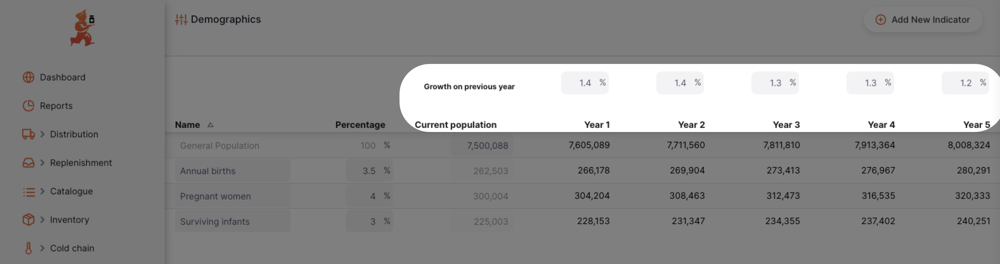
### 3. Specifying the national immunization program

To accurately calculate the forecast demand it is necessary to specify the national immunization program that the population are expected to adhere to. 

To do this requires: 
- [Specifying which vaccine courses form part of the national immunization program](#specifying-vaccine-courses)
- [Specifying the details of each vaccine course](#specifying-vaccine-course-variables)

#### Specifying vaccine courses

The different vaccine courses that form part of the national immunization program are specified at the central level in the [Programs > Immunizations](/docs/programs/immunisations/#vaccine-courses) section. 

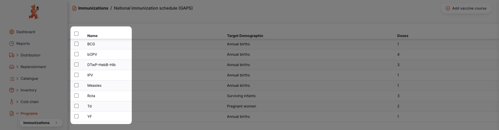

#### Specifying vaccine course variables

The variables of each vaccine course must be specified to provide an accurate demand forecast. 

The variables that must be specified include: 
- The [target demographic](#population-indicators)
- The coverage rate
- The wastage rate
- The number of doses required to complete the vaccine course

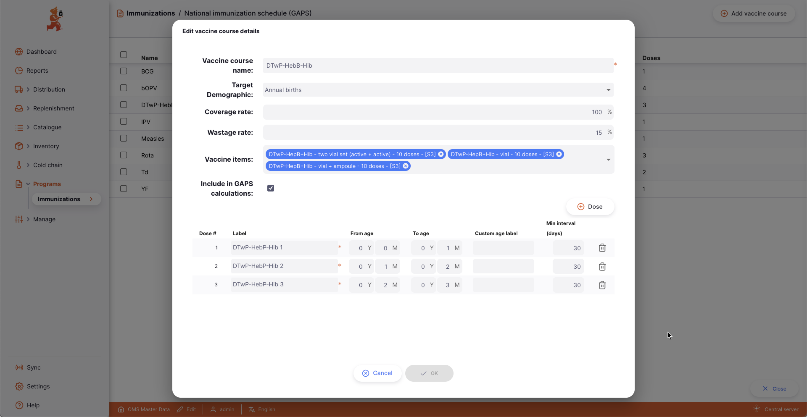
### 4. Reviewing the forecast demand

The total `CCE forecast demand` for each supply level (e.g. Primary, Sub-National, Lowest Distribution and Service Points) is determined by calculating the forecast demand for each vaccine course and then summing the results. 

The forecast demand for each each vaccine course is calculated by applying an algorithm to the data points collected in the previous sections.

The algorithm applied is: `Target population` x `Number of doses` x `Coverage rate` x `Loss factor`

More details on how each of the components of the algorithm are derived can be viewed on our GitHub repository <a href="https://github.com/msupply-foundation/open-msupply-forecasting-plugins?tab=readme-ov-file#forecasting-calculation" target="_blank">here</a>. 

The output values (in litres) can be viewed in the [mSupply Dashboard](/dashboard/introduction).  

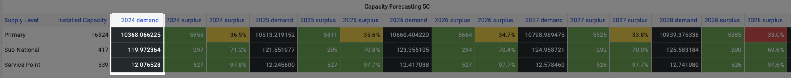
## Comparing CCE capacity to forecast demand

The [Installed CCE capacity](#installed-cce-capacity) and [Forecast CCE demand](#4-reviewing-the-forecast-demand) can be reviewed in the [mSupply Dashboard](/dashboard/introduction). 

The `CCE surplus / deficit` (in litres) is displayed for each supply level for the current year. 
Additionally a forecast is provided for the next 5 years to account for population growth. 

- Supply levels with sufficient `CCE surplus` are shown in green. 
- Supply levels with low `CCE surplus` are shown in yellow
- Supply levels with critically low `CCE surplus` are shown in red

The 5 year forecast allows for the identification of trends which help to highlight whether intervention will be required in the near future. 

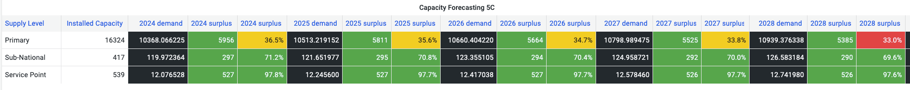
## Identifying facilities that need intervention

In addition to the aggregated supply level comparison it is possible to do a comparison at the individual facility level. 

This allows for identification of individual facilities that require attention. 

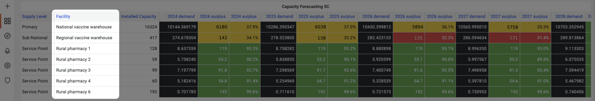

The `CCE surplus / deficit` (in litres) is displayed for each facility for the current year. 
Additionally a forecast is provided for the next 5 years to account for population growth. 

- Facilities with sufficient `CCE surplus` are shown in green. 
- Facilities with low `CCE surplus` are shown in yellow
- Facilities with critically low `CCE surplus` are shown in red

The 5 year forecast allows for the identification of trends which help to highlight whether intervention will be required in the near future. 

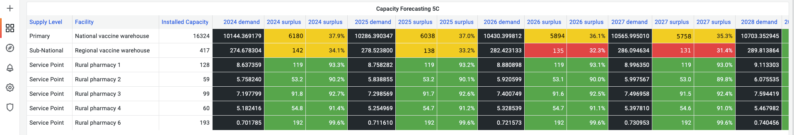
