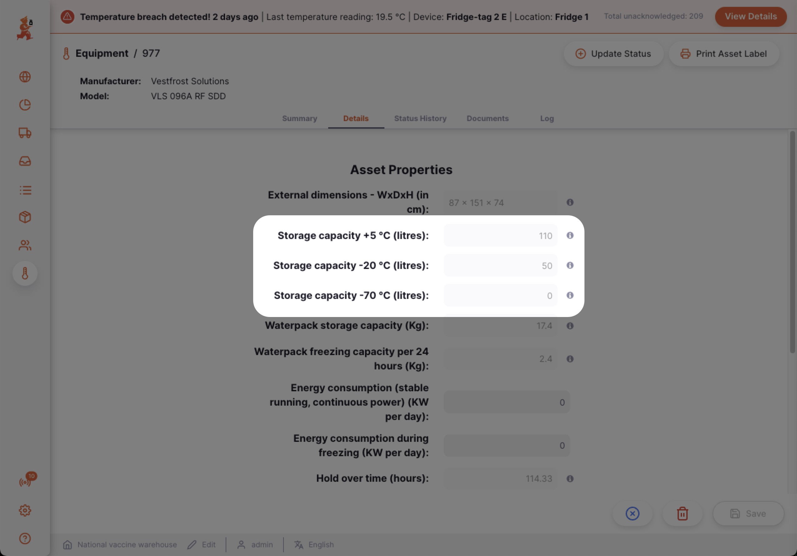
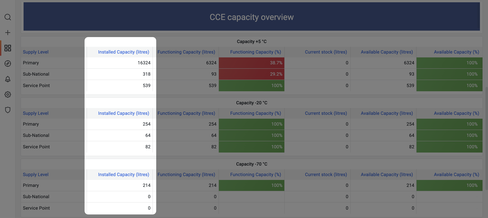

+++
title = "GAPS"
description = "Gap analysis planning system"
date = 2023-11-08T15:20:00+00:00
updated = 2023-11-08T15:20:00+00:00
draft = false
weight = 15
sort_by = "weight"
template = "docs/page.html"

[extra]
toc = true
top = false
+++

## Gap analysis planning system (GAPS)

The gap analysis planning system (GAPS) is a tool designed to help EPI teams to assess whether their CCE infrastructure is sufficient to meet expected demand.

The GAPS module allows EPI teams to: 
- Capture CCE volume capacity for the country
- Forecast the expected demand for CCE volume capacity over the next 5 years
- Compare the current CCE volume capacity to the expected demand
- Identify facilities that will need intervention due to increased demand
- Identify facilities that will need intervention due to CCE reaching end-of-life

## Capturing CCE volume capacity

The CCE volume capacity for the country can be captured by:
1. Registering all CCE for all facilities in the [CCEI module](/docs/coldchain/equipment/). 
2. Implementing a robust SOP for facilities to regularly report the functional status of their CCE 
### 1. Registering CCE

CCE can be registered for every facility in the country by following the documentation for the [CCEI module](/docs/coldchain/equipment/). 

Each registered CCE captures data about its cold storage volume capacity:  

The aggregation of these cold storage volumes from all CCE across all facilities therefore gives you the `Installed CCE volume capacity` for the country. 

The `Installed CCE volume capacity` can be viewed in the [mSupply Dashboard](/dashboard/introduction) and can be filtered by metrics such as supply level (Primary, Sub-National, Lowest Distribution etc) or temperature range (+ 5°C, -20 °C, -70°C)

### 2. Reporting CCE functional status
## Forecasting expected demand for CCE volume capacity

## Comparing CCE volume capacity to expected demand

## Identifying facilities that need intervention
