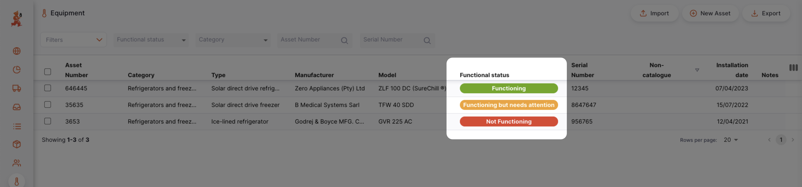
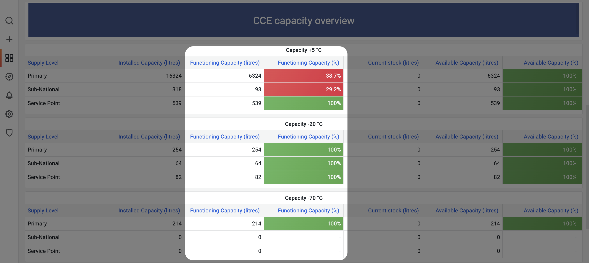
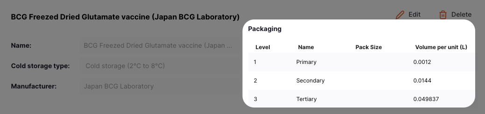
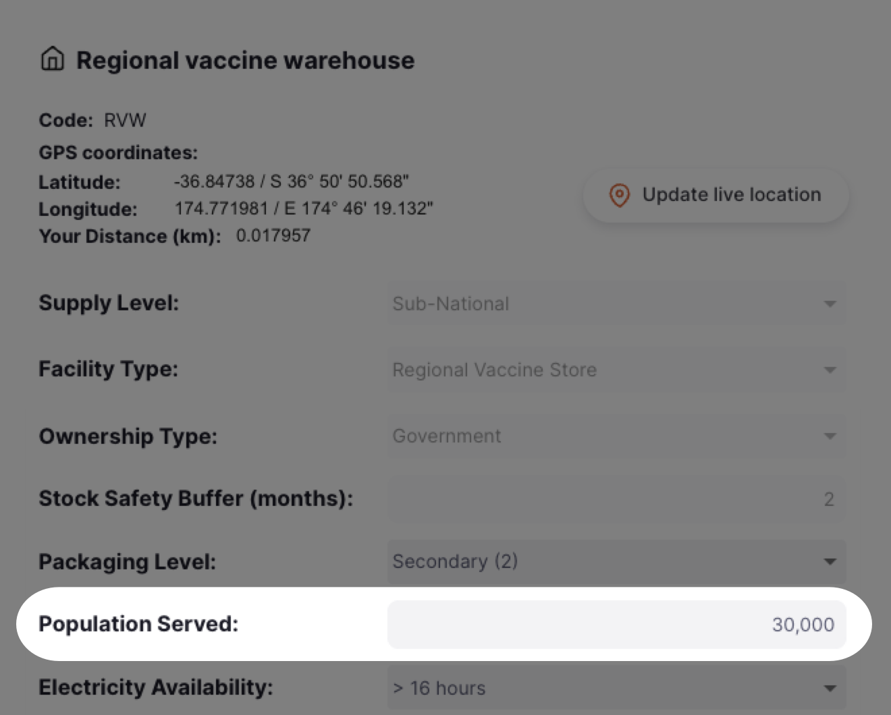

+++
title = "GAPS"
description = "Gap analysis planning system"
date = 2023-11-08T15:20:00+00:00
updated = 2023-11-08T15:20:00+00:00
draft = false
weight = 15
sort_by = "weight"
template = "docs/page.html"

[extra]
toc = true
top = false
+++

## Gap analysis planning system (GAPS)

The gap analysis planning system (GAPS) is a tool designed to help EPI teams to assess whether their CCE infrastructure is sufficient to meet expected demand.

The GAPS module allows EPI teams to: 
- [Assess CCE capacity for the country](#assessing-cce-capacity)
- [Forecast the expected demand for CCE capacity over the next 5 years](#forecasting-expected-demand-for-cce-capacity)
- [Compare the current CCE capacity to the expected demand](#comparing-cce-capacity-to-expected-demand)
- [Identify facilities that will need intervention due to increased demand](#identifying-facilities-that-need-intervention)
- [Identify facilities that will need intervention due to CCE reaching end-of-life](#identifying-facilities-that-need-intervention)

## Assessing CCE capacity

The CCE capacity for the country can be assessed by:
1. [Registering all CCE](#1-registering-cce) for all facilities in the CCEI module. 
2. [Obtaining recent updates about the functional status](#2-updating-cce-functional-status) of each CCE
3. [Reviewing the aggregated data](#3-reviewing-aggregated-cce-data)
### 1. Registering CCE

CCE can be registered for every facility in the country by following the documentation for the [CCEI module](/docs/coldchain/equipment/). 

Each registered CCE provides data about its cold storage volume capacity:  

The aggregation of these cold storage volumes from all CCE across all facilities therefore gives the `Installed CCE capacity` for the country (see [Installed CCE capacity](#installed-cce-capacity)). 

### 2. Updating CCE functional status

The `Functioning CCE capacity` is the percentage of the `Installed CCE capacity` that is currently working as expected. 

To determine an accurate `Functioning CCE capacity` it is necessary to obtain recent data about the functional status of each CCE in the country. 

This data can be obtained in two ways: 
1. Manually - each facility user submits a [functional status report](/docs/coldchain/equipment/#update-status) for each of their CCE
2. Automatically - each CCE directly reports its own functional status (**future feature*)

As of version 2.7, only the manual option is available. 

Therefore, to obtain an accurate `Functioning CCE capacity` it is **vitally important to implement a robust SOP** for facilities so that they regularly report the functional status of their CCE by submitting a [functional status report](/docs/coldchain/equipment/#update-status) (for example, on a weekly basis)
### 3. Reviewing aggregated CCE data

#### Installed CCE capacity

The `Installed CCE capacity` is the aggregation of the data collected in [1. Registering CCE](#1-registering-cce) and can be viewed in the [mSupply Dashboard](/dashboard/introduction).  

The dashboard can be filtered by metrics such as supply level (Primary, Sub-National, Lowest Distribution etc) or temperature range (+ 5°C, -20 °C, -70°C)

#### Functioning CCE capacity

The `Functioning CCE capacity` is the aggregation of the data collected in [2. Updating CCE functional status](#2-updating-cce-functional-status) and can be viewed in the [mSupply Dashboard](/dashboard/introduction).

The dashboard can be filtered by metrics such as supply level (Primary, Sub-National, Lowest Distribution etc) or temperature range (+ 5°C, -20 °C, -70°C)

## Forecasting expected demand for CCE capacity

The expected demand for CCE capacity for the country can be forecast by:
1. [Recording packaging volumes for each type of vaccine](#1-recording-packaging-volumes-for-vaccines)
2. [Capturing population data for each facility](#2-capturing-population-data-for-facilities)
3. [Specifying the national immunization program](#3-specifying-the-national-immunization-program)
4. [Reviewing the calculated forecasts](#4-reviewing-expected-demand-forecasts)

### 1. Recording packaging volumes for vaccines

To calculate how much CCE capacity is required to store vaccines it is necessary to know how much space each dose occupies in the CCE. 

The volume required to store each type of vaccine can be recorded in the [Item Catalogue](/docs/catalogue/items/#packaging-1). 

Volumes for primary, secondary and tertiary packaging can be recorded so that the appropriate packaging level for each facility is used when calculating their storage volume requirements.

Open mSupply comes with the <a target="_blank" href=https://extranet.who.int/prequal/vaccines/prequalified-vaccines>list of WHO PQS prequalified vaccines</a>, including their respective packaging volumes, built into the system by default. 

### 2. Capturing population data for facilities

To calculate how many doses of vaccines require storing in CCE it is necessary to know how many people are served by each facility and what percentage of those people will require vaccines. 

To do this requires: 
- A snapshot of the current population
- Specification of population indicators
- An estimation of population growth rate

#### Population snapshot

Each facility can submit a snapshot of their own `Population served` data in the [Store properties](/docs/manage/facilities/#editing-your-store-properties) section. 

This population data is then aggregated centrally to build a national population snapshot. 

#### Population indicators

#### Population growth rate
### 3. Specifying the national immunization program

### 4. Reviewing expected demand forecasts
## Comparing CCE capacity to expected demand

## Identifying facilities that need intervention
