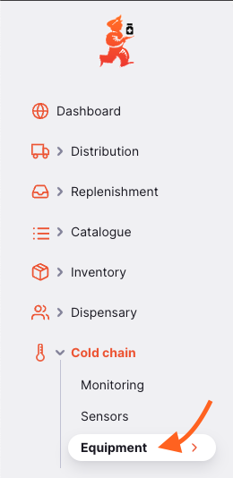
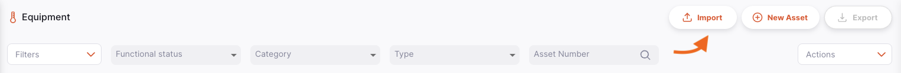
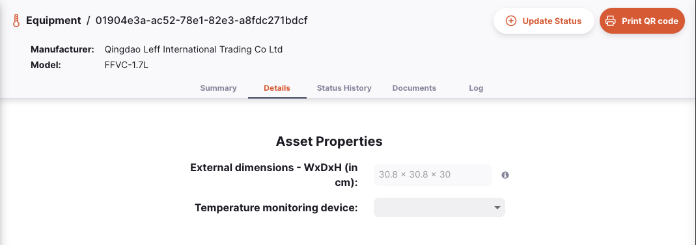
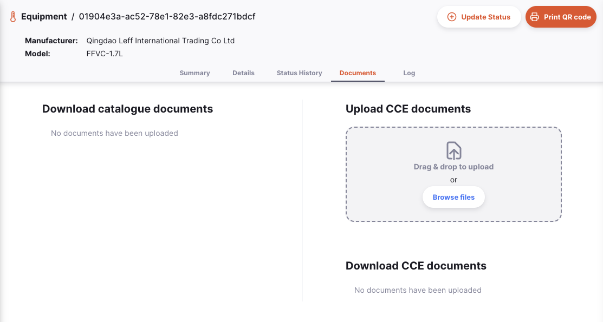
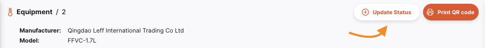
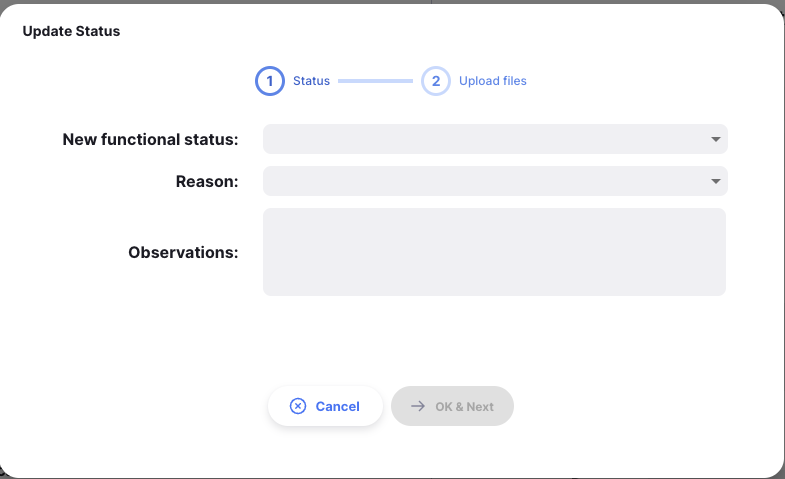
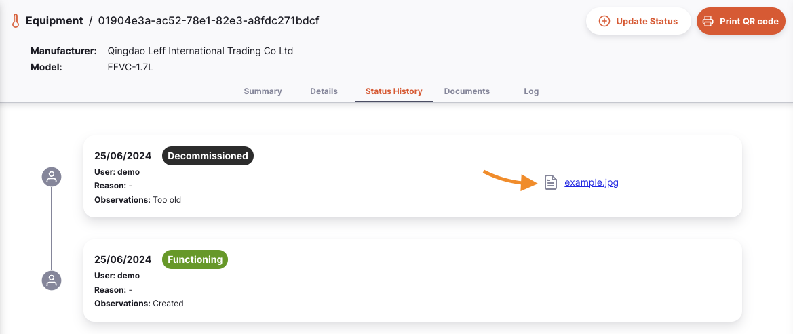

+++
title = "Equipamento"
description = "Gerenciamento de Equipamento de Cadeia de Frios"
date = 2023-11-08T15:20:00+00:00
updated = 2023-11-08T15:20:00+00:00
draft = false
weight = 10
sort_by = "weight"
template = "docs/page.html"

[extra]
toc = true
top = false
+++

El módulo de Equipos de Cadena de Frío es un registro digital e inventario para la gestión de activos de cadena de frío, como refrigeradores, congeladores y dispositivos de monitoreo remoto de temperatura. Permite a los departamentos de salud rastrear sus activos de cadena de frío, incluyendo su ubicación y estado funcional.

Desde el menú `Equipos`, se pueden ver todos los activos disponibles en el almacén actual.

<!--
TODO: Add link to central server docs when they are created
-->

Los activos de cadena de frío de **todos** los almacenes son visibles al acceder al menú `Equipos` a través del servidor central de Open mSupply.

Aquí puedes ver todos los equipos de cadena de frío disponibles en tu almacén.

La lista de equipos se divide en 6 columnas:

| Columna                  | Descripción                                                                                                                |
| :----------------------- | :------------------------------------------------------------------------------------------------------------------------- |
| **Número de activo**     | El número asignado al activo                                                                                               |
| **Tipo**                 | El tipo de activo                                                                                                          |
| **Fabricante**           | El fabricante del activo                                                                                                   |
| **Modelo**               | El número de modelo del activo                                                                                             |
| **Estado funcional**     | El estado funcional del activo, por ejemplo: `FUNCIONANDO`                                                                 |
| **Número de serie**      | El número de serie del activo                                                                                              |
| **Fuera de catálogo**    | Indica si el activo no fue creado a partir de un artículo del catálogo (ver [Catálogo > Activos](/docs/catalogue/assets/)) |
| **Fecha de instalación** | La fecha en que se instaló el activ                                                                                        |
| **Notas**                | Notas ingresadas sobre el activo                                                                                           |

#### Paginación de equipos

La lista puede mostrar un número fijo de activos por página. En la esquina inferior izquierda, puedes ver cuántos activos se están mostrando actualmente en tu pantalla.

Si tienes más activos que el límite actual, puedes navegar a las otras páginas tocando el número de página o utilizando las flechas derecha o izquierda (esquina inferior derecha).

También puedes seleccionar un número diferente de filas para mostrar por página usando la opción en la esquina inferior derecha de la página.

#### Filtrar equipos

Para agregar un filtro a la página, selecciona el filtro requerido del menú desplegable. Se pueden combinar varios filtros.

#### Eliminar equipos

Los activos pueden ser seleccionados y eliminados utilizando la acción de la barra de herramientas:

### Importación y exportación

#### Importar

Los activos de la cadena de frío se pueden importar desde un archivo de valores separados por comas (csv) utilizando el botón `Importar`

Esto abrirá una ventana emergente de importación. Haz clic en `Descargar una plantilla ` para descargar una plantilla csv que se puede usar para importar activos.

Al importar activos desde un almacén, se asignarán a ese almacén.

<!--
TODO: Add link to central server docs when they are created
-->

Al importar activos en el servidor central, se requerirá un campo adicional de `almacén` que asignará los activos a sus respectivos almacenes.

La información deberá ingresarse en el formato proporcionado por la plantilla csv para que Open mSupply pueda procesar y cargar estos datos.

| Columna                              | Descripción                                                               | Ejemplo                 | Obligatorio       |
| :----------------------------------- | :------------------------------------------------------------------------ | :---------------------- | :---------------- |
| **Número de activo**                 | El número de activo asignado por la organización del usuario              | 1                       | \*                |
| **Código del artículo del catálogo** | El código del catálogo de activos, es decir, el tipo de activo a importar | E003/002                | \*                |
| **Almacén**                          | El código del almacén al que se asignará el activo                        | CMS                     | \* (solo central) |
| **Notas**                            | Notas generales sobre el activo                                           | Guardado en oficina EPI |                   |
| **Número de serie**                  | El número de serie de ese activo en particular                            | 123456789ABC            |                   |
| **Fecha de instalación**             | La fecha en que se instaló el activo en el almacén                        | 2024-01-14              |                   |

Se puede cargar un archivo csv una vez que haya sido creado en el formato de ejemplo.

    

#### Exportar

Se puede exportar una lista de activos como un archivo csv utilizando el botón `Exportar`.

    

### Escaneo de códigos QR

Si estás utilizando Open mSupply en una tableta o en la versión de escritorio, tendrás un botón adicional en la barra de menú que permite escanear códigos QR. Este es el botón `Escanear`:

Es posible que veas esta notificación al hacer clic en el botón:

¡No te preocupes! Ve a la sección [Escáneres de códigos de barras](/docs/settings/devices/#barcode-scanners) de la documentación de `Configuración` y configura un escáner antes de continuar.

Una vez que tengas un escáner conectado, puedes hacer clic en el botón `Escanear` y escanear un código QR.
Si se encuentra una coincidencia al escanear, serás dirigido a la página de detalles de ese equipo de cadena de frío. Si no se encuentra ninguna coincidencia, verás una notificación informándote que no se encontró ningún resultado.

Puedes imprimir una etiqueta con un código QR para un equipo. Consulta la sección<a href="/docs/coldchain/equipment/#printing-a-qr-code">Imprimir código QR</a> para más detalles

### Crear nuevo activo

Los equipos de cadena de frío pueden crearse manualmente usando el botón `Nuevo Activo`.

    

Al hacer clic en este botón, se abrirá la ventana modal `Crear Activo`

En esta ventana, puedes asignar:

- El almacén al que pertenecerá el activo (solo disponible en el servidor central de Open mSupply)
- La categoría del activo
- El artículo del catálogo en el que se basará el activo: esto vinculará información del artículo del catálogo (como el fabricante y modelo) a este nuevo activo
- El número del activo
- Notas sobre el activo

Si el activo que estás creando no forma parte de los catálogos `OMS PQS` o `General`, puedes usar el botón para crear un activo que no esté basado en un artículo de catálogo.

### Gestión de activos de cadena de frío

Al hacer clic en una fila de la lista, se mostrarán los detalles de ese activo. Si el activo pertenece a la categoría `Refrigeradores y congeladores`, verás información adicional como la fuente de energía y el volumen de almacenamiento (capacidad del refrigerador o congelador, clasificada por la temperatura del artículo).

Hay 5 pestañas disponibles para gestionar el activo:

#### Pestaña Resumen

Desde la pestaña `Resumen`, puedes:

- Editar el número de serie
- Asignar una fecha de instalación
- Asignar una fecha de reemplazo
- Vincular `Ubicaciones` de almacenamiento de inventario al activo.

Se pueden asignar múltiples ubicaciones de almacenamiento de inventario a un solo activo

También puedes visualizar el estado funcional y editar las notas sobre dicho estado.

#### Detalles

La pestaña de `Detalles` muestra las propiedades del activo.

#### Historial de Estado

La pestaña `Historial de Estado` muestra el historial del estado funcional del activo.

#### Documentos

La pestaña `Documentos` muestra los documentos que se han subido para el artículo del catálogo al que pertenece el activo y los documentos subidos para este activo en particular.

Se pueden subir documentos adicionales para este activo.

<!--
TODO: Add link to central server docs when they are created
-->

Los documentos subidos aquí se sincronizarán con el servidor central, aunque no como parte del proceso habitual de sincronización. Los archivos solo se enviarán cuando no haya otra información para sincronizar, lo que significa que añadir documentos no causará retrasos en los envíos ni en la visualización del inventario.

#### Registro

La pestaña `Registro` muestra el registro de actividades de este activo.

Aquí se registran todas las acciones realizadas por los usuarios para este activo utilizando el sistema Open mSupply.

### Toolbar

#### Actualizar estado

Al hacer clic en el botón `Actualizar estado`, se puede crear una nueva entrada de estado funcional.

Esto abrirá el modal de estado funcional.

Aquí puedes ingresar:

- Un nuevo estado funcional
- Una razón para el nuevo estado funcional
- Cualquier observación o nota

También se pueden cargar documentos adicionales, incluidas fotos, para esta entrada de estado funcional.

Estos documentos se pueden visualizar en la pestaña `Historial de estados`

#### Imprimir un código QR

Para ayudar a identificar activos, puedes imprimir una etiqueta con un código QR para tu activo. Este código puede ser escaneado (ver arriba) para identificar fácilmente un activo en tu sistema.

Simplemente haz clic en el botón `Imprimir código QR` y se imprimirá un código QR, siempre que tengas configurada una impresora de etiquetas.

Para configurar una impresora de etiquetas, consulta la sección [Impresión de etiquetas](/docs/settings/devices/#label-printing) en las páginas de configuración.

La etiqueta mostrará el código y el número de serie, por ejemplo:

