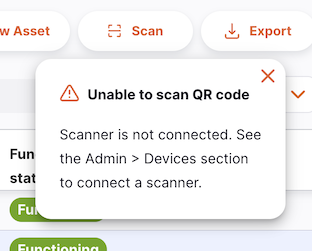
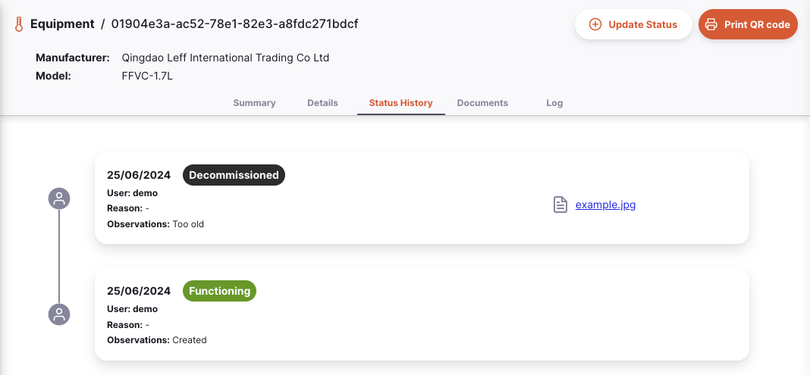
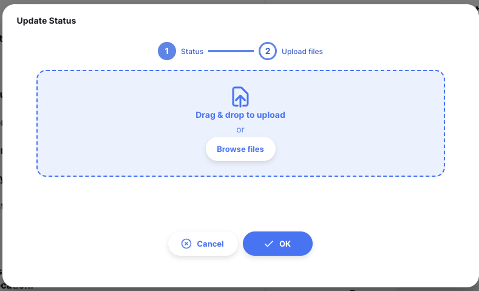

+++
title = "Equipements"
description = "Gestion des Equipements de la chaîne du froid"
date = 2023-11-08T15:20:00+00:00
updated = 2023-11-08T15:20:00+00:00
draft = false
weight = 10
sort_by = "weight"
template = "docs/page.html"

[extra]
toc = true
top = false
+++

Le logiciel de gestion de la chaîne du froid est un registre numérique permettant la création et la gestion des actifs de la chaîne du froid. Il permet aux services de santé de gérer, d'enregistrer les historiques de fonctionnement et de mettre à jour la localisation des équipements de la chaîne du froid.

A partir du menu **Equipements**, l'ensemble des actifs tangibles ou équipements d'un site sont visibles.

<!--
TODO: Add link to central server docs when they are created
-->

En accédant au menu **Équipements** via le serveur central Open mSupply, vous pouvez consulter l'ensemble des équipements de la chaîne du froid de tous les sites.

Ici, vous pouvez consulter tous les équipements de la chaîne du froid disponibles sur votre site.

La liste des équipements est divisée en 6 colonnes:

| Column                     | Description                                                                                             |
| :------------------------- | :------------------------------------------------------------------------------------------------------ |
| **Numéro d'Actif**         | Le numéro d'actif                                                                                       |
| **Type**                   | Le type d'actif                                                                                         |
| **Fabricant**              | Le fabricant de votre actif                                                                             |
| **Modele**                 | Le numéro de modele de votre actif                                                                      |
| **Etat de fonctionnement** | L'état de fonctionnement de votre actif, par exemple: `Opérationnel`                                    |
| **Numéro de série**        | Le numéro de série de l'actif                                                                           |
| **Hors-catalogue**         | Désigne si l'actif a ete créé hors actif catalogue (voir [Catalogue > Assets](/docs/catalogue/assets/)) |
| **Notes**                  | Notes entrées au sujet de l'actif                                                                       |

#### Paginer les équipements

La liste peut afficher un nombre fixe d'actifs par page. Dans le coin inférieur gauche, vous pouvez voir combien d'actifs sont actuellement affichés sur votre écran.

Si vous disposez de plus d'actifs que la limite actuelle, vous pouvez accéder aux autres pages en appuyant sur le numéro de page ou en utilisant la droite ou la gauche des flèches (coin inférieur droit).

Vous pouvez également sélectionner un nombre différent de lignes à afficher par page en utilisant l'option en bas à droite de la page.

#### Filtrer les équipements

Pour ajouter un filtre à la page, choisissez le filtre requis dans la liste déroulante. Plusieurs filtres peuvent être combinés.

#### Supprimer des actifs

Les actifs peuvent être sélectionnés et supprimés à l'aide de l'action de la barre d'outils :

### Importer et exporter

#### Import

Les actifs de la chaîne du froid peuvent être importés à partir d'un fichier de valeurs séparées par des virgules (csv) à l'aide du bouton `Importer`

Cette action ouvre un modèle d'import.

Un exemple de modèle CSV est disponible en téléchargement ici :

Lors de l’importation d’actifs depuis un dépôt, ils seront attribués à ce dépôt.

<!--
TODO: Add link to central server docs when they are created
-->

Lors de l'importation d'actifs sur le serveur central, un champ supplémentaire « dépôt » sera requis pour attribuer les actifs à leurs dépôt respectifs.

Les informations devront être saisies dans le format fourni par le modèle csv pour qu'Open mSupply puisse traiter et télécharger ces données.

| Colonne                    | Description                                                    | Exemple       | Obligatoire            |
| :------------------------- | :------------------------------------------------------------- | :------------ | :--------------------- |
| **Numéro de série**        | Le numéro d'actif attribué par l'organisation de l'utilisateur | 1             | \*                     |
| **Code Article Catalogue** | Le code du catalogue d'actifs - le type d'actif à importer     | E003/002      | \*                     |
| **Dépôt**                  | Le code du dépôt auquel l'actif' doit être affecté             | CMS           | \* (seulement central) |
| **Notes**                  | Note générales sur l'équipement                                | Bureau du PEV |                        |
| **Numéro de série**        | Le numéro de série de cet actif particulier                    | 123456789ABC  |                        |
| **Date d'insytallation**   | Date d'installation de l'actif dans le dépôt                   | 2024-01-14    |                        |

Un fichier csv peut être téléchargé une fois créé dans le format exemple.

#### Export

Une liste d'actifs peut être exportée au format CSV à l'aide du bouton `Exporter`.

### Scanner un code QR

Si vous exécutez Open mSupply sur une tablette ou si vous exécutez la version de bureau, vous obtiendrez un bouton supplémentaire dans la barre de menu qui permet de scanner les codes QR. Voici le bouton `Scan`

Vous pouvez voir cette notification lorsque vous cliquez sur le bouton :

Dans ce cas, référez-vous à la section [Scanners de code barre](/docs/administration/devices/#barcode-scanners) de la documentatiom `Administrateur` et configurez un sacnner avant de continuer.

Une fois que vous avez connecté un scanner, vous pouvez cliquer sur le bouton `Scan` et scanner un code QR.
Si une correspondance est trouvée lors de la numérisation, vous serez redirigé vers la page de détails de cet élément d'équipement de la chaîne du froid. Sinon, vous verrez une notification indiquant qu'aucune correspondance n'a été trouvée.

Vous pouvez imprimer une étiquette QR code pour un équipement. Voir la section <a href="/docs/coldchain/equipment/#printing-a-qr-code">Imprimer un code QR</a> [pour plus de détails]

### Créer un nouvel actif

Les actifs de la chaîne du froid peuvent être créés manuellement avec le bouton `Nouvel actif`.

En cliquant, ce bouton ouvre le mode `Créer un Actif`

Vous pouvez allouer:

- le dépot pour l'actif (seulement disponible sur le serveur central open mSupply)
- la catégorie d'actif
- l'article du catalogue d'actif auquel l'actif fait référence: Cela reliera les informations de l'élément du catalogue (telles que le fabricant et le modèle) à cet actif nouvellement créé.
- le numéro d'actif
- les notes sur cet équipement

Si l'actif que vous créez ne fait partie ni du catalogue `OMS PQS` ni du catalogue `Général`, vous pouvez utiliser la bascule pour créer un actif qui n'est pas basé sur un élément du catalogue.

### Gérer les équipements de la chaîne du froid

Cliquer sur une ligne de la liste affichera les détails de cet actif. Si votre actif appartient à la catégorie « Réfrigérateurs et congélateurs », vous verrez alors des informations supplémentaires telles que la source d'énergie et le volume de stockage (capacité du réfrigérateur ou du congélateur classée en fonction de la température de l'article).

Il y a 4 onglets disponibles pour gérer l'actif :

#### Onglet Résumé

Depuis l'onglet `Résumé`, vous pouvez:

- éditer le numéro de série
- allouer une date d'installation
- donner une date de remplacement
- attribuer des emplacements à l'actif

Plusieurs emplacements peuvent être attribués à un seul actif

Vous pouvez également afficher l'état fonctionnel et modifier les notes du journal d'état.

#### Journal d'état

L'onglet `JOurnal d'état` montre le journal d'état de tous les équipements

#### Documents

L'onglet `Documents` affiche les documents qui ont été téléchargés pour l'élément du catalogue d'actifs auquel appartient l'actif, ainsi que les documents téléchargés pour cet actif.

Des documents supplémentaires peuvent être téléchargés pour cet actif.

<!--
TODO: Add link to central server docs when they are created
-->

Les documents téléchargés ici seront synchronisés avec le serveur central, mais pas dans le cadre du processus de synchronisation habituel. Les fichiers ne seront envoyés que lorsqu'il n'y a aucune autre information à synchroniser, ce qui signifie que l'ajout de documents n'entraînera pas de retard dans les expéditions ou dans l'arrivée des stocks.

#### Journal

L'onglet `Journal` montre le journal d'activité de cet actif particulier.

Ceci enregistre toutes les actions de l'utilisateur qui ont été entreprises pour cet actif à l'aide du système Open mSupply.

### Bar d'action

#### État de mise à jour

Cliquer sur le bouton `État de mise à jour` permet la création d'un nouveau journal d'activité

Ceci ouvre un nouveau journal.

Ici, vous pouvez saisir :

- Un nouveau statut fonctionnel
- Une raison pour le nouveau statut fonctionnel
- Toutes observations ou notes
  Des documents supplémentaires, notamment des photos, peuvent également être téléchargés pour ce journal d'état.

Ces documents peuvent etre consultés dans l'onglet `Journaux d'état`.

#### Imprimer un code QR

Pour vous aider à identifier les actifs, vous pouvez imprimer une étiquette de code QR pour votre actif. Celui-ci peut ensuite être analysé (voir ci-dessus) pour identifier facilement un actif dans votre système.

Cliquez simplement sur le bouton `Imprimer le code QR` et un code QR sera imprimé, si vous avez configuré une imprimante d'étiquettes.

Pour configurer une imprimante d'étiquette, référez-vous a la section [Impression d'étiquette](/docs/administration/devices/#label-printing) des pages Administrateur.

L'étiquette indiquera le code et le numéro de série, par exemple :

