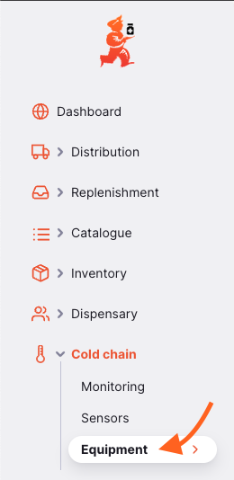
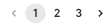
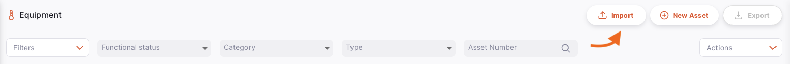
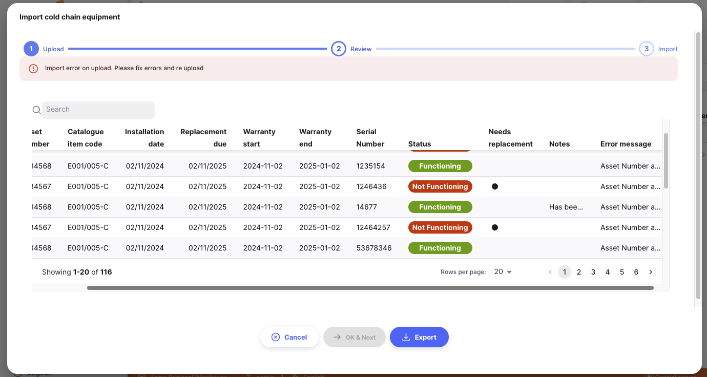
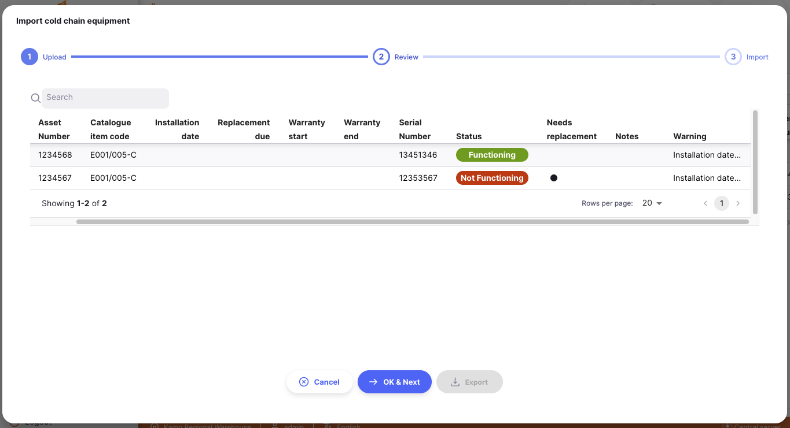
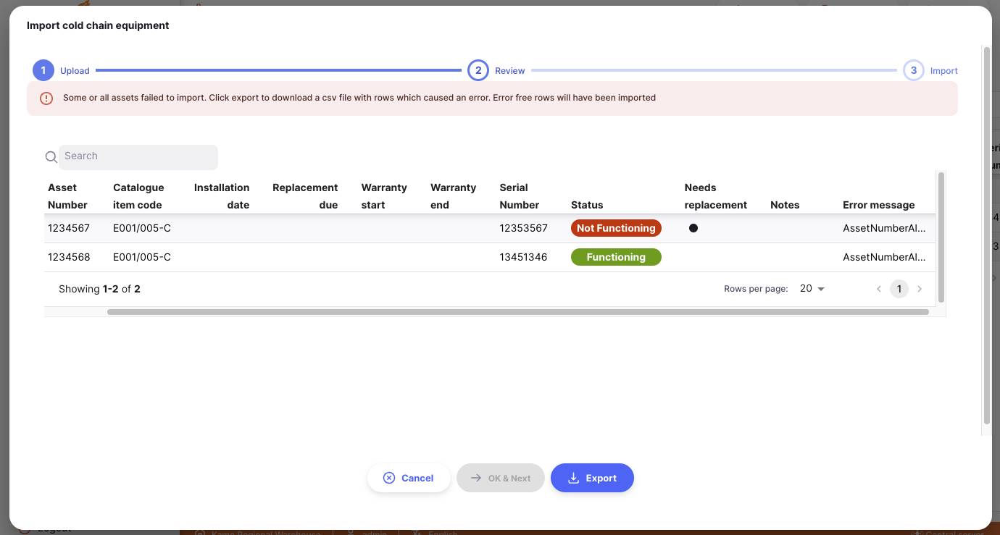
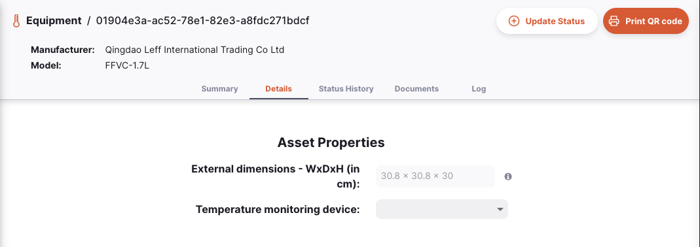
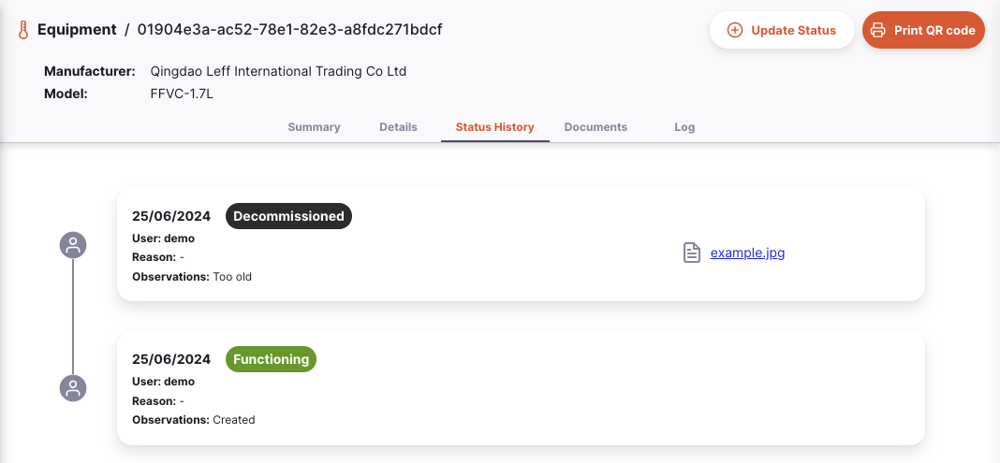
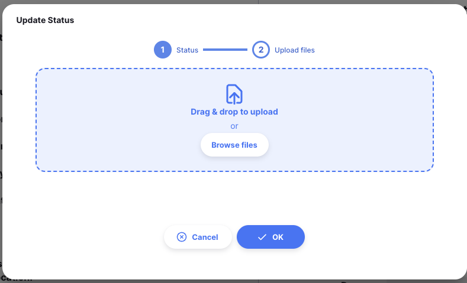
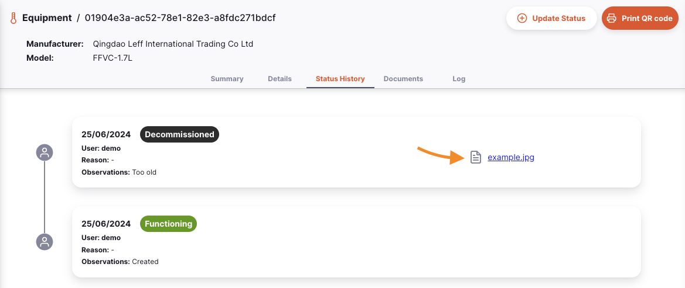

+++
title = "Equipment"
description = "Management of Cold Chain Equipment"
date = 2023-11-08T15:20:00+00:00
updated = 2025-02-20
draft = false
weight = 10
sort_by = "weight"
template = "docs/page.html"

[extra]
toc = true
top = false
+++

Cold Chain Equipment is a digital registry and inventory for the management of cold chain assets such as fridges, freezers and remote temperature monitoring devices. It allows health departments to track their cold chain assets including their location and functional status.

There are three main ways for users to interact with asset management in Open mSupply

- For managers:
  - Log on to the Open mSupply central server for an overview of assets in all facilities, to add and edit assets
  - Use the mSupply Dashboard to view customised data about assets
- For users at a facility
  - Log on to Open mSupply in their facility to update asset status (and occasionally add an asset, but usally this will be done by central managers)

From the `Equipment` menu, all assets available in the current store can be viewed.

<!--
TODO: Add link to central server docs when they are created
-->

Cold chain assets from **all** stores are visible when accessing the `Equipment` menu via Open mSupply central server.

Here you can see all cold chain equipment available in your store.

The equipment list is divided into 6 columns:

| Column                | Description                                                                                                       |
| :-------------------- | :---------------------------------------------------------------------------------------------------------------- |
| **Asset Number**      | The asset number                                                                                                  |
| **Type**              | The type of asset                                                                                                 |
| **Manufacturer**      | The manufacturer of your asset                                                                                    |
| **Model**             | The model number of the asset                                                                                     |
| **Functional Status** | The functional status of the asset ie: `FUNCTIONING`                                                              |
| **Serial Number**     | The serial number of the asset                                                                                    |
| **Non-catalogue**     | Designates if the asset was not created from a catalogue item (see [Catalogue > Assets](/docs/catalogue/assets/)) |
| **Installation date** | The date the asset was installed                                                                                  |
| **Notes**             | Notes entered about the asset                                                                                     |

#### Paginate Equipment

The list can display a fixed number of assets per page. On the bottom left corner, you can see how many assets are currently displayed on your screen.

If you have more assets than the current limit, you can navigate to the other pages by tapping on the page number or using the right of left arrows (bottom right corner).

You can also select a different number of rows to show per page using the option at the bottom right of the page.

#### Filter Equipment

To add a filter to the page, choose the required filter from the drop down. Multiple filters can be combined.

#### Delete Equipment

Select assets to delete them:

### Importing And Exporting

#### Import

Cold chain assets can be imported from a comma-separated-value (csv) file using the `Import` button

This will open an import modal. Click on `Download a template` to download a csv
template which can be used to import assets.

Assets are automatically assigned to the logged in store.

This differs when importing assets on the Open mSupply Central Server - an additional field of `Store` will be required to assign assets to their respective stores.

Information will need to be entered in the format provided by the csv template in order for Open mSupply to be able to process and upload this data.

| Column                  | Description                                                                                | Example                    | Mandatory                      |
| :---------------------- | :----------------------------------------------------------------------------------------- | :------------------------- | :----------------------------- |
| **Store**               | The code of the Store to which the asset is to be assigned                                 | CMS                        | \* (Open mSupply Central only) |
| **Asset Number**        | The asset number assigned by the user's organisation                                       | 1                          | \*                             |
| **Catalogue item code** | The [Asset Catalogue code](/docs/catalogue/assets) - i.e. the kind of asset to be imported | E003/002                   | \*                             |
| **Installation date**   | The date that the asset was installed at the Store                                         | 14/01/2024                 |                                |
| **Replacement due**     | The date that the asset is due for replacement                                             | 14/01/2026                 |                                |
| **Warranty start**      | The start date of the asset's warranty                                                     | 14/01/2024                 |                                |
| **Warranty end**        | The end date of the asset's warranty                                                       | 14/01/2025                 |                                |
| **Serial Number**       | The serial number of that particular asset                                                 | 123456789ABC               |                                |
| **Status**              | The asset's [functional status](#status-history)                                           | Functional                 |                                |
| **Needs replacement**   | Whether the asset needs replacing                                                          | TRUE                       |                                |
| **Notes**               | General notes about the asset                                                              | Kept in EPI office         |                                |
| **Asset properties**    | Many columns may be also be available here for configured asset properties                 | energy_source: Electricity |                                |

When you are ready, drag and drop the csv file into the modal or click on the `Browse files` button to select the file from your computer.

    

#### If things go wrong

Sometimes errors occur when importing CCE assets. Here are some common errors you might encounter:

##### Upload Errors

After uploading your CSV file, your data will be validated and displayed to you to review. At this step, if the data in your uploaded file is not valid, you will see an error message and won't be able to continue to the import step.

Common mistakes here are uploading a file type other than CSV, or if you included some duplicate asset numbers in your file. You'll see these errors in the `Error message` column.

You can use the `Export` button at the bottom of the upload window to download a CSV file which includes the error messages, to investigate what went wrong.

Once you have corrected the errors, you can go back to the `Upload` tab to upload the corrected file.

##### Upload Warnings

If certain data is missing or incorrect (such as the installation date and other date columns) you'll see a warning message rather than an error. This is because the asset can still be created without these date fields, but it's recommended to include them.

There will be a `Warning` column, which will alert you to which fields are missing or incorrect. You can still proceed with the import with this missing data if you wish.

Sometimes spreadsheet software can reformat dates, into a format we can't process. If your dates are missing on import, check your CSV file and ensure the dates are in DD/MM/YYYY format!

##### Import Errors

The import step is where the new cold chain assets are actually created in the system. If there are any errors at this step, you'll see a message like this:

This usually happens when you have an asset in your import file which has the same asset number as an existing asset. You'll see the error message in the `Error message` column. Again, you can export a CSV file with the error messages to investigate what went wrong.

#### Export

A list of existing assets can be exported as a csv using the `Export` button.

### QR code scanning

If you are running Open mSupply on a tablet, or are running the desktop version, you will get an extra button on the menu bar which allows scanning QR codes. This is the `Scan` button:

You may see this notification when you click the button:

If you do, don't panic! Head over to the [Barcode Scanners](/docs/settings/devices/#barcode-scanners) section of the `Settings` documentation and configure a scanner before continuing.

Once you have a scanner connected - you can click the `Scan` button and scan a QR code.
If a match is found when you scan, you'll be taken to the detail page for that cold chain equipment item. If not, you'll see a notification telling that no match was found.

You can print a QR code label for an equipment item. See the <a href="/docs/coldchain/equipment/#printing-a-qr-code">Print QR code</a> section for details

### Create new asset

Cold chain assets can be created manually with the `New Asset` button.

Clicking this button will open the `Create Asset` modal

With this modal you can assign:

- set the store for the asset (only available on the Open mSupply central server)
- the asset category
- the asset catalogue item the asset will be based on: this will link information from the catalogue item ( such as manufacturer & model ) to this newly created asset
- the asset number
- notes about the asset

If the asset you are creating is not part of either the `WHO PQS` or `General` catalogue, you can use the toggle to create an asset which is not based on a catalogue item.

### Managing cold chain assets

Clicking on a row in the list will show the details of that asset. If your asset is under the `Refrigerators and freezers` category, then you will see extra information such as the energy source and storage volume (capacity of the fridge or freezer catagorised by the temperature of the item).

There are 5 tabs available to manage the asset:

#### Summary tab

From the `Summary` tab, you can:

- edit the serial number
- assign an installation date
- assign a replacement date
- Link stock storage `Locations` to the the asset

Multiple stock storage Locations can be assigned to one asset

You can also view the functional status and edit notes on the status.

#### Details

The `Details` tab shows the asset properties.

#### Status History

The `Status History` tab shows the history of the functional status of the asset.

Available functional statuses are:

- Functioning
- Functioning but needs attention
- Not functioning
- Not in use
- Unserviceable
- Decommissioned

#### Documents

The `Documents` tab shows documents which have been uploaded for the asset catalogue item the asset belongs to, and the documents uploaded for this asset.

Additional documents can be uploaded for this asset.

<!--
TODO: Add link to central server docs when they are created
-->

Documents which are uploaded here will synchronise to the central server, though not as a part of the usual sync process. Files will only be sent when there is no other information to synchronise, which means that adding documents won't cause delays in shipments or stock showing up.

#### Log

The `Log` tab shows the activity log of this asset.

This records all user actions which have been taken for this asset using the Open mSupply system.

### Toolbar

#### Update Status

Clicking on the `Update Status` button allows the creation of a new functional status entry.

This will open the functional status modal.

Here you can enter:

- A new functional status
- A reason for the new functional status
- Any observations or notes

Additional documents including photos can also be uploaded for this functional status entry

These documents can be viewed in the `Status History` tab

#### Printing a QR code

To help identify assets, you can print a QR code label for your asset. This can then be scanned (see above) to easily identify an asset in your system.

Simply click the `Print QR code` button and a QR code will be printed, if you have a label printer configured.

To configure a label printer, refer to the [Label Printing](/docs/settings/devices/#label-printing) section of the settings pages.

The label will show the code and serial number, for example:

