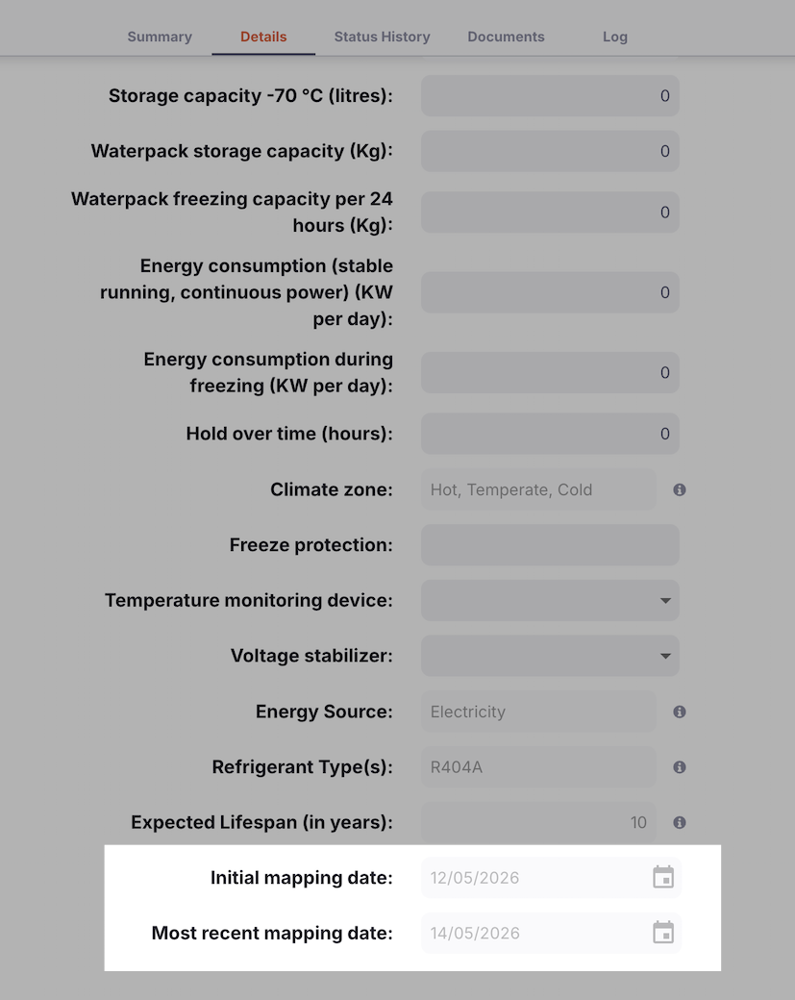
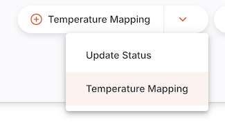
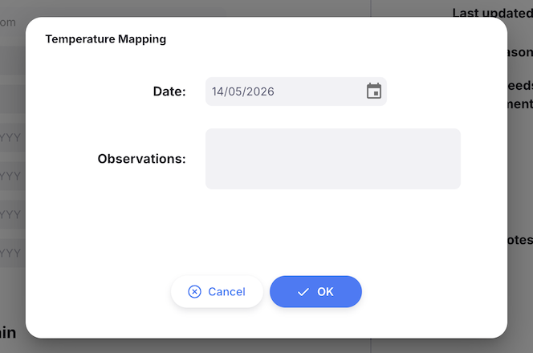
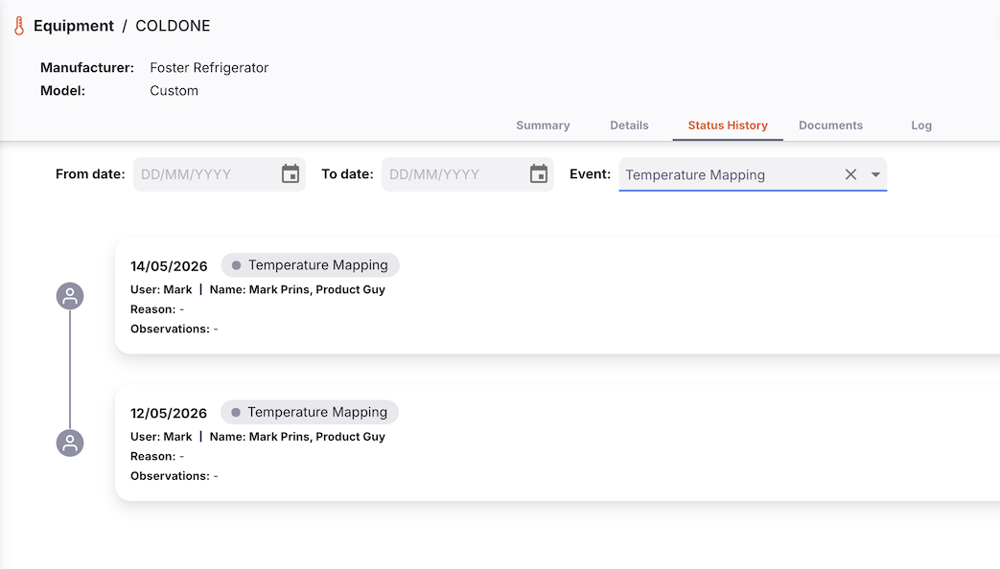

+++
title = "Cold Room Mapping"
description = "Recording temperature mapping assessments for cold rooms and freezer rooms."
date = 2026-05-14
updated = 2026-05-14
draft = false
weight = 20
sort_by = "weight"
template = "docs/page.html"

[extra]
toc = false
top = false
+++

Cold Room Mapping (also called **Temperature Mapping**) is the process of assessing and documenting the temperature distribution within a cold room or freezer room. Mapping verifies that a cold storage unit maintains acceptable temperatures throughout its internal volume and is an important part of ensuring cold chain integrity for vaccines and other temperature-sensitive medicines.

In Open mSupply, you can record the date and observations of each temperature mapping exercise performed on a cold room or freezer room asset. The system tracks both the initial mapping date and the most recent mapping date for each asset.

Temperature mapping is only available for cold chain equipment classified as <strong>Cold Rooms and Freezer Rooms</strong>. It is not available for other equipment categories such as refrigerators, freezers, or insulated containers.

## Viewing Mapping Dates

The initial and most recent mapping dates for an asset are displayed on the **Equipment detail view**.

To view the mapping dates for an asset:

1. Go to `Cold chain` > `Equipment` in the navigation panel.
2. Click on the cold room or freezer room asset you want to view.
3. The detail view will display the mapping dates in the asset properties section.

| Field                        | Description                                                            |
| :--------------------------- | :--------------------------------------------------------------------- |
| **Initial mapping date**     | The date of the first temperature mapping ever recorded for this asset |
| **Most recent mapping date** | The date of the most recently recorded temperature mapping             |

These dates are automatically calculated from all mapping records for the asset. You do not need to update them manually.

## Recording a Temperature Mapping

When a temperature mapping exercise has been completed on a cold room or freezer room, record it in Open mSupply as follows:

1. Go to `Cold chain` > `Equipment` in the navigation panel.
2. Locate the cold room or freezer room asset and click on it to open the detail view.
3. Click the **Temperature mapping** button.

The **Temperature Mapping** dialogue will open.

4. In the **Date** field, enter the date on which the temperature mapping was performed.

Only past dates or today can be selected. Future dates cannot be recorded.

5. In the **Observations** field, enter any relevant notes or findings from the mapping exercise — for example, any temperature variations observed, equipment adjustments made, or a summary of the results.

6. Click **OK** to save the mapping record.

After saving:

- A new mapping log entry is created for the asset with the type **Temperature Mapping**.
- The **Initial mapping date** and **Most recent mapping date** on the asset are automatically updated if the new date is earlier than the current initial date or later than the current most recent date.

## Mapping History

All temperature mapping records for an asset are stored as asset log entries. To view the full history of mapping events:

1. Open the cold room or freezer room asset detail view.
2. Navigate to the **Status history** tab.
3. Filter by log type **Temperature Mapping** to see only mapping records.

Each log entry displays:

| Column           | Description                                       |
| :--------------- | :------------------------------------------------ |
| **Date**         | The date the mapping was performed                |
| **Observations** | The notes entered when the mapping was recorded   |
| **Recorded by**  | The user who recorded the mapping in Open mSupply |

## Importing Mapping Dates

If you have historical mapping records that pre-date your use of Open mSupply, you can import initial and most recent mapping dates as part of a bulk [cold chain equipment import](/docs/coldchain/equipment/equipment/#import).

When mapping dates are included in an import file, Open mSupply automatically creates corresponding mapping log entries in the background so that the dates are treated as part of the asset's mapping history. This ensures that the **Initial mapping date** and **Most recent mapping date** fields remain accurate even when data is loaded via import rather than through the **Record Mapping** button.

For guidance on the import file format and required columns, see <a href="/docs/coldchain/equipment/equipment/#import">Importing Cold Chain Equipment</a>.

