+++
title = "Monitoreo"
description = "Temperature monitoring and reporting features"
date = 2023-11-08T15:20:00+00:00
updated = 2023-11-08T15:20:00+00:00
draft = false
weight = 1
sort_by = "weight"
template = "docs/page.html"

[extra]
toc = true
top = false
+++

La sección de Monitoreo muestra los datos de monitoreo de temperatura de la cadena de frío de tres maneras diferentes:

1. Vista en gráfico que muestra visualmente los datos de temperatura de todos los sensores
2. Vista en lista de todos los incumplimientos registrados
3. Vista de todos los registros de temperatura

Los datos de temperatura pueden importarse a Open mSupply a través de Bluetooth (por ejemplo, <a href="https://msupply.foundation/open-msupply/cold-chain/#mSupplySensor" target="_blank">sensores de temperatura mSupply</a>) o mediante USB (por ejemplo, <a href="https://msupply.foundation/open-msupply/cold-chain/#BerlingerSensor" target="_blank">Berlinger Fridge-tags / Q-tags)</a> - consulta <a href="https://docs.msupply.foundation/docs/coldchain/sensors/#connecting-sensors">Conexión de Sensores</a> para más información.

### Ver los datos de Monitoreo

Selecciona `Cadena de frío` > `Monitoreo` en el panel de navegación.

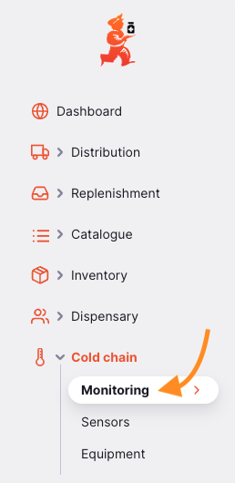

Esta página contiene tres pestañas que muestran diferentes vistas de los datos de monitoreo de temperatura. La pestaña que se mostrará por defecto es la pestaña `Gráfico`.

### Gráfico

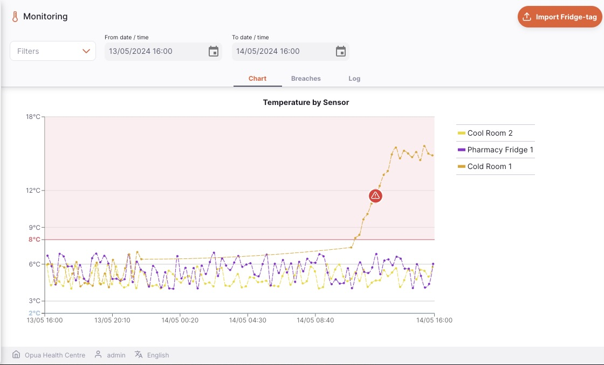

La pestaña de gráficos muestra un gráfico para todos los sensores configurados. Puedes filtrar los datos mostrados por:

- Nombre del sensor
- Ubicación
- Rango de temperatura
- Tipo de incumplimiento

Para agregar un filtro a la página, selecciona el filtro necesario del menú desplegable.

Por defecto, se muestran los datos de las últimas 24 horas. Usa los campos  <code>Desde fecha/hora</code> y <code>Hasta fecha/hora</code> para analizar un período más largo.
  
Los filtros también conservan sus valores cuando cambias entre las pestañas.
  
El filtro de fecha y hora se aplicará a todas las pestañas de la sección de monitoreo.

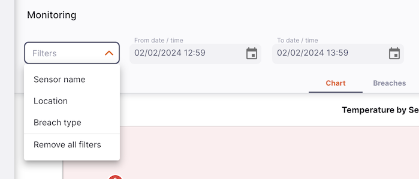

Si el sensor ha registrado un incumplimiento, se mostrará un ícono en el gráfico. Al hacer clic en el ícono, se mostrará información sobre el incumplimiento, junto con un botón que te llevará a la lista de todos los incumplimientos:

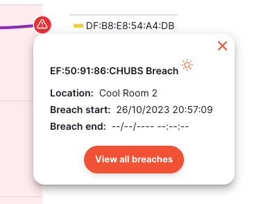

Para cerrar la ventana emergente, haz clic en la "x" roja en la esquina superior derecha.

En el gráfico también se muestran áreas sombreadas en rojo (superior) y azul (inferior). Estas representan los valores estándar de umbral de incumplimiento de temperatura de 8 °C y 2 °C, respectivamente.

Si has utilizado valores de umbral diferentes en tu configuración, podrías ver incumplimientos fuera del rango estándar.

Si seleccionas un período de tiempo largo, podrías ver un mensaje de advertencia como este:
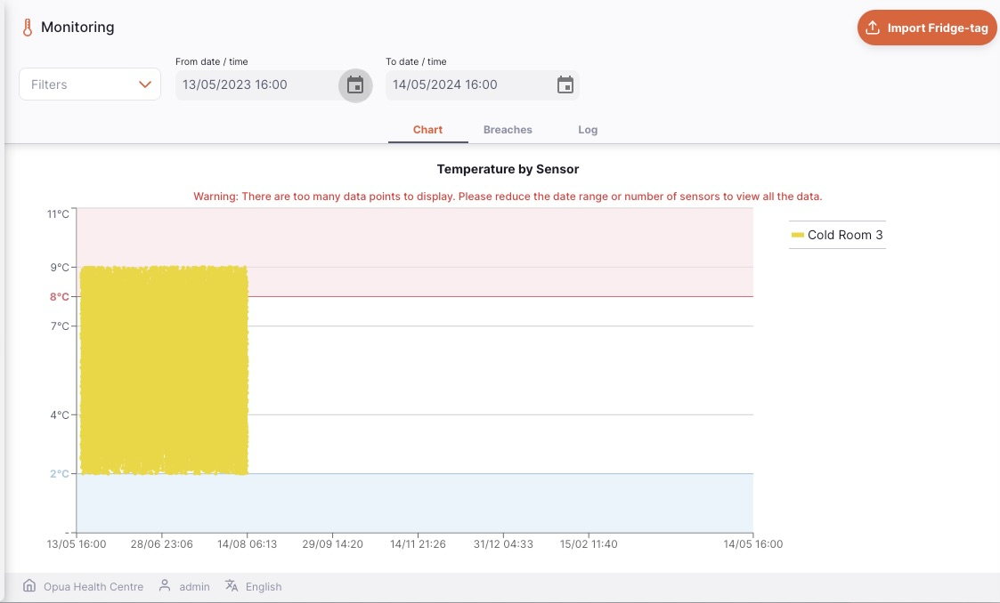
Para evitar esto, es posible que necesites seleccionar un período de tiempo más corto o filtrar los datos para mostrar solo los sensores que te interesan.
Solo se muestran los primeros 8640 puntos de datos en el gráfico.

### Incumplimientos

La pestaña `Incumplimientos` muestra una lista de todos los incumlplimientos registrados

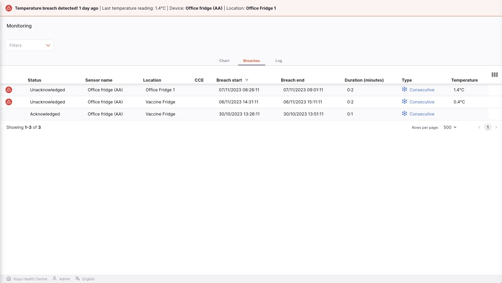

La lista de incumplimientos está dividida en 10 columnas:

| Columna                       | Descripción                                                                                                                                                  |
| :---------------------------- | :----------------------------------------------------------------------------------------------------------------------------------------------------------- |
|                               | Un ícono que muestra una alerta si este incumplimiento no ha sido reconocido                                                                                 |
| **Estado**                    | El estado del incumplimiento puede ser `Reconocido` o `No reconocido`                                                                                        |
| **Nombre del sensor**         | Nombre del sensor                                                                                                                                            |
| **Ubicación**                 | Ubicación actual asociada al sensor                                                                                                                          |
| **CCE**                       | Nombre del equipo de la cadena de frío con el que está asociado el sensor                                                                                    |
| **Inicio del incumplimiento** | Fecha y hora en que comenzó el incumplimiento                                                                                                                |
| **Fin del incumplimiento**    | Fecha y hora en que terminó el incumplimiento, si aplica                                                                                                     |
| **Duración**                  | La duración del incumplimiento, si ha terminado. Si el incumplimiento no ha terminado, se muestra `En curso`                                                 |
| **Tipo**                      | El tipo de incumplimiento: es una combinación de Caliente o Frío (mostrado por el ícono y el color del texto) y Consecutivo o Acumulativo                    |
| **Máx / Mín**                 | La temperatura registrada cuando el incumplimiento se actualizó, que corresponde al inicio o al final del incumplimiento (si el incumplimiento ha terminado) |

Puedes filtrar los datos mostrados por:

- Nombre del sensor
- Ubicación
- Rango de fecha/hora
- Tipo
- No reconocido

Para agregar un filtro a la página, selecciona el filtro requerido desde el menú desplegable. Para eliminar cualquier filtro aplicado, haz clic en la opción `Eliminar todos los filtros`.

Por defecto, el filtro `No reconocido` se muestra en la página de vista de la lista de incumplimientos.

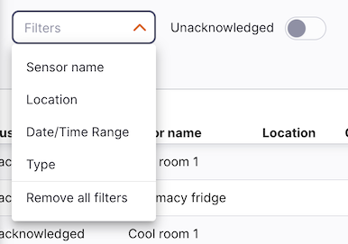

1. La lista puede mostrar un número fijo de incumplimientos por página. En la esquina inferior izquierda, puedes ver cuántos incumplimientos se están mostrando actualmente en tu pantalla.

2. Si tienes más registros que el límite actual, puedes navegar a otras páginas tocando el número de la página o usando las flechas de derecha o izquierda (en la esquina inferior derecha).

3. También puedes seleccionar un número diferente de filas para mostrar por página utilizando la opción en la esquina inferior derecha de la página.

#### Reconocer incumplimientos

Desde esta lista, puedes elegir reconocer un incumplimiento, lo que hará que deje de mostrarse como una notificación en la parte superior de la página.
Si un incumplimiento no ha sido reconocido, verás un ícono de alerta roja a la izquierda de la fila, como este:

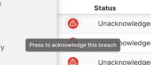

Al hacer clic en el ícono, se abrirá una ventana en la que podrás ingresar un comentario para reconocer el incumplimiento:

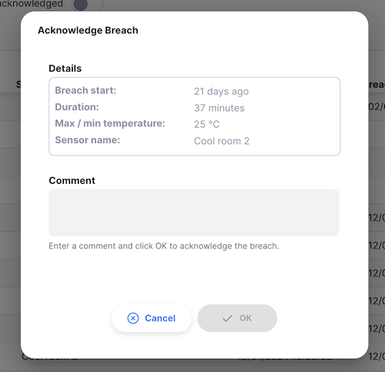

Si un incumplimiento está en curso, es decir, aún no ha terminado, no podrás reconocerlo aún, y la ventana estará deshabilitada:

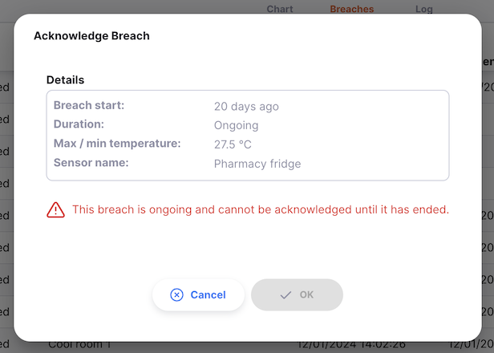

Una vez que un incumplimiento ha sido reconocido, el ícono de alerta roja ya no se muestra para esa fila del incumplimiento. En su lugar, se muestra un ícono de burbuja de diálogo. Al pasar el cursor sobre este ícono (en la versión de escritorio / web) o presionarlo durante un segundo (en tabletas), se mostrará el comentario:

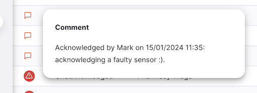

### Registro

La pestaña `Registro` muestra una lista de todos los registros de temperatura

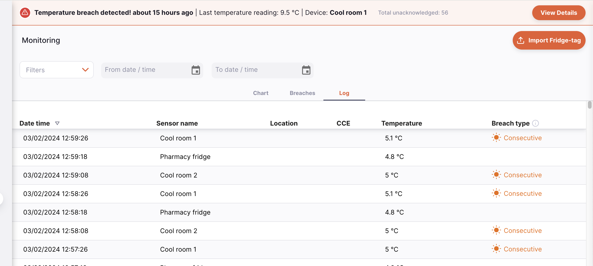

La lista de registros de temperatura está dividida en 6 columnas:

| Columna                    | Descripción                                                                                                                                                                                                        |
| :------------------------- | :----------------------------------------------------------------------------------------------------------------------------------------------------------------------------------------------------------------- |
| **Fecha y hora**           | Fecha y hora de la actividad más reciente para este sensor                                                                                                                                                         |
| **Nombre del sensor**      | Nombre del sensor                                                                                                                                                                                                  |
| **Ubicación**              | Ubicación actual asociada al sensor                                                                                                                                                                                |
| **CCE**                    | Nombre del equipo de la cadena de frío con el que está asociado el sensor                                                                                                                                          |
| **Temperatura**            | La temperatura más reciente reportada por el sensor                                                                                                                                                                |
| **Tipo de incumplimiento** | Si el sensor ha tenido un incumplimiento, se muestra el tipo del incumplimiento más reciente. Esto es una combinación de Caliente o Frío (mostrado por el ícono y el color del texto) y Consecutivo o Acumulativo. |

Puedes filtrar los datos mostrados por:

- Nombre del sensor
- Ubicación
- Rango de fecha/hora
- Tipo de incumplimiento

Para agregar un filtro a la página, selecciona el filtro requerido desde el menú desplegable.

1. La lista puede mostrar un número fijo de registros por página. En la esquina inferior izquierda, puedes ver cuántos registros se están mostrando actualmente en tu pantalla.

2. Si tienes más registros que el límite actual, puedes navegar a otras páginas tocando el número de la página o usando las flechas de derecha o izquierda (en la esquina inferior derecha).

3. También puedes seleccionar un número diferente de filas para mostrar por página utilizando la opción en la esquina inferior derecha de la página.
