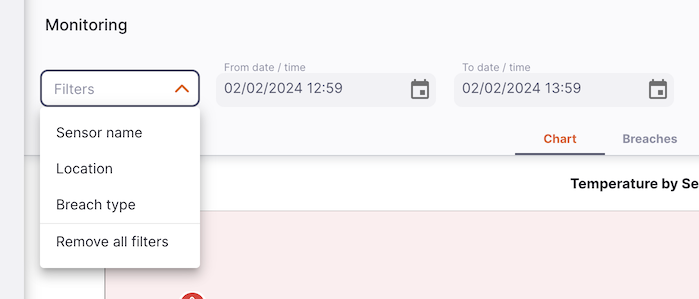
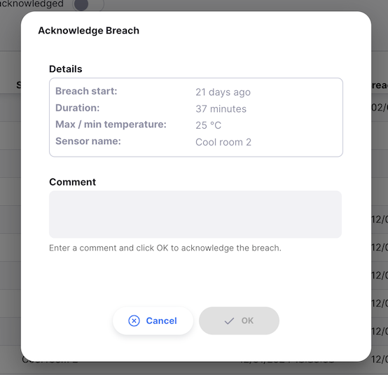
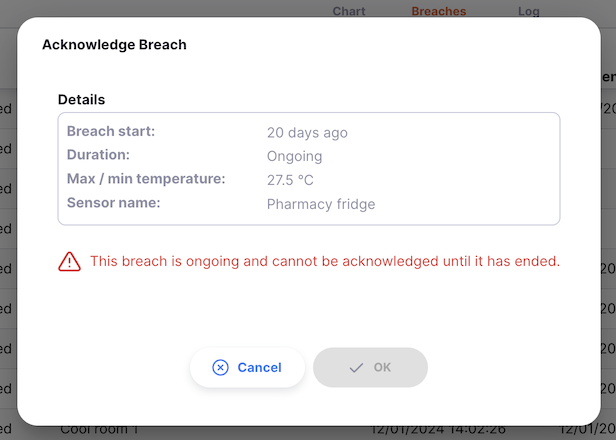
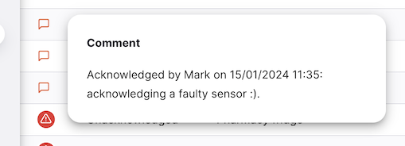
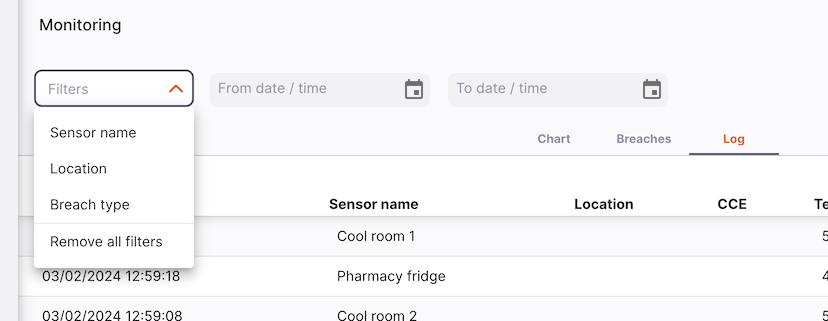

+++
title = "Surveillance"
description = "Surveillance des températures et outils de rapport"
date = 2023-11-08T15:20:00+00:00
updated = 2023-11-08T15:20:00+00:00
draft = false
weight = 1
sort_by = "weight"
template = "docs/page.html"

[extra]
toc = true
top = false
+++

La section Surveillance montre les données de surveillance de la chaîne du froid de trois manières:

1. Un graphique montrant un résumé des données de tous les capteurs
2. Une liste de toutes les anomalies enregistrées
3. Une liste de tous les journaux de température

Pour toutes ces options, vous pouvez importer les données d'un fridge tag. Pour plus d'information, voir ci-dessous.

### Observer les données de surveillance

Choisissez `Chaîne du froid` > `MSurveillance` dans le panneau de navigation.

Cette page contient trois onglets, affichant différents apercus des données de controle des températures. L'onglet `Graphique` sera celui affiché par défaut.

### Graphique

L'onglet Graphique montre un graphique avec tous les capteurs configurés. Vous pouvez filtrer les données par:

- Nom du capteur
- Emplacement
- Date/Période
- Type d'anomalie

Pour ajouter un filtre à la page, choisissez le filtre désiré dans le menu déroulant. Le filtre périodique s'appliquera à tous les onglets de la section de surveillance.

Par défaut, les données des dernieres 24 heures sont affichées. Utilisez les champs date/heure pour observer une période de temps plus longue.

Si le capteur a enregistré une breche ou une anomalie - une icone apparaitra sur le tableau. Cliquez sur l'icone pour faire apparaitre l'information sur l'anomalie avec un bouton vous amenant vers la liste de toutes les breches.

S'affichent également sur le graphique les depassements de seuil de temperature de 2°C (zone rouge) et 8°C (zone bleue).

Si vous avez configuré différentes valeurs de seuil, il est possible que vous voyiez des anomalies en dehors de l'éventail standard.

Si vous sélectionnez une période de temps longue, il est possible que s'affiche le message d'alerte suivant:

Pour éviter cela, sélectionnez une période plus courte ou choisissez un nombre de capteurs réduit.
Seuls les premiers 8640 points de donnée s'affichent sur le graphique.

### Anomalies

L'onglet `Anomalies` montre les enregistrements de toutes les breches

La liste est divisée en 10 colonnes:

| Colonne            | Description                                                                                                                    |
| :----------------- | :----------------------------------------------------------------------------------------------------------------------------- |
|                    | Une icone montrant une alerte si la breche est ignorée                                                                         |
| **Statut**         | Le statut de la breche peut etre `Pris en compte` ou `Ignoré`                                                                  |
| **Nom du capteur** | Nom du capteur                                                                                                                 |
| **Emplacement**    | Emplacment actuel assigné au capteur                                                                                           |
| **CCE**            | Nom de l'actif de la chaîne du froid auquel est rattaché le capteur                                                            |
| **Début**          | Date et heure de début de l'anomalie                                                                                           |
| **Fin**            | Date et heure de début de l'anomalie', si applicable                                                                           |
| **Durée**          | La durée de l'anomalie, si elle s'est terminée. `En cours` s'affiche si la breche n'est pas terminée.                          |
| **Type**           | Le type d'anomalie: ceci est une combinaison de Chaud ou Froid (voir la couleur du text et de l'icone) et Consécutif ou Cumulé |
| **Max / Min**      | La température enregistrée quand l'anomalie a été mise a jour, c'est a dire le debut ou la fin de l'anomalie.                  |

You can filter the data displayed by:

- Sensor name
- Location
- Date/Time Range
- Type
- Unacknowledged

By default, the `Unacknowledged` filter is shown on this page.
To add a filter to the page, choose the required filter from the drop down. To remove any applied filters, click the `Remove all filters` option.

1. The list can display a fixed number of breaches per page. On the bottom left corner, you can see how many breaches are currently displayed on your screen.

2. If you have more logs than the current limit, you can navigate to the other pages by tapping on the page number or using the right of left arrows (bottom right corner).

3. You can also select a different number of rows to show per page using the option at the bottom right of the page.

#### Acknowledging breaches

From this list, you can choose to acknowledge a breach which then will stop the breach showing as a notification at the top of the page.
If a breach has been unacknowledged you will see a red alert icon on the left of the row, like this:

Clicking the button will show a window, in this you can enter a comment to acknowledge the breach:

If a breach is ongoing, i.e. it has not ended yet, then you are unable to acknowledge it yet, and the window is disabled:

Once a breach is acknowledged, the red alert icon is no longer shown for that breach row. Instead, a speech bubble icon is shown. Hovering over this (on the desktop / web version) or pressing it for a second (on tablets) will show the comment:

### Journal

The log view shows a list of all temperature logs.

The list of temperature logs is divided into 6 columns:

| Column          | Description                                                                                                                                                                            |
| :-------------- | :------------------------------------------------------------------------------------------------------------------------------------------------------------------------------------- |
| **Date time**   | Date and time of the most recent activity for this sensor                                                                                                                              |
| **Sensor name** | Name of the Sensor                                                                                                                                                                     |
| **Location**    | Current location assigned to the sensor                                                                                                                                                |
| **CCE**         | Name of the cold chain equipment item which the sensor is associated with                                                                                                              |
| **Temperature** | The most recent temperature reported by the sensor                                                                                                                                     |
| **Breach type** | If the sensor has had a breach, this shows the type of the most recent breach. This is a combination of Hot or Cold (shown by the icon and text colour) and Consecutive or Cumulative. |

You can filter the data displayed by:

- Sensor name
- Location
- Date/Time Range
- Breach type

To add a filter to the page, choose the required filter from the drop down.

1. The list can display a fixed number of logs per page. On the bottom left corner, you can see how many logs are currently displayed on your screen.

2. If you have more logs than the current limit, you can navigate to the other pages by tapping on the page number or using the right of left arrows (bottom right corner).

3. You can also select a different number of rows to show per page using the option at the bottom right of the page.

### Importing Fridge-tags

If you are using Berlinger Fridge-tags, you can import the data directly into Open mSupply. To do this, insert the USB of the Fridge-tag into your computer.
Then click the `Import Fridge-tag` button:

This will open a file browsing window, allowing you to select the `.txt` file of the Fridge-tag data. Simply click on the file and wait for the import to complete.

Currently supported devices are Fridge-tags and Q-Tags from Berlinger.

Here's how the process looks (this is the mac desktop version):

You may need to wait for the text file to be generated after connecting the Fridge-tag to your computer.

The following Berlinger devices are compatible with Open mSupply:

| Device                  | Breach data displayed | Temperature graph plotted |
| :---------------------- | :-------------------- | :------------------------ |
| **Q-tag CLm doc**       | Yes                   | Yes                       |
| **Q-tag CLm doc D**     | Yes                   | Yes                       |
| **Q-tag CLm doc Ice**   | Yes                   | Yes                       |
| **Q-tag CLm doc Ice R** | Yes                   | Yes                       |
| **Q-tag CLm doc L**     | Yes                   | Yes                       |
| **Q-tag CLm doc LR**    | Yes                   | Yes                       |
| **Fridge-tag 2**        | Yes                   | No\*                      |
| **Fridge-tag 2E**       | Yes                   | No\*                      |
| **Fridge-tag 2L**       | Yes                   | Yes                       |
| **Fridge-tag UL**       | Yes                   | Yes                       |

\*Logger device does not capture individual temperature logs
