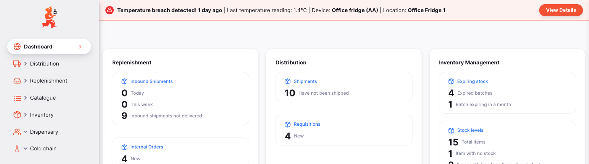
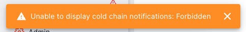

+++
title = "Notificaciones"
description = "Temperature breach / excursion notifications"
date = 2023-11-08T15:20:00+00:00
updated = 2023-11-08T15:20:00+00:00
draft = false
weight = 20
sort_by = "weight"
template = "docs/page.html"

[extra]
toc = true
top = false
+++

Open mSupply puede notificar a los usuarios en tiempo real si ocurre un incumplimiento de temperatura.

Se muestra una notificación en la parte superior de cada página de Open mSupply como advertencia para verificar el inventario potencialmente afectado. Una vez que se reconoce el incumplimiento, la notificación ya no se muestra.

Las notificaciones también pueden enviarse a los teléfonos de los usuarios a través de la aplicación de mensajería instantánea Telegram. 

## Incumplimientos

Los usuarios pueden ser notificados cuando se registra un incumplimiento de temperatura en un sensor. 

Si se cumplen las siguientes condiciones, aparecerá una barra de notificación en todas las páginas:

- El módulo de vacunas está habilitado para el almacén actual
- El usuario actualmente conectado tiene permiso para ver los registros de temperatura
- Uno o más sensores han registrado un incumplimiento de temperatura
- Uno o más de esos incumplimientos no han sido reconocidos

Así es como se ve la barra, mostrada en la parte superior de la página principal:

Si el almacén tiene habilitado el módulo de vacunas y el usuario no tiene permiso para ver los registros, o si ocurre algún otro error, verás una notificación al iniciar sesión o cambiar de almacén: 

Esto solo es para informarte que este usuario no será notificado si ocurre un incumplimiento.

El panel de notificaciones muestra:
1. Hace cuánto tiempo se registró el incumplimiento
2. La lectura de temperatura
3. El nombre del sensor que registró el incumplimiento
4. El nombre de la ubicación asignada al sensor, si tiene una asignada
5. Un botón que lleva a la página de incumplimientos, donde puedes ver todos los detalles del incumplimiento junto con otros incumplimientos.

Si deseas descartar la barra de notificaciones, deberás reconocer el incumplimiento. Puedes hacerlo desde la [Ver lista de incumplimientos](/docs/coldchain/monitoring/#acknowledging-breaches)

## Excursiones

También puedes ser notificado cuando una temperatura exceda temporalmente un límite configurado. Esto se denomina "excursión". Una vez que la temperatura vuelva a estar dentro del rango permitido, la notificación ya no se mostrará.