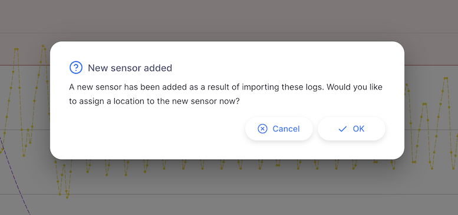

+++
title = "Sensores"
description = "Gestión de sensores de temperatura"
date = 2023-11-08T15:20:00+00:00
updated = 2023-11-08T15:20:00+00:00
draft = false
weight = 3
sort_by = "weight"
template = "docs/page.html"

[extra]
toc = true
top = false
+++

### Conectando sensores

Open mSupply soporta múltiples tipos de sensores de temperatura.

Los métodos para conectar cada uno se describen a continuación.

#### Sensores de temperatura mSupply

La Fundación mSupply fabrica sus propios [sensores de temperatura mSupply](https://msupply.foundation/open-msupply/cold-chain/#mSupplySensor).

Estos sensores pueden conectarse a Open mSupply a través de la integración con la aplicación [mSupply Cold Chain](/coldchain/introduction/).

Para configurar la integración, necesitarás configurar un nuevo usuario mSupply.

El usuario es un usuario mSupply estándar, con la siguiente configuración:

- La tienda predeterminada asignada al usuario es la tienda con la cual se asociarán los datos de temperatura.
- La tienda necesitará ser parte del sitio con el que Open mSupply se está sincronizando. Echa un vistazo a la sección [Configuración](/docs/settings/synchronisation/#viewing-the-synchronisation-settings) para ver con qué sitio se está sincronizando omSupply, y luego la pantalla [Sincronización](https://docs.msupply.org.nz/synchronisation:sync_sites#viewing_sync_sites) para verificar que tu sitio incluya la tienda correcta.
- El usuario debe tener el permiso Open Supply de `Acceso API cadena de frío` (ver abajo)

Desde aquí, sigue los pasos en la documentación de la aplicación mSupply Cold Chain para [Integración con mSupply Desktop](/coldchain/desktop-integration/#msupply-desktop-setup-steps) usando las nuevas credenciales de usuario mSupply creadas arriba en lugar de las credenciales de la tienda.

#### Fridge-tags y Q-tags

Al importar Fridge-tags en una tableta, se requiere Android 12 o posterior

Si estás usando Fridge-tags Berlinger, puedes importar los datos directamente a Open mSupply. Para hacer esto, inserta el USB del Fridge-tag en tu computadora.
Luego haz clic en el botón `Importar Fridge-tag`:

Esto abrirá una ventana de navegación de archivos, permitiéndote seleccionar el archivo `.txt` de los datos del Fridge-tag. Simplemente haz clic en el archivo y espera a que se complete la importación.

Así es como se ve el proceso (esta es la versión de escritorio para mac):

Luego deberías ver un mensaje de éxito en la parte inferior izquierda de la pantalla:

Si el sensor no ha sido agregado ya a tu sistema, se te preguntará si te gustaría agregarlo ahora:

Desde esta ventana, selecciona una ubicación para el sensor, haz clic en `OK`

y finalmente, confirma los cambios:

Puede que necesites esperar a que se genere el archivo de texto después de conectar el Fridge-tag a tu computadora.

##### Dispositivos Berlinger compatibles

Los siguientes dispositivos Berlinger son compatibles con Open mSupply:

| Dispositivo             | Datos de ruptura mostrados | Gráfico de temperatura trazado |
| :---------------------- | :------------------------- | :----------------------------- |
| **Q-tag CLm doc**       | Sí                         | Sí                             |
| **Q-tag CLm doc D**     | Sí                         | Sí                             |
| **Q-tag CLm doc Ice**   | Sí                         | Sí                             |
| **Q-tag CLm doc Ice R** | Sí                         | Sí                             |
| **Q-tag CLm doc L**     | Sí                         | Sí                             |
| **Q-tag CLm doc LR**    | Sí                         | Sí                             |
| **Fridge-tag 2**        | Sí                         | No\*                           |
| **Fridge-tag 2E**       | Sí                         | No\*                           |
| **Fridge-tag 2L**       | Sí                         | Sí                             |
| **Fridge-tag UL**       | Sí                         | Sí                             |

\*El dispositivo registrador no captura registros de temperatura individuales

### Ver sensores

Elige `Cadena de frío` > `Sensores` en el panel de navegación.

Se te presentará una lista de sensores (si no ves ninguno, ¡puede que no hayas importado datos aún o integrado con la aplicación mSupply Cold Chain!).

Desde esta pantalla puedes ver una lista de sensores y editar un sensor.

### Lista de sensores

1. La lista de sensores está dividida en 9 columnas:

| Columna              | Descripción                                                                               |
| :------------------- | :---------------------------------------------------------------------------------------- |
| **Nombre**           | Nombre del sensor                                                                         |
| **CCE**              | Número de activo del equipo de cadena de frío con el cual el sensor está asociado         |
| **Ubicación**        | `Ubicación` de almacenamiento de stock actual del sensor                                  |
| **Número de serie**  | Un identificador único para el sensor                                                     |
| **Nivel de batería** | Lectura de batería más reciente, en porcentaje                                            |
| **Última lectura**   | La temperatura más reciente reportada por el sensor                                       |
| **Fecha hora**       | Fecha y hora de la actividad más reciente para este sensor                                |
| **Tipo de sensor**   | El fabricante del sensor, las opciones actualmente soportadas son `mSupply` y `Berlinger` |
| **Tipo de ruptura**  | Si el sensor ha tenido una ruptura, esto muestra el tipo de la ruptura más reciente       |

1. La lista puede mostrar un número fijo de sensores por página. En la esquina inferior izquierda, puedes ver cuántos sensores se muestran actualmente en tu pantalla.

2. Si tienes más sensores que el límite actual, puedes navegar a las otras páginas tocando el número de página o usando las flechas izquierda o derecha (esquina inferior derecha).

3. También puedes seleccionar un número diferente de filas para mostrar por página usando la opción en la parte inferior derecha de la página.

### Editando un sensor

Hacer clic en una fila de la lista te mostrará los detalles de ese sensor

En esta pantalla puedes

- Editar el nombre del sensor
- Vincular el sensor a una `Ubicación` de almacenamiento de stock

Los nombres de los sensores de temperatura mSupply deben editarse en la aplicación mSupply Cold Chain

Los otros detalles del sensor, como el nivel de batería y la última temperatura registrada, también se muestran en esta pantalla.
