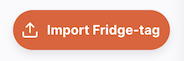
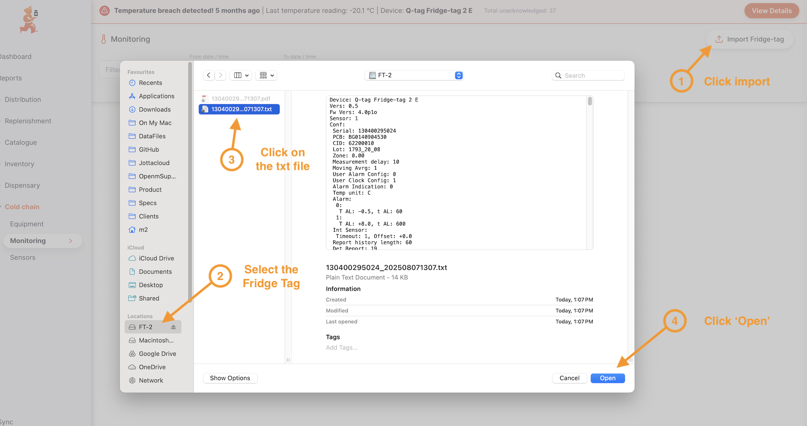
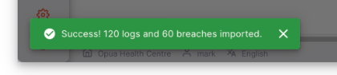
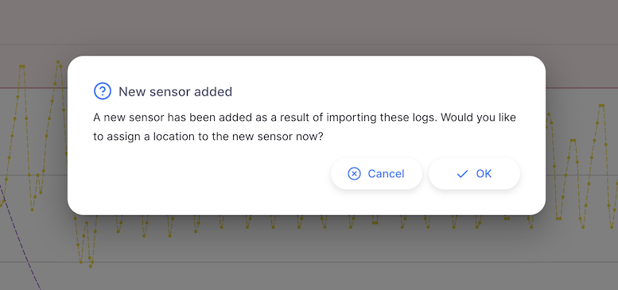
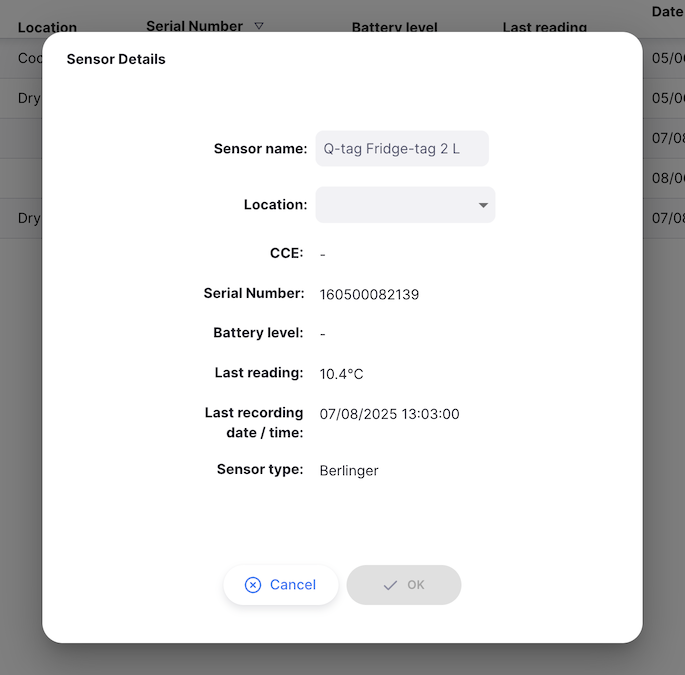
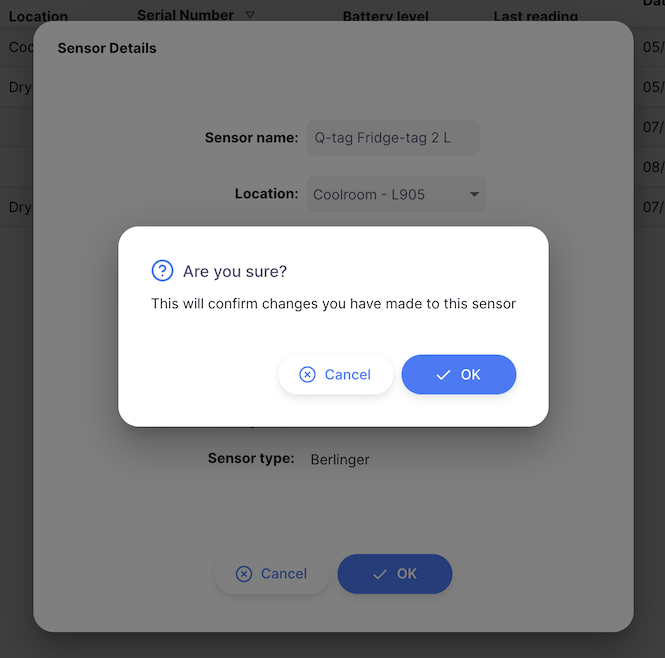

+++
title = "Capteurs"
description = "Gestion des capteurs de température"
date = 2023-11-08T15:20:00+00:00
updated = 2023-11-08T15:20:00+00:00
draft = false
weight = 3
sort_by = "weight"
template = "docs/page.html"

[extra]
toc = true
top = false
+++

### Connexion des capteurs

Open mSupply prend en charge plusieurs types de capteurs de température.

Les méthodes de connexion pour chacun sont décrites ci-dessous.

#### Capteurs de température mSupply

mSupply Foundation fabrique ses propres [capteurs de température mSupply](https://msupply.foundation/open-msupply/cold-chain/#mSupplySensor).

Ces capteurs peuvent être connectés à Open mSupply via l'intégration avec l'application [mSupply Cold Chain](/coldchain/introduction/).

Pour configurer l'intégration, vous devrez configurer un nouvel utilisateur mSupply.

L'utilisateur est un utilisateur mSupply standard, avec la configuration suivante :

- Le magasin par défaut assigné à l'utilisateur est le magasin auquel les données de température seront associées.
- Le magasin devra faire partie du site avec lequel Open mSupply se synchronise. Consultez la section [Paramètres](/docs/settings/synchronisation/#viewing-the-synchronisation-settings) pour voir avec quel site omSupply se synchronise, puis l'écran [Synchronisation](https://docs.msupply.org.nz/synchronisation:sync_sites#viewing_sync_sites) pour vérifier que votre site inclut le bon magasin.
- L'utilisateur doit avoir la permission Open Supply de `Accès API chaîne du froid` (voir ci-dessous)

À partir de là, suivez les étapes de la documentation de l'application mSupply Cold Chain pour [Intégration avec mSupply Desktop](/coldchain/desktop-integration/#msupply-desktop-setup-steps) en utilisant les nouvelles informations d'identification utilisateur mSupply créées ci-dessus à la place des informations d'identification du magasin.

#### Fridge-tags et Q-tags

Lors de l'importation de Fridge-tags sur une tablette, Android 12 ou ultérieur est requis

Si vous utilisez des Fridge-tags Berlinger, vous pouvez importer les données directement dans Open mSupply. Pour ce faire, insérez l'USB du Fridge-tag dans votre ordinateur.
Cliquez ensuite sur le bouton `Importer Fridge-tag` :

Cela ouvrira une fenêtre de navigation de fichiers, vous permettant de sélectionner le fichier `.txt` des données Fridge-tag. Cliquez simplement sur le fichier et attendez que l'importation se termine.

Voici comment se déroule le processus (il s'agit de la version de bureau mac) :

Vous devriez ensuite voir un message de succès en bas à gauche de l'écran :

Si le capteur n'a pas encore été ajouté à votre système, il vous sera demandé si vous souhaitez l'ajouter maintenant :

Depuis cette fenêtre, sélectionnez un emplacement pour le capteur, cliquez sur `OK`

et enfin, confirmez les modifications :

Vous pourriez devoir attendre que le fichier texte soit généré après avoir connecté le Fridge-tag à votre ordinateur.

##### Appareils Berlinger compatibles

Les appareils Berlinger suivants sont compatibles avec Open mSupply :

| Appareil                | Données de rupture affichées | Graphique de température tracé |
| :---------------------- | :--------------------------- | :----------------------------- |
| **Q-tag CLm doc**       | Oui                          | Oui                            |
| **Q-tag CLm doc D**     | Oui                          | Oui                            |
| **Q-tag CLm doc Ice**   | Oui                          | Oui                            |
| **Q-tag CLm doc Ice R** | Oui                          | Oui                            |
| **Q-tag CLm doc L**     | Oui                          | Oui                            |
| **Q-tag CLm doc LR**    | Oui                          | Oui                            |
| **Fridge-tag 2**        | Oui                          | Non\*                          |
| **Fridge-tag 2E**       | Oui                          | Non\*                          |
| **Fridge-tag 2L**       | Oui                          | Oui                            |
| **Fridge-tag UL**       | Oui                          | Oui                            |

\*L'appareil enregistreur ne capture pas les journaux de température individuels

### Visualisation des capteurs

Choisissez `Chaîne du froid` > `Capteurs` dans le panneau de navigation.

Une liste de capteurs vous sera présentée (si vous n'en voyez aucun, vous n'avez peut-être pas encore importé de données ou intégré l'application mSupply Cold Chain !).

Depuis cet écran, vous pouvez voir une liste de capteurs et modifier un capteur.

### Liste des capteurs

1. La liste des capteurs est divisée en 9 colonnes :

| Colonne                | Description                                                                                      |
| :--------------------- | :----------------------------------------------------------------------------------------------- |
| **Nom**                | Nom du capteur                                                                                   |
| **CCE**                | Numéro d'inventaire de l'équipement de chaîne du froid auquel le capteur est associé             |
| **Emplacement**        | `Emplacement` de stockage de stock actuel du capteur                                             |
| **Numéro de série**    | Un identifiant unique pour le capteur                                                            |
| **Niveau de batterie** | Lecture de batterie la plus récente, en pourcentage                                              |
| **Dernière lecture**   | La température la plus récente rapportée par le capteur                                          |
| **Date heure**         | Date et heure de la activité la plus récente pour ce capteur                                     |
| **Type de capteur**    | Le fabricant du capteur, les options actuellement prises en charge sont `mSupply` et `Berlinger` |
| **Type de rupture**    | Si le capteur a eu une rupture, cela montre le type de la rupture la plus récente                |

1. La liste peut afficher un nombre fixe de capteurs par page. Dans le coin inférieur gauche, vous pouvez voir combien de capteurs sont actuellement affichés sur votre écran.

2. Si vous avez plus de capteurs que la limite actuelle, vous pouvez naviguer vers les autres pages en appuyant sur le numéro de page ou en utilisant les flèches droite ou gauche (coin inférieur droit).

3. Vous pouvez également sélectionner un nombre différent de lignes à afficher par page en utilisant l'option en bas à droite de la page.

### Modification d'un capteur

Cliquer sur une ligne de la liste vous montrera les détails de ce capteur

Sur cet écran, vous pouvez

- Modifier le nom du capteur
- Lier le capteur à un `Emplacement` de stockage de stock

Les noms des capteurs de température mSupply doivent être modifiés dans l'application mSupply Cold Chain

Les autres détails du capteur, tels que le niveau de batterie et la dernière température enregistrée, sont également affichés sur cet écran.
