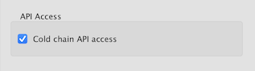
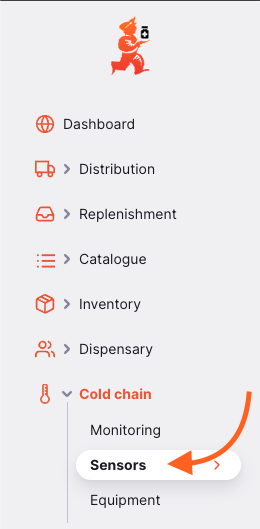
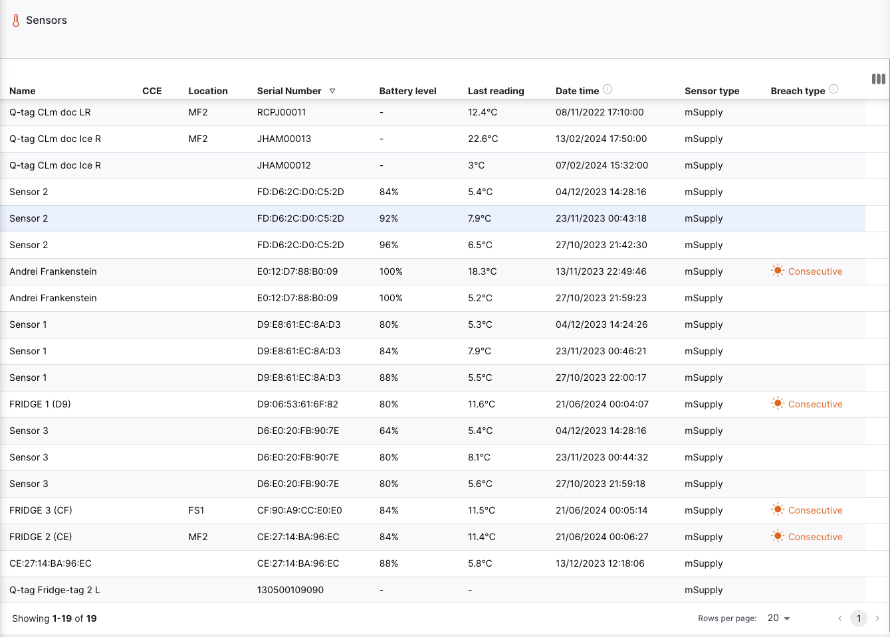
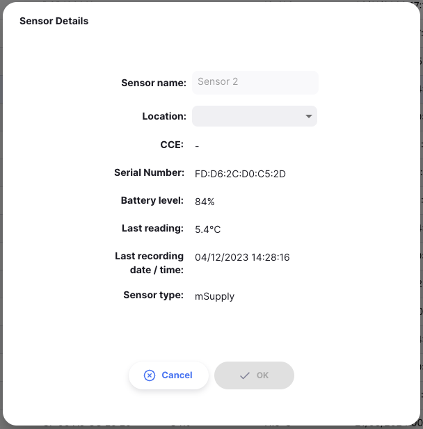

+++
title = "Sensors"
description = "Management of temperature sensors"
date = 2023-11-08T15:20:00+00:00
updated = 2023-11-08T15:20:00+00:00
draft = false
weight = 3
sort_by = "weight"
template = "docs/page.html"

[extra]
toc = true
top = false
+++

### Connecting Sensors

Open mSupply supports multiple types of temperature sensors.

The methods for connecting each are described below.

#### mSupply temperature sensors

mSupply Foundation manufacturers its own [mSupply temperature sensors](https://msupply.foundation/open-msupply/cold-chain/#mSupplySensor).

These sensors can be connected to Open mSupply via integration with the [mSupply Cold Chain](/coldchain/introduction/) application.

To configure the integration, you will need to configure a new mSupply user.

The user is a standard mSupply user, with the following configuration:

- The default store assigned to the user is the store with which the temperature data will be associated.
- The store will need to be part of the site that Open mSupply is synchronising with. Have a look at the [Settings](/docs/settings/synchronisation/#viewing-the-synchronisation-settings) section to see which site omSupply is syncing with, and then the [Synchronisation](https://docs.msupply.org.nz/synchronisation:sync_sites#viewing_sync_sites) screen to check that your site includes the correct store.
- The user must have the Open Supply permission of `Cold chain API access` (see below)

From here, follow the steps in the mSupply Cold Chain application documentation for [Integrating with mSupply Desktop](/coldchain/desktop-integration/#msupply-desktop-setup-steps) using the new mSupply user credentials created above in place of the store credentials.

#### Fridge-tags and Q-tags

If you are using Berlinger Fridge-tags, you can import the data directly into Open mSupply. To do this, insert the USB of the Fridge-tag into your computer.
Then click the `Import Fridge-tag` button:

This will open a file browsing window, allowing you to select the `.txt` file of the Fridge-tag data. Simply click on the file and wait for the import to complete.

Here's how the process looks (this is the mac desktop version):

You may need to wait for the text file to be generated after connecting the Fridge-tag to your computer.

##### Compatible Berlinger devices 

The following Berlinger devices are compatible with Open mSupply:

| Device                  | Breach data displayed | Temperature graph plotted |
| :---------------------- | :-------------------- | :------------------------ |
| **Q-tag CLm doc**       | Yes                   | Yes                       |
| **Q-tag CLm doc D**     | Yes                   | Yes                       |
| **Q-tag CLm doc Ice**   | Yes                   | Yes                       |
| **Q-tag CLm doc Ice R** | Yes                   | Yes                       |
| **Q-tag CLm doc L**     | Yes                   | Yes                       |
| **Q-tag CLm doc LR**    | Yes                   | Yes                       |
| **Fridge-tag 2**        | Yes                   | No\*                      |
| **Fridge-tag 2E**       | Yes                   | No\*                      |
| **Fridge-tag 2L**       | Yes                   | Yes                       |
| **Fridge-tag UL**       | Yes                   | Yes                       |

\*Logger device does not capture individual temperature logs

### Viewing Sensors

Choose `Cold chain` > `Sensors` in the navigation panel.

You will be presented with a list of Sensors (if you don't see any, you may not have imported data yet or integrated with the mSupply Cold Chain app!).

From this screen you can view a list of Sensors and edit a Sensor.

### Sensor list

1. The list of Sensors is divided into 9 columns:

| Column            | Description                                                                           |
| :---------------- | :------------------------------------------------------------------------------------ |
| **Name**          | Name of the Sensor                                                                    |
| **CCE**           | Asset number of the cold chain equipment item which the sensor is associated with     |
| **Location**      | Current stock storage `Location` of the sensor                                        |
| **Serial Number** | A unique identifier for the sensor                                                    |
| **Battery Level** | Most recent battery reading, in percentage                                            |
| **Last reading**  | The most recent temperature reported by the sensor                                    |
| **Date time**     | Date and time of the most recent activity for this sensor                             |
| **Sensor type**   | The manufacturer of the sensor, currently support options are `mSupply` & `Berlinger` |
| **Breach type**   | If the sensor has had a breach, this shows the type of the most recent breach         |

1. The list can display a fixed number of sensors per page. On the bottom left corner, you can see how many sensors are currently displayed on your screen.

2. If you have more sensors than the current limit, you can navigate to the other pages by tapping on the page number or using the right of left arrows (bottom right corner).

3. You can also select a different number of rows to show per page using the option at the bottom right of the page.

### Editing a sensor

Clicking on a row in the list will show you the details of that sensor

On this screen you can

- Edit the name of the sensor
- Link the sensor to a stock storage `Location`

The names of mSupply temperature sensors must be edited in the mSupply Cold Chain application

The other details of the sensor, such as battery level and last recorded temperature are also shown on this screen.
