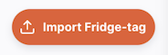
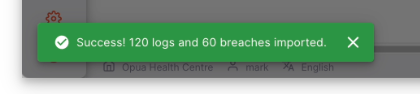
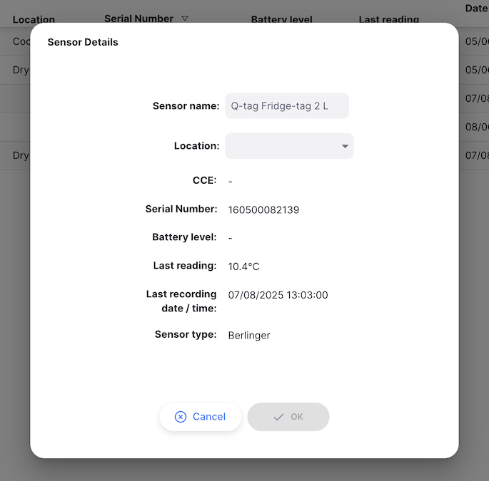
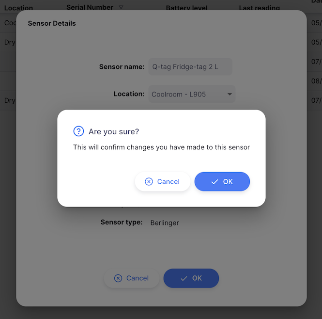
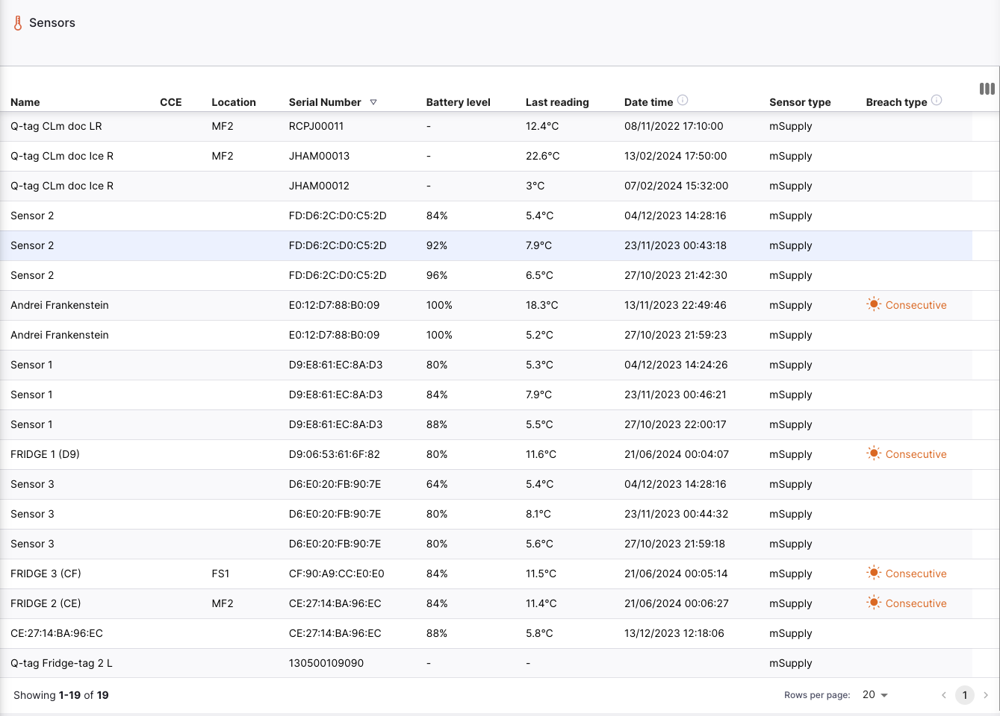
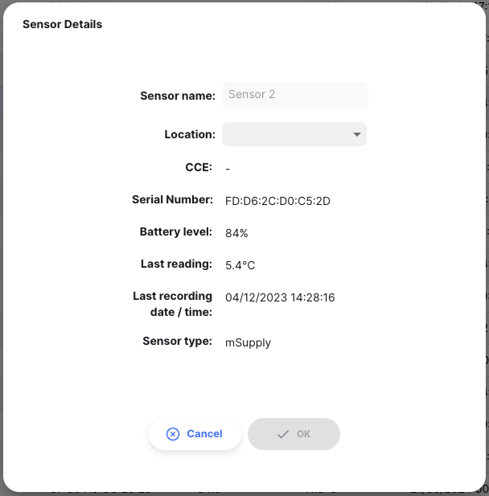

+++
title = "Sensores"
description = "Gestão de sensores de temperatura"
date = 2023-11-08T15:20:00+00:00
updated = 2023-11-08T15:20:00+00:00
draft = false
weight = 3
sort_by = "weight"
template = "docs/page.html"

[extra]
toc = true
top = false
+++

### Conectando sensores

O Open mSupply suporta múltiplos tipos de sensores de temperatura.

Os métodos para conectar cada um são descritos abaixo.

#### Sensores de temperatura mSupply

A mSupply Foundation fabrica seus próprios [sensores de temperatura mSupply](https://msupply.foundation/open-msupply/cold-chain/#mSupplySensor).

Estes sensores podem ser conectados ao Open mSupply através da integração com a aplicação [mSupply Cold Chain](/coldchain/introduction/).

Para configurar a integração, você precisará configurar um novo usuário mSupply.

O usuário é um usuário mSupply padrão, com a seguinte configuração:

- A loja padrão atribuída ao usuário é a loja com a qual os dados de temperatura serão associados.
- A loja precisará fazer parte do site com o qual o Open mSupply está sincronizando. Dê uma olhada na seção [Configurações](/docs/settings/synchronisation/#viewing-the-synchronisation-settings) para ver com qual site o omSupply está sincronizando, e então a tela [Sincronização](https://docs.msupply.org.nz/synchronisation:sync_sites#viewing_sync_sites) para verificar se seu site inclui a loja correta.
- O usuário deve ter a permissão Open Supply de `Acesso API cadeia de frio` (veja abaixo)

A partir daqui, siga os passos na documentação da aplicação mSupply Cold Chain para [Integração com mSupply Desktop](/coldchain/desktop-integration/#msupply-desktop-setup-steps) usando as novas credenciais de usuário mSupply criadas acima no lugar das credenciais da loja.

#### Fridge-tags e Q-tags

Ao importar Fridge-tags em um tablet, Android 12 ou posterior é necessário

Se você está usando Fridge-tags Berlinger, pode importar os dados diretamente para o Open mSupply. Para fazer isso, insira o USB do Fridge-tag no seu computador.
Em seguida, clique no botão `Importar Fridge-tag`:

Isso abrirá uma janela de navegação de arquivos, permitindo que você selecione o arquivo `.txt` dos dados do Fridge-tag. Simplesmente clique no arquivo e aguarde a importação ser concluída.

Veja como é o processo (esta é a versão desktop para mac):

Você deve então ver uma mensagem de sucesso no canto inferior esquerdo da tela:

Se o sensor ainda não foi adicionado ao seu sistema, será perguntado se você gostaria de adicioná-lo agora:

Desta janela, selecione um local para o sensor, clique em `OK`

e finalmente, confirme as alterações:

Você pode precisar aguardar que o arquivo de texto seja gerado após conectar o Fridge-tag ao seu computador.

##### Dispositivos Berlinger compatíveis

Os seguintes dispositivos Berlinger são compatíveis com o Open mSupply:

| Dispositivo             | Dados de violação exibidos | Gráfico de temperatura plotado |
| :---------------------- | :------------------------- | :----------------------------- |
| **Q-tag CLm doc**       | Sim                        | Sim                            |
| **Q-tag CLm doc D**     | Sim                        | Sim                            |
| **Q-tag CLm doc Ice**   | Sim                        | Sim                            |
| **Q-tag CLm doc Ice R** | Sim                        | Sim                            |
| **Q-tag CLm doc L**     | Sim                        | Sim                            |
| **Q-tag CLm doc LR**    | Sim                        | Sim                            |
| **Fridge-tag 2**        | Sim                        | Não\*                          |
| **Fridge-tag 2E**       | Sim                        | Não\*                          |
| **Fridge-tag 2L**       | Sim                        | Sim                            |
| **Fridge-tag UL**       | Sim                        | Sim                            |

\*O dispositivo registrador não captura registros de temperatura individuais

### Visualizando sensores

Escolha `Cadeia de frio` > `Sensores` no painel de navegação.

Será apresentada uma lista de sensores (se você não vir nenhum, pode ser que ainda não tenha importado dados ou integrado com a aplicação mSupply Cold Chain!).

Desta tela você pode ver uma lista de sensores e editar um sensor.

### Lista de sensores

1. A lista de sensores está dividida em 9 colunas:

| Coluna               | Descrição                                                                           |
| :------------------- | :---------------------------------------------------------------------------------- |
| **Nome**             | Nome do sensor                                                                      |
| **CCE**              | Número do ativo do equipamento de cadeia de frio com o qual o sensor está associado |
| **Localização**      | `Localização` de armazenamento de estoque atual do sensor                           |
| **Número de série**  | Um identificador único para o sensor                                                |
| **Nível da bateria** | Leitura mais recente da bateria, em porcentagem                                     |
| **Última leitura**   | A temperatura mais recente reportada pelo sensor                                    |
| **Data hora**        | Data e hora da atividade mais recente para este sensor                              |
| **Tipo de sensor**   | O fabricante do sensor, as opções atualmente suportadas são `mSupply` e `Berlinger` |
| **Tipo de violação** | Se o sensor teve uma violação, isso mostra o tipo da violação mais recente          |

1. A lista pode exibir um número fixo de sensores por página. No canto inferior esquerdo, você pode ver quantos sensores estão atualmente exibidos na sua tela.

2. Se você tem mais sensores que o limite atual, pode navegar para as outras páginas tocando no número da página ou usando as setas esquerda ou direita (canto inferior direito).

3. Você também pode selecionar um número diferente de linhas para mostrar por página usando a opção na parte inferior direita da página.

### Editando um sensor

Clicar em uma linha da lista mostrará os detalhes daquele sensor

Nesta tela você pode

- Editar o nome do sensor
- Vincular o sensor a uma `Localização` de armazenamento de estoque

Os nomes dos sensores de temperatura mSupply devem ser editados na aplicação mSupply Cold Chain

Os outros detalhes do sensor, como nível da bateria e última temperatura registrada, também são mostrados nesta tela.
