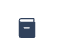
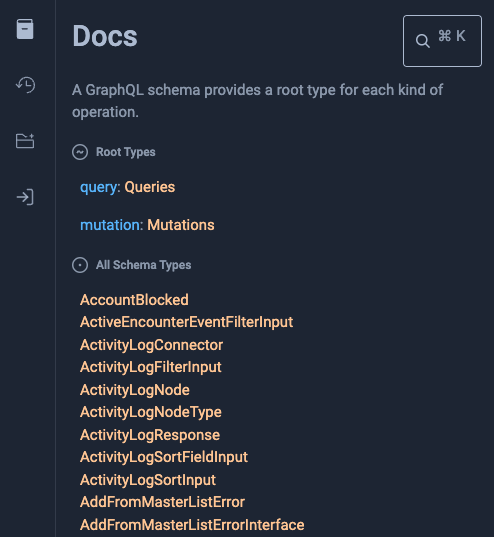
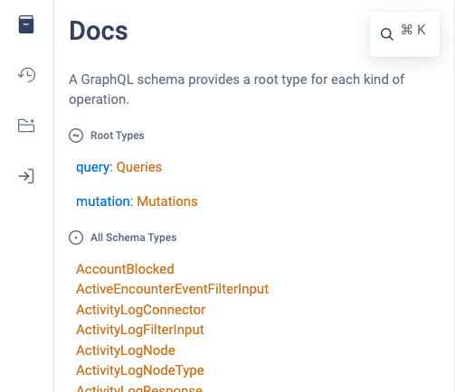
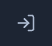
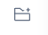

+++
title = "API GraphQL"
description = " Integración con Open mSupply utilizando la API GraphQL"
date = 2024-06-27T18:20:00+00:00
updated = 2024-06-27T18:20:00+00:00
draft = false
weight = 7
sort_by = "weight"
template = "docs/page.html"

[extra]
toc = true
+++

## GraphQL

Internamente, utilizamos [GraphQL](https://graphql.org/) como la capa de la API. Esto proporciona gran flexibilidad y permite a un desarrollador crear consultas específicas sin necesidad de modificar el código base del producto.

Para obtener detalles sobre GraphQL en sí, consulta el enlace anterior.

## Documentación

Nuestra API está documentada internamente. Puedes acceder a tu ambiente local del servidor con la URL `/graphql` para ver e interactuar con la API. Alternativamente, el [servidor de demostración](https://demo-open.msupply.org/graphql) está disponible para explorar si no tienes una instancia local.

Para abrir el panel de documentación, haz clic en el botón 'docs':

    
    

Esto abrirá el panel, permitiéndote explorar más a fondo los puntos finales y estructuras disponibles:

    
    

Usar el ambiente local utilizará una versión empaquetada del entorno GraphiQL. Puedes usar herramientas alternativas, como el [explorador graphiql en línea](https://graphiql-online.com/) ingresando la URL del servidor.

## Empezando

La API requiere que estés conectado. Este proceso ha sido simplificado para ti en el entorno de prueba. Puedes hacer clic en el botón de inicio de sesión:

    
    

para mostrar el formulario de inicio de sesión:

    
    

Una vez que hayas ingresado los detalles y iniciado sesión, podrás utilizar otros métodos de la API, limitados por los permisos del usuario con el que iniciaste sesión.

Para ayudarte, las consultas pueden ser creadas utilizando la función explorer. Haz clic en el botón del explorador para comenzar:

    
    

Desde aquí, puedes agregar consultas y mutaciones e ingresar valores para crear y ejecutar en el servidor. ¡Pruébalo y empieza a explorar!
