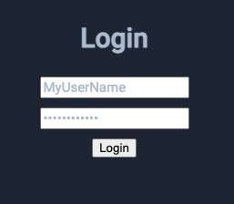

+++
title = "GraphQL API"
description = "Integrating with Open mSupply using the GraphQL API"
date = 2024-06-27T18:20:00+00:00
updated = 2024-06-27T18:20:00+00:00
draft = false
weight = 7
sort_by = "weight"
template = "docs/page.html"

[extra]
toc = true
+++

## GraphQL

Internally we are making use of [GraphQL](https://graphql.org/) as the API layer. This provides for great flexibility and allows a developer to craft specific queries without requiring development of the core product.

For details about GraphQL itself, see the link above.

## Documentation

Our API is internally documented. You can browse to your local server instance with the URL `/graphql` to view and interact with the API. Alternatively, the [demo server](https://demo-open.msupply.org/graphql) is available to explore if you do not have a local instance.

To open the documentation panel, click the 'docs' button:

    
    

This will open the panel, allowing you to explore further the available endpoints and structures:

    
    

Using the local instance will use a bundled version of the GraphiQL playground. You can use alternative tools, such as the [online graphiql explorer](https://graphiql-online.com/) by entering in the server URL.

## Getting started

The API will require you to be logged in. This process has been simplified for you, in the test environment. You can click the login button:

    
    

to show the login form:

    
    

Once you've entered details and logged in, you are able to use other API methods - limited by the permissions of the user which you've logged in as.

To help you, queries can be created using the _explorer_ function. Click the explorer button get started:

    
    

From here, you can add queries and mutations and enter values to create and execute on the server. Try it out and start exploring!
