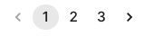

+++
title = "Clinicians"
description = "View and Manage CLinicians."
date = 2022-03-19
updated = 2024-10-03T17:40:00+00:00
draft = false
weight = 2
sort_by = "weight"
template = "docs/page.html"

[extra]
toc = true
top = false
+++

The list of all available clinicians can be viewed on this page.

## Viewing Clinicians

To use clinicians, ensure that your store is set to `Dispensary` mode (see the [virtual stores](https://docs.msupply.org.nz/other_stuff:virtual_stores#store_type) documentation for how to do this).

### Open the Clinicians Menu

Click on `Dispensary` > `Clinicians` in the navigation panel.

You will be presented with a list of clinicians visible to your store.

### Clinicians List

1. The list of clinicians is divided into 8 columns:

| Column         | Description                  |
| :------------- | :--------------------------- |
| **Code**       | The ID of the clinician      |
| **First name** | First name                   |
| **Last name**  | Last name                    |
| **Initials**   | The clinicians initials      |
| **Mobile**     | The clinicians mobile number |
| **Gender**     | Gender                       |

2. The list can display a fixed number of clinicians per page. On the bottom left corner, you can see how many clinicians are currently displayed on your screen.

3. If you have more clinicians than the current limit, you can navigate to the other pages by tapping on the page number or using the right of left arrows (bottom right corner).

4. You can also select a different number of rows to show per page using the option at the bottom right of the page.

## Creating Clinicians

You will need the permission [Can Add Clinicians](/docs/settings/permissions/) to be able to add a new clinician.

Currently clinicians can be created from a prescription - either while creating a <a href="/docs/dispensary/prescriptions/#creating-a-prescription">New Prescription</a> or editing an <a href="/docs/dispensary/prescriptions/#changing-the-clinician">existing one.</a>

Search for the code or name of the clinician and select the `Create Clinician` button in the dropdown.

Support for Editing clinicians will be available in future versions of Open mSupply

