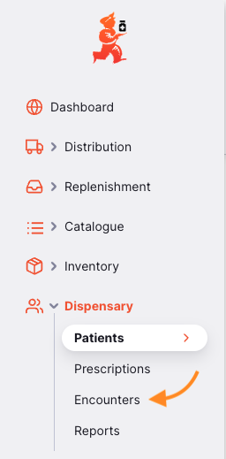

+++
title = "Encounters"
description = "Manage encounters (visits) with patients"
date = 2024-09-30T18:20:00+00:00
updated = 2024-09-30T18:20:00+00:00
draft = false
weight = 3
sort_by = "weight"
template = "docs/page.html"

[extra]
toc = true
top = false
+++

Encounters are the visits that patients make to your dispensary, under a specific Patient Program.

You will only see this tab under the `Dispensary` menu if you have Patient Programs configured.

Learn more about Encounters in the [Patient Programs](/docs/programs/program-module/#encounter) documentation.
