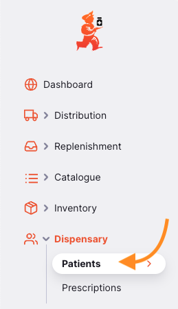
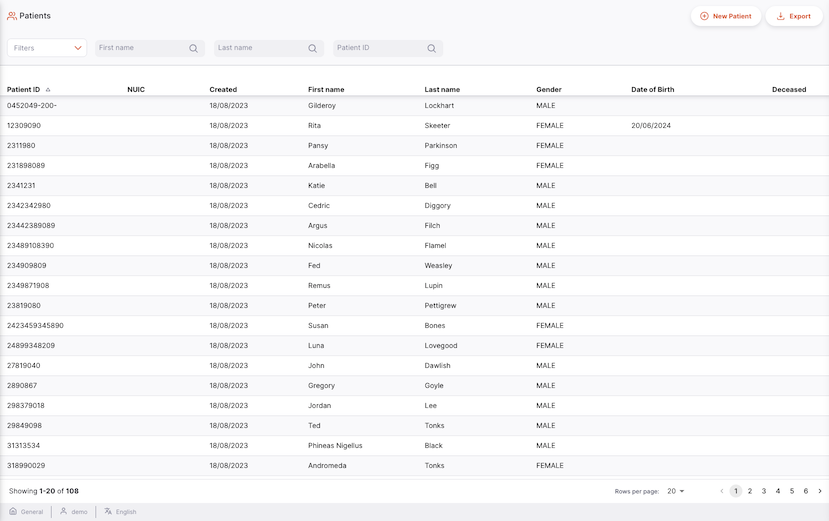
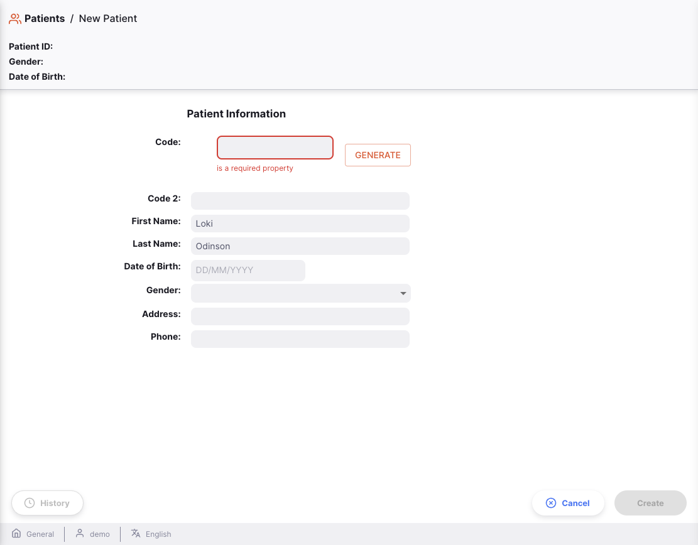

+++
title = "Pacientes"
description = "Introducción a la sección de Pacientes"
date = 2023-01-27T00:00:00+00:00
updated = 2023-01-27T00:00:00+00:00
draft = false
weight = 1
sort_by = "weight"
template = "docs/page.html"

[extra]
lead = "Ver y gestionar los Pacientes"
toc = true
top = false
+++

Desde esta página los pacientes pueden ser agregados y editar su nformación

### Pacientes

Para utilizar pacientes, asegúrate de que tu almacén esté configurado en el modo `Dispensario` (consulta la documentación de [almacenes virtuales](https://docs.msupply.org.nz/other_stuff:virtual_stores#store_type) para saber como hacerlo).

### Abrir el Menú de Pacientes

Haz clic en `Dispensario` > `Pacientes` en el panel de navegación.

Se mostrará una lista de pacientes visibles para tu almacén.

### Lista de Pacientes

1. La lista de pacientes está dividida en 8 columnas:

| Columna                 | Descripción                                |
| :---------------------- | :----------------------------------------- |
| **ID del Pacientes**    | El documento de identificación del cliente |
| **NUIC**                | Código único de identificación nacional    |
| **Creado**              | Fecha de creación del paciente             |
| **Nombre**              | Nombre                                     |
| **Apellido**            | Apellido                                   |
| **Género**              | Género                                     |
| **Fecha de NAcimiento** | Fecha de nacimiento del paciente           |
| **Fallecido**           | Indica si el paciente está fallecido       |

2. La lista puede mostrar un número fijo de pacientes por página. En la esquina inferior izquierda, puedes ver cuántos pacientes se están mostrando actualmente en tu pantalla.

3. Si tienes más pacientes que el límite actual, puedes navegar a las otras páginas tocando el número de página o usando las flechas derecha o izquierda (esquina inferior derecha).

4. También puedes seleccionar una cantidad diferente de filas para mostrar por página utilizando la opción en la esquina inferior derecha de la página.

### Filtrar pacientes

Puedes filtrar la lista de pacientes utilizando la barra de búsqueda en la parte superior de la página. Esto puede ser útil si estás buscando a un paciente específico. Por defecto, la barra de búsqueda incluirá los filtros para: Nombre, Apellido e ID del Paciente.

Por ejemplo, para filtrar por género, haz clic en `Filtros`, selecciona `Género`, y luego elige el género por el que deseas filtrar.

### Exportar pacientes

La lista de pacientes puede exportarse a un archivo separado por comas (CSV). Simplemente haz clic en el botón de exportar (ubicado en la parte superior derecha de la página). El archivo se descargará automáticamente. La función de exportación descargará todos los pacientes, no solo los de la página actual, en caso de que tengas más de 20.

### Crear un nuevo paciente

Haz clic en el botón `Nuevo Paciente` en la esquina superior derecha.

Se abrirá una ventana para ingresar los datos del paciente. Debes completar el código, el nombre y el apellido del paciente para habilitar el botón `Ok & siguiente`. Si no deseas ingresar el nombre real del paciente, puedes usar un seudónimo.

Si ya existe un paciente o pacientes con un nombre coincidente, aparecerá una ventana para seleccionarlo.

Al hacer clic en el paciente coincidente, serás redirigido a la página de detalles de ese paciente.

Sin embargo, si no hay pacientes coincidentes o deseas crear un nuevo paciente con los mismos detalles que uno existente, puedes hacer clic en el botón `Ok & Siguiente` para ser redirigido a la página de detalles del paciente y crear el nuevo registro.

Luego, haz clic en el botón `Crear` en la parte inferior derecha de la página para finalizar la creación del paciente.

### Buscar un Paciente

Si seguiste el proceso anterior, podrías ver un ícono diferente a la derecha de los detalles del paciente en la pantalla de resultados de búsqueda:

A veces, el registro del paciente que estás buscando ya ha sido creado en otro sitio. Este ícono de "descarga" indica que hay un paciente que coincide con tus criterios de búsqueda actuales, y puedes descargar todos sus datos existentes de paciente a tu sitio.

Para usar este registro de paciente, primero debes obtener los detalles del paciente. Haz clic en la fila del paciente (la cual tiene un mensaje emergente como se muestra a continuación):

Luego, se te pedirá confirmar la acción:

Si la operación es exitosa, recibirás un mensaje adicional:

Haciendo clic en el botón `Ver Paciente` te llevará a la pantalla que muestra los detalles del paciente. El paciente ya está disponible para ser prescrito, inscrito en un programa y para crear encuentros. Puedes actualizar los detalles del paciente y sincronizarlos de vuelta al sitio que originalmente creó el registro del paciente.

### Editar un paciente

Para editar un paciente, haz clic en su nombre en la lista de pacientes.

Si hay más datos en la vista de tu paciente, es probable que se deba a que los Programas de Pacientes están configurados. Puedes obtener más información en la documentación de [Programas de Pacientes](/docs/programs/program-module).
