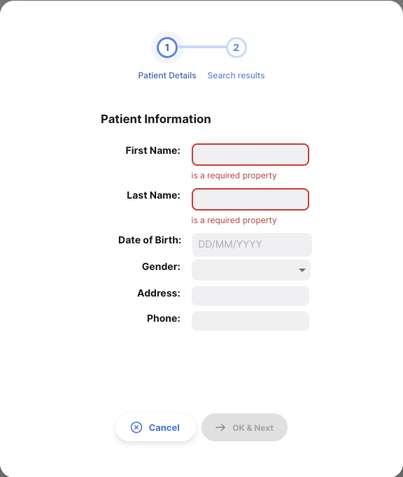
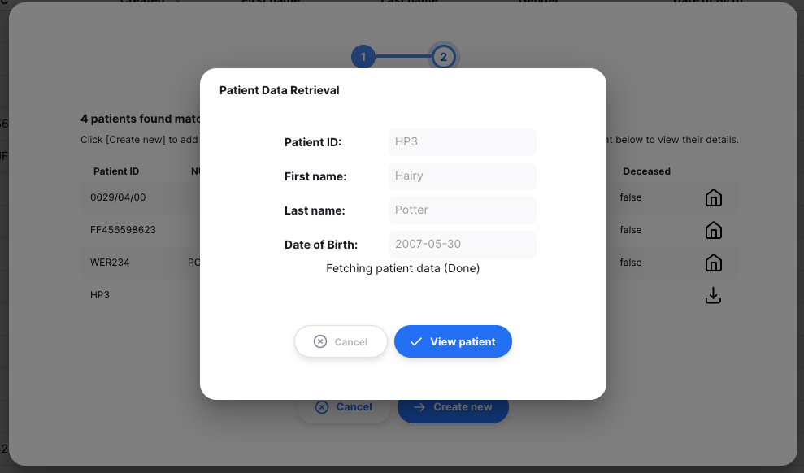

+++
title = "Patients"
description = "Introduction aux Patients"
date = 2023-01-27T00:00:00+00:00
updated = 2023-01-27T00:00:00+00:00
draft = false
weight = 1
sort_by = "weight"
template = "docs/page.html"

[extra]
lead = "Voir et gérer les patients"
toc = true
top = false
+++

Les patients peuvent être ajoutés et leurs informations modifiées depuis cette page.

### Patients

Pour utiliser les patients, assurez-vous que votre magasin est en mode `Dispensaire` (voir la documentation [magasins virtuels](https://docs.msupply.org.nz/other_stuff:virtual_stores#store_type) pour savoir comment faire).

### Ouvrir le menu Patient

Cliquez sur `Dispensaire` > `Patients` dans le panneau de navigation.

Une liste de patients visibles pour votre magasin s'affichera.

### Liste des Patients

1. La liste des patients est divisée en 8 colonnes :

| Colonne               | Description                           |
| :-------------------- | :------------------------------------ |
| **ID Patient**        | L'identifiant du patient              |
| **NUIC**              | Code d'identification unique national |
| **Créé**              | Date de création du patient           |
| **Prénom**            | Prénom                                |
| **Nom**               | Nom                                   |
| **Sexe**              | Sexe                                  |
| **Date de naissance** | Date de naissance du patient          |
| **Décédé**            | Si le patient est décédé              |

2. La liste peut afficher un nombre fixe de patients par page. En bas à gauche, vous pouvez voir combien de patients sont actuellement affichés à l'écran.

3. Si vous avez plus de patients que la limite actuelle, vous pouvez naviguer vers les autres pages en appuyant sur le numéro de page ou en utilisant les flèches droite ou gauche (en bas à droite).

4. Vous pouvez également sélectionner un nombre différent de lignes à afficher par page en utilisant l'option en bas à droite de la page.

### Filtrer les Patients

Vous pouvez filtrer la liste des patients en utilisant la barre de recherche en haut de la page. Cela peut être utile si vous recherchez un patient spécifique. Par défaut, la barre de recherche contient les filtres pour : Prénom, Nom et ID Patient.

Par exemple, pour filtrer par sexe, cliquez sur `Filtres`, sélectionnez `Sexe`, puis choisissez le sexe que vous souhaitez filtrer.

### Exporter les Patients

La liste des patients peut être exportée dans un fichier séparé par des virgules (csv). Cliquez simplement sur le bouton d'exportation (à droite, en haut de la page), et le fichier sera téléchargé. La fonction d'exportation téléchargera tous les patients, pas seulement la page actuelle.

### Créer un nouveau patient

Cliquez sur le bouton `Nouveau patient` en haut à droite.

Une nouvelle fenêtre apparaîtra pour saisir les détails du patient. Vous devez entrer le prénom et le nom du patient pour activer le bouton `Rechercher`. Si vous ne souhaitez pas entrer le vrai nom du patient, vous pouvez utiliser un pseudonyme.

Si un ou plusieurs patients correspondent au nom que vous avez saisi, vous serez invité à sélectionner le patient dans la nouvelle fenêtre.

En cliquant sur le patient correspondant, vous serez redirigé vers la page de détails du patient.

Si aucun patient correspondant n'est trouvé, ou si vous souhaitez créer un nouveau patient en utilisant des détails similaires à un patient existant, cliquez sur le bouton `Créer un nouveau patient` pour continuer vers la page de détails du patient et compléter la configuration.
Ensuite, cliquez sur le bouton `Enregistrer` en bas de la page pour créer le patient.

### Rechercher un patient

Si vous avez suivi le processus ci-dessus, vous pouvez voir une icône différente à droite des détails d'un patient sur l'écran des résultats de recherche de patients :

Parfois, le dossier du patient que vous recherchez a déjà été créé sur un autre site. Cette icône de 'téléchargement' indique qu'un patient correspond à vos critères de recherche actuels, et vous pouvez télécharger toutes ses données existantes sur votre site.

Pour utiliser ce dossier patient, vous devez d'abord récupérer les détails du patient. Cliquez sur la ligne du patient (qui affiche un message d'info-bulle comme ci-dessous) :

Vous serez alors invité à confirmer l'action :

et si cela réussit, vous recevrez un autre message :

En cliquant sur le bouton `Voir le patient` ici, vous accéderez à l'écran qui affiche les détails du patient. Le patient est maintenant disponible pour la prescription, l'inscription à un programme et la création de rencontres. Vous pouvez mettre à jour les détails du patient et les synchroniser avec le magasin qui a créé le dossier patient.

### Modifier un patient

Pour modifier un patient, cliquez sur le nom du patient dans la liste des patients.

S'il y a plus de données dans votre vue Patient, c'est probablement parce que les Programmes Patient sont configurés. Vous pouvez en savoir plus dans la documentation [Programmes Patient](/docs/programs/program-module).

## Assurance

Des polices d'assurance peuvent être ajoutées à un patient. Vous pouvez modifier les informations d'assurance et les utiliser pour les paiements.

L'onglet Assurance n'est disponible que si vous avez configuré <a href="https://docs.msupply.org.nz/dispensing:patient_insurance#insurance_providers">les fournisseurs d'assurance dans mSupply</a>

### Liste des Assurances

Sélectionnez un patient et cliquez sur l'onglet `Assurance`. Ici, vous pouvez voir la liste des polices d'assurance disponibles pour un patient.

### Ajouter une assurance à un patient

1. Cliquez sur le bouton `Ajouter une assurance` en haut à droite.

   

2. Une nouvelle fenêtre apparaîtra pour saisir les détails de l'assurance du patient. Remplissez tous les champs du formulaire pour activer le bouton d'enregistrement.

   

Les polices seront considérées comme expirées à partir du début du jour spécifié dans le champ <b>Date d'expiration</b>

3. Après avoir rempli le formulaire, cliquez sur le bouton `Enregistrer`. Votre nouvelle assurance apparaîtra dans la liste, et un message de confirmation s'affichera.

   

4. Si vous oubliez de remplir une section du formulaire, le système vous alertera et les détails ne seront pas enregistrés.

   

### Modifier les informations d'assurance

1. Pour modifier une assurance existante, assurez-vous d'être sur l'onglet assurance d'un patient. Cliquez sur l'une des assurances disponibles.

   

2. Une fenêtre familière apparaîtra, vous permettant de modifier les détails de l'assurance du patient.

   

3. Mettez à jour les informations d'assurance selon vos besoins.

   

4. Une fois les mises à jour terminées, cliquez sur le bouton `Enregistrer`. Si la modification est réussie, un message de confirmation s'affichera et vos changements seront immédiatement pris en compte.
