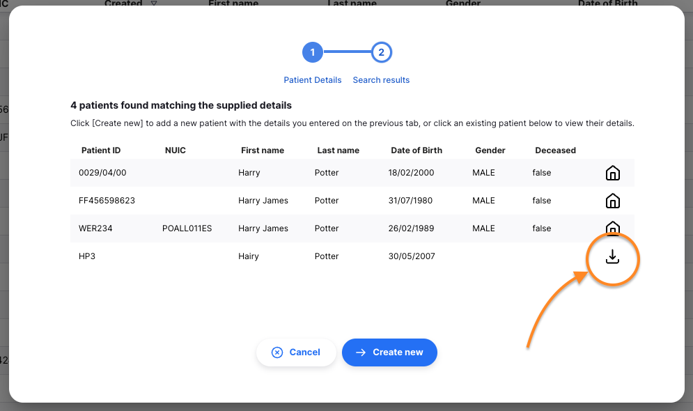
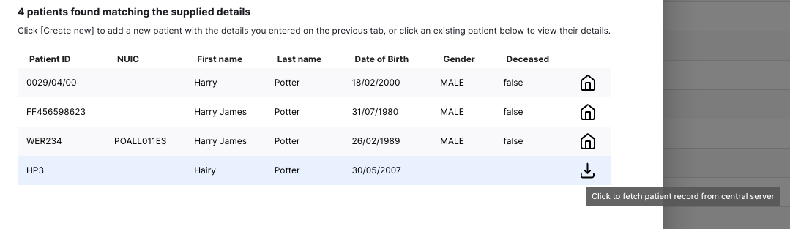
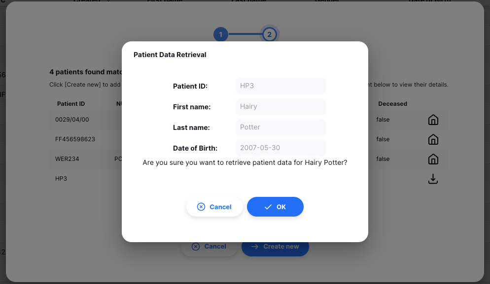
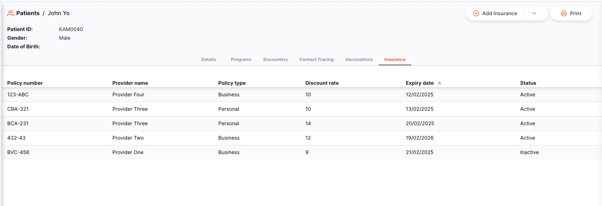
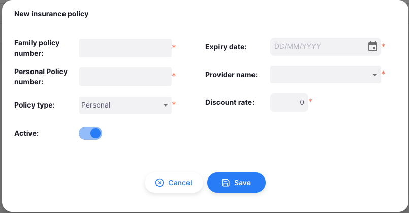
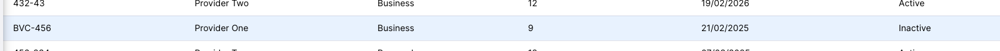
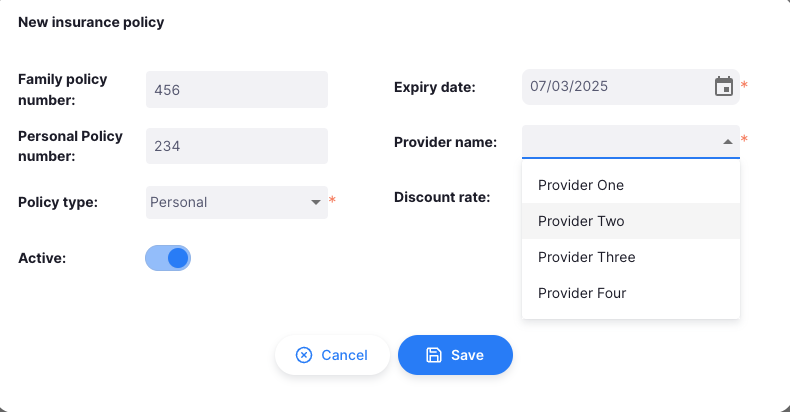

+++
title = "Patients"
description = "Introduction to the Patients"
date = 2023-01-27T00:00:00+00:00
updated = 2023-01-27T00:00:00+00:00
draft = false
weight = 1
sort_by = "weight"
template = "docs/page.html"

[extra]
lead = "View and Manage Patients"
toc = true
top = false
+++

Patients can be added and their information edited from this page.

### Patients

To use patients, ensure that your store is set to `Dispensary` mode (see the [virtual stores](https://docs.msupply.org.nz/other_stuff:virtual_stores#store_type) documentation for how to do this).

### Open the Patient Menu

Click on `Dispensary` > `Patients` in the navigation panel.

You will be presented with a list of patients visible to your store.

### Patient List

1. The list of patients is divided into 8 columns:

| Column            | Description                      |
| :---------------- | :------------------------------- |
| **Patient ID**    | The ID of the patient            |
| **NUIC**          | National unique identifier code  |
| **Created**       | The date the patient was created |
| **First name**    | First name                       |
| **Last name**     | Last name                        |
| **Gender**        | Gender                           |
| **Date of Birth** | The patient's date of birth      |
| **Deceased**      | Whether the patient is deceased  |

2. The list can display a fixed number of patients per page. On the bottom left corner, you can see how many patients are currently displayed on your screen.

3. If you have more patients than the current limit, you can navigate to the other pages by tapping on the page number or using the right of left arrows (bottom right corner).

4. You can also select a different number of rows to show per page using the option at the bottom right of the page.

### Filter Patients

You can filter the list of patients by using the search bar at the top of the page. This can be useful if you are looking for a specific patient. By default, the search bar will contain the filters for: First name, Last name, and Patient ID.

For example, to filter by gender, click on the `Filters`, select `Gender`, and then select which gender you would like to filter by.

### Exporting Patients

The list of Patients can be exported to a comma separated file (csv). Simply click the export button (on the right, at the top of the page), and the file will be downloaded. The export function will download all Patients, not just the current page.

### Creating a New Patient

Press on the `New Patient` button in the top right corner.

A new window will appear for you to enter the patient's details. You must enter the patient's code, first name and last name to enable to `Ok & Next` button. If you do not wish to enter the patient's real name, you can use a pseudonym.

If you have a patient or patients matching the name you have entered, you will be prompted to select the patient in the new window.

Clicking on the matching patient will re-direct you to the patient's details page.

However, if you have no matching patients or if you wish to create a new patient with the same details as an existing patient, you can click the `Ok & Next` button to be re-directed to the patient's details page where you can create the patient.

Then click the `Create` button at the bottom right of the page to create the patient.

### Lookup a Patient

If you have followed the process above, you may see a different icon to the right of a patient's details on the patient search results screen:

Sometimes the record for the patient you are searching for has already been created at another site. This 'download' icon indicates that a patient matches your current search criteria, and you can download all their existing patient data to your site.

To use this patient record, you must first fetch the patient details. Click the patient row (which has a tooltip message as shown below):

You'll then be prompted to confirm the action:

and if successful, you'll then get a further message:

Clicking the `View patient` button here will take you to the screen which displays the patient details. The patient is now available for prescribing to, enrolling in a program and for creating encounters. You can update the patient details and have them synchronise back to the store which originally created the patient record.

### Edit a Patient

To edit a patient, click on the patient's name in the list of patients.

If there is more data in your Patient view, it's likely due to Patient Programs being configured. You can find out more in the [Patient Programs](/docs/programs/program-module) documentation.

## Insurance

Insurance policies can be added to a patient. You can edit the insurance information and use it for payments.

The Insurance tab is only available if you've setup <a href="https://docs.msupply.org.nz/dispensing:patient_insurance#insurance_providers">Insurance Providers in mSupply</a>

### Insurance List

Select any patient and click on the `Insurance` tab. Here you can see the list of insurance policies available to a patient.

### Adding Insurance to a Patient

1. Click the `Add Insurance` button in the top right corner.

   

2. A new window will appear for you to enter the insurance details for a patient. Fill out all the fields in the form to enable the save button.

   

3. After filling out the form, click the `Save` button. Your newly created insurance will show in the list, and a confirmation message will appear.

   

4. If you forget to fill out a section of the form, the system will alert you and the details won't be saved.

   

### Editing Insurance Information

1. To edit an existing insurance, ensure that you are on the insurance tab of a patient. Click on one of the available insurances.

   

2. A familiar window will appear, allowing you to edit the insurance details of a patient.

   

3. Update the insurance information as needed.

   

4. Once done with the updates, click the `Save` button. When successful, a confirmation message will appear, and your changes will be reflected immediately.

   
