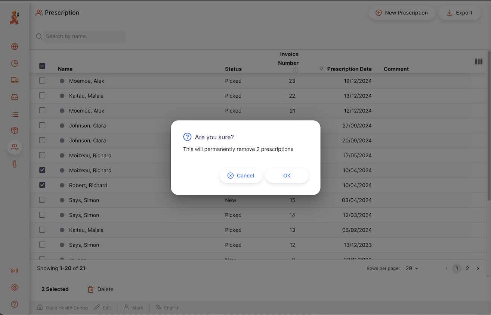
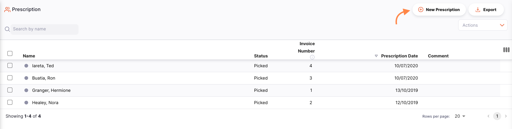
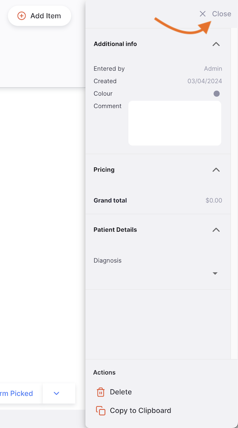
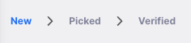
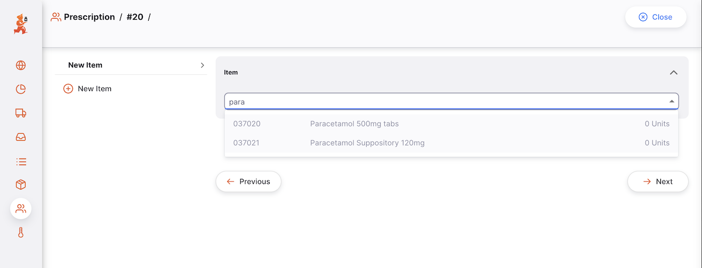
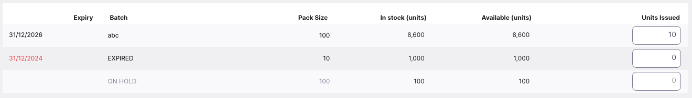
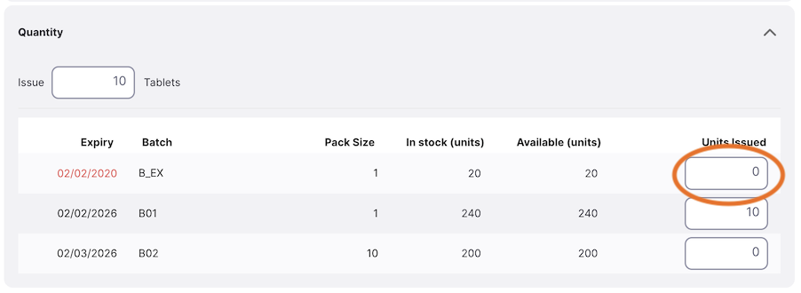
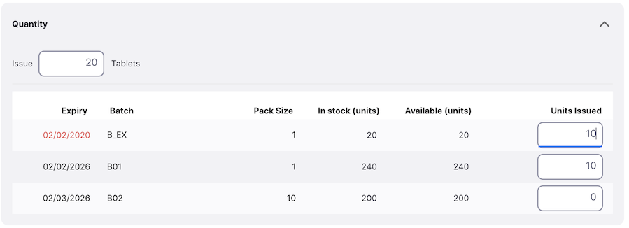

+++
title = "Prescripciones"
description = "Prescribir medicamentos a los pacientes."
date = 2022-03-19T18:20:00+00:00
updated = 2022-03-19T18:20:00+00:00
draft = false
weight = 2
sort_by = "weight"
template = "docs/page.html"

[extra]
toc = true
top = false
+++

Las prescripciones se pueden usar para prescribir medicamentos a los pacientes.

Una prescripción puede ser utilizada para:

- Entregar medicamentos a un paciente

## Ver Prescripciones

Para usar las prescripciones, asegúrate de que tu almacén esté configurado en modo `Dispensario` (consulta la documentación sobre [almacenes virtuales](images/https://docs.msupply.org.nz/other_stuff:virtual_stores#store_type) para saber cómo hacerlo).

### Abrir el menú de prescripciones

Selecciona `Dispensario` > `Prescripción` en el panel de navegación.

Se mostrará una lista de prescripciones (si no ves ninguna, probablemente estés comenzando).

Desde esta pantalla puedes:

- Ver una lista de prescripciones
- Crear una nueva Prescripción
- Exportar prescripciones a un archivo `.csv`

### Lista de Prescripciones

1. La lista de prescripciones se divide en 5 columnas:

| Columna        | Descripción                             |
| :------------- | :-------------------------------------- |
| **Nombre**     | Nombre del paciente                     |
| **Estado**     | Estado actual de la prescripción        |
| **Número**     | Número de referencia de la prescripción |
| **Creada**     | Fecha de creación de la prescripción    |
| **Comentario** | Comentario sobre la prescripción        |

2. La lista puede mostrar un número fijo de prescripciones por página. En la esquina inferior izquierda, puedes ver cuántas prescripciones se están mostrando actualmente en tu pantalla.

3. Si tienes más prescripciones que el límite actual, puedes navegar a las otras páginas tocando el número de página o usando las flechas izquierda o derecha (esquina inferior derecha).

4. También puedes seleccionar un número diferente de filas para mostrar por página utilizando la opción en la esquina inferior derecha de la página.

### Buscar por nombre del paciente

Puedes filtrar la lista de prescripciones por el nombre del paciente. Esto puede ser útil si estás buscando una prescripción en particular.

Escribe el nombre de un paciente en el campo `Buscar por nombre` (a la izquierda, justo encima de los encabezados de la lista). Todas las prescripciones para este paciente aparecerán en la lista.

### Exportar Prescripciones

La lista de prescripciones se puede exportar a un archivo separado por comas (CSV). Simplemente haz clic en el botón de Exportar (a la derecha, en la parte superior de la página).

y el archivo se descargará. La función de exportar descargará todas las prescripciones, no solo la página actual, si tienes más de 20. Las prescripciones se exportan utilizando el orden de clasificación seleccionado en la tabla, aunque, por supuesto, puedes ordenar fácilmente la lista en Excel o cualquier programa con el que abras el archivo CSV.

### Eliminar una Prescripción

Puedes eliminar una prescripción de la lista de prescripciones.

1. Selecciona la prescripción que deseas eliminar marcando la casilla en el extremo izquierdo de la lista. Puedes seleccionar más de una prescripción para eliminar. Incluso puedes seleccionarlas todas usando la casilla maestra en los encabezados de la lista.

2. Abre el menú desplegable `Seleccionar` (esquina superior derecha, encima de la lista) y selecciona `Eliminar las líneas seleccionadas`.

3. Una notificación confirmará cuántas prescripciones fueron eliminadas (esquina inferior izquierda).

Solo puedes eliminar prescripciones con el estado <code>NUEVO</code>.

## Crear una prescripción

1. Ve a `Dispensario` > `Prescripciones`.

2. Haz clic en `Nueva Prescripción`, en la esquina superior derecha.

3. Se abrirá una nueva ventana llamada `Pacientes`, invitándote a seleccionar un paciente.

#### Seleccionar un paciente

En la ventana "Nueva receta", se le presentará un formulario para buscar pacientes disponibles. La lista de pacientes se cargará al empezar a escribir; puede introducir el nombre o el código del paciente según sus necesidades.

Si no se encuentra ninguna coincidencia, aparecerá el botón "Crear nuevo paciente". Al hacer clic en él, se abrirá una nueva ventana para crear un nuevo paciente, antes de volver a la ventana "Receta".

Si ha encontrado un paciente que coincida con la búsqueda, pero no es el correcto, puede pulsar la barra espaciadora varias veces para ver el botón "Nuevo paciente".

Tu prescripción se crea automáticamente al hacer clic en el paciente en la lista desplegable.

Si todo salió bien, deberías ver el nombre de tu paciente en la esquina superior izquierda y el estado debería ser  <code>NUEVO</code> 

### Editar el nombre del paciente

Si seleccionaste al paciente incorrecto, puedes cambiar el nombre en el campo `Nombre del Paciente` o seleccionar uno de la lista desplegable:

Es posible que necesites escribir más del nombre o código del paciente si tienes más de 100 pacientes para que el nombre aparezca en la lista desplegable.

### Ver o editar el panel de información de Prescripción

El panel de información te permite ver o editar datos sobre la prescripción. Está dividido en varias secciones:

- Información adicional
- Detalles de la factura

Planeamos añadir más secciones en el futuro a medida que Open mSupply crezca.

#### ¿Cómo abrir y cerrar el panel de información?

Si estás usando una pantalla grande, el panel de información se abrirá automáticamente. Sin embargo, en pantallas de tamaño promedio, el panel estará cerrado de forma predeterminada.

Para abrir el panel de información, puedes tocar el botón `Más`, ubicado en la esquina superior derecha de la vista de prescripción.

Puedes cerrarlo tocando el botón `X Cerrar`, que se encuentra en la esquina superior derecha del panel de información.

#### Información Adicional

EN la sección **Información Adicional**, puedes:

- Ver quién creó la prescripción (nombre del usuario)
- Ver y editar el color de la prescripción. Para editar el color, toca el círculo de color y selecciona un color en la ventana emergente
- Escribir o editar un Comentario

#### Detalles de la Prescripción

En esta sección, verás por defecto el precio total de venta de los artículos listados en la prescripción.

### Secuencia de estados de la Prescripción

La secuencia de estados se encuentra en la esquina inferior izquierda de la pantalla de la prescripción.

Los estados completados se destacan en azul, mientras que los próximos estados aparecen en gris.

Hay 3 estados para una prescripción:

| Estado         | Descripción                                                                                                                                                                |
| :------------- | -------------------------------------------------------------------------------------------------------------------------------------------------------------------------- |
| **Nuevo**      | Este es el primer estado cuando creas una prescripción.                                                                                                                    |
| **Recogido**   | La prescripción ha sido recogida y ahora está lista para entregar al paciente. Los productos siguen siendo parte de tu inventario y la prescripción aún puede ser editada. |
| **Verificado** | El paciente ha recibido su medicamento.                                                                                                                                    |

Si pasas el cursor sobre la secuencia de estados, aparecerá una ventana de historial de la prescripción. En ella puedes ver la fecha en que se actualizó la prescripción de un estado a otro.

Esta prescripción fue creada, recogida y verificada el 18/08/2023.

### Botón de Cancelar y Confirmar

#### Botón Cancelar

Toca el Botón `Cerrar` para salir de la vista de la prescripción y regresar a la lista de prescripciones.

#### Botón Confirmar

El botón `Confirmar` actualiza el estado de la prescripción. El estado que puedes confirmar depende del estado actual de la prescripción y sigue la secuencia que se muestra a continuación.

Al gestionar una prescripción, solo puedes confirmar los estados Recogida y Verificada.

| Confirmar...             | Estado actual | Próximo Estado |
| :----------------------- | :------------ | :------------- |
| **Confirmar Recogida**   | Nuevo         | Recogida       |
| **Confirmar verificada** | Recogida      | Verificada     |

No es obligatorio actualizar una prescripción al siguiente estado en la secuencia. Puedes optar por omitir `Confirmar Verificada` e ir directamente a `Confirmar Enviada`, por ejemplo.

Como se muestra a continuación, toca la flecha hacia abajo del botón `Confirmar` y selecciona el estado al que deseas actualizar la prescripción.

## Agregar líneas a una prescripción

Toca el botón `Agregar Artículo` (en la esquina superior derecha).

Se abrirá una nueva ventana llamada`Agregar Artículo`.

### Seleccionar un artículo

En la ventana `Agregar Artículo`, puedes buscar un artículo de las siguientes maneras:

- Revisando la lista de artículos disponibles
- Escribiendo parte o la totalidad del nombre del artículo
- Escribiendo parte o la totalidad del código del artículo

Una vez que el artículo esté resaltado, haz clic en el nombre o presiona `Enter`.

Después de seleccionar el artículo, podrás ver la siguiente información:

#### Encabezados

- Código y nombre del artículo (por ejemplo, 030063 Ácido Acetilsalicílico 100mg tabletas)
- La cantidad de stock disponible para este artículo (por ejemplo, 20,976 unidades)
- La unidad del artículo (por ejemplo, Tableta)
- **Nota**: Las instrucciones de uso del medicamento

<b>Ejemplo:</b> Para el artículo *030063 Ácido Acetilsalicílico 100mg tabletas*, hay 20,976 tabletas disponibles.

#### Emitir [Cantidad] de unidades en paquetes de [Tamaño del paquete]

En el campo `Emitir`, puedes ingresar la cantidad que deseas entregar a tu paciente.

Por defecto, se te invita a emitir una cantidad en **unidades**. . Sin embargo, tienes la posibilidad de emitir una cantidad en paquetes cambiando el valor en el segundo menú desplegable (`Tamaño del paquete`).

El valor predeterminado es `Cualquiera` cuando emites en unidades.

#### Lista de lotes disponibles:

Esta es una lista de los números de lote que tienes en el almacén para este artículo:

| Columna                     | Descripción                                                                                                           |
| :-------------------------- | :-------------------------------------------------------------------------------------------------------------------- |
| **Lote**                    | Número de lote. Es una designación asignada a productos fabricados en la misma tanda de producción.                   |
| **Vencimiento**             | Fecha de vencimiento del lote (formato: MM/AAAA).                                                                     |
| **Ubicación**               | Nombre de la ubicación donde se almacena el artículo, si tu inventario se gestiona con ubicaciones de almacenamiento. |
| **En Retención**            | Indica si un lote está retenido o no. No puedes emitir un lote que esté en retención.                                 |
| **En almacén (paquetes)**   | Número total de paquetes en tu almacén.                                                                               |
| **Disponible (paquetes)**   | Número de paquetes disponibles (no asignados a otros envíos).                                                         |
| **Tamaño del paquete**      | Cantidad de unidades por paquete.                                                                                     |
| **[Unidad] Cant. Emitida**  | Cantidad total de unidades que se emitirán.                                                                           |
| **Cant. Paquetes Emitidos** | Número de paquetes que se emitirán.                                                                                   |

Los lotes disponibles para selección se muestran primero, mientras que los lotes que no están disponibles (en retención o sin stock disponible) se muestran debajo y en una fuente de color gris.

### Emitir una cantidad de unidades

De forma predeterminada, se te invita a emitir una cantidad de **unidades**, independientemente del tamaño del paquete (cantidad de unidades en un paquete).

En el siguiente ejemplo, estamos emitiendo 1000 unidades del artículo. Todas las 1000 unidades serán tomadas del mismo lote (tercera fila). Los primeros dos lotes no se seleccionaron porque están vencidos.

 En este otro ejemplo, estamos emitiendo 82 unidades. El sistema selecciona dos lotes con diferentes tamaños de paquete. 

#### Advertencias

Puedes ver uno o más mensajes de advertencia en esta pantalla:

La advertencia se muestra para informarte que no hay suficiente stock disponible para cumplir con tu solicitud. Se agrega automáticamente una cantidad de marcador de posición para que puedas realizar un seguimiento de la cantidad solicitada mientras se añade más stock (por ejemplo, utilizando una orden interna o una entrada).

Esta imagen también muestra una advertencia que te informa que algunas líneas de stock están vencidas; esto puede ser la razón por la cual el sistema no asignó automáticamente ciertas líneas de stock.
Sin embargo, ¡todavía puedes elegir manualmente esas líneas y emitir el stock vencido!

Esta advertencia te indica que, debido a los tamaños de paquete disponibles, el sistema ha redondeado hacia arriba la cantidad solicitada. En este ejemplo, no hay ningún tamaño de paquete menor que `12`. Sin embargo, hay paquetes de `20` disponibles, por lo que cuando se solicitan 12 tabletas, el sistema ha redondeado la solicitud a `2` paquetes de `20`.

Si añades un artículo, olvidas ingresar una cantidad para emitir y haces clic en `OK` verás este mensaje de advertencia. Te informa que no se ingresó una cantidad para emitir; desde aquí puedes hacer clic en `OK` nuevamente para confirmar que pretendías ingresar `0`, n cuyo caso la ventana se cerrará y se añadirá una fila de marcador de posición al envío. Más adelante puedes editar la fila y añadir una cantidad. Sin embargo, si olvidas agregar una cantidad y confirmas el envío como asignado, ¡esta fila será eliminada!

### Emitir una cantidad de paquetes

Puedes decidir emitir una cantidad de **paquetes**. Para hacerlo, puedes cambiar el valor en el menú desplegable `Tamaño del paquete`.

 Imaginemos que solo quieres dispensar en un tamaño de paquete de 100 unidades. Puedes cambiar el valor del menú desplegable de `Cualquiera` a `100`.

Ahora se te ofrece emitir un número de paquetes de 10 unidades. Solo se pueden emitir automáticamente los números de lote con un tamaño de paquete de 10 unidades.

Si previamente ingresaste una cantidad en unidades y cambias a una cantidad en paquetes, la cantidad en unidades se convertirá automáticamente en la cantidad correcta de paquetes.

Cuando se selecciona un tamaño de paquete, las líneas de stock que tienen un tamaño de paquete diferente al seleccionado no están disponibles para su selección. Por lo tanto, esas filas se listan más abajo en la tabla y se muestran en una fuente gris, de la misma manera que otras filas no disponibles.

### Asignación manual

Independientemente de si elegiste emitir una cantidad de unidades o paquetes, siempre puedes cambiar manualmente la cantidad a nivel de número de lote antes de presionar OK.

Solo tienes que ingresar o editar la cantidad en la columna `Paquetes Emitidos`.

Los valores en la fila **Total** se actualizarán automáticamente con la nueva cantidad.

 <b></b> Al asignar cantidades a nivel de número de lote, la cantidad que ingreses siempre será una cantidad de paquetes.

### Confirmar artículo y cantidad

Cuando estés satisfecho con la cantidad, puedes presionar:

- el botón `OK`. Serás redirigido a la vista de la prescripción y tu artículo se habrá añadido a la lista
- el botón `OK & Siguiente`, para añadir otro artículo de inmediato
- el botón `Cancelar` si ya no deseas añadir el artículo a la prescripción

## Editar una línea de prescripción

Para editar una línea de prescripción, toca sobre ella. Se te presentará la ventana `Editar Artículo` que es idéntica a la ventana `Añadir Artículo`, excepto que el artículo ya está seleccionado.

### Editar una línea de prescripción

 <b></b> Puedes editar una línea de prescripción si la prescripción tiene un estado inferior a <code>Verificada</code>. 

1. Abre la prescripción que deseas editar.

2. Toca sobre la línea que deseas editar. Aparecerá una ventana idéntica a la de `Añadir Artículo`. En esta etapa:

   - Edita el campo principal `Emitir`
   - o cambia el valor del número de paquetes a nivel de lote

 <b></b> Al editar una línea de prescripción, no puedes cambiar el artículo. Necesitarías eliminar la línea de prescripción y crear una nueva.

### Eliminar una línea de prescripción

1. Abre la prescripción que deseas editar.
2. Selecciona la(s) línea(s) que deseas eliminar marcando la(s) casilla(s) a la derecha de la lista.
3. Dirígete al menú desplegable `Acciones` (esquina superior derecha, sobre la lista).
4. Selecciona la acción`Eliminar líneas seleccionadas`

En el siguiente ejemplo, estamos eliminando el <i>artículo 030063 - Acetilsalicílico Ácido 100mg tabletas</i>

 <b></b> Puedes eliminar múltiples líneas a la vez. Asegúrate de revisar lo que está seleccionado antes de realizar la acción de eliminar. 

## Retroceder una Prescripción

Una prescripción puede retrocederse cambiando el campo de la fecha en el encabezado. Esto debe hacerse antes de agregar los artículos a la prescripción.

#### Niveles de Inventario

Al agregar artículos a una prescripción retrocedida, el inventario disponible se ajustará a lo que estaba disponible en esa fecha (y no se ha utilizado desde entonces).
Los demás campos siguen mostrando el estado actual del sistema.

Si no ves un inventario que esperabas ver, usa el <a href="/docs/inventory/stock-view/#ledger-tab">Libro mayor</a> Inventario para ver cuándo se recibió ese inventario..

#### Cambiar la fecha después de agregar artículos

Si ya has asignado inventario a una prescripción y luego cambias la fecha de la prescripción, verás esta advertencia:

El sistema necesita recalcular los niveles de inventario disponibles según la nueva fecha, por lo que las líneas existentes se eliminarán y deberás agregarlas nuevamente. ¡Por lo tanto, se recomienda establecer la fecha antes de agregar artículos a la prescripción!

## Procesar una prescripción

### Confirmar la recogida de la prescripción

La recogida se refiere al proceso en el que se seleccionan artículos individuales de la farmacia.

Una vez que se ha añadido un artículo a tu prescripción, el estado cambiará automáticamente a recogida:

- El estado de la prescripción ahora es `RECOGIDO`
- Ahora se te invita a confirmar la prescripción mediante el botón `Confirmar Verificado`

En esta etapa, aún puedes editar las líneas del envío, añadir artículos o eliminar líneas existentes.

### Verificar la prescripción

El último paso para prescribir medicamentos es verificar la prescripción.

Para verificar una prescripción, presiona el botón `Confirmar Verificado`.

Una vez que la prescripción ha sido confirmada:

- El estado de la prescripción ahora es `VERIFICADO`
- Los productos ya no forman parte de tu inventario
- Ya no puedes editar las líneas de la prescripción
- Ya no puedes eliminar la prescripción

## Ver la Prescripción

Los lotes se agrupan automáticamente por artículo al ver una prescripción específica. Usa la opción de expandir en el encabezado de la tabla para desplegar todas las filas agrupadas.

Si no tienes suficiente espacio en tu pantalla o simplemente no te interesan algunas de las columnas mostradas, tienes la opción de ocultar las columnas visibles en esta vista.

Haz clic en el botón `Mostrar / ocultar columnas`,ubicado en la esquina superior derecha de la tabla. Esto mostrará una lista de las columnas disponibles; puedes marcar las columnas que deseas ver. Las opciones seleccionadas se guardan para el navegador actual, por lo que la próxima vez que veas una prescripción, solo se mostrarán las columnas seleccionadas. Si has elegido qué columnas mostrar, el botón aparecerá en azul como recordatorio de que hay más columnas disponibles.

