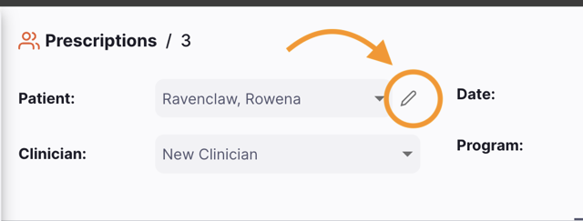
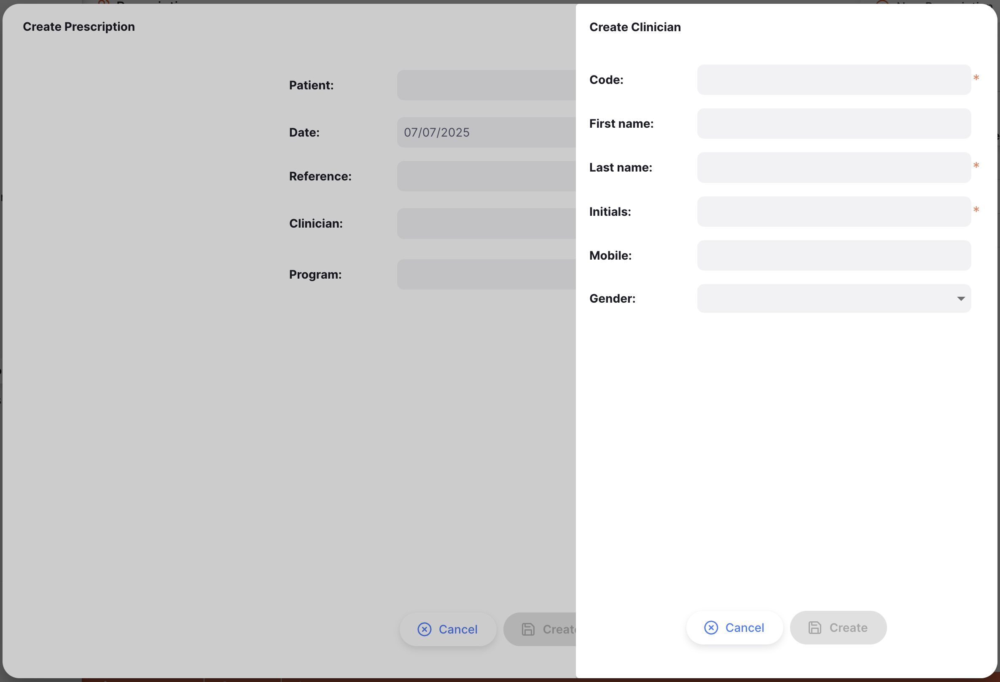
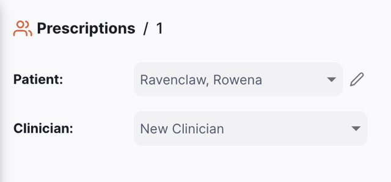
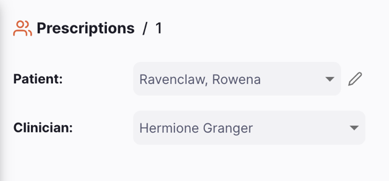
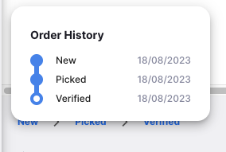
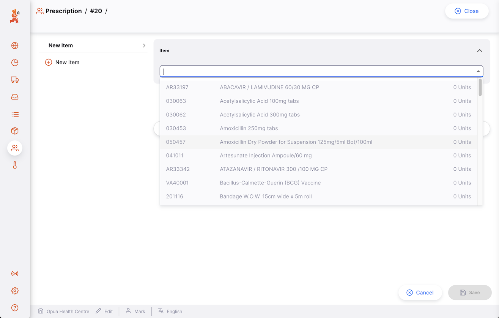

+++
title = "Prescriptions"
description = "Prescrire des articles aux patients."
date = 2022-03-19
updated = 2025-08-25T17:40:00+00:00
draft = false
weight = 2
sort_by = "weight"
template = "docs/page.html"

[extra]
toc = true
top = false
+++

Les prescriptions peuvent être utilisées pour prescrire des médicaments aux patients.

Une Prescription peut être utilisée pour :

- Distribuer des médicaments à un patient

## Afficher les Prescriptions

Pour utiliser les prescriptions, assurez-vous que votre dépôt est configuré en mode `Dispensaire` (voir la documentation des [dépôts virtuels](https://docs.msupply.org.nz/other_stuff:virtual_stores#store_type) pour savoir comment procéder).

### Ouvrir le Menu des Prescriptions

Choisissez `Dispensaire` > `Prescription` dans le volet de navigation.

Vous verrez une liste des Prescriptions (si vous n'en voyez aucune, vous ne faites probablement que commencer !).

Depuis cet écran, vous pouvez :

- Afficher une liste des Prescriptions
- Créer une nouvelle Prescription
- Exporter la Prescription vers un fichier `.csv`

### Liste des Prescriptions

1. La liste des Prescriptions est divisée en 5 colonnes :

| Colonne         | Description                            |
| :-------------- | :------------------------------------- |
| **Nom**         | Nom du Patient                         |
| **Statut**      | Statut actuel de la prescription       |
| **Numéro**      | Numéro de référence de la prescription |
| **Créé**        | Date de création de la prescription    |
| **Commentaire** | Commentaire pour la prescription       |

2. La liste peut afficher un nombre fixe de prescriptions par page. Dans le coin inférieur gauche, vous pouvez voir combien de prescriptions sont actuellement affichées sur votre écran.

3. Si vous avez plus de prescriptions que la limite actuelle, vous pouvez naviguer vers les autres pages en appuyant sur le numéro de page ou en utilisant les flèches droite ou gauche (coin inférieur droit).

4. Vous pouvez également choisir un nombre différent de lignes à afficher par page en utilisant l'option en bas à droite de la page.

### Rechercher une prescription

Les Prescriptions peuvent être filtrées par Statut, Référence, Numéro de facture, Date de dispensation et Nom du patient

Le filtre numéro de facture nécessite une correspondance exacte donc rechercher "1" ne retournera pas les factures 10, 11, 12, etc.

### Exporter les Prescriptions

La liste des Prescriptions peut être exportée vers un fichier séparé par des virgules (csv). Cliquez simplement sur le bouton d'exportation (à droite, en haut de la page) et le fichier sera téléchargé.
La fonction d'exportation téléchargera toutes les Prescriptions, pas seulement la page actuelle, si vous en avez plus de 20. Les Prescriptions sont exportées en utilisant l'ordre de tri sélectionné dans le tableau, bien que vous puissiez facilement trier la liste dans Excel ou tout autre programme avec lequel vous ouvrez le fichier .csv.

### Supprimer une Prescription

Vous pouvez supprimer une prescription de la liste des Prescriptions.

1. Choisir la prescription que vous voulez supprimer en cochant la case à l'extrémité gauche de la liste. Vous pouvez choisir plusieurs prescriptions à supprimer. Vous pouvez même toutes les choisir en utilisant la case à cocher principale dans les en-têtes de liste.
2. Le pied de page `Actions` s'affichera en bas de l'écran quand une prescription est choisie. Il affichera le nombre de prescriptions choisies et les actions qui peuvent être entreprises. Cliquez sur `Supprimer`.
3. Une notification confirme combien de prescriptions ont été supprimées (coin inférieur gauche).

Vous ne pouvez supprimer que les Prescriptions avec un statut <code>NOUVEAU</code> ou <code>COLLECTÉ</code>. Les prescriptions vérifiées peuvent être annulées, mais pas supprimées.

## Créer une Prescription

1. Aller à `Dispensaire` > `Prescriptions`

2. Appuyer sur le bouton `Nouvelle Prescription`, dans le coin supérieur droit

3. Une nouvelle fenêtre s'ouvre, dans laquelle vous pouvez choisir un patient et d'autres détails pour la prescription

#### Choisir un Patient

Dans la fenêtre `Nouvelle Prescription`, vous verrez un formulaire pour rechercher les patients disponibles. La liste des patients se chargera quand vous commencerez à taper - une fois que vous voyez le patient correct sur votre écran, vous pouvez le choisir (vous n'avez pas besoin d'entrer le nom complet ou le code)

Si aucune correspondance n'est trouvée, un bouton `Nouveau patient` apparaîtra. Cliquez dessus pour ouvrir une section où vous pouvez entrer les détails du patient.  

Entrez le prénom et le nom de famille du patient pour activer le bouton `Rechercher`. Cela affichera tous les patients correspondants même s'ils ont été créés sur un site mSupply différent.

Cliquez sur un patient pour le choisir pour la prescription, ou choisissez `Créer un nouveau patient` pour continuer et entrer les détails restants pour un nouveau patient. Une fois terminé, choisir Enregistrer pour ajouter le patient et continuer à créer la prescription.

Si vous avez trouvé un patient correspondant, mais ce n'est pas le bon, cliquez sur l'option <b>Nouveau Patient</b> qui s'affiche en bas de la liste

### Patient

Si vous avez choisi le mauvais patient, vous pouvez changer le patient en tapant dans le champ `Patient` pour rechercher et choisir le bon dans la liste déroulante. Si aucune correspondance n'est trouvée, vous pouvez également créer un nouveau patient à partir d'ici.

Si vous avez choisi le mauvais patient, vous pouvez changer le nom du patient dans le champ `Patient` en tapant quelques caractères pour rechercher et ensuite en le choisissant dans la liste déroulante :

Vous devrez peut-être taper plus du nom du patient ou du code si vous avez plus de 100 patients pour que le nom du patient s'affiche dans la liste déroulante.

### Modifier les Détails du Patient

Pour modifier les détails du patient choisi, cliquez sur l'icône crayon à côté du nom du patient. Après avoir apporté des modifications, cliquez sur Enregistrer pour mettre à jour les informations, ou choisir `Afficher Patient` pour ouvrir le dossier du patient.

Les détails d'assurance peuvent être affichés dans l'onglet Assurance si vous avez configuré les [Fournisseurs d'Assurance](/docs/dispensary/patients/#insurance) dans mSupply</a>

#### Praticien(ne)

C'est un champ optionnel pour le praticien qui a prescrit le médicament. Vous pouvez rechercher un praticien existant par code ou nom. Si aucune correspondance n'est trouvée, cliquez sur `Créer praticien` pour en ajouter un nouveau.

Entrez les détails du praticien, puis cliquez sur `Créer` pour enregistrer le praticien et l'ajouter à la prescription.

### Changer le Praticien

Si vous avez choisi le mauvais praticien, vous pouvez changer le praticien en tapant dans le champ `Praticien` pour rechercher et choisir le bon dans la liste déroulante. Si aucune correspondance n'est trouvée, vous pouvez également créer un nouveau praticien à partir d'ici.

Le support pour Modifier les praticiens sera disponible dans les versions futures d'Open mSupply

#### Définir d'autres Champs de Prescription

Les champs suivants sont optionnels - si aucun de ceux-ci ne vous est utile, cliquez simplement sur `Créer` pour créer la prescription après avoir choisi le patient.

- **Date** : La date de dispensation. Elle est par défaut à la date actuelle, mais peut être changée à une date passée si vous entrez une prescription antidatée.
- **Référence** : C'est un champ de texte libre qui peut être utilisé pour stocker un numéro de référence ou d'autres informations sur la prescription.
- **Praticien** : Le praticien qui a prescrit le médicament.
- **Programme** : Le programme auquel cette prescription est associée. Si choisi, seuls les articles de ce programme seront disponibles pour être ajoutés à la prescription.

Après avoir choisi un patient, et rempli tous les autres détails pertinents, appuyez sur le bouton `Créer`.

Si tout s'est bien passé, vous devriez voir le nom de votre patient dans le coin supérieur gauche et le statut devrait être <code>NOUVEAU</code> 

### Afficher ou modifier le Volet d'Information de la Prescription

Le Volet d'Information vous permet de voir ou modifier les informations sur la Prescription. Il est divisé en sections suivantes :

- Détails de la Prescription
- Informations Supplémentaires
- Tarification
- Détails du Patient
- Actions

Plus de sections seront ajoutées au fur et à mesure qu'Open mSupply évolue.

#### Comment ouvrir et fermer le Volet d'Information ?

Si vous utilisez un grand écran, le volet d'information sera automatiquement ouvert pour vous. Cependant, sur un écran de taille moyenne, le volet d'information sera fermé par défaut.

Pour ouvrir le Volet d'Information, vous pouvez appuyer sur le bouton `Plus`, situé dans le coin supérieur droit de la vue Prescription.

Vous pouvez fermer en appuyant sur le bouton `X Fermer`, dans le coin supérieur droit du volet d'information.

#### Volet d'Information

Dans la section **Informations Supplémentaires**, vous pouvez :

- Voir qui a créé la Prescription (nom de l'utilisateur)
- Afficher et modifier la couleur de la Prescription. Pour modifier la couleur, appuyez sur le cercle coloré et choisir une couleur dans la fenêtre contextuelle
- Écrire ou modifier un commentaire

Dans la section **Tarification**, vous pouvez :

- Voir le prix de vente total des articles listés dans la Prescription.
- Toute information d'assurance liée à cette prescription.

Dans la section **Détails du Patient**, vous pouvez :

- Voir le nom du patient, le code, le sexe, et la Date de Naissance
- Choisir un Diagnostic lié à la prescription

Dans la section **Actions**, vous pouvez :

- Supprimer ou Annuler la Prescription
- Copier la Prescription

### Suivi du Statut de Prescription

Le suivi du statut est situé dans le coin inférieur gauche de l'écran Prescription.

Les statuts passés sont surlignés en bleu, les statuts suivants apparaissent en gris.

Il y a 3 statuts pour une Prescription :

| Statut       | Description                                                                                                                                                                      |
| :----------- | -------------------------------------------------------------------------------------------------------------------------------------------------------------------------------- |
| **Nouveau**  | C'est le premier statut quand vous créez une prescription.                                                                                                                       |
| **Collecté** | La prescription est collectée et est maintenant prête à être donnée au patient. Les produits font toujours partie de votre stock et la prescription peut toujours être modifiée. |
| **Vérifié**  | Le patient a reçu son médicament.                                                                                                                                                |

Si vous passez la souris sur le suivi du statut, une fenêtre d'historique de prescription apparaît. Vous pouvez voir la date quand une prescription a été mise à jour d'un statut à un autre.

Cette prescription a été créée, collectée et vérifiée le 18/08/2023

### Bouton Fermer et Confirmer

#### Bouton Fermer

Appuyez sur le bouton `Fermer` pour quitter la vue Prescription et retourner à la liste des Prescriptions.

#### Bouton Confirmer

Le bouton `Confirmer` met à jour le statut de la prescription. Le statut que vous pouvez confirmer dépend du statut actuel de la prescription et suit l'ordre montré ci-dessous.

Lors de la gestion d'une Prescription, vous ne pouvez confirmer que les statuts Collecté et Vérifié. Une fois que vous avez ajouté un article à une prescription, le statut changera automatiquement à `Collecté`.

| Confirmer...           | Statut Actuel | Statut Suivant |
| :--------------------- | :------------ | :------------- |
| **Confirmer Collecté** | Nouveau       | Collecté       |
| **Confirmer Vérifié**  | Collecté      | Vérifié        |

## Ajouter des lignes à une Prescription

Appuyez sur le bouton `Ajouter Article` (coin supérieur droit) de la fenêtre prescription ou appuyez sur `Alt`+`N` sur le clavier pour commencer à ajouter des articles à la prescription.

Une fois qu'un article a été ajouté à la prescription, vous pouvez également utiliser le bouton `Nouvel Article` dans le volet de gauche pour ajouter un article supplémentaire.

### Choisir un Article

Dans la fenêtre `Ajouter Article`, vous pouvez rechercher un article en :

- Lisant la liste des articles disponibles
- ou en tapant une partie ou la totalité du nom de l'article
- ou en tapant une partie ou la totalité d'un code d'article

Une fois que votre article est surligné, appuyez sur le nom ou appuyez sur `Entrée`.

Une fois l'article choisi, vous pouvez voir les informations sur l'article divisées en différentes sections

#### Section Article

Cela montre le nom de l'article et le code.

#### Section Quantité

Cette section montre ce qui suit :

- les lots disponibles pour cet article
- l'unité de l'article (par ex. _Comprimés_)

### Distribuer le stock

Dans le champ `Distribuer`, vous pouvez entrer la quantité que vous voulez distribuer à votre patient.
Si vous enregistrez les [quantités prescrites](https://docs.msupply.org.nz/other_stuff:virtual_stores#preferences_tab), vous pouvez d'abord entrer la quantité prescrite, ce qui remplira automatiquement le champ `Distribuer` pour vous.

Le système allouera alors automatiquement le stock pour la prescription, le stock expirant en premier étant préféré.

Il y a un cas spécial lors de la distribution d'un article vaccin et quand la préférence <a href="/docs/manage/facilities/#store-preferences">Trier les lots disponibles par statut VVM puis péremption</a> est activée.  

Dans ce cas, les lignes de stock sont allouées dans l'ordre numérique du niveau de 'propriété' du statut VVM (ceci est séparé de l'étape VVM, voir la <a href="https://docs.msupply.org.nz/cold_chain_equipment:configure?s[]=vvm&s[]=status#priority_of_vvm_status">documentation</a> pour plus de détails). S'il y a plus d'une ligne avec le même niveau de statut VVM, alors parmi ces lignes, la première ligne à expirer est choisie (règles FEFO normales).

#### Liste des lots disponibles :

Ceci est une liste des numéros de lots que vous avez en dépôt pour cet article :

| Colonne                 | Description                                                                                           |
| :---------------------- | :---------------------------------------------------------------------------------------------------- |
| **Péremption**          | Date de péremption du lot (format : MM/AAAA)                                                          |
| **Lot**                 | Numéro de lot. C'est une désignation donnée aux produits fabriqués dans la même série de fabrication. |
| **Taille de boîte**     | Quantité d'unités par boîte                                                                           |
| **En Stock (unités)**   | Nombre total d'unités dans votre dépôt                                                                |
| **Disponible (unités)** | Nombre d'unités disponibles (pas déjà allouées à d'autres factures)                                   |
| **Unités Distribuées**  | Quantité totale d'unités à distribuer                                                                 |

#### Distribuer une quantité

Dans l'exemple ci-dessous, nous distribuons 1000 unités de l'article. Toutes les 1000 unités seront prises du même lot (première ligne). Les deux autres lots n'ont pas été choisis car ils sont périmés ou en attente.

Dans cet autre exemple, nous distribuons 11 unités. Le système choisit deux lots avec différentes tailles de boîte. 

#### Avertissements

Vous pouvez voir un ou plusieurs messages d'avertissement sur cet écran :

Cet avertissement vous indique que vous essayez de distribuer plus d'unités que vous n'en avez en stock. Vous devrez réduire la quantité que vous essayez de distribuer, ou ajouter plus de stock au système.

Cet avertissement vous indique qu'à cause des tailles de boîtes disponibles, la quantité que vous essayez de distribuer résulterait en une boîte partielle distribuée. Si vous ne voulez pas diviser une boîte, vous devrez entrer une quantité qui est un multiple de la/des taille(s) de boîte disponible(s).

Cet avertissement vous indique qu'une partie de votre stock est en attente et/ou périmé ne peut pas être alloué automatiquement.

#### Distribuer en doses

Les articles vaccins peuvent être dispensés en doses plutôt qu'en unités, si la préférence de dépôt [Gérer les vaccins en doses](/docs/manage/facilities/#store-preferences) est activée.

Les colonnes de quantité suivantes seront affichées à la place lors de la distribution d'un article vaccin :

| Colonne               | Description                                                                                                                                                                                    |
| :-------------------- | :--------------------------------------------------------------------------------------------------------------------------------------------------------------------------------------------- |
| **Statut VVM**        | Si la préférence de dépôt [Gérer le statut VVM pour le stock](/docs/manage/facilities/#store-preferences) est activée, une colonne affichant le statut VVM de cette ligne de stock est montrée |
| **Doses par [unité]** | Le nombre de doses par unité (l'étiquette montrée pour l'unité variera, car cela provient de l'article. Un exemple est `Flacon`)                                                               |
| **[Unité]s en stock** | Nombre total d'unités (par ex. `Flacons`) qui sont en stock dans votre dépôt                                                                                                                   |
| **Doses Disponibles** | Nombre total de doses disponibles dans votre dépôt                                                                                                                                             |
| **Doses Distribuées** | Nombre total de doses à distribuer                                                                                                                                                             |

### Allocation Manuelle

Peu importe comment le système alloue automatiquement le stock, vous pouvez toujours changer manuellement la quantité au niveau du numéro de lot directement.
Cette méthode vous permet également de choisir des lots périmés, mais pas des lots en attente.

Pour choisir ou ajuster les lots choisis, entrez ou modifiez la quantité dans la colonne `Unités Distribuées`.

<figure>

<figcaption align="center"><i>Allocation manuelle au niveau du numéro de lot.</i></figcaption>
</figure>

### Posologie / Conseil d'utilisation

Cette section vous permet d'entrer ou de choisir la posologie / les conseils d'utilisation du patient pour l'article actuel. Cette posologie sera imprimée sur les étiquettes si l'impression d'étiquettes est utilisée.
Il y a 3 façons d'entrer la posologie

1. Vous pouvez choisir la posologie par défaut de l'article dans la liste déroulante [(Voir la Documentation mSupply pour la configuration de la posologie des articles)](https://docs.msupply.org.nz/items:item_basics:tab_dispensing?#default_directions)

2. Vous pouvez entrer une posologie définie ou abrégée dans la zone de texte qui sera développée vers le champ de posologie complet
   [(Voir la Documentation mSupply pour la configuration des abréviations)](https://docs.msupply.org.nz/dispensing:abbreviations)

3. Vous pouvez entrer ou modifier la posologie dans la zone de texte

### Confirmer l'Article, la Quantité et autres détails

Quand vous êtes satisfait de la quantité, vous pouvez soit appuyer sur :

- le bouton `Enregistrer` (ou appuyer sur `Alt`+`S` sur le clavier)

- le bouton `Annuler` (ou la touche `Échap`) si vous ne voulez plus ajouter l'article à la Prescription

## Modifier une Ligne de Prescription

Pour modifier une ligne de prescription, appuyez dessus. Vous verrez la fenêtre `Modifier Article`, qui est identique à la fenêtre `Ajouter Article`, sauf que l'article est déjà choisi.

### Modifier une Ligne de Prescription

 <b></b> Vous pouvez modifier une ligne de prescription si la prescription a un statut inférieur à <code>Vérifié</code>. 

1. Ouvrir la Prescription que vous voulez modifier.
2. Appuyer sur la ligne que vous voulez modifier.

 <b></b> Lors de la modification d'une ligne de prescription, vous ne pouvez pas changer l'article. Vous devriez supprimer la ligne de prescription et en créer une nouvelle. 

### Supprimer une ligne de Prescription

1. Ouvrir la Prescription que vous voulez modifier
2. Choisir la/les ligne(s) que vous voulez supprimer en cochant la/les case(s) sur le côté gauche de la liste
3. Le pied de page `Actions` s'affichera en bas de l'écran quand une ligne de prescription est choisie. Il affichera le nombre de lignes de prescription choisies et les actions qui peuvent être entreprises.
4. Cliquez sur `Supprimer`
5. Accepter la confirmation
6. Une notification de succès sera affichée en bas à gauche de l'écran

Dans l'exemple ci-dessous, nous supprimons <i>article 088882 - Ibuprofène 200mg comprimés</i>

Vous pouvez supprimer plusieurs lignes à la fois. Assurez-vous de vérifier ce qui est choisi avant d'effectuer l'action Supprimer. 

## Antidater une Prescription

Une prescription peut être antidatée en changeant le champ Date dans l'en-tête. Ceci doit être fait avant d'ajouter des articles à la prescription.

#### Niveaux de Stock

Lors de l'ajout d'articles à une prescription antidatée, le stock disponible sera ajusté à ce qui était disponible à cette date (et n'a pas été utilisé depuis).
Les autres champs affichent toujours l'état actuel du système.

Si un stock que vous vous attendez à voir ne s'affiche pas comme disponible, utilisez le <a href="/docs/inventory/stock-view/#ledger-tab">Registre</a> dans Stock -> Stock pour voir quand ce stock a été reçu.

#### Changer la date après avoir ajouté des articles

Si vous avez déjà assigné du stock à une prescription, et ensuite vous changez la date de la prescription, vous verrez cet avertissement :

Le système a besoin de recalculer les niveaux de stock disponibles basés sur la nouvelle date, donc les lignes existantes seront supprimées et vous devrez les ajouter à nouveau. Par conséquent, il est recommandé de définir la date avant d'ajouter des articles à la prescription !

## Traiter une Prescription

### Confirmer la collecte de Prescription

La collecte fait référence au processus où les articles individuels sont collectés de la pharmacie.

Une fois qu'un article a été ajouté à votre prescription, le statut changera automatiquement à collecté :

- Le statut de Prescription est maintenant `COLLECTÉ`
- Vous êtes maintenant invité à confirmer la prescription via le bouton `Confirmer Vérifié`

À ce stade, vous êtes toujours capable de modifier les lignes de facture, d'ajouter des articles ou de supprimer des lignes existantes.

### Vérifier la Prescription

La dernière étape pour prescrire un médicament est de vérifier la prescription.

Pour vérifier une prescription, appuyez sur le bouton `Confirmer Vérifié`.

Une fois que la prescription a été confirmée :

- Le statut de Prescription est maintenant `VÉRIFIÉ`
- Les produits ne font plus partie de votre stock
- Vous ne pouvez plus modifier les lignes de prescription
- Vous ne pouvez plus supprimer la prescription

## Imprimer des Étiquettes

Open mSupply a une impression d'étiquettes basique qui sera améliorée avec plus de flexibilité dans le futur.

### Commencer

Pour commencer à imprimer des étiquettes, assurez-vous d'abord d'avoir configuré une imprimante dans [Configurations](/docs/settings/devices/).

Une note technique : pour le moment nous utilisons le langage d'impression ZPL en arrière-plan, qui couvre environ la moitié du matériel d'imprimante d'étiquettes sur le marché. Vous devrez ajuster la configuration de l'imprimante (directement sur le dispositif) pour l'adapter exactement à notre impression d'étiquettes. Le support pour plus d'imprimantes et de formats d'étiquettes arrive dans les futures versions d'Open mSupply.

### Posologie / Conseil d'utilisation

Pour chaque article dans la prescription, vous devrez définir la posologie / conseils d'utilisation de l'article à imprimer sur les étiquettes. Ceux-ci peuvent être entrés manuellement, avec des abréviations ou la posologie par défaut des articles.

Voir la section [Posologie / Conseil d'utilisation](#posologie-conseil-d-utilisation) pour plus d'informations.

### Imprimer Tout

Lors de l'affichage de la prescription globale, vous verrez que les lignes qui ont une posologie auront une icône de bulle de commentaire. Une fois que toute la posologie est entrée sur toutes les lignes, c'est le bon moment pour imprimer toutes vos étiquettes ! Appuyez sur le bouton `Imprimer Étiquettes` en haut de la page.

Note : Si vous avez plusieurs lots du même article, seulement 1 étiquette sera imprimée avec le nombre total d'unités à travers les lots noté dans la ligne du haut de l'étiquette.

### Imprimer les Lignes Choisies

Vous pouvez choisir des lignes individuelles dans la prescription pour imprimer des étiquettes en cochant la colonne à gauche, puis en appuyant sur `Imprimer Étiquettes` dans la barre d'action en bas de l'écran.

### Dépannage

Si quelque chose ne fonctionne pas correctement, [support@msupply.foundation](mailto:support@msupply.foundation) sera heureux d'aider à configurer votre imprimante.

Voici quelques problèmes communs que vous pourriez avoir :

#### Mes étiquettes sont mal coupées en haut/bas/gauche/droite

Ceci est probablement dû à une configuration incompatible de l'imprimante d'étiquettes. La solution la plus simple est d'utiliser mSupply pour imprimer une étiquette avec une _bonne_ configuration car il a de la magie qui reconfigure l'imprimante basée sur les configurations d'impression que nous ne faisons pas tout à fait dans Open mSupply !

#### Les détails du Praticien manquent

Ceci est probablement dû au fait de ne pas avoir défini le Praticien pour la prescription.

#### Toute ma posologie ne s'affiche pas

Malheureusement, pour le moment nous ne supportons que jusqu'à 5 lignes de posologie par prescription. Dans le futur, nous chercherons à avoir un ajustement de taille pour permettre plus ainsi que plusieurs étiquettes imprimées s'il y a trop de texte.

#### Le nom de l'article s'est imprimé par-dessus lui-même

Les noms d'articles dans le système sont trop longs pour ce format d'étiquette ! Veuillez contacter [support@msupply.foundation](mailto:support@msupply.foundation).

## Afficher une Prescription

La vue détaillée de prescription montre chaque article dans la prescription, ainsi que la quantité distribuée et beaucoup d'autres informations utiles.

Si vous n'avez pas assez de place sur votre écran, ou n'êtes simplement pas intéressé par certaines des colonnes montrées, vous avez l'option de masquer quelles colonnes sont affichées dans cette vue.

Cliquez sur le bouton `Afficher / masquer les colonnes` qui est en haut à droite du tableau. Cela donne une liste des colonnes disponibles - vous pouvez cocher les colonnes que vous voulez voir. Les options choisies sont stockées pour le navigateur actuel, donc la prochaine fois que vous afficherez une Prescription, vous verrez seulement les colonnes choisies. Si vous avez choisi quelles colonnes afficher, alors le bouton est affiché en bleu pour vous rappeler qu'il y a plus de colonnes disponibles.

Si certaines colonnes sont masquées, vous pouvez cliquer sur `Afficher tout` pour afficher toutes les colonnes à nouveau.

## Annuler une Prescription

Si une prescription a déjà été vérifiée, elle ne peut pas être supprimée, mais elle peut être annulée.

Ceci est fait dans la section actions du Volet latéral.

Une fois qu'une prescription est annulée, elle s'affichera toujours dans la liste des prescriptions, mais avec un statut `ANNULÉ`.

## Paiement

1. Une fois que vous avez fini d'entrer les articles pour la Prescription, cliquez sur le bouton `Confirmer Vérifié`.

   

2. S'il y a un prix de vente non-zéro pour les articles dans la prescription, Une nouvelle fenêtre apparaîtra pour vous permettre d'entrer les détails de paiement pour la prescription du patient.

   

3. Cliquez sur le bouton `Enregistrer` une fois que tout est terminé.

4. Cliquer sur le bouton `Annuler` arrêtera le processus d'enregistrement.

### Assurance

S'il y a des polices d'assurances disponibles pour vos patients, vous pouvez indiquer que le paiement a été partiellement couvert par l'assurance.

1. Une fois que vous avez fini d'entrer les articles pour la Prescription, cliquez sur le bouton `Confirmer Vérifié`.

   

2. Cliquez sur la liste déroulante pour la Police d'Assurance et choisir l'assurance à utiliser.

   

3. Le montant de remise et le montant payé par l'assurance s'afficheront automatiquement après avoir choisi une assurance.

   

4. Cliquez sur le bouton `Enregistrer` une fois que tout est terminé.
