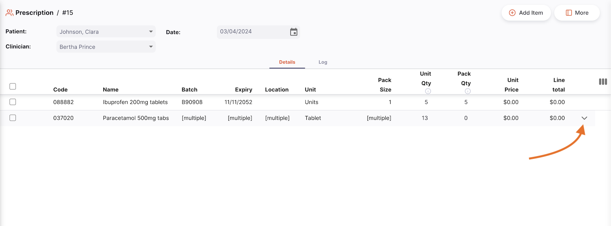
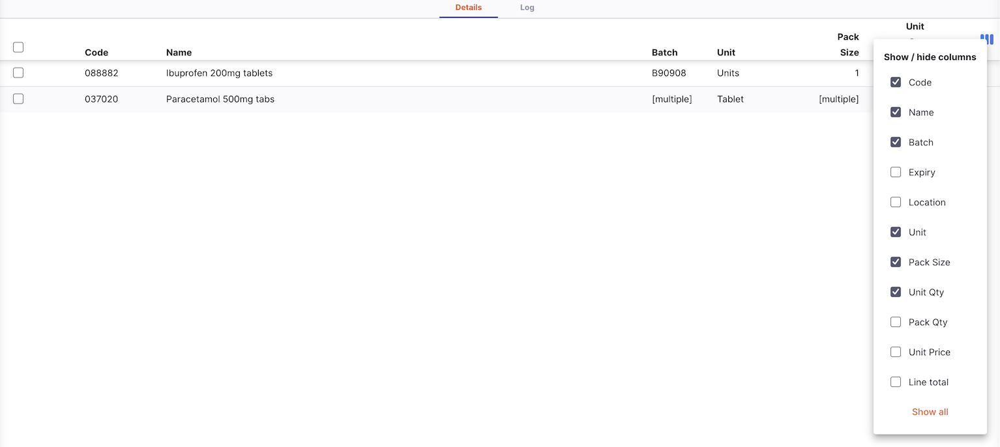

+++
title = "Prescriptions"
description = "Prescrire des médicaments aux patients."
date = 2022-03-19
updated = 2024-10-03T17:40:00+00:00
draft = false
weight = 2
sort_by = "weight"
template = "docs/page.html"

[extra]
toc = true
top = false
+++

Les prescriptions peuvent être utilisées pour prescrire des médicaments aux patients.

Une prescription peut être utilisée pour :

- Délivrer des médicaments à un patient

## Visualisation des Prescriptions

Pour utiliser les prescriptions, assurez-vous que votre magasin est configuré en mode `Pharmacie` (voir la documentation des [magasins virtuels](https://docs.msupply.org.nz/other_stuff:virtual_stores#store_type) pour savoir comment procéder).

### Ouvrir le Menu des Prescriptions

Choisissez `Pharmacie` > `Prescription` dans le panneau de navigation.

Une liste de prescriptions vous sera présentée (si vous n'en voyez aucune, vous débutez probablement !).

Depuis cet écran, vous pouvez :

- Voir une liste des prescriptions
- Créer une nouvelle prescription
- Exporter les prescriptions vers un fichier `.csv`

### Liste des Prescriptions

1. La liste des prescriptions est divisée en 5 colonnes :

| Colonne         | Description                            |
| :-------------- | :------------------------------------- |
| **Nom**         | Nom du patient                         |
| **Statut**      | Statut actuel de la prescription       |
| **Numéro**      | Numéro de référence de la prescription |
| **Créé**        | Date de création de la prescription    |
| **Commentaire** | Commentaire pour la prescription       |

2. La liste peut afficher un nombre fixe de prescriptions par page. Dans le coin inférieur gauche, vous pouvez voir combien de prescriptions sont actuellement affichées sur votre écran.

3. Si vous avez plus de prescriptions que la limite actuelle, vous pouvez naviguer vers les autres pages en appuyant sur le numéro de page ou en utilisant les flèches droite ou gauche (coin inférieur droit).

4. Vous pouvez également sélectionner un nombre différent de lignes à afficher par page en utilisant l'option en bas à droite de la page.

### Recherche d'une prescription

Les prescriptions peuvent être filtrées par Statut, Référence, Numéro de facture, Date de délivrance et Nom du patient.

Le filtre du numéro de facture nécessite une correspondance exacte, donc rechercher "1" ne retournera pas les factures 10, 11, 12, etc.

### Exportation des Prescriptions

La liste des prescriptions peut être exportée vers un fichier séparé par des virgules (csv). Cliquez simplement sur le bouton d'exportation (à droite, en haut de la page) et le fichier sera téléchargé.
La fonction d'exportation téléchargera toutes les prescriptions, pas seulement la page actuelle, si vous en avez plus de 20. Les prescriptions sont exportées selon l'ordre de tri sélectionné dans le tableau, bien que vous puissiez facilement trier la liste dans Excel ou tout autre programme avec lequel vous ouvrez le fichier .csv.

La fonctionnalité d'exportation n'est pas disponible sur les appareils Android.

### Supprimer une Prescription

Vous pouvez supprimer une prescription de la liste des prescriptions.

1. Sélectionnez la prescription que vous voulez supprimer en cochant la case à l'extrémité gauche de la liste. Vous pouvez sélectionner plus d'une prescription à supprimer. Vous pouvez même toutes les sélectionner en utilisant la case à cocher principale dans les en-têtes de liste.
2. Le pied de page `Actions` s'affichera en bas de l'écran lorsqu'une prescription est sélectionnée. Il affichera le nombre de prescriptions sélectionnées et les actions qui peuvent être entreprises. Cliquez sur `Supprimer`.
3. Une notification confirme combien de prescriptions ont été supprimées (coin inférieur gauche).

Vous ne pouvez supprimer que les prescriptions avec un statut <code>NOUVEAU</code> ou <code>PRÉPARÉ</code>. Les prescriptions vérifiées peuvent être annulées, mais pas supprimées.

## Création d'une Prescription

1. Allez à `Pharmacie` > `Prescriptions`

2. Appuyez sur le bouton `Nouvelle Prescription`, dans le coin supérieur droit

3. Une nouvelle fenêtre s'ouvre, dans laquelle vous pouvez sélectionner un patient et d'autres détails pour la prescription

#### Sélectionner un Patient

Dans la fenêtre `Nouvelle Prescription`, un formulaire vous sera présenté pour rechercher les patients disponibles. La liste des patients se chargera lorsque vous commencerez à taper - vous pouvez saisir autant du nom ou du code du patient que nécessaire.

Si aucune correspondance n'est trouvée, un bouton `Créer un nouveau patient` apparaîtra. Cliquer dessus ouvrira une nouvelle fenêtre pour créer un nouveau patient, avant de vous ramener à la fenêtre Prescription.

Si vous avez trouvé un patient correspondant, mais que ce n'est pas le bon, vous pouvez simplement appuyer plusieurs fois sur la barre d'espace pour voir le bouton Nouveau Patient.

#### Définir les Autres Champs de Prescription

Les champs suivants sont optionnels - si aucun de ceux-ci ne vous est utile, cliquez simplement sur `Créer` pour créer la prescription après avoir sélectionné le patient.

- **Date** : La date de délivrance. Elle est définie par défaut à la date actuelle, mais peut être changée à une date passée si vous saisissez une prescription antidatée.
- **Référence** : Il s'agit d'un champ de texte libre qui peut être utilisé pour stocker un numéro de référence ou d'autres informations sur la prescription.
- **Clinicien** : Le clinicien qui a prescrit le médicament.
- **Programme** : Le programme auquel cette prescription est associée. Si sélectionné, seuls les articles de ce programme seront disponibles pour être ajoutés à la prescription.

Après avoir sélectionné un patient et rempli tous les autres détails pertinents, appuyez sur le bouton `Créer`.

Si tout s'est bien passé, vous devriez voir le nom de votre patient dans le coin supérieur gauche et le statut devrait être <code>NOUVEAU</code>

### Modifier le Nom du Patient

Si vous avez sélectionné le mauvais patient, vous pouvez changer le nom du patient dans le champ `Patient` en tapant quelques caractères pour rechercher puis en sélectionnant dans la liste déroulante :

Vous devrez peut-être taper plus du nom ou du code du patient si vous avez plus de 100 patients pour que le nom du patient apparaisse dans la liste déroulante.

### Voir ou modifier le Panneau d'Information de la Prescription

Le Panneau d'Information vous permet de voir ou modifier les informations sur la Prescription. Il est divisé en sections suivantes :

- Détails de la Prescription
- Informations Supplémentaires
- Tarification
- Détails du Patient
- Actions

D'autres sections seront ajoutées au fur et à mesure qu'Open mSupply se développe.

#### Comment ouvrir et fermer le Panneau d'Information ?

Si vous utilisez un grand écran, le panneau d'information s'ouvrira automatiquement pour vous. Cependant, sur un écran de taille moyenne, le panneau d'information sera fermé par défaut.

Pour ouvrir le Panneau d'Information, vous pouvez appuyer sur le bouton `Plus`, situé dans le coin supérieur droit de la vue Prescription.

Vous pouvez fermer en appuyant sur le bouton `X Fermer`, dans le coin supérieur droit du panneau d'information.

#### Panneau d'Information

Dans la section **Informations Supplémentaires**, vous pouvez :

- Voir qui a créé la Prescription (nom de l'utilisateur)
- Voir et modifier la couleur de la Prescription. Pour modifier la couleur, appuyez sur le cercle coloré et sélectionnez une couleur dans la pop-up
- Écrire ou modifier un commentaire

Dans la section **Tarification**, vous pouvez :

- Voir le prix de vente total des articles listés dans la Prescription.
- Toute information d'assurance liée à cette prescription.

Dans la section **Détails du Patient**, vous pouvez :

- Voir le nom, le code, le sexe et la date de naissance du patient
- Sélectionner un Diagnostic lié à la prescription

Dans la section **Actions**, vous pouvez :

- Supprimer ou Annuler la Prescription

### Séquence de Statut de Prescription

La séquence de statut est située dans le coin inférieur gauche de l'écran Prescription.

Les statuts passés sont surlignés en bleu, les statuts suivants apparaissent en gris.

<figure>

<figcaption align="center">Séquence de Statut : le statut actuel est <code>NOUVEAU</code>.</figcaption>
</figure>

<figure>

<figcaption align="center">Séquence de Statut : le statut actuel est <code>VÉRIFIÉ</code>.</figcaption>
</figure>

Il y a 3 statuts pour une Prescription :

| Statut      | Description                                                                                                                                                                            |
| :---------- | -------------------------------------------------------------------------------------------------------------------------------------------------------------------------------------- |
| **Nouveau** | C'est le premier statut lorsque vous créez une prescription.                                                                                                                           |
| **Préparé** | La prescription est préparée et est maintenant prête à être donnée au patient. Les marchandises font toujours partie de votre inventaire et la prescription peut encore être modifiée. |
| **Vérifié** | Le patient a reçu son médicament.                                                                                                                                                      |

Si vous survolez la séquence de statut, une fenêtre d'historique de prescription apparaît. Vous pouvez voir la date à laquelle une prescription a été mise à jour d'un statut à un autre.

Cette prescription a été créée, préparée et vérifiée le 18/08/2023

### Boutons Fermer et Confirmer

#### Bouton Fermer

Appuyez sur le bouton `Fermer` pour quitter la vue Prescription et retourner à la liste des Prescriptions.

#### Bouton Confirmer

Le bouton `Confirmer` met à jour le statut de la prescription. Le statut que vous pouvez confirmer dépend du statut actuel de la prescription et suit la séquence montrée ci-dessous.

Lors de la gestion d'une Prescription, vous ne pouvez confirmer que les statuts Préparé et Vérifié. Une fois que vous avez ajouté un article à une prescription, le statut changera automatiquement en `Préparé`.

| Confirmer...          | Statut Actuel | Statut Suivant |
| :-------------------- | :------------ | :------------- |
| **Confirmer Préparé** | Nouveau       | Préparé        |
| **Confirmer Vérifié** | Préparé       | Vérifié        |

## Ajout de lignes à une Prescription

Appuyez sur le bouton `Ajouter un Article` (coin supérieur droit) de la fenêtre de prescription pour commencer à ajouter des articles à la prescription.

Une fois qu'un article a été ajouté à la prescription, vous pouvez également utiliser le bouton `Nouvel Article` dans le panneau de gauche pour ajouter un article supplémentaire.

### Sélectionner un Article

Dans la fenêtre `Ajouter un Article`, vous pouvez rechercher un article par :

- Lecture de la liste des articles disponibles
- ou en tapant une partie ou la totalité du nom de l'article
- ou en tapant une partie ou la totalité d'un code d'article

Une fois votre article surligné, appuyez sur le nom ou appuyez sur `Entrée`.

Une fois l'article sélectionné, vous pouvez voir les informations sur l'article réparties en différentes sections

#### Section Article

Ceci montre le nom et le code de l'article.

#### Section Quantité

- les lots disponibles pour cet article
- l'unité de l'article (ex. _Comprimés_)

### Délivrance de stock

Dans le champ `Délivrer`, vous pouvez saisir la quantité que vous voulez délivrer à votre patient.
Si vous enregistrez les [quantités prescrites](https://docs.msupply.org.nz/other_stuff:virtual_stores#preferences_tab), vous pouvez d'abord saisir la quantité prescrite, qui remplira automatiquement le champ `Délivrer` pour vous.

Le système tentera alors d'allouer automatiquement le stock pour la prescription.

#### Liste des lots disponibles :

Il s'agit d'une liste des numéros de lot que vous avez en magasin pour cet article :

| Colonne                 | Description                                                                                           |
| :---------------------- | :---------------------------------------------------------------------------------------------------- |
| **Expiration**          | Date d'expiration du lot (format : MM/AAAA)                                                           |
| **Lot**                 | Numéro de lot. C'est une désignation donnée aux produits fabriqués dans la même série de fabrication. |
| **Taille d'Emballage**  | Quantité d'unités par emballage                                                                       |
| **En Stock (unités)**   | Nombre total d'unités dans votre magasin                                                              |
| **Disponible (unités)** | Nombre d'unités disponibles (pas déjà allouées à d'autres factures)                                   |
| **Unités Délivrées**    | Quantité totale d'unités à délivrer                                                                   |

#### Délivrer une quantité

Dans l'exemple ci-dessous, nous délivrons 1000 unités de l'article. Toutes les 1000 unités seront prises du même lot (première ligne). Les deux autres lots n'ont pas été sélectionnés parce qu'ils sont expirés ou en attente.

Dans cet autre exemple, nous délivrons 11 unités. Le système sélectionne deux lots avec différentes tailles d'emballage.

#### Avertissements

Vous pourriez voir un ou plusieurs messages d'avertissement sur cet écran :

Cet avertissement vous indique que vous essayez de délivrer plus d'unités que vous n'en avez en stock. Vous devrez réduire la quantité que vous essayez de délivrer, ou ajouter plus de stock au système.

Cet avertissement vous indique qu'en raison des tailles d'emballage disponibles, la quantité que vous essayez de délivrer résulterait en un emballage partiel délivré. Si vous ne voulez pas diviser un emballage, vous devrez saisir une quantité qui est un multiple de la/des taille(s) d'emballage disponible(s).

Cet avertissement vous indique qu'une partie de votre stock est en attente et/ou expiré et ne peut pas être alloué automatiquement.

#### Délivrance en doses

Les articles de vaccin peuvent être dispensés en doses plutôt qu'en unités, si la préférence de magasin [Gérer les vaccins en doses](/docs/manage/facilities/#editing-store-preferences) est activée.

Les colonnes de quantité suivantes seront affichées à la place lors de la délivrance d'un article de vaccin :

| Colonne               | Description                                          |
| :-------------------- | :--------------------------------------------------- |
| **Doses par unité**   | Le nombre de doses par unité                         |
| **Unités en stock**   | Nombre total d'unités dans votre magasin             |
| **Doses Disponibles** | Nombre total de doses disponibles dans votre magasin |
| **Doses Délivrées**   | Nombre total de doses à administrer                  |

### Attribution Manuelle

Peu importe comment le système alloue automatiquement le stock, vous pouvez toujours changer manuellement la quantité au niveau du numéro de lot directement.
Cette méthode vous permet également de sélectionner des lots expirés, mais pas des lots en attente.

Pour sélectionner ou ajuster les lots sélectionnés, saisissez ou modifiez la quantité dans la colonne `Unités Délivrées`.

<figure>

<figcaption align="center"><i>Attribution manuelle au niveau du numéro de lot.</i></figcaption>
</figure>

### Directions

Cette section vous permet de saisir ou sélectionner des directions pour l'usage du patient de l'article actuel. Ces directions seront imprimées sur les étiquettes si l'impression d'étiquettes est utilisée.
Il y a 3 façons de saisir des directions

1. Vous pouvez sélectionner les directions par défaut de l'article dans la liste déroulante [(Voir la documentation mSupply pour la configuration des directions d'article)](https://docs.msupply.org.nz/items:item_basics:tab_dispensing?#default_directions)

2. Vous pouvez saisir un ensemble de directions définies ou abrégées dans la zone de texte qui sera étendu au champ de directions complètes
   [(Voir la documentation mSupply pour la configuration des abréviations)](https://docs.msupply.org.nz/dispensing:abbreviations)

3. Vous pouvez saisir ou modifier les directions dans la zone de texte

### Confirmer l'Article, la Quantité et autres détails

Lorsque vous êtes satisfait de la quantité, vous pouvez appuyer sur :

- le bouton `Sauvegarder`.

- le bouton `Annuler` si vous ne voulez plus ajouter l'article à la Prescription

## Modification d'une Ligne de Prescription

Pour modifier une ligne de prescription, appuyez dessus. La fenêtre `Modifier l'Article` vous sera présentée, qui est identique à la fenêtre `Ajouter un Article`, sauf que l'article est déjà choisi.

### Modifier une Ligne de Prescription

 <b></b> Vous pouvez modifier une ligne de prescription si la prescription a un statut inférieur à <code>Vérifié</code>.

1. Ouvrez la Prescription que vous voulez modifier.
2. Appuyez sur la ligne que vous voulez modifier.

 <b></b> Lors de la modification d'une ligne de prescription, vous ne pouvez pas changer l'article. Vous devriez supprimer la ligne de prescription et en créer une nouvelle.

### Supprimer une ligne de Prescription

1. Ouvrez la Prescription que vous voulez modifier
2. Sélectionnez la/les ligne(s) que vous voulez supprimer en cochant la/les case(s) sur le côté gauche de la liste
3. Le pied de page `Actions` s'affichera en bas de l'écran lorsqu'une ligne de prescription est sélectionnée. Il affichera le nombre de lignes de prescription sélectionnées et les actions qui peuvent être entreprises.
4. Cliquez sur `Supprimer`
5. Acceptez la confirmation
6. Une notification de succès sera affichée en bas à gauche de l'écran

Dans l'exemple ci-dessous, nous supprimons <i>article 088882 - Comprimés d'Ibuprofène 200mg</i>

Vous pouvez supprimer plusieurs lignes à la fois. Assurez-vous de vérifier ce qui est sélectionné avant d'effectuer l'action Supprimer.

## Antidater une Prescription

Une prescription peut être antidatée en changeant le champ Date dans l'en-tête. Ceci doit être fait avant d'ajouter des articles à la prescription.

#### Niveaux de Stock

Lors de l'ajout d'articles à une prescription antidatée, le stock disponible sera ajusté à ce qui était disponible à cette date (et qui n'a pas été utilisé depuis).
Les autres champs montrent toujours l'état actuel du système.

Si du stock que vous vous attendez à voir n'apparaît pas comme disponible, utilisez le <a href="/docs/inventory/stock-view/#ledger-tab">Registre</a> dans Inventaire -> Stock pour voir quand ce stock a été reçu.

#### Changer la date après avoir ajouté des articles

Si vous avez déjà assigné du stock à une prescription, et que vous changez ensuite la date de la prescription, vous verrez cet avertissement :

Le système doit recalculer les niveaux de stock disponibles basés sur la nouvelle date, donc les lignes existantes seront supprimées et vous devrez les ajouter à nouveau. Par conséquent, il est recommandé de définir la date avant d'ajouter des articles à la prescription !

## Traitement d'une Prescription

### Confirmation de la préparation de Prescription

La préparation fait référence au processus où les articles individuels sont préparés de la pharmacie.

Une fois qu'un article a été ajouté à votre prescription, le statut changera automatiquement en préparé :

- Le statut de prescription est maintenant `PRÉPARÉ`
- Vous êtes maintenant invité à confirmer la prescription via le bouton `Confirmer Vérifié`

À ce stade, vous pouvez encore modifier les lignes de facture, ajouter des articles ou supprimer des lignes existantes.

### Vérifier la Prescription

La dernière étape pour prescrire un médicament est de vérifier la prescription.

Pour vérifier une prescription, appuyez sur le bouton `Confirmer Vérifié`.

Une fois la prescription confirmée :

- Le statut de prescription est maintenant `VÉRIFIÉ`
- Les marchandises ne font plus partie de votre inventaire
- Vous ne pouvez plus modifier les lignes de prescription
- Vous ne pouvez plus supprimer la prescription

## Impression d'Étiquettes

Open mSupply a une impression d'étiquettes de base qui sera améliorée avec plus de flexibilité dans le futur.

### Commencer

Pour commencer à imprimer des étiquettes, assurez-vous d'abord d'avoir configuré une imprimante dans [Paramètres](/docs/settings/devices/).

Une note technique : pour le moment nous utilisons le langage d'impression ZPL sous le capot, qui couvre environ la moitié du matériel d'imprimantes d'étiquettes sur le marché. Vous devrez ajuster la configuration de l'imprimante (directement sur l'appareil) pour l'adapter parfaitement à notre impression d'étiquettes. Le support pour plus d'imprimantes et de formats d'étiquettes arrive dans les futures versions d'Open mSupply.

### Directions

Pour chaque article dans la prescription, vous devrez définir les directions d'article à imprimer sur les étiquettes. Celles-ci peuvent être saisies manuellement, avec des abréviations ou des directions par défaut d'article.

Voir la section [Directions](#directions) pour plus d'informations.

### Impression de Tout

Lors de la visualisation de la prescription globale, vous verrez que les lignes qui ont des directions auront une icône de bulle de commentaire. Une fois que toutes les directions sont saisies sur toutes les lignes, c'est un bon moment pour imprimer toutes vos étiquettes ! Appuyez sur le bouton `Imprimer les Étiquettes` en haut de la page.

Note : Si vous avez plusieurs lots du même article, seulement 1 étiquette sera imprimée avec le nombre total d'unités à travers les lots noté dans la ligne supérieure de l'étiquette.

### Impression de Lignes Sélectionnées

Vous pouvez sélectionner des lignes individuelles dans la prescription pour imprimer des étiquettes en cochant la colonne de gauche, puis en appuyant sur `Imprimer les Étiquettes` dans la barre d'action en bas de l'écran.

### Dépannage

Si quelque chose ne fonctionne pas correctement, [support@msupply.foundation](mailto:support@msupply.foundation) sera heureux d'aider à configurer votre imprimante.

Voici quelques problèmes courants que vous pourriez rencontrer :

#### Mes étiquettes sont mal coupées en haut/bas/gauche/droite

Ceci est probablement dû à une configuration incompatible de l'imprimante d'étiquettes. La solution la plus facile est d'utiliser mSupply pour imprimer une étiquette avec une _bonne_ configuration car il a une magie qui reconfigure l'imprimante basée sur les paramètres d'impression que nous ne faisons pas tout à fait dans Open mSupply !

#### Les détails du Clinicien sont manquants

Ceci est probablement dû au fait de ne pas avoir défini le Clinicien pour la prescription.

#### Toutes mes directions ne s'affichent pas

Malheureusement, en ce moment nous ne supportons que jusqu'à 5 lignes de directions par prescription. Dans le futur, nous chercherons à avoir un ajustement de taille pour permettre plus ainsi que plusieurs étiquettes imprimées s'il y a trop de texte.

#### Le nom de l'article s'est imprimé par-dessus lui-même

Les noms d'articles dans le système sont trop longs pour ce format d'étiquette ! Veuillez contacter [support@msupply.foundation](mailto:support@msupply.foundation).

## Visualisation d'une Prescription

Les lots sont automatiquement groupés par article lors de la visualisation d'une prescription spécifique. Utilisez le bouton d'expansion pour une ligne spécifique afin de voir les détails pour chaque lot de l'article.

Par exemple, les comprimés de Paracétamol 500mg montrés ici, ont trois lots alloués. Cliquez sur l'icône d'expansion dans la ligne pour voir les détails :

Si vous n'avez pas assez de place sur votre écran, ou si vous n'êtes simplement pas intéressé par certaines des colonnes montrées, vous avez l'option de masquer quelles colonnes sont montrées dans cette vue.

Cliquez sur le bouton `Afficher / masquer les colonnes` qui est en haut à droite du tableau. Ceci donne une liste des colonnes disponibles - vous pouvez cocher les colonnes que vous voulez voir. Les options choisies sont stockées pour le navigateur actuel, donc la prochaine fois que vous visualisez une Prescription, vous verrez seulement les colonnes sélectionnées. Si vous avez choisi quelles colonnes afficher, alors le bouton est montré en bleu pour vous rappeler qu'il y a plus de colonnes disponibles.

Si certaines colonnes sont masquées, vous pouvez cliquer sur `Tout afficher` pour afficher à nouveau toutes les colonnes.

## Annulation d'une Prescription

Si une prescription a déjà été vérifiée, elle ne peut pas être supprimée, mais elle peut être annulée.

Ceci est fait dans la section actions du panneau latéral.

Une fois qu'une prescription est annulée, elle apparaîtra toujours dans la liste des prescriptions, mais avec un statut `ANNULÉ`.

## Paiement

1. Une fois que vous avez fini de saisir les articles pour la Prescription, cliquez sur le bouton `Confirmer Vérifié`.

   

2. S'il y a un prix de vente non nul pour les articles dans la prescription, une nouvelle fenêtre apparaîtra pour vous permettre de saisir les détails de paiement pour la prescription du patient.

   

3. Cliquez sur le bouton `Sauvegarder` une fois que tout est terminé.

4. Cliquer sur le bouton `Annuler` arrêtera le processus de sauvegarde.

### Assurance

S'il y a des polices d'assurance disponibles pour vos patients, vous pouvez indiquer que le paiement a été partiellement couvert par l'assurance.

1. Une fois que vous avez fini de saisir les articles pour la Prescription, cliquez sur le bouton `Confirmer Vérifié`.

   

2. Cliquez sur la liste déroulante pour la Police d'Assurance et sélectionnez l'assurance à utiliser.

   

3. Le montant de la remise et le montant payé par l'assurance s'afficheront automatiquement après avoir sélectionné une assurance.

   

4. Cliquez sur le bouton `Sauvegarder` une fois que tout est terminé.
