+++
title = "Prescriptions"
description = "Prescribing stock to patients."
date = 2022-03-19
updated = 2024-10-03T17:40:00+00:00
draft = false
weight = 2
sort_by = "weight"
template = "docs/page.html"

[extra]
toc = true
top = false
+++

Prescriptions can be used to prescribe medicine to patients.

A Prescription can be used to:

- Issue medicine to a patient

## Viewing Prescriptions

To use prescriptions, ensure that your store is set to `Dispensary` mode (see the [virtual stores](https://docs.msupply.org.nz/other_stuff:virtual_stores#store_type) documentation for how to do this).

### Open the Prescriptions Menu

Choose `Dispensary` > `Prescription` in the navigation panel.

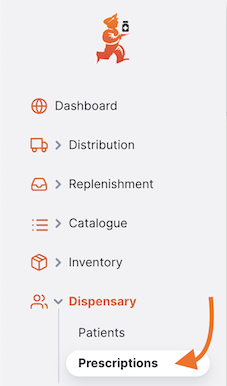

You will be presented with a list of Prescriptions (if you don't see any, you are probably just starting!).

From this screen you can:

- View a list of Prescriptions
- Create a new Prescription
- Export Prescription to a `.csv` file

### Prescription List

1. The list of Prescriptions is divided into 5 columns:

| Column      | Description                          |
| :---------- | :----------------------------------- |
| **Name**    | Name of the Patient                  |
| **Status**  | Current Status of the prescription   |
| **Number**  | Reference Number of the prescription |
| **Created** | Creation date of the prescription    |
| **Comment** | Comment for the prescription         |

2. The list can display a fixed number of prescriptions per page. On the bottom left corner, you can see how many prescriptions are currently displayed on your screen.

3. If you have more prescriptions than the current limit, you can navigate to the other pages by tapping on the page number or using the right of left arrows (bottom right corner).

4. You can also select a different number of rows to show per page using the option at the bottom right of the page.

### Searching for a prescription

Prescriptions can be filtered by Status, Reference, Invoice Number, Dispensing Date, and Patient Name

The invoice number filter requires an exact match so searching for "1" will not return invoices 10, 11, 12 etc.

### Exporting Prescriptions

The list of Prescriptions can be exported to a comma separated file (csv). Simply click the export button (on the right, at the top of the page) and the file will be downloaded.
The export function will download all Prescriptions, not just the current page, if you have more than 20 of them. Prescriptions are exported using sort order selected in the table, though of course you could easily sort the list in Excel or whatever you open the .csv file with.
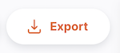

### Delete a Prescription

You can delete a prescription from the Prescription list.

1. Select the prescription that you want to delete by checking the box on the left end of the list. You can select more than one prescription to be deleted. You can even select them all using the master checkbox in the list headers.
2. The `Actions` footer will display at the bottom of the screen when a prescription is selected. It will display the number of prescriptions selected and the actions which can be taken. Click `Delete`.
3. A notification confirms how many prescriptions were deleted (bottom left corner).

You can only delete Prescriptions with a status <code>NEW</code> or <code>PICKED</code>. Verified prescriptions can be cancelled, but not deleted.

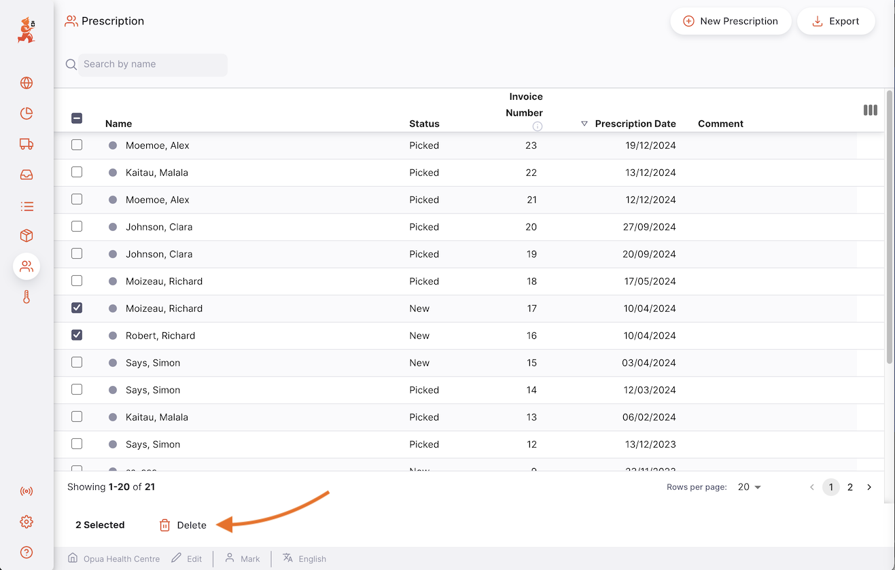

## Creating a Prescription

1. Go to `Dispensary` > `Prescriptions`

2. Press the `New Prescription` button, in the top right corner

3. A new window opens, in which you can select a patient and other details for the prescription

#### Select a Patient

In the `New Prescription` window, you will be presented with a form to search for available patients. The patients list will load when you start typing - once you see the correct patient on your screen you can select it (you do not need the enter the full name or code)

If no match is found, a `New patient` button will appear. Click this to open a section where you can enter the patient's details.  

Enter the patient's first name and last name to enable the `Search` button. This will show any matching patients even if they were created on a different mSupply site.

Click on a patient to select them for the prescription, or choose `Create new patient` to proceed and enter the remaining details for a new patient. Once complete, select Save to add the patient and continue creating the prescription.

If you have found a matching patient, but it's not the correct one, click the <b>New Patient</b> option which shows at the bottom of the list

### Patient

If you’ve selected the wrong patient, you can change the patient by typing in the `Patient` field to search and select the correct one from the dropdown list. If no match is found, you can also create a new patient from here.

If you have selected the wrong patient, you can change the patient name in the `Patient` field by typing some characters to search and then selecting from the dropdown list:

You may need to type more of the patient's name or code if you have more than 100 patients for the patient's name to show on the dropdown list.

### Edit the Patient Details

To edit the details of the selected patient, click the pencil icon next to the patient’s name. After making changes, click Save to update the information, or select `View Patient` to open the patient’s file.

Insurance details can be viewed in the Insurance tab if you have setup [Insurance Providers](/docs/dispensary/patients/#insurance) in mSupply</a>

#### Clinician

This is an optional field for the clinician who prescribed the medicine. You can search for an existing clinician by code or name. If no match is found, click `Create clinician` to add a new one.

Enter the clinician’s details, then click `Create` to save the clinician and add them to the prescription.

### Changing the Clinician

If you’ve selected the wrong clinician, you can change the clinician by typing in the `Clinician` field to search and select the correct one from the dropdown list. If no match is found, you can also create a new clinician from here.

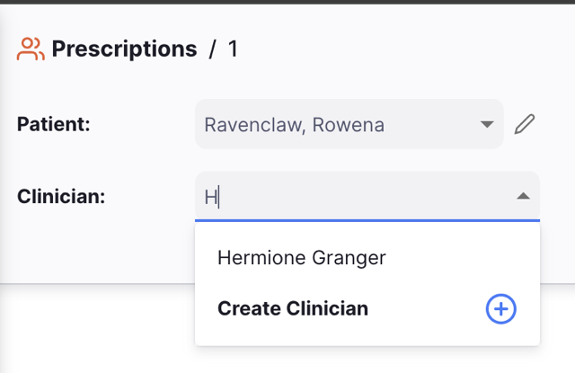

Support for Editing clinicians will be available in future versions of Open mSupply

#### Set other Prescription Fields

The following fields are optional - if none of these are useful for you, simply click `Create` to create the prescription after selecting the patient.

- **Date**: The dispensing date. This defaults to the current date, but can be changed to a past date if you're entering a backdated prescription.
- **Reference**: This is a free text field that can be used to store a reference number or other information about the prescription.
- **Clinician**: The clinician who prescribed the medicine.
- **Program**: The program that this prescription is associated with. If selected, only items from this program will be available to add to the prescription.

After selecting a patient, and filling in any other relevant details, press the `Create` button.

If everything went well, you should see the name of your patient in the top left corner and the status should be <code>NEW</code> 

### View or edit the Prescription Information Panel

The Information Panel allows you to see or edit information about the Prescription. It is divided into the following sections:

- Prescription Details
- Additional Info
- Pricing
- Patient Details
- Actions

More sections will be added as Open mSupply grows.

#### How to open and close the Information Panel?

If you are using a large screen, the information panel will be automatically opened for you. However, on an average sized screen, the information panel will be closed by default.

To open the Information Panel, you can tap on the `More` button, located in the top right corner of the Prescription view.

You can close by tapping on the `X Close` button, on the top right corner of the information panel.

#### Information Panel

In the **Additional Info** section, you can:

- See who created the Prescription (name of the user)
- View and edit the Prescription color. To edit the color, tap on the coloured circle and select a color from the pop-up
- Write or edit a comment

In the **Pricing** section, you can:

- See the total selling price of the items listed in the Prescription.
- Any insurance information related to this prescription.

In the **Patient Details** section, you can:

- See the patient's name, code, gender, and Date of Birth
- Select a Diagnosis related to the prescription

In the **Actions** section, you can:

- Delete or Cancel the Prescription
- Copy the Prescription

### Prescription Status Tracking

The status tracking is located at the bottom left corner of the Prescription screen.

Passed statuses are highlighted in blue, next statuses appear in grey.

<figure>

<figcaption align="center">Status Tracking: current status is <code>NEW</code>.</figcaption>
</figure>

<figure>

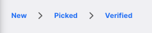

<figcaption align="center">Status Tracking: current status is </i><code>VERIFIED</code>.</figcaption>
</figure>

There are 3 status for a Prescription:

| Status       | Description                                                                                                                                  |
| :----------- | -------------------------------------------------------------------------------------------------------------------------------------------- |
| **New**      | This is the first status when you create a prescription.                                                                                     |
| **Picked**   | Prescription is picked and is now ready to give to the patient. Goods are still part of your inventory and prescription can still be edited. |
| **Verified** | The patient has received their medicine.                                                                                                     |

If you hover over the status tracking, a prescription history window appears. You can see the date when a prescription was updated from one status to another.

This prescription has been created, picked and verified on 18/08/2023

### Close and Confirm button

#### Close Button

Tap on the `Close` button to quit the Prescription view and return to the Prescriptions list.

#### Confirm Button

The `Confirm` button updates the status of the prescription. The status which you can confirm depends on the current status of the prescription and follows the order shown below.

When managing a Prescription, you can only confirm the Picked and Verified statuses. Once you have added an item to a prescription, the status will change to `Picked` automatically.

| Confirm...           | Current Status | Next Status |
| :------------------- | :------------- | :---------- |
| **Confirm Picked**   | New            | Picked      |
| **Confirm Verified** | Picked         | Verified    |

## Adding lines to a Prescription

Tap on the `Add Item` button (top right corner) of the prescription window to begin adding items to the prescription.

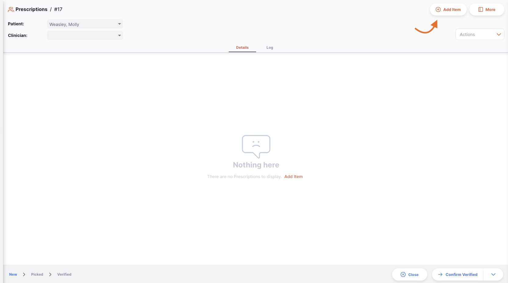

Once an item has been added to the prescription, you can also use the `New Item` button in the left hand panel to add an additional item.

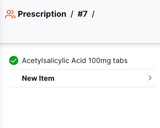

### Select an Item

In the `Add Item` window, you can look up an item by:

- Reading through the list of available items
- or by typing some or all of the item name
- or by typing some or all of an item code

Once your item is highlighted, tap on the name or press `Enter`.

Once the item is selected, you can see information about the item broken down into different sections

#### Item Section

This shows the item name and code.

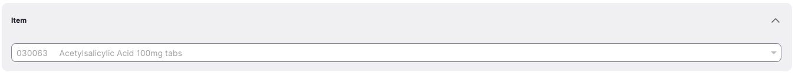

#### Quantity Section

This section shows the following:

- the available batches for this item
- the item's unit (eg. _Tablets_)

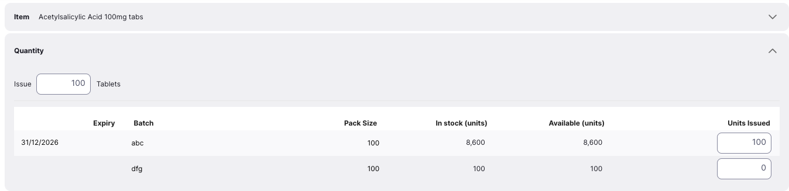

### Issuing stock

In the `Issue` field, you can enter the quantity that you want to issue to your patient.
If you're recording [prescribed quantities](https://docs.msupply.org.nz/other_stuff:virtual_stores#preferences_tab), you can enter the prescribed quantity first, which will automatically populate the `Issue` field for you.

The system will then automatically allocate the stock for the prescription, with the stock expiring first being preferred.

There is a special case when issuing a vaccine item and the <a href="/docs/manage/facilities/#store-preferences">Sort available batches by VVM status then expiry</a> preference is enabled.  

In this case the stock lines are allocated in numerical order of the VVM status 'Level' property (this is separate to the VVM stage, see the <a href="https://docs.msupply.org.nz/cold_chain_equipment:configure?s[]=vvm&s[]=status#priority_of_vvm_status">documentation</a> for details). If there is more than one line with the same VVM status level, then of those lines the first line to expiry is selected (normal FEFO rules).

#### List of available batches:

This is a list of batch numbers that you have in store for this item:

| Column                | Description                                                                             |
| :-------------------- | :-------------------------------------------------------------------------------------- |
| **Expiry**            | Expiry date of the batch (format: MM/YYYY)                                              |
| **Batch**             | Batch number. It is a designation given to products made in the same manufacturing run. |
| **Pack Size**         | Quantity of units per pack                                                              |
| **In Stock (units)**  | Total number of units in your store                                                     |
| **Available (units)** | Number of units available (not already allocated to other invoices)                     |
| **Units Issued**      | Total quantity of units to be issued                                                    |

#### Issue a quantity

In the below example, we are issuing 1000 units of the item. All 1000 units will be taken from the same batch (first row). The other two batches was not selected because they are expired or on hold.

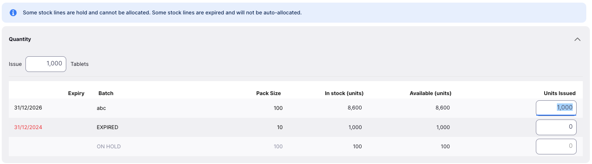

In this other example, we are issuing 11 units. The system selects two batches with different pack sizes. 

#### Warnings

You may see one or more warning messages on this screen:

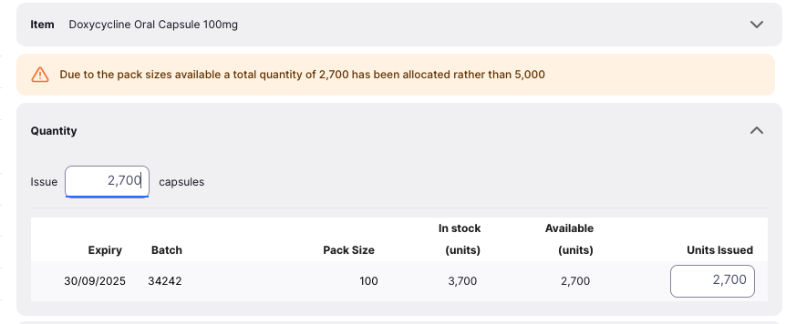
This warning tells you that you are trying to issue more units than you have in stock. You will need to reduce the quantity you are trying to issue, or add more stock to the system.

This warning tells you that because of the available pack sizes, the quantity you are trying to issue would result in an a partial pack being issued. If do not want to split a pack, you'll need to enter a quantity that is a multiple of the pack size(s) available.

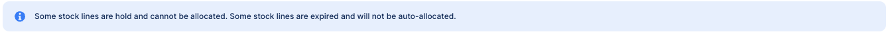

This warning tells you that some of your stock is on hold and/or expired cannot be auto allocated.

#### Issuing in doses

Vaccine items can be dispensed in doses rather than units, if the [Manage vaccines in doses](/docs/manage/facilities/#store-preferences) store preference is enabled.

The following quantity columns will be displayed instead when issuing a vaccine item:

| Column               | Description                                                                                                                                                                  |
| :------------------- | :--------------------------------------------------------------------------------------------------------------------------------------------------------------------------- |
| **VVM Status**       | If the [Manage VVM status for stock](/docs/manage/facilities/#store-preferences) store preference is enabled, a column displaying the VVM status of this stock line is shown |
| **Doses per [unit]** | The number of doses per unit (the label shown for unit will vary, as this comes from the item. An example is `Vial`)                                                         |
| **[Unit]s in stock** | Total number of units (e.g. `Vials`) which are in stock at your store                                                                                                        |
| **Doses Available**  | Total number of doses available in your store                                                                                                                                |
| **Doses Issued**     | Total number of doses to be issued                                                                                                                                           |

### Manual Allocation

Regardless if how the system automatically allocates stock, you can always manually change the quantity at the batch number level directly.
This method also allows you to select expired batches, but not on hold batches.

To select or adjust the selected batches, enter or edit the quantity in the `Units Issued` column.

<figure>

<figcaption align="center"><i>Manual allocation at the batch number level.</i></figcaption>
</figure>

### Directions

This section allows you to enter or select directions for patient use of the current item. These directions will be printed on labels if label printing is in use.
There are 3 ways to enter directions

1. You can select default item directions from the dropdown list [(See mSupply Docs for item directions configuration)](https://docs.msupply.org.nz/items:item_basics:tab_dispensing?#default_directions)

2. You can enter a set or abbreviated directions in the text box which will be expanded to the full directions field
   [(See mSupply Docs for abbreviation configuration)](https://docs.msupply.org.nz/dispensing:abbreviations)

3. You can enter or modify the directions in the text box

### Confirm Item, Quantity and other details

When you are happy with the quantity, you can either press on:

- the `Save` button.

- the `Cancel` button if you do not want to add the item to the Prescription any more

## Editing a Prescription Line

To edit a prescription line, tap on it. You will be presented with the `Edit Item` window, which is identical to the `Add Item` window, except that the item is already chosen.

### Edit a Prescription Line

 <b></b> You can edit a prescription line if the prescription has a status lower than <code>Verified</code>. 

1. Open the Prescription you want to edit.
2. Tap on the line you want to edit.

 <b></b> When editing a prescription line, you cannot change the item. You would need to delete the prescription line and create a new one. 

### Delete a Prescription line

1. Open the Prescription you want to edit
2. Select the line(s) you want to delete by checking the box(es) on the left hand side of the list
3. The `Actions` footer will display at the bottom of the screen when a prescription line is selected. It will display the number of prescription lines selected and the actions which can be taken.
4. Click `Delete`
5. Accept the confirmation
6. A success notification will be shown on the bottom left of the screen

In the below example, we are deleting <i>item 088882 - Ibuprofen 200mg tablets</i>

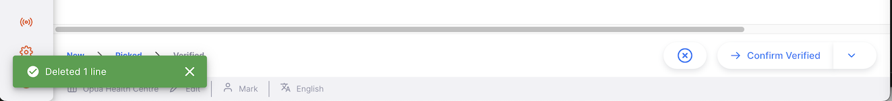

You can delete multiple lines at once. Be sure to review what is selected before performing the Delete action. 

## Backdating A Prescription

A prescription can be backdated by changing the Date field in the header. This must be done before adding items to the prescription.

#### Stock Levels

When adding items to a backdated prescription, the available stock will be adjusted to what was available at that date (and hasn't been used since).
The other fields still show the current state of the system.

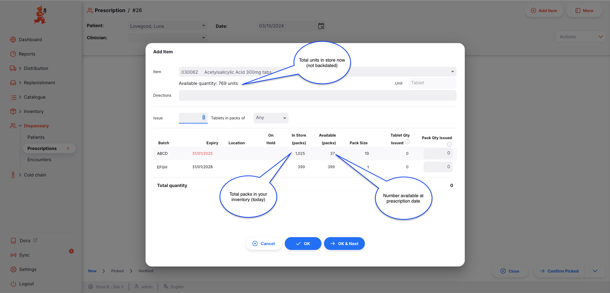

If some stock you are expecting to see doesn't show as available, use the <a href="/docs/inventory/stock-view/#ledger-tab">Ledger</a> in Inventory -> Stock to see when that stock was received.

#### Changing the date after adding items

If you have already assigned stock to a prescription, and then you change the date of the prescription, you will see this warning:

The system needs to recalculate the available stock levels based on the new date, so existing lines will be removed and you'll need to add them again. Therefore, it is recommended to set the date before adding items to the prescription!

## Processing a Prescription

### Confirming Prescription picking

Picking refers to the process where individual items are picked from pharmacy.

Once an item has been added to your prescription, the status will automatically change to picked:

- Prescription status is now `PICKED`
- You are now invited to confirm the prescription via the `Confirm Verified` button

At this stage, you are still able to edit invoice lines, to add items or to delete existing lines.

### Verify the Prescription

The last step to prescribe medicine is to verify the prescription.

To verify a prescription, tap on the `Confirm Verified` button.

Once the prescription has been confirmed:

- Prescription status is now `VERIFIED`
- Goods are no longer part of your inventory
- You can no longer edit prescription lines
- You can no longer delete the prescription

## Printing Labels

Open mSupply has basic label printing that will be improved with more flexibility in the future.

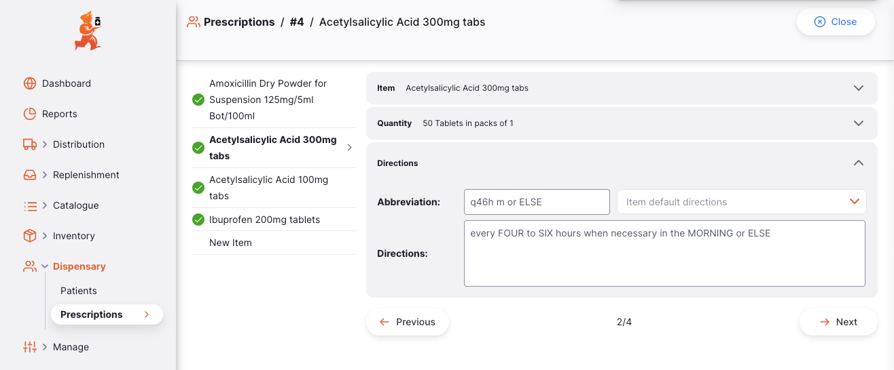

### Getting started

To begin printing labels, first ensure that you have configured a printer in [Settings](/docs/settings/devices/).

A technical note: at the moment we use the ZPL printing language under the hood, which covers about half the label printer hardware on the market. You'll need to tweak the printer configuration (directly on the device) to get it just right for our label printing. The support for more printers and label formats is coming in future releases of Open mSupply.

### Directions

For each item in the prescription you'll need to define item directions to be printed on the labels. These can be entered manually, with abbreviations or default item directions.

See the [Directions](#directions) section for more information.

### Printing All

When viewing the overall prescription, you'll see that lines that have directions will have a comment bubble icon. Once all the directions are entered on all the lines, this is a good time to print all your labels! Press the `Print Labels` button at the top of the page.

Note: If you have multiple batches of the same item, only 1 label will be printed with the total number of units across the batches noted in the top line of the label.

### Printing Selected Rows

You can select individual rows in the prescription to print labels for by ticking the column on the left, then pressing `Print Labels` in the action bar at the bottom of the screen.

### Troubleshooting

If something isn't working correctly, [support@msupply.foundation](mailto:support@msupply.foundation) will be happy to help figure out your printer setup.

Here are some common problems that you may be having:

#### My labels are badly cut off on the top/bottom/left/right

This is likely due to incompatible configuration of the label printer. The easiest solution is to use mSupply to print a label with a _good_ configuration as it has some magic that reconfigures the printer based on the printing settings that we don't quite do in Open mSupply!

#### The Clinician details are missing

This is likely due to not having set the Clinician for the prescription.

#### Not all my directions are showing

Unfortunately at this time we only support up to 5 lines of directions per prescription. In the future we'll seek to have some size adjustment to allow more as well as multiple labels printed if there is too much text.

#### The item name has printed over itself

The item names in the system are too long for this label format! Please contact [support@msupply.foundation](mailto:support@msupply.foundation).

## Viewing a Prescription

Batches are automatically grouped by item when viewing a specific prescription. Use the expand button for a specific row in order to see the details for each batch of the item.

For example, the Paracetamol 500mg tabs shown here, has three batches allocated. Click the expand icon in the row to see the details:

If you do not have enough room on your screen, or simply aren't interested in some of the columns shown, you have the option of hiding which columns are shown in this view.

Click on the `Show / hide columns` button which is at the top right of the table. This gives a list of the columns available - you can check the columns you want to see. The options chosen are stored for the current browser, so next time you view a Prescription, you will see the selected columns only. If you have chosen which columns to show, then the button is shown in blue to remind you that there are more columns available.

If some columns are hidden, you can click `Show all` to show all of the columns again.

## Cancelling a Prescription

If a prescription has already been verified it can't be deleted, but it can be cancelled.

This is done in the Side panel actions section.

Once a prescription is cancelled, it will still show in the list of prescriptions, but with a status of `CANCELLED`.

## Payment

1. Once you're finished entering the items for the Prescription, click the `Confirm Verified` button.

   

2. If there is a non-zero sell price for the items in the prescription, A new window will appear for you to enter the payment details for the patient's prescription.

   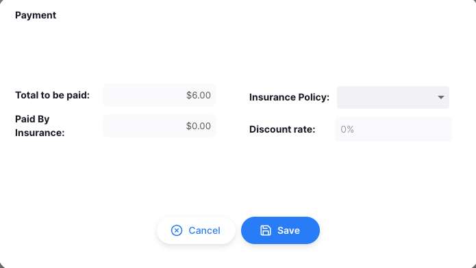

3. Click the `Save` button once everything is done.

4. Clicking the `Cancel` button will stop the saving process.

### Insurance

If there are available insurances policies for your patients, you can indicate that the payment was partially covered by insurance.

1. Once you're finished entering the items for the Prescription, click the `Confirm Verified` button.

   

2. Click the dropdown for the Insurance Policy and select the insurance to be used.

   

3. The discount amount and amount paid by the insurance will automatically display after selecting an insurance.

   

4. Click the `Save` button once everything is done.
