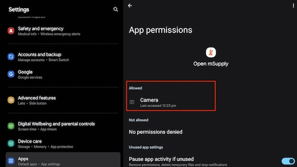
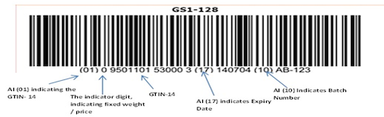
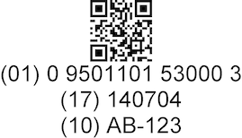
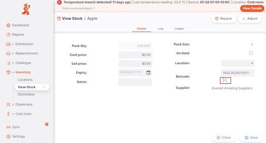

+++
title = "Barcode scanning"
description = "Adding stock to an Outbound Shipment with a barcode scanner."
date = 2023-05-03T18:20:00+00:00
updated = 2023-05-03T18:20:00+00:00
draft = false
weight = 111
sort_by = "weight"
template = "docs/page.html"

[extra]
toc = true
top = false
+++

## Adding items using a barcode scanner

If using the desktop or android apps, you have the option of scanning items in order to add them to the Outbound Shipment.
It is recommended to set the scanner to 'continuous scan' mode if it supports this.

We have been using Zebra USB scanners, model DS2208. Any hand held barcode scanner should work for this, though we may need to update to support different models. If you have another model of scanner, please get in touch.

## Using the android camera for barcode scanning

If you are managing your store via an android tablet then you do not need a Zebra USB scanner or any other scanner hardware. Instead you can use the inbuilt camera to scan the barcode.

On the openmSupply app setting, ensure that openmSupply has the permission to use the camera.

The scanners support 1D and 2D barcodes, and can parse the information from a GS1 barcode in order to read the GTIN-14 code, batch number and expiry date.
As an example, barcodes could look like this:

### Introducing barcode to stock
You may find that sometimes the stock that you have lacks the barcode when a suitable GTIN-14 code already exists. If this is the case then you can view the stock and either via the android tablet (inbuilt camaera) or via the windows exe (scanner hardware), you can then assign the missing barcode. 

on OpenmSupply : 
* Navigate and expand the Inventory section
* Click on `View Stock`
* View a stock in detail
* Click the `[-]` button
* Either using the android camaera or the scanner, scan the barcode
* See that the `Barcode` field now has the code.

### Issuing stock out using the barcode

To begin, open the Outbound Shipment. If the status is `New`, `Allocated` or `Picked` you can start and stop the scanner using the `Scan` button:

You can also press the 'control (ctrl)' and 's' keys at the same time to start (and stop) scanning

### Adding items

Once the scanner is started you can scan items. Each time a barcode is detected by the scanner the `Add Item` window is shown. If the scanned barcode matches an item in your database then this item is automatically selected. When no match is made, the usual drop down selection is shown allowing you to select an item.

In addition, if the scanned barcode provides batch information and a match exists in your database, then all other batch lines are disabled, and the matching line is focused.

After entering a quantity of the item, click `Ok` as usual.

In the case when the scanned barcode did not match any of the items in your database, this barcode is saved against the item selected in the `Add item` window. This means that the next time this particular item is scanned, it will correctly match an item.

When using the desktop application, the scanner will continue accepting barcodes until you click the `Scan` button a second time. You can continue to scan items and enter their quantity until all items are added.
