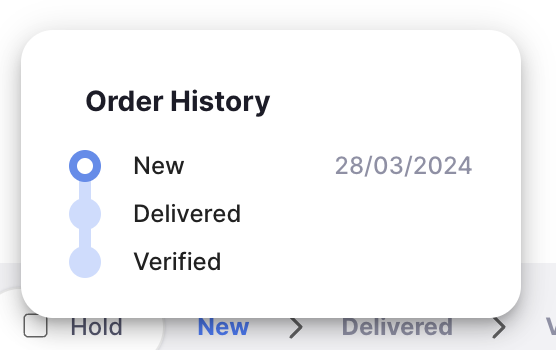
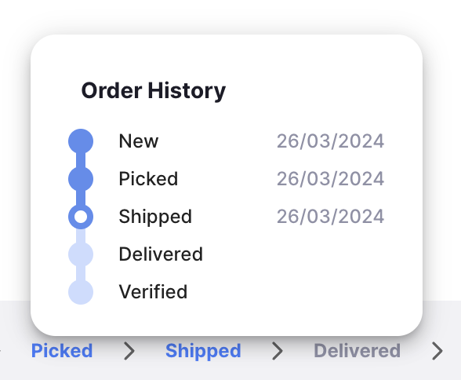
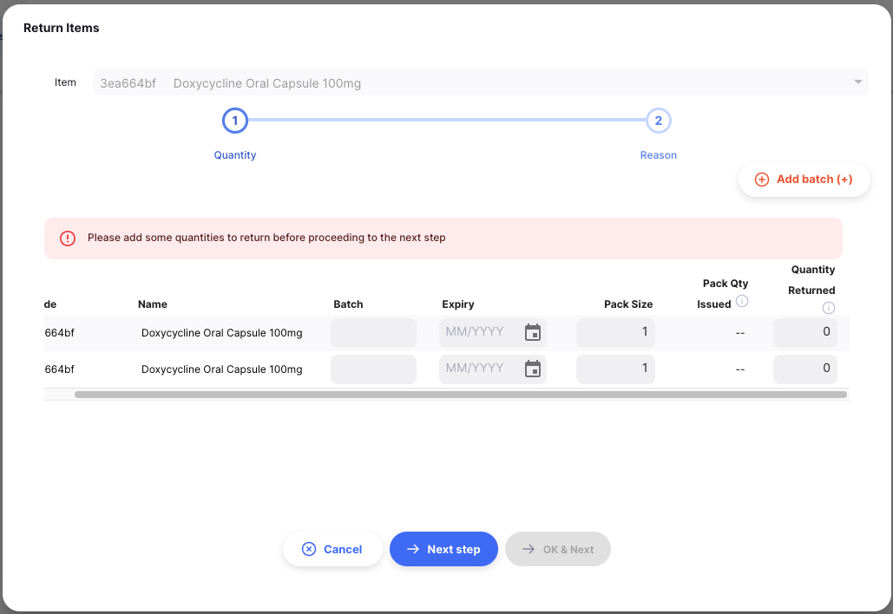
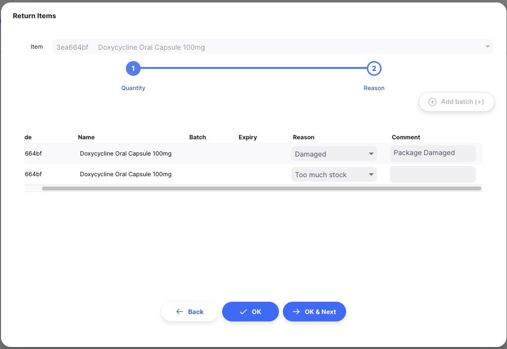

+++
title = "Retours clients"
description = "Receiving returned stock from your customers"
date = 2022-03-19T18:20:00+00:00
updated = 2022-03-19T18:20:00+00:00
draft = false
weight = 44
sort_by = "weight"
template = "docs/page.html"

[extra]
toc = true
top = false
+++

Un retour client sert à enregistrer le stock qui est retourné par un client.

Il est important de pouvoir recevoir des articles d’un client sans qu’elles soient comptées comme étant des articles provenant d’un fournisseur. Si votre client vous envoie les articles dans un envoi sortant et que vous les recevez par l’intermédiaire d’un envoi entrant, ces articles seront comptées comme faisant partie de la 'livraison' de votre dépot par les fournisseurs, ce qui n’est pas correct. Un retour client est la bonne façon de recevoir des articles en arrière d’un client.

Si vous avez déjà utilisé mSupply, vous connaissez peut-être le terme **Crédit Client** au lieu de « retour client ».

Tous les produits retournés par un client doivent être enregistrés dans mSupply avec un retour client. Ils sont créés automatiquement, à la suite d’un retour fournisseur créé par un autre dépot dans Open mSupply, et peuvent également être entrés manuellement.

## Affichage des retours clients

### Ouvrir le menu des retours clients

Choisissez `Distribution` > `Retours Client` dans le panneau de navigation.

Vous recevrez une liste des retours clients si certains ont déjà été créés.

De cet écran, vous pouvez :

- Afficher la liste des retours clients
- Créer un nouveau retour client
- Exporter les retours du client dans un fichier `.csv`

### Liste des retours clients

1. La liste des retours clients est divisée en 6 colonnes :

| Colonne         | Description                   |
| :-------------- | :---------------------------- |
| **Nom**         | nom du client                 |
| **Statut**      | Statut actuel du retour       |
| **Numéro**      | Numéro de référence du retour |
| **Créé**        | Date de création du retour    |
| **Commentaire** | Commentaire pour le retour    |
| **Référence**   | Référence client              |

2. La liste peut afficher un nombre fixe de retours par page. Dans le coin inférieur gauche, vous pouvez voir combien de retours sont actuellement affichés sur votre écran.

3. Si vous avez plus de retours que la limite actuelle, vous pouvez naviguer vers les autres pages en appuyant sur le numéro de page ou en utilisant la droite des flèches gauche (coin inférieur droit).

4. Vous pouvez également sélectionner un nombre différent de lignes à afficher par page en utilisant l’option située dans le coin inférieur droit de la page.

### Recherche par nom de client

Vous pouvez filtrer la liste des retours par nom de client ou par statut. Cela peut être utile si vous cherchez un retour particulier!

Par exemple : Sélectionnez le filtre `Nom` dans la liste pour filtrer par nom de client. Tapez le nom d’un client dans le champ `Nom`. Tous les retours pour ce client apparaîtront dans la liste.

### Exportation des retours clients

La liste des retours clients peut être exportée dans un fichier séparé par des virgules (csv). Il suffit de cliquer sur le bouton d’exportation (à droite, en haut de la page)

et le fichier sera téléchargé. La fonction d’exportation téléchargera tous les retours clients, et non seulement la page actuelle, si vous avez plus de retours que la limite de page actuelle.

### Supprimer un retour client

Vous pouvez supprimer un retour de la liste des retours clients.

1. Sélectionnez le retour que vous voulez supprimer en cochant la case à gauche de la liste. Vous pouvez sélectionner plus d’un retour à supprimer. Vous pouvez même les sélectionner tous en utilisant la case à cocher maître dans les en-têtes de liste.

2. Ouvrez le menu déroulant `Selectionner` (en haut à droite, au-dessus de la liste) et sélectionnez `Supprimer les lignes selectionnées`.

3. Une notification confirme combien de retours ont été supprimés (coin inférieur gauche).

Vous ne pouvez supprimer les retours de clients que s’ils ont un statut <code>NOUVEAU</code>.

## Création d’un retour client

Les retours clients sont créés automatiquement, lorsqu’un retour fournisseur est créé par un autre D2POT. Si nécessaire, ils peuvent également être créés manuellement, comme expliqué ci-dessous.

### Créer à partir d’une livraison

Souvent, vous traiterez le retour de marchandises que vous avez envoyées par l’intermédiaire d’une livraison. Dans ce cas, vous pouvez [create a Customer Return from the Outbound Shipment](../outbound-shipments/#process-return-of-stock-from-an-outbound-shipment).

### Créer manuellement

1. Allez à `Distribution` > `Retours client`.

2. Appuyez sur le bouton `Nouveau Retour` dans le coin supérieur droit.

3. Une nouvelle fenêtre `Clients` s'ouvre, vous invitant à sélectionner un client.

#### Sélectionner un client

1. Dans la fenêtre `Clients` vous verrez une liste des clients disponibles. Vous pouvez sélectionner votre client dans la liste ou vous pouvez filtrer en tapant le nom du client.

Dans l’exemple ci-dessous, nous souhaitons recevoir des articles retournés du <b>Dépot Médical Central de Tamaki</b>. 

Vous pouvez savoir si un client utilise également Open mSupply dans son dépot. Si c’est le cas, vous verrez une icône comme celle-ci  à côté du code client.

2. Une fois que vous appuyez sur `Entrée`, ou cliquez sur un client, votre retour de client est automatiquement créé.

Si tout s’est bien passé, vous devriez voir le nom de votre client dans le coin supérieur gauche et l’état devrait être <code>NOUVEAU</code>

### Entrez une référence client

Une fois que votre retour client a été créé, vous pouvez entrer une référence de client dans le champ `Ref Client` s’il en a une (ex. _PO#1234567_)

### Panneau de renseignements sur les retours clients

Le panneau d’information vous permet de voir ou de modifier les renseignements sur le retour du client. Il est divisé en plusieurs sections :

- Informations complémentaires
- Documents relatifs
- Détails de transport

Nous prévoyons d’ajouter d’autres sections à l’avenir, au fur et à mesure que Open mSupply se développera.

#### Comment ouvrir et fermer le panneau d’information?

Si vous utilisez un grand écran, le panneau d’information s’ouvrira automatiquement pour vous. Toutefois, sur un écran de taille moyenne, le panneau d’information sera fermé par défaut.

Pour ouvrir le panneau d’information, vous pouvez appuyer sur le bouton `Plus` situé dans le coin supérieur droit de la vue Retour client.

Vous pouvez fermer en appuyant sur le bouton `X Fermer` dans le coin supérieur droit du panneau d’information.

#### Informations complémentaires

Dans la section **Informations complémentaires**, vous pouvez :

- Voir qui a créé le retour client (nom de l’utilisateur)
- Afficher et modifier la couleur de retour du client. Pour modifier la couleur, appuyez sur le cercle coloré et sélectionnez une couleur dans la fenêtre contextuelle.
- Écrire ou modifier un commentaire

#### Documents relatifs

Dans la section **Documents relatifs**, vous pouvez voir d’autres documents de transaction connexes pour le retour client.

Si votre retour client a été créé à partir d’un **Livraison**, le numéro de référence de l’envoi sortant apparaîtra dans cette section.

À l’avenir, nous inclurons également d’autres documents tels que des documents de transport ou des bordereaux de prélèvement.

#### Détails transport

Si votre retour client a été créé automatiquement, via un retour fournisseur à partir d’un autre dépot, vous verrez une section Détails de transport. Ici, vous pouvez voir une référence de transport (p. ex., un numéro de réservation ou de suivi)

#### Actions

1. **Supprimer:** Vous pouvez cliquer sur le bouton `Supprimer` pour supprimer le retour. Vous ne pouvez supprimer les retours de clients que lorsqu’ils sont dans le statut <code>NOUVEAU</code>.
2. **Copier dans le presse-papiers**: Vous pouvez cliquer sur le bouton `Copier dans le presse-papiers` pour copier les détails de la facture dans le presse-papiers.

### Séquence de statut de retour client

La séquence de statut se trouve dans le coin inférieur gauche de l’écran Retour client.

Les statuts passés sont surlignés en bleu, les états suivants apparaissent en gris.

Il y a 5 statuts pour le retour client :

| Status          | Description                                                                                                                          |
| :-------------- | ------------------------------------------------------------------------------------------------------------------------------------ |
| **Nouveau**     | Il s’agit du premier état lorsque vous créez un nouveau retour client manuel                                                         |
| **Sélectionné** | Le client a confirmé que le retour est sélectionné et prêt à être expédié (s’applique uniquement aux retours créés automatiquement). |
| **Expédié**     | Le retour a été expédié et les marchandises sont en transit (s’applique uniquement aux retours créés automatiquement)                |
| **Livré**       | Lorsque vous confirmez que le retour a été livré                                                                                     |
| **Vérifié**     | Lorsque vous avez vérifié le retour du client                                                                                        |

Vous avez probablement remarqué que deux des valeurs de statut ne s’appliquent qu’aux envois créés automatiquement. Ces données sont créées par le système lorsqu’un autre magasin du système crée un retour de fournisseur pour retourner les stocks à votre dépot. Si c’est le cas, vous verrez un message en haut de la page :

Notez que ce message apparaît différemment si le statut est `Livré` ou `Vérifié`

Si, toutefois, vous avez créé un envoi entrant manuellement, le message suivant s’affiche :

et vous verrez que la barre de statut ne contient que les valeurs du statut qui s’appliquent à ce type d’envoi.

<figure align="center">
    
    <figcaption align="center">Status Sequence: Le statut actuel est </i><code>Nouveau</code>.</figcaption>
</figure>

Si vous passez le curseur de la souris sur la séquence de statut, une fenêtre d’historique des retours apparaît. Vous pouvez voir la date à laquelle un retour a été mis à jour d’un statut à l’autre.

Ce retour manuel a été créé le 28/03/2024

Ce retour automatique a été créé, sélectionné et expédié le 26/03/24

### Case à cocher En attente

Situé dans le coin inférieur gauche, à gauche de la séquence de statut.

Cocher la case `En attente` empêche le retour du client d’être mis à jour au prochain statut.

### Bouton de fermer et de confirmer

#### Bouton Fermer

Appuyez sur le bouton `Fermer` pour quitter la vue Retour du client et retourner à la liste Retours du client.

#### bouton Confirmer

Le bouton `Confirmer` met à jour le statut d’un retour. Le statut que vous pouvez confirmer dépend du statut actuel du retour et suit la séquence ci-dessous.

Lorsque vous gérez un retour de client, vous ne pouvez le confirmer que comme étant livré ou vérifié.

| Confirm...                    | Current Status | Next Status |
| :---------------------------- | :------------- | :---------- |
| **Confirmer la livraison**    | expédié        | livré       |
| **Confirmer la vérification** | livré          | vérifié     |

Pour les retours clients manuels, vous n’avez pas besoin de passer au statut suivant dans la séquence. Vous pouvez choisir de sauter `Livré` pour passer directement à `Confirmer Verifier`.

Comme indiqué ci-dessous, appuyez sur la flèche vers le bas du bouton `Confirmer` et sélectionnez le statut auquel vous voulez que le retour soit mis à jour.

## Ajout de lignes à un retour client

Appuyez sur le bouton `Ajouter Article` (en haut à droite).

### Sélectionner un article

Une nouvelle fenêtre `Ajouter article` s’ouvre. Dans la fenêtre `Ajouter article` vous pouvez rechercher un article en :

- Lecture de la liste des articles disponibles
- ou en tapant tout ou partie du nom de l’article
- ou en tapant tout ou partie d’un code d’article

Une fois que votre article est en surbrillance, appuyez sur le nom ou appuyez sur `Entrer`.

#### Étape de sélection des quantités

Dans l’étape `Selectionner Quantitiés`, vous pouvez entrer les champs suivants :

- **Code**: code article
- **Nom**: nom d'article
- **Lot**: Numéro de lot. C’est une désignation donnée aux produits fabriqués dans le même cycle de fabrication.
- **Expiration**: Date d’expiration du lot (format : MM/AAAA)
- **Taille de l'emballage**: Quantité d’unités par paquet
- **Quantité d’emballage émise**: Nombre de colis qui ont été émis dans la livraison
- **Quantité retournée**: Nombre de colis à retourner

Si vous recevez plus d’un numéro de lot pour le même article, vous pouvez ajouter des lignes avec le bouton `Ajouter lot`.

#### Avertissements

Vous pouvez voir un ou plusieurs messages d’avertissement sur cet écran.

Si vous oubliez d’entrer une `Quantité Retournée` pour un lot et que vous cliquez sur `Etape suivante`, vous verrez ce message d’avertissement. Vous devrez ajouter une quantité retournée pour au moins un lot. Vous pouvez cliquer sur `Annuler` si vous ne voulez plus traiter le retour de ce stock.

### Donner les raisons

Les raisons de retour sont configurées sur le serveur central mSupply via **[options](https://docs.msupply.org.nz/preferences:options)**

Lorsque vous êtes satisfait des informations sur le lot et les quantités à retourner, vous pouvez appuyer sur le bouton `Etape suivante`. La liste des lots sera filtrée pour inclure uniquement les lots pour lesquels vous avez défini une quantité de retour. Dans cette vue, vous pouvez entrer une raison pour le retour de chaque lot, et un commentaire supplémentaire.

### Confirmer

Lorsque vous êtes satisfait des quantités et des motifs, vous pouvez appuyer sur :

- Le bouton `OK` Votre article sera ajouté au formulaire de retour du client.
- le bouton `OK & suivant` pour ajouter un autre article immédiatement
- le bouton `Retour`, pour revenir à l’étape `Selectionner quantité`

## Modification d’une ligne de retour du client

Pour modifier une ligne de retour, appuyez dessus. Vous verrez la fenêtre `Modifier article`, qui est identique à la fenêtre `Ajouter article`, except that the item is already chosen.

### Modifier une ligne de retour

 <b></b> Vous pouvez modifier une ligne de retour si le retour n’est pas encore <code>VERIFIÉ</code>. 

1. Ouvrez le retour client que vous souhaitez modifier.
2. Appuyez sur la ligne que vous voulez modifier. Une fenêtre identique à `Ajouter Article` apparaît. À ce stade, vous pouvez :

   - Modifier les informations du lot
   - Modifier la quantité retournée pour chaque lot
   - Cliquez sur `Prochaine étape` pour afficher ou modifier les motifs et les commentaires.

Si vous définissez la quantité retournée à `0`, cette ligne sera supprimée du retour.

Si vous définissez toutes les quantités de retour à `0`, et cliquez sur `Prochaine étape` vous verrez ce message d’avertissement. Il vous informe qu’aucune quantité de retour n’a été fournie; à partir de là, vous pouvez cliquer sur `OK` à nouveau pour confirmer, auquel cas la fenêtre se fermera et toutes les lignes pour cet article seront supprimées.

 <b></b> Lorsque vous modifiez une ligne de retour, vous ne pouvez pas modifier l’article. Vous devez supprimer la ligne de retour et en créer une nouvelle. 

### Supprimer une ligne de retour

1. Ouvrez le retour client que vous souhaitez modifier.
2. Sélectionnez la ou les lignes que vous voulez supprimer en cochant la ou les cases à droite de la liste.
3. Allez au menu déroulant `Actions` (en haut à droite, au-dessus de la liste)
4. Sélectionnez l’action `Supprimer les lignes sélectionnées`

Dans l’exemple ci-dessous, nous supprimons <i>article 030063 - Acetylsalicylic Acid 100mg tabs</i>

 <b></b> Vous pouvez supprimer plusieurs lignes à la fois. N’oubliez pas de vérifier ce qui est sélectionné avant d’effectuer l’action Supprimer. 

## Réception d’un retour de client

### Confirmer la livraison du retour

Que votre retour soit **manuel** ou **automatique**, la première étape pour recevoir les marchandises retournées est de confirmer la livraison.

À ce stade, vous n’avez pas besoin de vérifier si les quantités ou d’autres informations sont correctes, il vous suffit de confirmer que vous avez reçu les marchandises retournées par votre client.

Pour confirmer qu’un retour de client a été livré, cliquez sur le bouton `Confirmer la livraison`.

Une fois que vous avez fait ceci :

- Les articles font maintenant partie de votre inventaire
- Le statut de retour est maintenant `LIVRÉ`

Si votre retour client est <b>automatique</b>, vous ne pouvez pas confirmer sa livraison à moins que le client n’ait confirmé son envoi. En d’autres termes, votre statut de livraison doit être <code>EXPÉDIÉ</code> avant que vous puissiez confirmer que vous avez reçu les articles retournées. 

### Vérifier le retour client

La vérification est la dernière étape pour recevoir les articles retournées dans mSupply. À ce stade, vous pouvez vérifier ce que vous avez reçu et vous assurer que les informations dans mSupply sont correctes.

Vous avez la possibilité de vérifier les informations suivantes :

- Numéros de lot et dates d’expiration
- Quantité de colis et taille du colis
- Raisons de retour

Une fois que tous les renseignements ont été saisis ou vérifiés, vous pouvez confirmer le retour du client en cliquant sur `VÉRIFIÉ` dans la boîte de dialogue `Confirmer`.

Une fois que vous avez fait ceci :

- Le statut de retour du client est maintenant `VÉRIFIÉ`
- Vous ne pouvez plus modifier les lignes de retour
- Vous ne pouvez plus supprimer le retour

## Visualisation d’un retour client

Lorsque vous affichez un retour spécifique, vous pouvez afficher les lots de ce retour groupés par article ou avec chaque lot répertorié séparément. Pour changer le mode de visualisation, cliquez sur l’interrupteur `Grouper par article`.

Lorsque vous regroupez par article, vous pouvez développer l’élément pour afficher les lots individuels ou utiliser le bouton développer dans l’en-tête de la table pour développer toutes les lignes groupées.

Si vous n’avez pas assez de place sur votre écran, ou si certaines des colonnes affichées ne vous intéressent tout simplement pas, vous avez la possibilité de masquer les colonnes qui sont affichées dans cette vue.

Cliquez sur le bouton `Afficher / masquer les colonnes` qui se trouve en haut à droite du tableau. Cela donne une liste des colonnes disponibles - vous pouvez vérifier les colonnes que vous voulez voir. Les options choisies sont enregistrées pour le navigateur actuel, de sorte que la prochaine fois que vous afficherez un retour client, vous ne verrez que les colonnes sélectionnées. Si vous avez choisi les colonnes à afficher, le bouton est affiché en bleu pour vous rappeler qu’il y a plus de colonnes disponibles.

Dans l’exemple ci-dessous, nous cachons les colonnes de lot, d’expiration et de quantité unitaire

