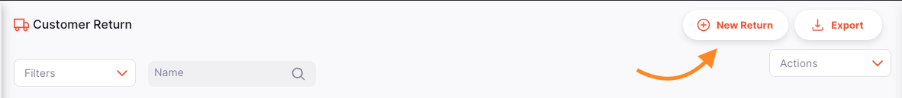
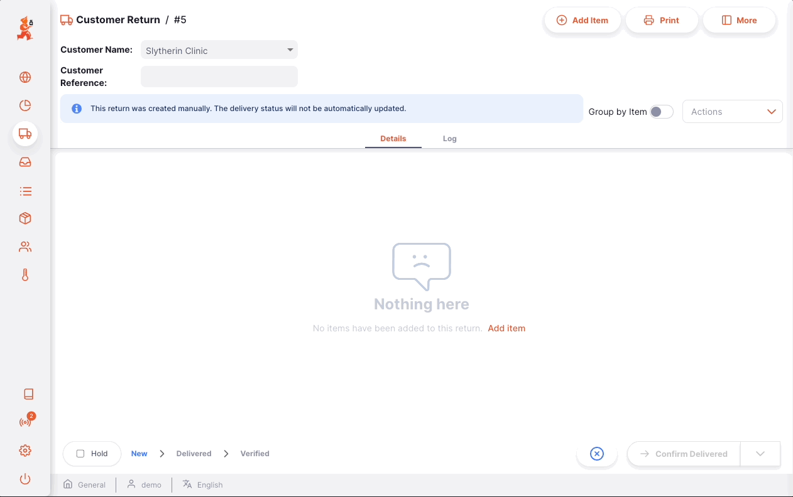
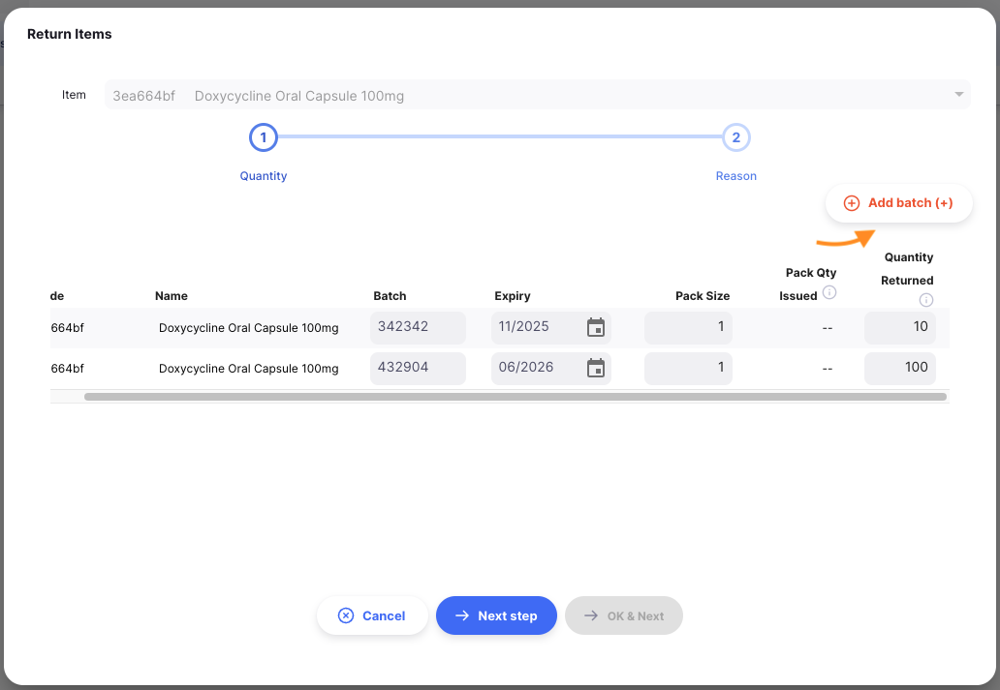

+++
title = "Retorno de Clientes"
description = "Receber retorno de stock de seus clientes"
date = 2022-03-19T18:20:00+00:00
updated = 2022-03-19T18:20:00+00:00
draft = false
weight = 44
sort_by = "weight"
template = "docs/page.html"

[extra]
toc = true
top = false
+++

Uma Devolução de Cliente é utilizada para registar o stock devolvido por um cliente.

É importante poder receber mercadorias de volta de um cliente sem que isso seja contabilizado como mercadorias provenientes de um fornecedor. Se o seu cliente lhe emitir as mercadorias numa Remessa de Saída e as receber através de uma Remessa de Entrada, essas mercadorias serão contabilizadas como parte do "abastecimento" da sua loja proveniente de fornecedores, o que não está correto. Uma devolução do cliente é a forma correta de receber mercadorias de volta de um cliente.

Se já utilizou o mSupply no passado, poderá estar familiarizado com o termo **Crédito do Cliente** em vez de Devolução do Cliente.

Todos os produtos devolvidos por um cliente devem ser registados no mSupply com uma Devolução do Cliente. São criados automaticamente, como resultado de uma Devolução de Fornecedor criada por outra loja no Open mSupply, podendo também ser introduzidos manualmente.

## Visualização de devoluções de clientes

### Abra o menu de devoluções de clientes

Selecione `Distribuição` > `Devoluções de clientes` no painel de navegação.

Será apresentada uma lista de Devoluções de Clientes, caso algumas já tenham sido criadas.

Neste ecrã pode:

- Veja uma lista de devoluções de clientes
- Criar uma nova devolução de cliente
- Exportar Devoluções de Clientes para um ficheiro `. csv`

### Lista de Devolução de Clientes

1. A lista de Devoluções de Clientes está dividida em 6 colunas:

| Coluna         | Descrição                          |
| :------------- | :--------------------------------- |
| **Nome**       | Nome do Cliente                    |
| **Estado**     | Situação atual da declaração       |
| **Número**     | Número de referência da declaração |
| **Criado**     | Data de criação da declaração      |
| **Comentário** | Comentário para o retorno          |
| **Referência** | Referência do cliente              |

1. A lista pode apresentar um número fixo de retornos por página. No canto inferior esquerdo pode ver quantas devoluções estão atualmente apresentadas no ecrã.

3.Se tiver mais devoluções do que o limite atual, pode navegar para as outras páginas tocando no número da página ou utilizando as setas direita ou esquerda (canto inferior direito).

4.º Também pode selecionar um número diferente de linhas para mostrar por página, utilizando a opção no canto inferior direito da página.

### Pesquisar por nome do cliente

Pode filtrar a lista de devoluções por nome ou estado do cliente. Isto pode ser útil se estiver à procura de um retorno específico!

Por exemplo: seleccione o filtro `Nome` na lista para filtrar pelo nome do cliente. Introduza o nome de um cliente no campo `Nome`. Todas as devoluções deste cliente aparecerão na lista.

### Exportar Devoluções de Clientes

A lista de devoluções de clientes pode ser exportada para um ficheiro separado por vírgulas (csv). Basta clicar no botão exportar (à direita, no topo da página)

e o ficheiro será descarregado. A função de exportação irá descarregar todas as devoluções de clientes, e não apenas a página atual, no caso de ter mais devoluções do que o limite de páginas atual.

### Apagar uma devolução de cliente

Pode eliminar uma devolução da lista de Devoluções do Cliente.

1.º Selecione a devolução que pretende eliminar, assinalando a caixa na extremidade esquerda da lista. Pode selecionar mais do que uma declaração para ser excluída. Pode até selecioná-los todos utilizando a caixa de seleção principal nos cabeçalhos da lista.

2.º Clique no botão `Apagar` que aparece na parte inferior da página.

3. Uma notificação confirma quantas devoluções foram eliminadas (canto inferior esquerdo).

Só pode eliminar devoluções de clientes se estas tiverem o estado <code>NOVO</code>.

## Criação de uma devolução de cliente

As devoluções de clientes são criadas automaticamente quando é criada uma devolução de fornecedores por outra loja. Se necessário, também podem ser criados manualmente, como explicado abaixo.

### Criar a partir de remessa de saída

Muitas vezes, processará a devolução de mercadorias enviadas através de uma Remessa de Saída. Nesse caso, pode [criar uma Devolução do Cliente a partir da Remessa de Saída](../outbound-shipments/#process-return-of-stock-from-an-outbound-shipment).

### Criar manualmente

1.º Vá a `Distribuição` > `Devolução do cliente`.

2.º Pressione o botão `Novo Retorno`, no canto superior direito

3.º Será aberta uma nova janela `Clientes`, convidando-o a selecionar um cliente.

#### Selecione um cliente

1.Na janela `Clientes`, verá uma lista de clientes disponíveis. Pode selecionar o seu cliente na lista ou filtrar, digitando o nome do cliente.

No exemplo abaixo, queremos receber stock devolvido da <b>Clínica Sonserina</b>.

Pode saber se um cliente também está a utilizar o Open mSupply na sua loja. Se o fizerem, verá um ícone como este  ao lado do código do cliente.

2. Depois de tocar ou premir `Enter`, ou clicar num cliente, a sua devolução de cliente é automaticamente criada

Se tudo correr bem, deverá ver o nome do seu cliente no canto superior esquerdo e o estado deverá ser <code>NOVO</code>

### Introduza uma referência de cliente

Assim que a sua devolução de cliente for criada, pode introduzir uma referência de cliente no campo `Ref. do cliente`, se existir uma (por exemplo, _PO#1234567_)

### Painel de informação de devolução do cliente

O Painel de Informação permite visualizar ou editar informações sobre a Devolução do Cliente. Está dividido em várias secções:

- Informações adicionais
- Documentos relacionados
- Detalhes de transporte

Estamos a planear adicionar mais secções no futuro à medida que o Open mSupply cresce.

#### Como abrir e fechar o Painel de Informação?

Se estiver a utilizar um ecrã grande, o painel de informações será aberto automaticamente. No entanto, num ecrã de tamanho médio, o painel de informações será fechado por defeito.

Para abrir o Painel de Informação, pode tocar no botão "Mais", localizado no canto superior direito da vista Devolução do Cliente.

Pode fechar tocando no botão `X Fechar`, no canto superior direito do painel de informação.

#### Informações adicionais

Na secção **Informações adicionais**, pode:

- Veja quem criou a Retorno do Cliente (nome do utilizador)
- Visualize e edite a cor da devolução do cliente. Para editar a cor, toque no círculo colorido e selecione uma cor no pop-up
- Escrever ou editar um comentário

#### Documentos relacionados

Na secção **Documentos Relacionados**, pode ver outros documentos de transações relacionadas com a Devolução do Cliente.

Se a sua Devolução de Cliente tiver sido criada a partir de uma **Remessa de Saída**, o número de referência da Remessa de Saída aparecerá nesta secção.

No futuro, incluiremos também outros documentos, como documentos de transporte ou recibos de cobrança.

#### Detalhes de transporte

Se a sua Devolução de Cliente tiver sido criada automaticamente, através de uma Devolução de Fornecedor de outra loja, verá uma secção Detalhes de Transporte. Aqui pode ver uma referência de transporte (por exemplo, um número de reserva ou de seguimento).

#### Ações

1. **Apagar:** Pode clicar no botão `Apagar` para apagar a declaração. Só pode eliminar devoluções de clientes enquanto estas estiverem no estado <code>NOVO</code>.
2. **Copiar para a área de transferência**: Pode clicar no botão `Copiar para a área de transferência' para copiar os dados da fatura para a área de transferência.

### Sequência de estado de retorno do cliente

A sequência de estado está localizada no canto inferior esquerdo do ecrã de Devolução do Cliente.

Os estados passados ​​estão destacados a azul, os próximos estados aparecem a cinzento.

Existem 5 estados para a Devolução do Cliente:

| Situação       | Descrição                                                                                                                          |
| :------------- | ---------------------------------------------------------------------------------------------------------------------------------- |
| **Novo**       | Este é o primeiro estado quando cria um novo manual de Devolução do Cliente                                                        |
| **Recolhido**  | O cliente confirmou que a devolução foi recolhida e está pronta para envio (aplica-se apenas a devoluções criadas automaticamente) |
| **Enviado**    | A devolução foi enviada e as mercadorias estão em trânsito (aplica-se apenas a devoluções criadas automaticamente)                 |
| **Entregue**   | Quando confirma que a devolução foi entregue                                                                                       |
| **Verificado** | Quando tiver verificado a Devolução do Cliente                                                                                     |

### Caixa de seleção Segurar

Localizado no canto inferior esquerdo, à esquerda da sequência de estado.

Marcar a caixa de seleção `Manter` impede que a devolução do cliente seja atualizada para o próximo estado.

### Botão Fechar e Confirmar

#### Botão Fechar

Toque no botão `Fechar` para sair da vista Devolução do Cliente e voltar à lista de Devoluções do Cliente.

#### Botão Confirmar

O botão `Confirmar` atualiza o estado de uma devolução. O estado que pode confirmar depende do estado atual da declaração e segue a sequência apresentada abaixo.

Ao gerir uma Devolução de Cliente, só pode confirmá-la como Entregue ou Verificada.

| Confirmar...             | Situação atual | Próximo estado |
| :----------------------- | :------------- | :------------- |
| **Confirmar entrega**    | Enviado        | Entregue       |
| **Confirmar verificado** | Entregue       | Verificado     |

Para devoluções manuais de clientes, não precisa de atualizar para o próximo estado na sequência. Pode optar por saltar `Entregue` para ir diretamente para `Confirmar verificado`.

Conforme demonstrado abaixo, toque na seta para baixo do botão `Confirmar` e selecione o estado para o qual pretende que a declaração seja atualizada.

## Adicionar linhas a uma devolução de cliente

Toque no botão `Adicionar item` (canto superior direito).

### Selecione um item

É aberta uma nova janela `Adicionar item`. Na janela `Adicionar item`, pode procurar um item por:

- Leitura da lista de itens disponíveis
- ou digitando parte ou todo o nome do item
- ou digitando parte ou todo o código do artigo

Quando o seu item estiver realçado, toque no nome ou prima `Enter`.

#### Selecione o passo de quantidades

No passo `Selecionar quantidades`, pode introduzir os seguintes campos:

- **Código**: Código do artigo
- **Nome**: Nome do artigo
- **Lote**: Número de lote. É uma designação dada a produtos fabricados no mesmo ciclo de fabrico.
- **Expiração**: Data de validade do lote (formato: MM/AAAA)
- **Tamanho da embalagem**: Número de unidades por embalagem
- **Quantidade de pacotes emitidos**: Número de pacotes que foram emitidos na remessa de saída
- **Quantidade devolvida**: Número de pacotes a devolver

Se estiver a receber mais do que um número de lote para o mesmo artigo, pode adicionar linhas com o botão `Adicionar lote'.

#### Avisos

Pode ver uma ou mais mensagens de aviso neste ecrã.

Se se esquecer de introduzir uma `Quantidade devolvida` para qualquer lote e clicar em `Próximo passo`, verá esta mensagem de aviso. Terá de adicionar uma quantidade devolvida para pelo menos um lote. Pode clicar em `Cancelar` se já não quiser processar a devolução de nenhuma destas ações.

### Apresente razões

Os motivos de devolução são configurados no servidor central do mSupply através de **[opções](https://docs.msupply.org.nz/preferences:options)**

Quando estiver satisfeito com as informações do lote e com as quantidades devolvidas, pode premir o botão `Próximo passo'. A lista de lotes será filtrada para incluir apenas os lotes para os quais definiu uma quantidade de devolução. Nesta pré-visualização, pode introduzir um motivo para a devolução de cada lote e um comentário adicional.

### Confirmar

Quando estiver satisfeito com as quantidades e os motivos, pode avançar:

- o botão `OK`. O seu artigo será adicionado à Devolução do Cliente
- o botão `OK e Seguinte` para adicionar outro item imediatamente
- o botão `Voltar`, para voltar ao passo `Selecionar quantidade`

## Editar uma linha de devolução do cliente

Para editar uma linha de retorno, toque sobre ela. Verá a janela `Editar Item`, que é idêntica à janela `Adicionar Item`, só que o item já está escolhido.

### Editar uma linha de retorno

 <b></b>Pode editar uma linha de retorno se o retorno ainda não estiver <code>VERIFICADO</code>.

1.º Abra a devolução do cliente que pretende editar.
2.º Toque na linha que pretende editar. Aparece uma janela idêntica à `Adicionar Item`. Nesta fase pode:

- Editar informação do lote
- Editar quantidade devolvida para cada lote
- Clique em `Próximo passo` para visualizar/ajustar os motivos e comentários

Se definir a Quantidade Devolvida para `0`, essa linha será removida da declaração.

Se definir todas as quantidades de devolução para `0` e clicar em `Próximo passo`, verá esta mensagem de aviso. Informamos que não foi fornecida qualquer quantidade de retorno; A partir daqui, pode clicar novamente em `OK` para confirmar.

 <b></b>Ao editar uma linha de retorno, não pode alterar o item. Precisaria de eliminar a linha de retorno e criar uma nova.

### Apagar uma linha de retorno

1.º Abra a devolução do cliente que pretende editar.
2.º Selecione a(s) linha(s) que pretende eliminar, assinalando a(s) caixa(s) à direita da lista.
3.º Clique no botão `Apagar` que aparece na parte inferior da página.

No exemplo abaixo, estamos a excluir duas linhas

 <b></b>Pode eliminar várias linhas de uma só vez. Certifique-se de rever o que está selecionado antes de executar a ação Apagar.

## Receber uma devolução do cliente

### Confirmando a entrega da devolução

Quer a sua Devolução de Cliente seja **manual** ou **automática**, o primeiro passo para receber os produtos devolvidos é confirmar a entrega.

Nesta fase, não precisa de verificar se as quantidades ou outras informações estão corretas, apenas precisa de confirmar que recebeu a mercadoria devolvida do seu cliente.

Para confirmar que foi entregue uma devolução do cliente, clique no botão `Confirmar entrega'.

Depois de fazer isto:

- Os produtos fazem agora parte do seu inventário
- O estado de retorno é agora `ENTREGUE`

Caso a sua Devolução do Cliente seja <b>automática</b>, não poderá confirmar a sua entrega a menos que o cliente tenha confirmado o seu envio. Por outras palavras, o estado da sua devolução precisa de ser <code>ENVIADO</code> antes de poder confirmar que recebeu os produtos devolvidos.

### Verifique a sua devolução do cliente

A verificação é o último passo para receber mercadorias devolvidas no mSupply. Neste passo, pode verificar o que recebeu e certificar-se de que as informações no mSupply estão corretas.

Tem a possibilidade de verificar as seguintes informações:

- Números de lote e respetivas datas de validade
- Quantidade de embalagens e tamanho da embalagem
- Motivos de devolução

Depois de todas as informações terem sido captadas ou verificadas, pode confirmar a devolução do cliente como `VERIFICADA' tocando no botão `Confirmar verificado'.

Depois de fazer isto:

- O estado de devolução do cliente é agora `VERIFICADO'
- Já não pode editar linhas de retorno
- Já não pode apagar o retorno

## Visualização de uma devolução do cliente

Ao visualizar uma declaração específica, pode visualizar os lotes dessa declaração agrupados por artigo ou com cada lote listado separadamente.
Para alterar o modo de visualização, clique no botão `Agrupar por item`.

Quando agrupado por item, pode expandir o item para ver lotes individuais ou utilizar a expansão no cabeçalho da tabela para expandir todas as linhas agrupadas.

Se não tiver espaço suficiente no ecrã ou simplesmente não estiver interessado em algumas das colunas apresentadas, tem a opção de ocultar as colunas que são apresentadas nesta vista.

Clique no botão `Mostrar/ocultar colunas` que se encontra no canto superior direito da tabela. Isto fornece uma lista das colunas disponíveis - pode marcar as colunas que pretende ver. As opções escolhidas são guardadas para o navegador atual, pelo que, da próxima vez que visualizar uma Devolução do Cliente, apenas verá as colunas selecionadas. Se tiver escolhido as colunas a mostrar, o botão será apresentado a azul para o lembrar de que há mais colunas disponíveis.

No exemplo abaixo, ocultamos as colunas de lote, validade e quantidade unitária

