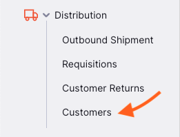
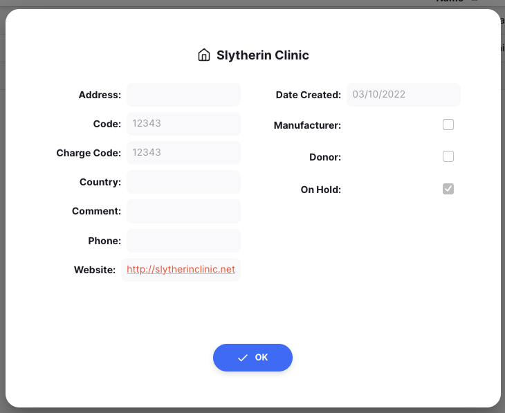

+++
title = "Clientes"
description = "Ver y gestionar a tus clientes"
date = 2022-03-19T18:20:00+00:00
updated = 2022-03-19T18:20:00+00:00
draft = false
weight = 21
sort_by = "weight"
template = "docs/page.html"

[extra]
lead = "Ver y gestionar a tus clientes"
toc = true
top = false
+++

En este momento, solo puedes ver a tus clientes y su información. En el futuro, podrás crear y editar a tus clientes (¡siempre y cuando tengas la autorización para hacerlo!). 

## Ver tus clientes

Para ver los clientes de tu tienda, ve al menú `Distribución` y haz clic en `Clientes`. 

Se te presentará una lista de clientes visibles para tu almacén.

Solo puedes ver a los clientes que son visibles para tu almacén. Puede haber más clientes en tu organización.
 
 
Si no encuentras al cliente que estás buscando, ponte en contacto con tu administrador. 

## Ver detalles de clientes

Selecciona uno de tus clientes para ver sus detalles.

