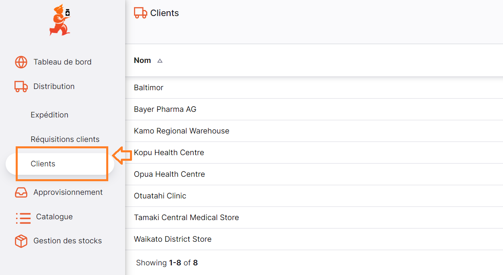
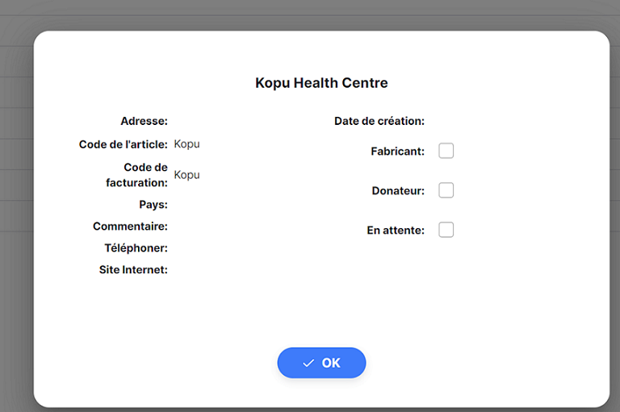

+++
title = "Clients"
description = "Voir et Gérer les Clients"
date = 2022-03-19T18:20:00+00:00
updated = 2022-03-19T18:20:00+00:00
draft = false
weight = 1
sort_by = "weight"
template = "docs/page.html"

[extra]
lead = "Voir et Gérer les Clients"
toc = true
top = false
+++

Pour le moment, vous ne pouvez voir que vos clients et leurs informations. À l'avenir, vous pourrez créer et modifier vos clients (à condition d'en avoir l'autorisation !). 

## Voir les Clients

Pour voir les clients de votre dépôt, allez dans le menu  `Distribution` ensuite `Clients`. 

Une liste de clients visibles dans votre dépôt vous sera présentée. 

Vous ne pouvez voir que les clients qui sont visibles pour votre dépôt. Il peut y avoir plus de clients dans l'organisation que vous n'en voyez dans votre dépôt.  
 
 
Si vous ne trouvez pas le client que vous recherchez, contactez votre administrateur. 

## Voir les détails d'un client

Cliquez sur l'un de vos clients pour voir ses détails.

