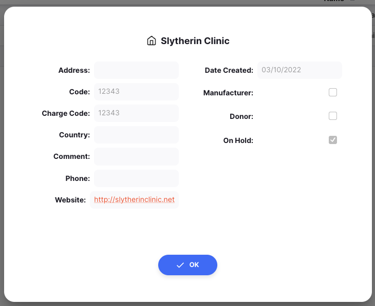

+++
title = "Clientes"
description = "Ver e gerenciar seus clientes"
date = 2022-03-19T18:20:00+00:00
updated = 2022-03-19T18:20:00+00:00
draft = false
weight = 21
sort_by = "weight"
template = "docs/page.html"

[extra]
lead = "VVer e gerenciar seus clientes"
toc = true
top = false
+++

Neste momento, só pode visualizar os seus clientes e as suas informações. No futuro, poderá criar e editar os seus clientes (desde que tenha autorização para tal!).

## Visualizar clientes

Para visualizar os clientes da sua loja, aceda ao menu `Distribuição` e clique em `Clientes`.

Será apresentada uma lista de clientes visíveis na sua loja.

Só pode ver clientes que são visíveis na sua loja.  Pode haver mais clientes na sua organização.
 
 
Se não encontrar o cliente que procura, contacte o seu administrador.

## Visualização de detalhes do cliente

Toque num dos seus clientes para ver os seus detalhes.

