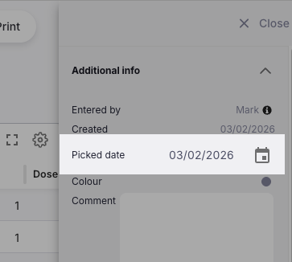
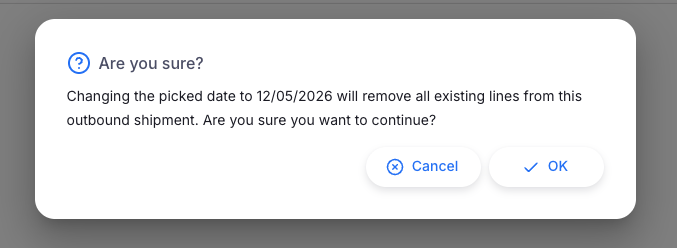

+++
title = "Backdating Outbound Shipments"
description = "Setting the picked date of an outbound shipment to an earlier date."
date = 2026-05-14
updated = 2026-05-14
draft = false
weight = 50
sort_by = "weight"
template = "docs/page.html"

[extra]
toc = false
top = false
+++

Backdating allows you to set the **picked date** of an Outbound Shipment to an earlier date than today. This is useful when stock was issued physically on an earlier date but the shipment is being entered into Open mSupply after the fact.

When a picked date is set, the stock ledger records the outbound movement as having occurred on that earlier date, keeping your historical stock records accurate.

Backdating must be enabled by an administrator before this feature is available. See <a href="/docs/manage/global-preferences/#backdating">global preferences</a> for configuration details.

## Requirements

### Permissions

Your user account requires the **Edit outbound shipment picked date** permission to change the picked date.

### Shipment status

The picked date can only be set on Outbound Shipments with a status of **New**. Once a shipment moves beyond **New** status, the picked date can no longer be changed.

## Setting the Picked Date

The **Picked date** field is located in the **Additional Info** section of the side panel on the Outbound Shipment detail view.

To open the side panel, click the **Additional Info** button (or the expand icon) on the right-hand side of the shipment detail view.

To set the picked date:

1. Open the Outbound Shipment you want to backdate.
2. Open the **side panel** and locate the **Picked date** field.
3. Click on the date field to open the date picker.
4. Select the date you want to use as the picked date.
5. If the shipment already has **lines added**, a confirmation dialogue will appear:

Changing the picked date removes all existing shipment lines. This is because stock availability and batch allocations need to be recalculated based on the new date. You will need to re-add all items after confirming the date change.

6. Click **OK** to confirm the date change and remove existing lines, or **Cancel** to leave everything unchanged.

### Stocktake warning

If a stocktake has been recorded for this store **after** the new picked date you have selected, an additional warning will appear after the confirmation above:

"Stocktake(s) have been recorded after [date]. Adding a new inbound shipment may result in stocktake counts that don't align with the ledger. Are you sure you want to continue with this date?"

Review this warning carefully. Backdating an outbound shipment to before a stocktake date may create inconsistencies between the stocktake snapshot and the ledger history. Click **OK** to proceed, or **Cancel** to choose a different date.

## What Changes When You Set the Picked Date

When you confirm a picked date:

- The **picked date** on the shipment is set to the selected date.
- The **status timestamps** (`allocated`, `picked`, and `verified` datetimes) are all set to the backdated date when the shipment is later confirmed.
- All **existing lines are removed** so that stock can be re-allocated correctly as at the new date.
- The stock ledger will record the outbound movement on the backdated date rather than the current date.

## When Backdating is Disabled

If the **Picked date** field is read-only then hovering over the field will display a tooltip explaining why:

| Message                                                                                  | Meaning                                                                                   |
| :--------------------------------------------------------------------------------------- | :---------------------------------------------------------------------------------------- |
| **The picked date can only be set on new outbound shipments.**                           | The shipment has already progressed beyond **New** status.                                |
| **Date editing on shipments is not enabled. This can be changed in global preferences.** | The backdating preference for shipments is turned off. Contact your system administrator. |
